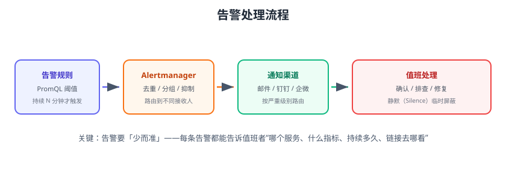

# 告警规则与 Alertmanager

告警是监控的“最后一公里”：指标异常时，系统要**准确、及时、不轰炸**地通知到责任人。Prometheus 负责根据规则评估是否触发，Alertmanager 负责把触发的告警去重、分组、路由并发送到通知渠道。本页给出完整的告警配置实践。



## 告警链路

```text
Prometheus 告警规则（PromQL 阈值 + for 持续时间）
  → 触发 → 推送到 Alertmanager
  → 分组 / 抑制 / 静默
  → 按路由规则 → 通知渠道（邮件、钉钉、企微、Webhook）
  → 值班人处理 → 恢复通知
```

## 告警规则语法

```yaml [alert-rules.yml]
groups:
  - name: host-alerts
    rules:
      - alert: HostHighCpu
        expr: 100 - avg(rate(node_cpu_seconds_total{mode="idle"}[5m])) * 100 > 85
        for: 5m
        labels:
          severity: warning
        annotations:
          summary: "主机 CPU 使用率过高"
          description: "{{ $labels.instance }} CPU 使用率超过 85%，当前 {{ $value | humanize }}%"
          runbook_url: "https://wiki.example.com/ops/host-cpu"
```

| 字段 | 说明 |
| --- | --- |
| `alert` | 告警名 |
| `expr` | PromQL 触发条件 |
| `for` | 持续多长时间才触发（防止抖动误报） |
| `labels` | 附加标签（severity 等），用于路由 |
| `annotations` | 告警内容：summary、description、runbook_url |

Prometheus 配置加载规则：

```yaml [prometheus.yml]
rule_files:
  - "alert-rules.yml"
```

## 常用告警规则模板

```yaml
groups:
  - name: host-alerts
    rules:
      - alert: HostHighCpu
        expr: 100 - avg(rate(node_cpu_seconds_total{mode="idle"}[5m])) * 100 > 85
        for: 10m
        labels: {severity: warning}

      - alert: HostMemoryPressure
        expr: (1 - node_memory_MemAvailable_bytes / node_memory_MemTotal_bytes) * 100 > 90
        for: 5m
        labels: {severity: critical}

      - alert: HostDiskWillFill
        expr: predict_linear(node_filesystem_avail_bytes{mountpoint="/"}[6h], 4 * 3600) < 0
        for: 30m
        labels: {severity: critical}

  - name: app-alerts
    rules:
      - alert: HighErrorRate
        expr: |
          sum(rate(http_requests_total{status=~"5.."}[5m])) by (job) /
          sum(rate(http_requests_total[5m])) by (job) > 0.05
        for: 5m
        labels: {severity: critical}

      - alert: InstanceDown
        expr: up == 0
        for: 2m
        labels: {severity: critical}

      - alert: HighLatencyP95
        expr: |
          histogram_quantile(0.95,
            sum by (le, job) (rate(http_request_duration_seconds_bucket[5m]))) > 2
        for: 10m
        labels: {severity: warning}
```

::: tip predict_linear 技巧
用 `predict_linear` 按历史趋势预测磁盘/内存耗尽时间，比“当前 > 90%”更早发现风险。
:::

## Alertmanager 配置

### 安装

```yaml [docker-compose.yml]
services:
  alertmanager:
    image: prom/alertmanager:v0.33.1
    container_name: alertmanager
    ports:
      - "9093:9093"
    volumes:
      - ./alertmanager.yml:/etc/alertmanager/alertmanager.yml
```

### 路由与接收器

```yaml [alertmanager.yml]
global:
  resolve_timeout: 5m
  smtp_smarthost: smtp.example.com:587
  smtp_from: alert@example.com
  smtp_auth_username: alert@example.com
  smtp_auth_password: xxx

route:
  group_by: ["alertname", "instance"]   # 按告警名+实例分组
  group_wait: 30s                       # 组内第一条等待
  group_interval: 5m                    # 同组告警重复发送间隔
  repeat_interval: 4h                   # 未恢复重复通知间隔
  receiver: default
  routes:
    - matchers:
        - severity="critical"
      receiver: pager
      continue: true
    - matchers:
        - job="order-service"
      receiver: order-team

receivers:
  - name: default
    email_configs:
      - to: ops@example.com
  - name: pager
    webhook_configs:
      - url: http://dingtalk-hook/alert
  - name: order-team
    webhook_configs:
      - url: http://wecom-hook/alert
```

### Prometheus 对接

```yaml [prometheus.yml]
alerting:
  alertmanagers:
    - static_configs:
        - targets: ["alertmanager:9093"]
```

## 分组、抑制、静默

| 能力 | 作用 | 场景 |
| --- | --- | --- |
| 分组 | 同一批告警合并成一条通知 | 一个实例挂了触发 20 条规则，只发 1 条 |
| 抑制 | 高等级告警屏蔽低等级 | 主机挂了，就不用再报“服务不可达” |
| 静默 | 人工临时屏蔽 | 已知维护窗口内不报警 |

抑制示例：`severity=critical` 时抑制同 instance 的 warning：

```yaml
inhibit_rules:
  - source_matchers: [severity="critical"]
    target_matchers: [severity="warning"]
    equal: ["instance"]
```

静默（UI 或 API）：

```shell
curl -X POST http://localhost:9093/api/v2/silences -d '{
  "matchers": [{"name":"instance","value":"10.0.0.11:9100"}],
  "startsAt":"2026-08-29T10:00:00+08:00",
  "endsAt":"2026-08-29T12:00:00+08:00",
  "createdBy":"ops",
  "comment":"机房维护"
}'
```

## 告警分级建议

| 级别 | 定义 | 响应时限 | 通知方式 |
| --- | --- | --- | --- |
| P0 | 核心业务不可用 | 立即（15 分钟内） | 电话/短信 + IM |
| P1 | 功能异常但可降级 | 30 分钟 | IM + 邮件 |
| P2 | 有风险未故障 | 1 个工作日 | IM |
| P3 | 信息性 | 计划处理 | 不通知或汇总 |

## 易错点与最佳实践

::: danger 常见错误
1. **`for` 不设置**：瞬时抖动就报警，告警风暴。
2. **`repeat_interval` 太短**：每 5 分钟轰炸一次，值班人员直接屏蔽通知。
3. **分组键太少**：`group_by` 只有 alertname，不同实例的告警合到一起，定位困难。
4. **告警无操作说明**：通知里没有 runbook 链接，值班人不知道怎么办。
5. **维护期不做静默**：发布/维护窗口刷屏告警，真告警被淹没。
6. **告警没有复盘**：长期静默的规则不清理，噪音越来越多。
:::

::: tip 最佳实践
1. 告警必须可操作：说明、影响、操作链接、责任人。
2. 用 `for` 过滤抖动，用 `predict_linear` 提前预警。
3. 告警分组按 `alertname + instance + job`，抑制主从关系。
4. 维护窗口自动静默（按时间/标签）。
5. 每周 Review：新增、调整、废弃告警规则，控制噪音。
6. 告警值班表（on-call rotation）与通知绑定，确保有人响应。
:::

## 验证方式

1. 配置一条 CPU 告警（阈值设低如 1%），等 `for` 时间后确认 Alertmanager 收到告警并发出通知。
2. 触发两条同组告警，确认只收到一条合并通知。
3. 添加静默规则，确认静默期间不再通知。
4. 恢复指标后确认告警自动恢复并发送恢复通知。

## 参考资料

- Alertmanager 文档：https://prometheus.io/docs/alerting/latest/alertmanager/
- 告警规则最佳实践：https://prometheus.io/docs/practices/alerting/
- 告警路由配置：https://prometheus.io/docs/alerting/latest/configuration/
- Grafana Alerting：https://grafana.com/docs/grafana/latest/alerting/
