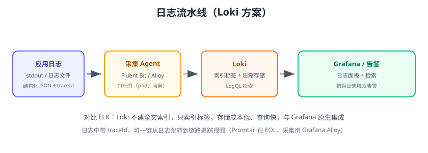

# 日志监控

指标告诉你“系统坏了”，日志告诉你“**为什么**坏了”。日志监控 = 统一采集 + 集中存储 + 快速检索 + 异常告警。本页以 **Loki（Grafana 日志栈）** 为主，对比 ELK，给出从采集到告警的完整落地。



## 为什么需要统一日志平台

微服务时代日志散落在几十台机器：

1. 出问题要一台台 SSH 上去 `grep`，效率极低。
2. 同一请求的日志分布在多个服务，难以串联（需 traceId）。
3. 磁盘被日志写满，应用崩溃。
4. 没有保留策略，日志无限增长，成本失控。

统一日志平台解决：采集、存储、检索、告警、关联。

## Loki vs ELK

| 维度 | Loki | ELK（Elasticsearch） |
| --- | --- | --- |
| 索引方式 | 只索引标签，不全文索引 | 全文倒排索引 |
| 存储成本 | 低（压缩 + 对象存储） | 高（索引副本） |
| 查询语言 | LogQL | KQL / Lucene |
| 集成 | 与 Grafana 原生一体 | Kibana |
| 适用 | 日志量大、预算有限、Grafana 用户 | 复杂全文检索、安全分析 |
| 版本（2026-08） | 3.7.x | Elasticsearch 9.x |

::: tip 选型
团队已用 Grafana → 选 Loki；需要复杂全文检索/安全分析/合规 → ELK。
:::

## 日志规范（采集前先立规矩）

### 结构化日志

```json
{"time":"2026-08-29T10:00:00+08:00","level":"ERROR","service":"order-service","traceId":"abc123","message":"库存不足","orderNo":"1001"}
```

### 标签设计

标签用于索引，**基数要低**：

```text
✓ 好标签：job、level、service、pod、container
✗ 坏标签：traceId、orderNo、user_id（高基数，应放日志内容）
```

## 部署 Loki

```yaml [docker-compose.yml]
services:
  loki:
    image: grafana/loki:3.7.6
    container_name: loki
    ports:
      - "3100:3100"
    volumes:
      - loki-data:/loki
    command: -config.file=/etc/loki/local-config.yaml
```

验证：`curl http://localhost:3100/ready` 返回 `ready`。

## 采集：Promtail / Fluent Bit

### Promtail（与 Loki 同家）

```yaml [promtail-config.yml]
server:
  http_listen_port: 9080
clients:
  - url: http://loki:3100/loki/api/v1/push
scrape_configs:
  - job_name: app
    static_configs:
      - targets: [localhost]
        labels:
          job: order-service
          __path__: /var/log/order-service/*.log
```

### Fluent Bit（更轻量）

```yaml [fluent-bit.yml]
[INPUT]
    Name tail
    Path /var/log/app/*.log
    Tag app

[OUTPUT]
    Name loki
    Match *
    Host loki
    Port 3100
    Labels job=order-service
```

### Docker/K8s 日志

- Docker：容器日志写到 stdout，直接用 Promtail 采集 `/var/lib/docker/containers/*/*.log`。
- K8s：用 Helm 部署 Loki + Promtail（或 Grafana Alloy），自动打 Pod 标签，`kubectl logs` 的日志自动进入 Loki。

## LogQL 查询

```logql
# 按标签过滤 + 关键字
{job="order-service"} |= "ERROR"

# 排除关键字
{job="order-service"} != "DEBUG"

# 正则
{job="order-service"} |~ "exception|timeout"

# 解析 JSON 后按字段过滤
{job="order-service"} | json | level="ERROR"

# 统计错误数量（指标化）
sum(count_over_time({job="order-service"} |= "ERROR" [5m]))
```

## 日志告警

Grafana 告警支持 Loki 数据源：

```text
Alert rule 查询：
  sum(count_over_time({job="order-service"} |= "ERROR" [5m])) > 50
评估：每 1m，for 5m
```

也可以让 Prometheus 通过 `logql` 不支持的场景用 Grafana Alerting 直接消费 Loki。

## 日志与链路关联

1. 应用日志统一输出 `traceId`。
2. Loki 日志面板支持“Logs to traces”数据链路：点击日志行中的 traceId 直接跳到 SkyWalking/Zipkin 的链路视图。
3. 反之，链路视图的 Span 也可以关联到日志。

```yaml
# Grafana 数据源 Loki 配置
jsonData:
  derivedFields:
    - name: traceId
      matcherRegex: "traceId=(\\w+)"
      url: "http://skywalking-ui:8080/trace?traceId=${__value.raw}"
```

## 保留策略与成本

```yaml
limits_config:
  retention_period: 30d
  max_query_lookback: 30d
```

降本手段：

1. 分环境保留：debug 日志 7 天，error 日志 90 天。
2. 高基数/大字段不入标签，减少索引开销。
3. 冷数据放对象存储（S3/MinIO）。
4. 采样：超大流量场景按比例采集。

## 易错点与最佳实践

::: danger 常见错误
1. **标签高基数**：把 traceId/订单号当标签，Loki 索引爆炸。
2. **日志不打 traceId**：跨服务无法串联，排障回到石器时代。
3. **容器日志不采集**：容器一删日志就没，故障现场丢失。
4. **采集端单点**：Promtail 挂了日志断流；配置多副本/自愈。
5. **明文敏感信息入日志**：密码、Token 打进日志，安全审计不过。
6. **Loki 单机当生产**：数据量大要分模式部署（读写分离）或对象存储。
:::

::: tip 最佳实践
1. 统一日志格式：JSON + level + service + traceId。
2. 日志级别规范：INFO 记业务、WARN 记异常、ERROR 记故障；禁止 DEBUG 上生产。
3. ERROR 日志必须可操作：带上订单号、堆栈、上下文。
4. 敏感信息脱敏后再落盘。
5. 保留策略分级，成本与排查能力平衡。
6. 日志告警与指标告警配合：指标先报，日志定位。
:::

## 验证方式

1. 启动 Loki + Promtail，往日志目录写一条测试日志，Grafana 日志面板能检索到。
2. 用 LogQL 过滤 `ERROR`，确认只返回错误日志。
3. 配置日志数量告警，批量制造错误日志，确认告警触发。
4. 点击日志中的 traceId，验证跳转到链路追踪视图。

## 参考资料

- Grafana Loki 文档：https://grafana.com/docs/loki/latest/
- LogQL 参考：https://grafana.com/docs/loki/latest/logql/
- Promtail 配置：https://grafana.com/docs/loki/latest/send-data/promtail/
- Fluent Bit Loki 输出：https://docs.fluentbit.io/manual/pipeline/outputs/loki
- ELK（Elastic Stack）：https://www.elastic.co/guide/
