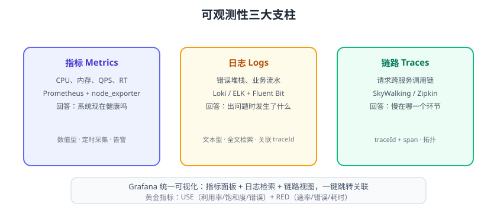

# 监控体系与可观测性

监控（Monitoring）回答“系统现在健康吗”，可观测性（Observability）更进一步回答“出问题时**为什么**”。现代可观测性由**指标（Metrics）、日志（Logs）、链路（Traces）** 三大支柱构成：指标用于告警与趋势，日志用于定位细节，链路用于还原跨服务调用。本页建立监控体系的整体框架。



## 为什么需要监控

没有监控的系统像“蒙眼开车”：

1. 磁盘写满、内存泄漏、请求变慢，用户先发现。
2. 故障发生后靠翻日志定位，MTTR（平均恢复时间）以小时计。
3. 容量规划没有数据，促销前不知道要不要扩容。
4. 变更上线后无法对比指标，好坏全凭感觉。

监控的价值：**缩短发现时间、缩短定位时间、支撑容量与性能优化**。

## 可观测性三大支柱

| 支柱 | 数据形态 | 回答的问题 | 代表工具 |
| --- | --- | --- | --- |
| 指标 Metrics | 数值（CPU、QPS、RT） | 现在健康吗 | Prometheus、node_exporter |
| 日志 Logs | 文本（错误堆栈、流水） | 出了什么具体错误 | Loki、ELK |
| 链路 Traces | 调用链（traceId/span） | 慢在哪一个环节 | SkyWalking、Zipkin |

三者配合：告警发现指标异常 → 打开日志看报错 → 顺着 traceId 看链路定位瓶颈。

## 监控分层

一个完整的监控体系从下到上分层：

| 层 | 监控对象 | 关键指标 |
| --- | --- | --- |
| 基础设施 | 服务器、网络、磁盘 | CPU、内存、磁盘、网络、温度 |
| 容器/编排 | Docker、K8s | 容器数、Pod 状态、资源请求/限制 |
| 中间件 | MySQL、Redis、Kafka、Nginx | 连接数、慢查询、积压、错误率 |
| 应用 | 服务进程、接口 | QPS、RT、错误率、JVM、线程池 |
| 业务 | 订单量、支付成功率 | 转化率、GMV、核心链路可用性 |

## 黄金指标

### RED（服务视角）

| 指标 | 英文 | 说明 |
| --- | --- | --- |
| Rate | 速率 | 每秒请求数 QPS |
| Errors | 错误 | 错误请求数/错误率 |
| Duration | 耗时 | 请求耗时分布（P50/P95/P99） |

### USE（资源视角）

| 指标 | 英文 | 说明 |
| --- | --- | --- |
| Utilization | 利用率 | 资源被使用的时间比例 |
| Saturation | 饱和度 | 资源排队/超载程度 |
| Errors | 错误 | 资源报错数量 |

::: tip 组合使用
服务接口看 **RED**，服务器/中间件看 **USE**：RED 发现问题，USE 解释资源瓶颈。
:::

## 监控方案选型

| 方案 | 组件 | 特点 |
| --- | --- | --- |
| Prometheus 全家桶 | Prometheus + Grafana + Alertmanager + Loki | 开源标准、云原生标配 |
| Zabbix | 一体化 | 传统 IT 监控、模板丰富 |
| 云监控 | 阿里云/腾讯云/AWS | 免运维、云资源开箱即用 |
| SkyWalking | APM | 侧重链路与应用性能 |
| ELK | Elasticsearch + Logstash + Kibana | 侧重日志 |

::: info 版本说明（2026-08 核对）
Prometheus 最新稳定为 **3.14.x**，Grafana 为 **13.x**，Alertmanager 为 **0.33.x**，Grafana Loki 为 **3.7.x**，node_exporter 为 **1.12.x**。
:::

## 告警设计原则

1. **少而准**：告警是“需要人处理的信号”，不是噪音。
2. **可操作**：每条告警写明：哪个服务、什么指标、阈值、持续多久、看哪里。
3. **分级**：P0 立即处理 / P1 优先处理 / P2 计划处理。
4. **避免告警风暴**：一个根因只发一条，用分组与抑制。
5. **持续改进**：每周复盘告警，静默长期无用的规则。

## 实施路线

```text
第 1 步：接入基础设施指标（node_exporter）→ 面板能看
第 2 步：接入应用指标（Actuator/客户端库）→ RED 指标
第 3 步：配置核心告警（CPU/内存/接口 5xx）→ 通知到人
第 4 步：接入日志（Loki）与链路（SkyWalking）→ 全链路可观测
第 5 步：容量规划、SLO/SLI 度量、定期故障演练
```

## 易错点与最佳实践

::: danger 常见错误
1. **监控只做一半**：有面板没告警，半夜挂了没人知道。
2. **告警阈值拍脑袋**：不压测就设阈值，要么天天误报、要么永远不报。
3. **只监控机器不监控应用**：CPU 正常但接口全挂，机器指标毫无意义。
4. **监控自身没高可用**：Prometheus 单点挂掉，告警消失，故障被“掩盖”。
5. **数据保留无限期**：TSDB/日志存储无限膨胀，成本失控；分级保留。
6. **告警没有责任人**：通知发到没人看的频道，等于没告警。
:::

::: tip 落地建议
1. 先定 SLA 再定告警：只为核心 SLO 配置 P0 告警。
2. 每个团队指定“告警责任人”，通知必须到人。
3. 用 Grafana 统一面板，指标/日志/链路三视图可跳转。
4. 每季度做一次故障演练与告警有效性的评审。
:::

## 验证方式

1. 部署 node_exporter + Prometheus，确认 `up == 1`。
2. 在 Grafana 配置第一个面板，能看到主机 CPU 曲线。
3. 故意让一个接口返回 500，确认告警在配置的持续时间内触发并通知。

## 参考资料

- 网络层监控指标：[网络基础 · 网络排查方法论](../Network/Troubleshoot/index.md)
- Prometheus 文档：https://prometheus.io/docs/
- Grafana 文档：https://grafana.com/docs/
- 可观测性工程（O'Reilly 书籍）
- Google SRE 手册：https://sre.google/sre-book/
- RED/USE 方法：https://grafana.com/blog/2018/08/02/the-red-method-how-to-instrument-your-services/
