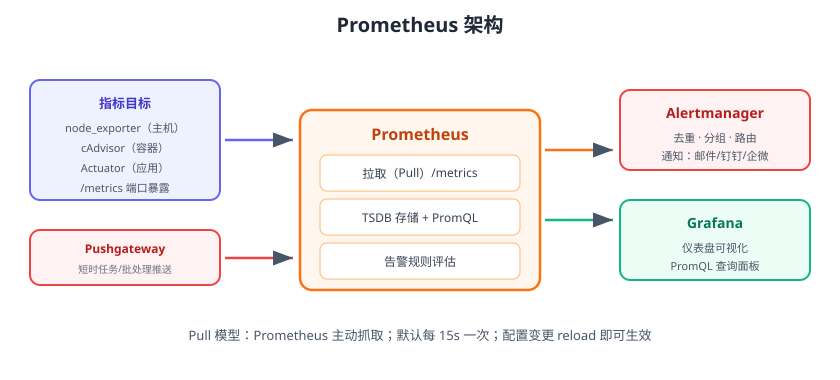
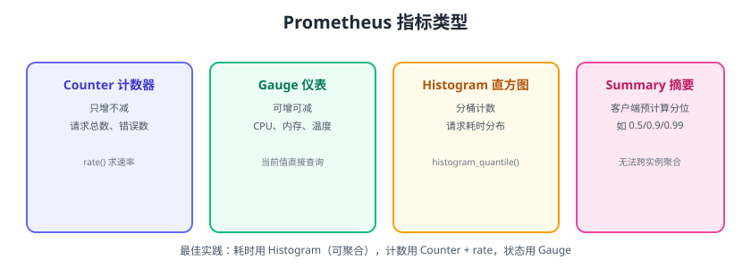

# Prometheus 入门

Prometheus 是云原生监控的事实标准：它通过 **Pull 模型**定期抓取目标的 `/metrics` 接口，把指标存入自带的时间序列数据库（TSDB），并提供 PromQL 查询语言用于面板与告警。截至 2026 年 8 月，最新稳定版为 **3.14.x**。



## 核心概念

| 概念 | 说明 |
| --- | --- |
| Metric | 一个带名字的指标，如 `http_requests_total` |
| Label | 指标的标签（键值对），如 `method="GET"`、`instance="10.0.0.1:9100"` |
| Sample | 一个时间点的数值，`(timestamp, value)` |
| TSDB | 时间序列数据库，Prometheus 内置存储 |
| Target | 被采集的目标（一个 `/metrics` 端点） |
| Job | 一组相同配置的 Target |
| Scrape | 一次抓取 |
| PromQL | Prometheus 查询语言 |

## 指标类型



| 类型 | 语义 | 典型例子 | 常用函数 |
| --- | --- | --- | --- |
| Counter | 只增不减的计数器 | 请求总数、错误数 | `rate()`、`increase()` |
| Gauge | 可增可减的当前值 | CPU 使用率、内存、连接数 | 直接查 |
| Histogram | 分桶计数，服务端计算 | 请求耗时分布 | `histogram_quantile()` |
| Summary | 客户端预计算分位 | 延迟 P95 | 直接查，但不可聚合 |

## 安装与启动

```shell [docker-compose.yml]
services:
  prometheus:
    image: prom/prometheus:v3.14.0
    container_name: prometheus
    ports:
      - "9090:9090"
    volumes:
      - ./prometheus.yml:/etc/prometheus/prometheus.yml
      - prom-data:/prometheus
volumes:
  prom-data:
```

```yaml [prometheus.yml]
global:
  scrape_interval: 15s

scrape_configs:
  - job_name: prometheus
    static_configs:
      - targets: ["localhost:9090"]

  - job_name: node
    static_configs:
      - targets: ["node-exporter:9100"]
```

```shell
docker compose up -d
```

访问 http://localhost:9090，在 Graph 页输入 `up` 查询，应返回 `1`。

## PromQL 基础

### 选择器

```promql
up                                            # 所有 up 指标
up{job="node"}                                # 按标签过滤
up{instance=~"10.0.*"}                        # 正则匹配
http_requests_total{method="GET"}[5m]         # 最近 5 分钟的所有样本
```

### 常用函数

| 函数 | 作用 | 示例 |
| --- | --- | --- |
| `rate()` | 每秒增长率（Counter 专用） | `rate(http_requests_total[5m])` |
| `increase()` | 一段时间增量 | `increase(http_requests_total[1h])` |
| `sum()` | 求和聚合 | `sum(rate(http_requests_total[5m]))` |
| `by` | 按标签分组 | `sum by (job) (rate(...[5m]))` |
| `histogram_quantile()` | 从直方图算分位 | `histogram_quantile(0.95, rate(http_request_duration_seconds_bucket[5m]))` |
| `avg_over_time()` | 时间窗口平均 | `avg_over_time(cpu_usage[5m])` |

### 查询示例

```promql
# 每秒请求数（按 method 分组）
sum(rate(http_requests_total[5m])) by (method)

# 错误率
sum(rate(http_requests_total{status=~"5.."}[5m])) /
sum(rate(http_requests_total[5m]))

# 95 分位延迟
histogram_quantile(0.95,
  sum by (le) (rate(http_request_duration_seconds_bucket[5m])))
```

## 服务发现

### 静态配置

```yaml
scrape_configs:
  - job_name: order-service
    static_configs:
      - targets: ["10.0.0.11:8080", "10.0.0.12:8080"]
```

### 文件发现（脚本动态生成）

```yaml
scrape_configs:
  - job_name: nodes
    file_sd_configs:
      - files: ["/etc/prometheus/targets/*.yml"]
        refresh_interval: 30s
```

### 云原生发现

- **Kubernetes**：`kubernetes_sd_configs` 自动发现 Pod/Service（见 [Kubernetes 专题](../../../Ops/Kubernetes/Monitoring/index.md)）。
- **Consul**：`consul_sd_configs`。
- **云**：`ec2_sd_configs`、`azure_sd_configs`。

## 存储与保留

```yaml
storage:
  tsdb:
    retention:
      time: 15d          # 默认 15 天
      size: 50GB         # 可选：按大小限制
```

::: warning 数据保留规划
默认保留 15 天，指标量大时用 `retention.size` 限制；需要长期归档的数据用 Thanos / VictoriaMetrics 或定时导出。
:::

## 配置热加载

修改 `prometheus.yml` 后无需重启：

```shell
curl -X POST http://localhost:9090/-/reload
# 或向容器发送 SIGHUP
docker kill -s HUP prometheus
```

## 易错点与最佳实践

::: danger 常见错误
1. **Counter 用 `increase(1m)` 当速率**：抖动大，用 `rate(x[5m])` 平滑。
2. **Gauge 用 `rate()`**：Gauge 不是计数器，`rate` 无意义。
3. **分位聚合错误**：`histogram_quantile` 必须在 `sum(rate(..._bucket))` 之后计算，否则结果错误。
4. **时间范围太短**：`rate(x[1m])` 在 scrape 间隔 15s 时样本不足；至少用 `[5m]`。
5. **标签值过高基数**：把用户 ID、订单号做成标签，会撑爆 TSDB；高基数用日志/追踪。
6. **单点部署不备份**：Prometheus 是数据库，磁盘与数据要纳入备份与高可用规划。
:::

::: tip 最佳实践
1. 命名规范：`<namespace>_<subsystem>_<name>_<unit>`，如 `http_requests_total`。
2. 单位进指标名：`_seconds`、`_bytes`，避免歧义。
3. 用 `sum by (job)` 聚合，别裸查每个实例。
4. 为每类 Target 建立独立的 `job_name`，便于分组与告警。
5. 生产环境至少 2 个 Prometheus 实例做高可用，或接入 Thanos。
:::

## 验证方式

1. 启动后访问 `/metrics` 看到指标输出，`up` 查询返回 1。
2. 停掉 node-exporter，30 秒后 `up{job="node"}` 变为 0。
3. 在 Graph 页执行 `rate(node_cpu_seconds_total[5m])`，能看到 CPU 使用率曲线。

## 参考资料

- Prometheus 官方文档：https://prometheus.io/docs/
- PromQL 查询：https://prometheus.io/docs/prometheus/latest/querying/basics/
- 指标与标签最佳实践：https://prometheus.io/docs/practices/naming/
- Prometheus 下载：https://prometheus.io/download/
