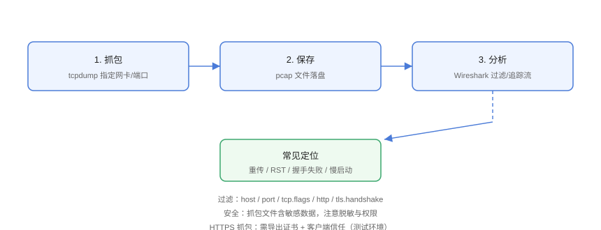

# 抓包分析：tcpdump 与 Wireshark

抓包是网络问题定位的「最终证据」：能看到握手是否成功、谁发了 RST、重传发生在哪里、HTTP 请求是否到达。本页覆盖 tcpdump 抓取、Wireshark 分析与常见定位场景。

## 抓包流程



## tcpdump 基础

```shell
# 安装
sudo apt install tcpdump

# 抓指定网卡
sudo tcpdump -i eth0

# 按主机/端口过滤
sudo tcpdump -i any host 1.2.3.4
sudo tcpdump -i any port 443
sudo tcpdump -i any host 1.2.3.4 and port 80

# 显示更详细信息（时间戳、IP、端口）
sudo tcpdump -i any -nn -tttt port 443

# 保存 pcap 供 Wireshark 分析
sudo tcpdump -i any -nn -w /tmp/capture.pcap port 443

# 抓 N 个包后自动停止
sudo tcpdump -i any -c 100 port 80
```

## 常用过滤表达式

| 过滤 | 含义 |
| --- | --- |
| `host 1.2.3.4` | 指定主机 |
| `port 443` | 指定端口 |
| `src 1.2.3.4` / `dst 1.2.3.4` | 源/目的 |
| `tcp` / `udp` / `icmp` | 协议 |
| `tcp port 443` | TCP + 端口 |
| `tcp[tcpflags] & tcp-syn != 0` | 只抓 SYN |
| `tcp[tcpflags] & tcp-rst != 0` | 只抓 RST |
| `net 10.0.0.0/24` | 网段 |
| `portrange 8000-9000` | 端口范围 |

## 常见定位场景

### 1. 握手失败

```shell
# 抓取握手过程
sudo tcpdump -i any -nn 'tcp port 443 and (tcp-syn|tcp-syn|tcp-ack)'
```

```text
预期：SYN → SYN+ACK → ACK（三次握手完成）
异常：只有 SYN 无响应 → 防火墙丢包/目标不可达
      SYN → RST → 端口未监听/防火墙 reject
```

### 2. 重传与丢包

```shell
# 抓重传
sudo tcpdump -i any -nn 'tcp[13] & 8 != 0'   # tcp-ack 带重传标记需在 Wireshark 看

# 统计重传次数（-tttt 记录时间）
sudo tcpdump -i any -nn -tttt host 1.2.3.4 | grep -c retransmission
```

### 3. 谁发了 RST

```shell
sudo tcpdump -i any -nn 'tcp[tcpflags] & tcp-rst != 0'
```

看到 RST 的**源**：客户端发 → 客户端主动放弃；服务端发 → 服务端/中间设备重置。

### 4. HTTP 请求是否到达

```shell
sudo tcpdump -i any -nn -A -s0 port 80 | grep -i "GET\|POST\|Host"
```

::: danger 抓包性能与安全
1. 生产抓包**会消耗 CPU/磁盘**，限定过滤条件与时长（`-c` 或 `timeout`）；
2. pcap 含敏感数据（密码、Token），传输与留存要脱敏/加密；
3. 用 `-w` 落盘而非终端滚动，避免丢包。
:::

## Wireshark 分析

### 打开与过滤

```text
打开 pcap 后：
  顶部过滤栏：tcp.stream == 0（追踪单个 TCP 流）
  ip.addr == 1.2.3.4
  http.request.method == "GET"
  tls.handshake.type == 1
```

### 追踪流

```text
右键任意包 → Follow → TCP Stream
→ 直接看到该连接的完整请求响应内容（HTTP 明文）
```

### 分析菜单

| 功能 | 用途 |
| --- | --- |
| Statistics → Conversations | 连接级流量统计 |
| Statistics → TCP Stream Graph | 时序图（丢包/重传可视化） |
| Expert Info | 自动标注异常（重传、RST、乱序） |
| Analyze → Follow TCP Stream | 追踪流 |

## HTTPS 抓包

HTTPS 内容是加密的，方案：

```text
1. 设置环境变量导出密钥（测试环境）：
   export SSLKEYLOGFILE=/tmp/keys.log
   curl -v https://example.com

2. Wireshark：Preferences → TLS → 添加密钥日志文件
→ 即可解密查看明文
```

::: warning 生产环境不要导出密钥
密钥日志会泄露会话内容，**仅限测试环境**使用；生产排查用服务端访问日志或 Nginx 日志替代。
:::

## 易错点与最佳实践

::: danger 常见坑
1. **过滤条件写错抓不到**：先抓全量（`-nn port 443`）再逐步收窄。
2. **忘记 `-nn`**：端口显示为服务名（http/443 混淆）。
3. **抓包在错误的网卡**：多网卡要确认业务流量走哪张卡。
4. **pcap 被截断**：`-s0` 抓完整包（默认 snaplen 可能只抓头部）。
5. **时间不同步**：两端抓包对比时先确认时间一致。
:::

::: tip 最佳实践
- 抓包前写清楚「要验证什么」，抓完先看 Expert Info；
- 排查 RST/重传优先 Wireshark 的 TCP Stream Graph；
- 抓包文件按「日期-场景-网卡」命名归档。
:::

## 验证方式

```shell
# 本地验证：抓自己访问百度
sudo tcpdump -i any -nn -w /tmp/test.pcap 'port 443' &
curl -s https://www.baidu.com -o /dev/null
sudo kill %1

# 用 Wireshark 打开 /tmp/test.pcap，确认三次握手与 TLS ClientHello
```

## 参考资料

- [tcpdump 手册](https://www.tcpdump.org/manpages/tcpdump.1.html)
- [Wireshark 官方文档](https://www.wireshark.org/docs/)
- [Wireshark 过滤器参考](https://www.wireshark.org/docs/dfref/)
