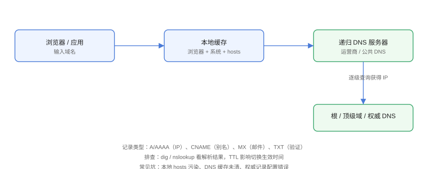

# DNS 解析与配置

DNS（Domain Name System）把人类可读的域名解析为 IP 地址，是几乎所有网络访问的第一步。DNS 出问题表现为「域名解析不出来」「解析到旧 IP」「切换机房后访问仍到旧地址」等。

## 解析流程



```text
浏览器 → 本地缓存（浏览器/系统/hosts）→ 递归 DNS（运营商/公共）→ 权威 DNS（域名商）
```

## 记录类型

| 记录 | 作用 | 示例 |
| --- | --- | --- |
| A | 域名 → IPv4 | `example.com → 1.2.3.4` |
| AAAA | 域名 → IPv6 | `example.com → 2400:...` |
| CNAME | 域名别名 | `www → example.com` |
| MX | 邮件服务器 | `@ → mail.example.com` |
| TXT | 文本验证（SPF/DKIM） | `v=spf1 include:...` |
| NS | 权威 DNS 服务器 | `example.com → ns1.xxx` |

## 排查工具

### dig

```shell
# 查询 A 记录
dig example.com

# 指定 DNS 服务器
dig @8.8.8.8 example.com

# 查看具体记录
dig example.com A
dig example.com CNAME
dig example.com MX
```

输出关键部分：

```text
;; ANSWER SECTION:
example.com.    300    IN    A    1.2.3.4
```

### nslookup / host

```shell
nslookup example.com
host example.com
```

## 本机配置

### /etc/resolv.conf

```text
# Linux DNS 配置
nameserver 223.5.5.5
nameserver 8.8.8.8
```

### /etc/hosts

```text
# 本地域名覆盖（测试/内网常用）
127.0.0.1   localhost
10.0.0.5    api.internal.example.com
```

### 公共 DNS 对比

| DNS | 特点 |
| --- | --- |
| 223.5.5.5（阿里） | 国内解析快 |
| 119.29.29.29（腾讯 DNSPod） | 国内 |
| 8.8.8.8 / 1.1.1.1 | 国际 |

## 常见故障场景

### 场景一：解析到旧 IP

```shell
# 本地缓存导致
dig example.com          # 看 TTL
sudo systemd-resolve --flush-caches   # 清系统缓存
# 或重启网络服务

# 权威记录已改但全球未生效：等 TTL + 各递归 DNS 缓存过期
```

### 场景二：域名解析不出

```shell
dig example.com
# 无 ANSWER → 检查：域名是否过期、NS 记录是否正确、权威 DNS 是否可用

# 对比公共 DNS
dig @8.8.8.8 example.com
```

### 场景三：内部域名不解析

```shell
# 检查 resolv.conf 是否被 NetworkManager 覆盖
# 检查内网 DNS 服务器是否可达
dig @10.0.0.53 internal.example.com
```

::: danger hosts 与 DNS 的优先级
Linux 默认 `/etc/hosts` 优先于 DNS（取决于 nsswitch.conf）。测试时改 hosts 能快速验证，但**排查线上问题先确认没有 hosts 干扰**。
:::

## 切换与灰度

```shell
# 验证新 IP 服务正常后再切 DNS
curl -H "Host: example.com" --resolve example.com:443:10.0.0.5 https://example.com

# 降低 TTL 提前准备
# 切换后保留旧 TTL 观察窗口，出现问题可回切
```

## 易错点与最佳实践

::: danger 常见坑
1. **改完 DNS 不生效就反复改**：先确认 TTL 与缓存，等一个 TTL 周期再判断。
2. **CNAME 与 MX 混用**：CNAME 目标域不能再有 MX 等冲突记录（依托管商规则）。
3. **hosts 残留**：测试机 hosts 指向旧 IP，上线后仍访问旧环境。
4. **忽略 IPv6**：AAAA 记录配置错误可能导致部分网络（IPv6 优先）访问异常。
5. **证书域名不匹配**：DNS 解析正常但证书 SAN 不含该域名，访问报错。
:::

::: tip 最佳实践
- 域名切换遵循「低 TTL 预热 → 切换 → 观察 → 恢复 TTL」流程；
- 用 `dig` 与 `curl --resolve` 提前验证，不要在切换后才测；
- 监控 DNS 解析结果与证书到期，异常自动告警。
:::

## 验证方式

```shell
dig example.com
dig @223.5.5.5 example.com
curl -v https://example.com
```

预期：解析结果一致、TTL 正常、curl 能完成连接。修改 `/etc/hosts` 后 `ping` 立即变化，确认 hosts 优先级。

## 参考资料

- [dig 命令手册](https://man7.org/linux/man-pages/man1/dig.1.html)
- [RFC 1035：DNS 规范](https://www.rfc-editor.org/rfc/rfc1035)
- [Cloudflare DNS 文档](https://developers.cloudflare.com/dns/)
