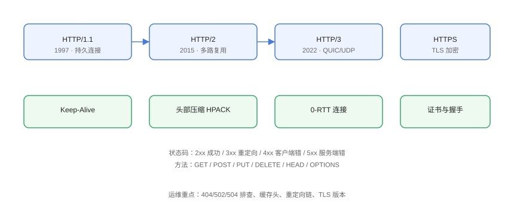

# HTTP 与 HTTPS

HTTP 是 Web 世界的通用协议；HTTPS 在其上叠加 TLS 加密。运维每天面对 4xx/5xx、重定向、缓存与证书问题，理解协议细节是定位这些问题的前提。

## 版本演进



| 版本 | 年份 | 核心能力 |
| --- | --- | --- |
| HTTP/1.1 | 1997 | 持久连接（Keep-Alive）、管线化 |
| HTTP/2 | 2015 | 多路复用、头部压缩（HPACK） |
| HTTP/3 | 2022 | QUIC（基于 UDP）、0-RTT、连接迁移 |

## 请求与响应

```text
请求行：GET /api/user HTTP/1.1
请求头：Host / User-Agent / Accept / Authorization / Cookie
请求体：POST 数据

状态行：HTTP/1.1 200 OK
响应头：Content-Type / Content-Length / Cache-Control / Set-Cookie
响应体：内容
```

```shell
# 完整查看请求响应
curl -v https://example.com

# 只看响应头
curl -sI https://example.com
```

## 状态码速查

| 范围 | 含义 | 运维关注 |
| --- | --- | --- |
| 2xx | 成功 | 200 / 204 |
| 3xx | 重定向 | 301 永久、302 临时、304 缓存 |
| 400 | 请求错误 | 参数/格式 |
| 401/403 | 未认证/无权限 | 认证配置 |
| 404 | 不存在 | 路由/静态文件 |
| 429 | 限流 | 频率限制配置 |
| 500 | 服务端内部错误 | 应用日志 |
| 502 | 网关收到无效响应 | 上游挂了/超时 |
| 503 | 服务不可用 | 过载/维护 |
| 504 | 网关超时 | 上游响应慢 |

## 常见故障排查

### 502 Bad Gateway

```shell
# Nginx 无法连接上游
curl -v http://backend:8080/health    # 上游是否可达
tail -f /var/log/nginx/error.log      # 看 upstream 错误
```

常见原因：上游宕机、端口错、防火墙、超时（`proxy_read_timeout`）。

### 504 Gateway Timeout

```shell
# 上游处理超时
检查：慢查询、长任务、代理超时配置
调整：proxy_read_timeout / upstream 响应时间
```

### 404 与静态资源

```shell
# 检查 root / alias 路径
nginx -T | grep -A5 "location /"
ls -l /var/www/html/
```

## 缓存头

```http
Cache-Control: max-age=3600            # 浏览器缓存 1 小时
Cache-Control: no-cache                 # 每次校验（配合 ETag）
Cache-Control: public, immutable        # 带 hash 的静态资源
Expires: Wed, 21 Oct 2026 07:28:00 GMT # 旧语法
```

```shell
# 验证缓存命中
curl -sI https://example.com/assets/app.js | grep -i cache
```

## HTTPS 与证书

```shell
# 查看证书信息
echo | openssl s_client -connect example.com:443 -servername example.com 2>/dev/null \
  | openssl x509 -noout -dates -subject -ext subjectAltName

# 检查 TLS 版本与套件
openssl s_client -connect example.com:443 -tls1_2 </dev/null 2>/dev/null | head
```

常见问题：

| 现象 | 原因 |
| --- | --- |
| 证书过期 | 未自动续期（Let's Encrypt 90 天） |
| 域名不匹配 | 证书 SAN 缺少该域名 |
| 证书链不完整 | 未配置中间证书 |
| 混合内容 | 页面引用 HTTP 资源 |

## 重定向排查

```shell
# 追踪重定向链
curl -sIL https://example.com
# 避免重定向死循环：http→https→http...
```

::: danger 重定向循环
常见：Nginx 同时做 http→https 跳转和 `$scheme` 判断，或 CDN 与源站都强制跳转。用 `curl -sIL` 观察循环路径。
:::

## 易错点与最佳实践

::: danger 常见坑
1. **502/504 定位错方向**：先确认「是网关问题还是上游问题」，再决定看哪边日志。
2. **缓存不生效**：检查 Cache-Control、CDN 缓存规则、URL 是否带 hash。
3. **证书续期失败无告警**：配置监控，提前 30 天告警。
4. **HTTP/2 与 HTTP/3 混淆**：Nginx `listen 443 ssl http2`（1.25 后为 `http2 on;`），QUIC 需额外配置。
5. **忽略代理链**：经过 CDN + Nginx + 应用，每层都要看日志。
:::

::: tip 最佳实践
- 用 `curl -v` 与 `curl -sIL` 作为第一排查工具；
- 网关层（Nginx）错误日志与访问日志分开看；
- 证书与域名到期纳入监控告警。
:::

## 验证方式

```shell
curl -v https://example.com
curl -sIL https://example.com
echo | openssl s_client -connect example.com:443 2>/dev/null | grep "Verify return code"
```

预期：返回 200、重定向链无循环、证书校验码为 `ok (0)`。

## 参考资料

- [MDN：HTTP](https://developer.mozilla.org/zh-CN/docs/Web/HTTP)
- [HTTP/3（RFC 9114）](https://www.rfc-editor.org/rfc/rfc9114)
- [Let's Encrypt 文档](https://letsencrypt.org/zh-cn/docs/)
