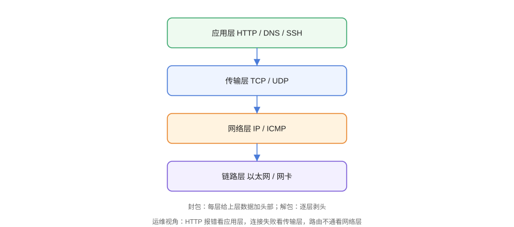

# 网络分层与 TCP/IP 模型

网络分层把复杂通信拆成「各自独立、逐层协作」的模块：每层只关心自己的职责，上层调用下层。运维排查的第一步就是**判断问题在哪一层**。

## 分层模型



## OSI 七层 vs TCP/IP 四层

| TCP/IP 四层 | OSI 七层 | 协议/设备 | 常见问题 |
| --- | --- | --- | --- |
| 应用层 | 应用层 / 表示层 / 会话层 | HTTP、DNS、SSH、TLS | 502、404、证书错误 |
| 传输层 | 传输层 | TCP、UDP | 连接超时、端口不通 |
| 网络层 | 网络层 | IP、ICMP、路由器 | 路由不通、丢包 |
| 链路层 | 数据链路层 / 物理层 | 以太网、交换机、网卡 | 网线、网卡故障 |

## 封包与解包

```text
发送（封包）：
  HTTP 数据 → 加 TCP 头（端口）→ 加 IP 头（地址）→ 加以太网头（MAC）→ 发出

接收（解包）：
  以太网头 → IP 头 → TCP 头 → HTTP 数据
```

```shell
# 查看本机网络接口与地址
ip addr
# 查看路由表
ip route
# 查看默认网关
ip route show default
```

## 关键概念

| 概念 | 说明 | 常用命令 |
| --- | --- | --- |
| IP 地址 | 网络层定位主机 | `ip addr` |
| MAC 地址 | 链路层定位网卡 | `ip link` |
| 端口 | 传输层定位进程 | `ss -tlnp` |
| 网关 | 出网下一跳 | `ip route` |
| MTU | 最大传输单元 | `ip link show` |
| DNS | 域名 → IP | `dig` |

## 运维视角的分层判断

| 现象 | 大概率层级 |
| --- | --- |
| 网卡灯不亮、`ip link` DOWN | 链路层 |
| ping 不通、路由丢失 | 网络层 |
| ping 通但 telnet 端口失败 | 传输层（防火墙/服务未起） |
| 端口通但 HTTP 报 502/504 | 应用层（网关/后端） |
| HTTPS 证书报错 | 应用层（TLS） |

## 易错点与最佳实践

::: danger 常见坑
1. **ping 通 ≠ 服务正常**：ping 走 ICMP，不代表 TCP 端口可用。
2. **telnet 通 ≠ 应用正常**：端口通只说明 TCP 建立成功，应用层可能仍报错。
3. **在错误的机器上排查**：先确认问题在哪台机器/哪段链路（客户端、服务端、中间设备）。
4. **忽略本机防火墙**：`iptables`/`firewalld`/云安全组都可能在网络层之前拦截。
5. **把「慢」当成「不通」**：慢通常涉及带宽、延迟、应用处理，需要抓包区分。
:::

::: tip 最佳实践
- 排查顺序固定为**自底向上**：链路 → 网络 → 传输 → 应用；
- 每个问题记录「在哪一层、用什么命令、什么结论」；
- 网络监控（ping 存活、端口探测、证书到期）提前告警，减少事后排查。
:::

## 验证方式

```shell
ip addr show
ip route
ping -c 3 8.8.8.8        # 网络层
ss -tlnp                 # 传输层监听端口
curl -v https://example.com   # 应用层
```

预期：地址/路由正常、ping 有响应、`ss` 能看到监听端口、curl 能完成 TLS 握手并返回内容。

## 参考资料

- [TCP/IP 指南（RFC 1180）](https://www.rfc-editor.org/rfc/rfc1180)
- [Linux ip 命令手册](https://man7.org/linux/man-pages/man8/ip.8.html)
- [MDN：网络协议](https://developer.mozilla.org/zh-CN/docs/Web/Guide/Network)
