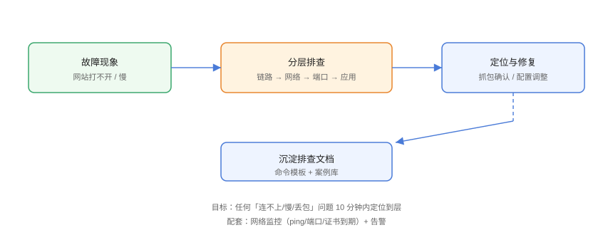

# 实战：网络故障排查全流程

用两个真实场景串联完整方法论：**「网站 502」**与**「时通时断」**，从现象到根因，覆盖分层排查、抓包取证与修复验证。

## 案例一：网站突然 502



### 现象

用户反馈首页 502，运维登录 Nginx 服务器。

### 排查

```shell
# 1. 本机网络正常吗？
ip addr && ip route

# 2. Nginx 进程在吗？
systemctl status nginx
ss -tlnp | grep 80

# 3. 看 Nginx 错误日志（关键！）
tail -n 50 /var/log/nginx/error.log
```

日志关键行：

```text
connect() failed (111: Connection refused) while connecting to upstream
```

结论：**上游（后端服务）拒绝连接**。

### 定位上游

```shell
# 4. 后端端口监听？
ss -tlnp | grep 8080

# 5. 后端服务状态？
systemctl status backend
journalctl -u backend -n 50
```

根因：后端服务 OOM 被 kill，systemd 自动重启中。

### 修复与验证

```shell
# 等待自动重启或手动拉起
systemctl start backend

# 验证后端健康
curl -s http://127.0.0.1:8080/health

# 验证 Nginx 恢复
curl -sI http://127.0.0.1/ | head -1
# HTTP/1.1 200 OK
```

### 预防

1. 后端健康检查（每 30s 探测 /health）；
2. 进程监控 + 告警（端口存活、OOM 事件）；
3. Nginx upstream 加备用节点。

## 案例二：时通时断

### 现象

应用偶尔连接数据库超时，无规律。

### 排查

```shell
# 1. 连续 ping 数据库（观察丢包）
ping -i 0.2 -c 100 10.0.0.10 | tail -3
# 10% 丢包 → 链路层/网络层有问题

# 2. 大包测试（MTU）
ping -s 1472 -M do 10.0.0.10
# 失败
ping -s 1400 -M do 10.0.0.10
# 成功 → MTU 问题

# 3. 抓包确认
sudo tcpdump -i eth0 -nn -c 500 host 10.0.0.10 and icmp
```

根因：中间 VPN 隧道 MTU 1500，业务大包被分片/丢弃。

### 修复

```shell
# 调整接口 MTU（按网络规划）
sudo ip link set dev eth0 mtu 1400

# 持久化（Netplan 示例）
# network:
#   ethernets:
#     eth0:
#       mtu: 1400
```

### 验证

```shell
ping -s 1472 -M do 10.0.0.10    # 现在应通过
ip link show eth0               # 确认 MTU
```

## 排查记录模板

```text
【故障时间】2026-08-30 10:00
【现象】首页 502 / 数据库连接超时
【影响范围】全部用户 / 部分时段
【分层定位】
  链路层：正常
  网络层：MTU 丢包 10%
  传输层：TCP 重传
  应用层：连接超时
【根因】VPN 隧道 MTU 1500 导致大包丢弃
【修复】eth0 MTU 调为 1400
【验证】大包 ping 通过，业务 24h 无超时
【预防】网络变更后执行 MTU 大包测试；监控丢包率告警
```

## 易错点与最佳实践

::: danger 常见坑
1. **先改配置后定位**：502 先看日志再动配置，避免掩盖根因。
2. **只在一端抓包**：MTU 问题两端对比更清晰（服务端+客户端）。
3. **修复后不验证**：必须复现原故障路径确认恢复。
4. **没有记录**：同样的故障第二次还要从头查。
5. **忽略变更窗口**：故障常由最近变更引发，先查变更记录。
:::

::: tip 最佳实践
- 建立「变更 → 验证 → 回滚」流程，网络问题先关联变更；
- 把排查命令做成脚本一键收集（`ip/ping/ss/curl/dig/tcpdump`）；
- 故障复盘产出监控项，让同类问题提前告警。
:::

## 验证方式

在本机搭一个 Nginx + 后端服务（如 `python3 -m http.server 8080`），停掉后端复现 502，按案例一流程走通；再模拟 MTU（或直接用大包 ping 内网目标）走通案例二。最后产出自己的「排查记录模板」填写版。

## 参考资料

- [Nginx 错误日志定位 upstream](https://nginx.org/en/docs/http/ngx_http_proxy_module.html)
- [MTU 与 PMTUD 说明](https://www.cloudflare.com/zh-cn/learning/network-layer/what-is-mtu/)
- [systemd 服务故障排查](https://www.freedesktop.org/software/systemd/man/latest/systemd.service.html)
