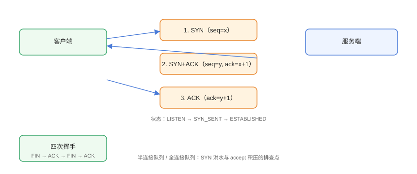

# TCP/IP 核心机制

TCP 提供**可靠、有序、全双工**的字节流传输；UDP 提供**无连接、不可靠但低延迟**的数据报传输。运维排查连接问题的核心就是理解 TCP 的握手、挥手与状态机。

## TCP 三次握手



```text
客户端                    服务端
   |---- SYN --------------->|  请求建立连接
   |<---- SYN+ACK -----------|  同意并同步
   |---- ACK --------------->|  确认
   |========= 连接建立 =======|
```

```shell
# 观察握手状态
ss -tn state syn-sent
ss -tn state established
```

## TCP 四次挥手

```text
客户端                    服务端
   |---- FIN --------------->|  关闭发送
   |<---- ACK ---------------|  确认（半关闭）
   |<---- FIN ---------------|  服务端关闭
   |---- ACK --------------->|  确认
   |===== TIME_WAIT =========|
```

```shell
# 观察 TIME_WAIT / CLOSE_WAIT
ss -tan | awk '{print $1}' | sort | uniq -c
```

::: tip 状态解读
- `TIME_WAIT` 多：正常现象（主动关闭方等待 2MSL），量级大时看连接复用配置；
- `CLOSE_WAIT` 堆积：**服务端程序没关闭 socket**（应用层 bug），需查代码；
- `SYN_RECV` 堆积：半连接队列满，可能 SYN 洪水或 accept 慢。
:::

## TCP 可靠性机制

| 机制 | 作用 |
| --- | --- |
| 序号与确认（seq/ack） | 保证有序与可靠 |
| 重传（RTO） | 超时未确认则重发 |
| 滑动窗口 | 流量控制（接收方通告窗口） |
| 拥塞控制 | 慢启动、拥塞避免、快重传 |
| 校验和 | 检测数据损坏 |

```shell
# 查看重传与丢包
netstat -s | grep -i retrans
ip -s link show
```

## UDP

```text
无连接：不握手、不确认、不重传
适用：DNS 查询、视频流、游戏、QUIC（HTTP/3）
排查：udp 丢包看 counters，抓包看重复/乱序
```

## 端口与连接排查

```shell
# 查看监听端口
ss -tlnp

# 查看连接状态统计
ss -tan

# 连接数统计（按状态）
ss -tan | awk 'NR>1{print $1}' | sort | uniq -c

# 连接数最多的远程 IP（排查扫描/攻击）
ss -tan | awk 'NR>1{print $5}' | cut -d: -f1 | sort | uniq -c | sort -rn | head
```

## 常见故障

### 连接超时（timeout）

```shell
# 服务器不通或防火墙丢包（静默丢弃）
traceroute -n -T -p 443 example.com

# 本机到目标端口探测
timeout 3 bash -c 'echo > /dev/tcp/1.2.3.4/443' && echo open || echo closed
```

### 连接被重置（RST）

```text
常见原因：
1. 端口未监听 → 内核回 RST
2. 防火墙 reject（而非 drop）
3. 应用主动关闭（如超时、协议错误）
4. 中间设备（负载均衡）干预

抓包确认：tcpdump 看到 RST 即定位到「谁发的」
```

## 易错点与最佳实践

::: danger 常见坑
1. **只看 ping 不看端口**：ping 通不代表 TCP 服务可用。
2. **CLOSE_WAIT 堆积累积不管**：这是应用层资源泄漏信号。
3. **盲目调大内核参数**：`tcp_tw_reuse` 等参数改错反而引发问题，先量后调。
4. **忽略 MTU 问题**：大包不通、小包通 → 检查 MTU（隧道/VPN 常见）。
5. **忘记查看两端状态**：连接问题要看客户端与服务端两侧状态才能定位。
:::

::: tip 最佳实践
- 用 `ss`（比 netstat 更快更全）；
- 连接问题配合 `tcpdump` 抓包看 SYN/RST/FIN；
- 内核网络参数调整遵循「监控 → 压测 → 调参 → 复测」。
:::

## 验证方式

```shell
ss -tlnp                     # 看到监听端口
curl -v http://127.0.0.1:8080   # 本机应用连通
ss -tan | grep ESTAB         # 看到已建立连接
```

预期：监听端口正常、curl 返回响应、连接进入 ESTABLISHED。

## 参考资料

- [RFC 793：TCP](https://www.rfc-editor.org/rfc/rfc793)
- [Linux 网络栈文档](https://www.kernel.org/doc/html/latest/networking/)
- [ss 命令手册](https://man7.org/linux/man-pages/man8/ss.8.html)
