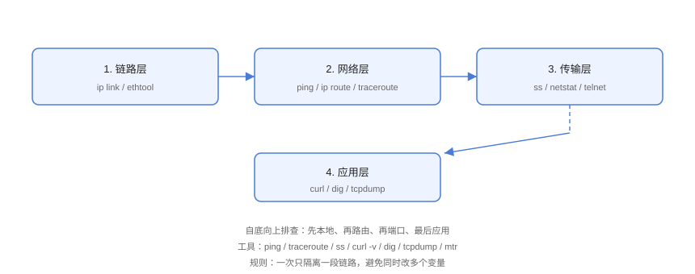

# 网络排查方法论

网络排查的核心是**分层定位 + 工具组合**：从链路层到应用层逐层排除，每层用合适的工具取证。本页给出标准流程、命令模板与常见场景。

## 排查流程



```text
自底向上：链路 → 网络 → 传输 → 应用
```

## 分层命令速查

| 层级 | 命令 | 目的 |
| --- | --- | --- |
| 链路层 | `ip link` / `ethtool` | 网卡状态、速率、错误计数 |
| 网络层 | `ping` / `ip route` / `traceroute` | 连通性、路由、丢包位置 |
| 传输层 | `ss` / `nc` / `telnet` | 端口监听、连接状态 |
| 应用层 | `curl -v` / `dig` / `tcpdump` | 协议交互、DNS、抓包 |

## 标准排查模板

```shell
# ========== 1. 链路层 ==========
ip link show
# 状态 UP/DOWN、错误计数

# ========== 2. 网络层 ==========
ping -c 3 目标IP
ip route get 目标IP          # 确认路由
traceroute -n 目标IP         # 定位丢包点

# ========== 3. 传输层 ==========
ss -tlnp                     # 本机监听
nc -vz 目标IP 端口            # 端口探测

# ========== 4. 应用层 ==========
curl -v http://目标/路径      # HTTP 交互
dig 域名                     # DNS
tcpdump -i any port 443      # 抓包
```

## 场景演练

### 场景一：网站完全打不开

```shell
# 1. 本机网络
ip addr && ip route

# 2. 网关与外网
ping -c 3 网关
ping -c 3 8.8.8.8

# 3. DNS
dig example.com

# 4. 目标端口
nc -vz 1.2.3.4 443

# 5. HTTP
curl -v https://example.com
```

在哪一步失败，问题就在那一层。

### 场景二：时通时断

```shell
# 连续 ping 观察丢包
ping -i 0.2 -c 100 目标IP | tail -3

# 抓包看重传（连续抓 60 秒）
tcpdump -i eth0 -nn -c 1000 host 目标IP and tcp | grep -c retransmission

# 确认是否 MTU 问题：大包 vs 小包
ping -s 1472 -M do 目标IP    # 1500-28
ping -s 1400 -M do 目标IP
```

::: tip 大包不通小包通 → MTU
`ping -s 1472 -M do` 失败而 `-s 1400` 成功，说明路径 MTU 问题（VPN/隧道/云网络常见），调整接口 MTU 或启用 PMTUD。
:::

### 场景三：连接超时 vs 拒绝

```text
超时（timeout）：目标不可达或防火墙 DROP → 抓包无响应
拒绝（refused）：端口未监听或防火墙 REJECT → 立即 RST/ICMP 拒绝
```

```shell
nc -vz 1.2.3.4 443
# timeout → 抓包确认
# refused → 检查服务与防火墙
```

## 排查原则

::: danger 排查大忌
1. **同时改多个变量**：无法归因，一次只隔离一段。
2. **跳过底层直接看应用**：应用日志可能掩盖网络真相。
3. **用 ping 判断一切**：ICMP 与 TCP 行为不同。
4. **不看时间同步**：日志时间不同步会导致跨端排查混乱（检查 `date`/NTP）。
5. **抓包不落盘**：关键证据要保存 pcap 留档。
:::

## 工具进阶

| 工具 | 用途 |
| --- | --- |
| `mtr` | ping + traceroute 持续统计（定位中间链路丢包） |
| `nload` / `iftop` | 实时带宽与连接流量 |
| `nethogs` | 按进程看流量 |
| `tcpdump` | 抓包分析（见抓包专题） |
| `iftop` | 连接级流量排序 |

```shell
# 安装后使用
sudo apt install mtr iftop nload
mtr -rwc 20 目标IP
```

## 易错点与最佳实践

::: danger 常见坑
1. **防火墙规则自己忘看**：`iptables -L`、`firewalld`、云安全组都可能拦截。
2. **多网卡选错**：默认路由与业务网卡不一致，`ip route get` 确认。
3. **代理影响测试**：系统代理会让 curl 走代理，`curl --noproxy '*'` 排除干扰。
4. **NAT 环境误判**：内网多跳 NAT 时源 IP 变化是正常的。
5. **日志与现象不同步**：先对齐时间再对照日志。
:::

::: tip 最佳实践
- 把排查流程固化为团队文档与脚本（一键收集 `ip/ping/ss/curl/dig` 信息）；
- 每次故障记录「现象 → 分层结论 → 根因 → 修复 → 预防」；
- 用监控把常见问题（端口挂、证书过期、丢包率高）提前暴露。
:::

## 验证方式

对一台测试机完整执行标准模板：`ip → ping → ss → curl`，每一步输出正常；再人为制造故障（停服务、加防火墙规则），确认对应步骤能暴露问题。

## 参考资料

- [traceroute 手册](https://man7.org/linux/man-pages/man8/traceroute.8.html)
- [mtr 项目](https://www.bitwizard.nl/mtr/)
- [Linux 网络诊断（Red Hat 文档）](https://access.redhat.com/documentation/en-us/red_hat_enterprise_linux/9/html/configuring_and_managing_networking/index)
