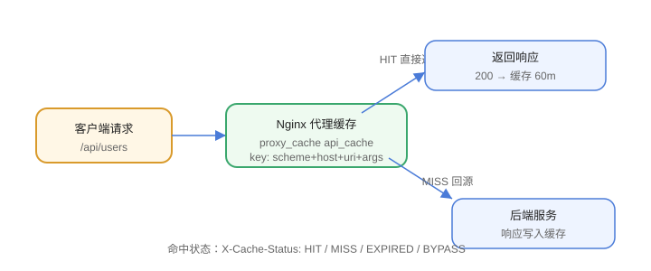

# 缓存配置

Nginx 的 `proxy_cache` 把后端响应存在**本机文件系统**上，命中时直接返回，不回源。对「读多写少、且能容忍秒级到分钟级陈旧」的接口与页面，这是最便宜的一层加速——不需要改一行业务代码。

这一页讲**代理层缓存**（`proxy_cache`）。浏览器侧的强缓存/协商缓存是另一套机制，见 [HTTP 缓存](../../../Frontend/Basic/Browser/Cache/index.md)；应用层缓存（Redis 等）见 [Redis 缓存设计](../../../DB/NoRelational/Redis/Advanced/CacheDesign/index.md)。



## 先分清三层缓存

三层缓存各管一段，混在一起排查会互相掩盖：

| 层 | 存在哪 | 由什么控制 | 命中怎么看出来 |
| --- | --- | --- | --- |
| 浏览器缓存 | 用户磁盘/内存 | 响应头 `Cache-Control` / `ETag`（见 [HTTP 缓存](../../../Frontend/Basic/Browser/Cache/index.md)） | DevTools 的 `(disk cache)` / 304 |
| **Nginx 代理缓存**（本页） | Nginx 所在主机磁盘 | `proxy_cache` 系列指令 | `X-Cache-Status: HIT` |
| 应用缓存 | Redis / 进程内 | 业务代码 | 应用日志、`Redis` 命中率 |

::: warning 排查顺序：由外向内
用户说「内容没更新」，按 **浏览器 → Nginx → 应用** 的顺序排除。反过来先怀疑应用，常常查半天发现是 Nginx 缓存了一份 10 分钟的旧响应——本页第 6 节给的三条观测手段就是为这个场景准备的。
:::

## 最小可用配置

`proxy_cache` 需要**三件事同时存在**才生效：一块共享内存区（`proxy_cache_path`）、一个使用它的 `proxy_cache` 指令、一个缓存键。

```nginx
# ① http 块：声明缓存区（必须在 http 上下文，不能写在 server 里）
http {
    # keys_zone=api_cache:10m  10MB 元数据（约 8 万个键），不含响应体
    # max_size=1g              响应体总量上限，超出按 LRU 淘汰
    # inactive=60m             60 分钟没被访问就淘汰（即使还没过期）
    # levels=1:2               两级目录散列，避免单目录文件过多
    proxy_cache_path /var/cache/nginx/api
                     keys_zone=api_cache:10m
                     max_size=1g
                     inactive=60m
                     use_temp_path=off;

    server {
        listen 80;

        location /api/ {
            proxy_pass http://backend;

            proxy_cache           api_cache;                                  # ② 使用缓存区
            proxy_cache_key       "$scheme$request_method$host$request_uri";  # ③ 缓存键
            proxy_cache_valid     200 302 10m;                                # 状态码 → 有效期
            proxy_cache_valid     404      1m;
            proxy_cache_use_stale error timeout updating http_500 http_502;   # 回源失败时用旧副本
            proxy_cache_background_update on;                                 # 过期后异步刷新
            proxy_cache_lock      on;                                         # 同一 key 只放一个请求回源

            add_header X-Cache-Status $upstream_cache_status;                 # 观测用
        }
    }
}
```

```shell
# 目录必须先建好并归 nginx 用户所有，否则启动报 permission denied
sudo mkdir -p /var/cache/nginx/api
sudo chown -R nginx:nginx /var/cache/nginx/api   # Debian/Ubuntu 上是 www-data
nginx -t && nginx -s reload
```

## `proxy_cache_path` 参数表

| 参数 | 含义 | 怎么定 |
| --- | --- | --- |
| `keys_zone=名:大小` | 共享内存里的**键与元数据**（不含响应体） | 1MB ≈ 8000 个键；先按「平均活跃键数 × 128 字节」估 |
| `max_size` | 磁盘上响应体总量上限 | 磁盘可用空间的 10%~20%；到顶后按 LRU 淘汰 |
| `inactive` | 多久没被访问就淘汰（**与过期时间无关**） | 设得比 `proxy_cache_valid` 大，否则没到有效期就被 LRU 清掉 |
| `levels=1:2` | 目录层级（散列分桶） | 长尾键多时**必须开**，否则单目录几十万文件、`ls` 都能卡住 |
| `use_temp_path=off` | 先写临时目录再改名 → 关闭后**直接写入最终位置** | 建议 `off`，少一次跨目录 `rename` |
| `min_free` | 保留的最小空闲空间（新版本支持） | 与其它服务共用磁盘时设，防写满 |
| `manager_files` / `loader_files` | 淘汰与加载的批次大小 | 键数量极大（百万级）时调优用 |

::: danger `keys_zone` 与 `max_size` 是两笔账
共享内存只存**键和元数据**，响应体全在磁盘。把 `keys_zone` 设成 10g 并不会让响应体进内存——那只会浪费共享内存（且 Nginx 启动时就会分配）。响应体的容量由 `max_size` 管。
:::

## 缓存键设计

默认键是 `$scheme$proxy_host$request_uri`，**多数场景需要显式重写**：

| 键写法 | 效果 | 适用 |
| --- | --- | --- |
| `$scheme$request_method$host$request_uri` | 含查询串、含方法（GET/POST 分开） | 通用推荐；`request_uri` 自带 `?args` |
| `$host$uri` | **丢弃查询串** | 查询串对内容无影响的页面（注意：会命中错内容） |
| `$host$uri$is_args$args` | 等价于 `$request_uri`，写法更显式 | 需要按参数排序时（`$args` 为空则 `$is_args` 也是空串） |
| 加 `$http_authorization` 等 | 按身份分缓存 | **慎用**：键空间爆炸；个人数据应直接 `proxy_no_cache` |

::: danger 三条纪律
① **不要把 POST 缓进来**：`proxy_cache_key` 里带 `$request_method` 只会让 GET/POST 分开存，但 POST 本就不该被 `proxy_cache_valid` 覆盖——用 `proxy_cache_methods` 明确只放 GET/HEAD（默认即如此，别改）；
② **不要漏 `$args`**：`/list?page=2` 与 `/list?page=3` 共用键会让读者看到别人的页；
③ **按身份区分的接口直接禁用缓存**（在 location 里写 `proxy_no_cache 1;` 或 `proxy_cache_bypass 1;`），而不是把 token 拼进键。
:::

## `proxy_cache_valid` 与后端响应头的关系

**上游的 `Cache-Control` 优先级高于 `proxy_cache_valid`**，这是最容易踩的一条：

| 上游响应头 | 结果 |
| --- | --- |
| `Cache-Control: max-age=600` | 按 600 秒缓存（`proxy_cache_valid` 被忽略） |
| `Cache-Control: no-store` / `private` | **不缓存** |
| `Cache-Control: no-cache` | 缓存但每次回源校验 |
| `X-Accel-Expires: 0` | 不缓存（Nginx 专有，用于让**后端**控制代理缓存） |
| 完全没有缓存相关头 | 这时才按 `proxy_cache_valid` 的状态码表决定 |

```nginx
# 想让 proxy_cache_valid 说了算，要么上游不返回缓存头，
# 要么显式忽略上游的 Cache-Control：
proxy_ignore_headers Cache-Control Expires Set-Cookie;
```

::: tip 反过来用：让后端精确控制
后端只要返回 `X-Accel-Expires: 600`，Nginx 就按 600 秒缓存该响应——这个头**不会转发给浏览器**，正好用来表达「Nginx 可以缓存 10 分钟，但浏览器别缓存」。比在 Nginx 里用各种 `map` 判断路径干净得多。
:::

## 观测：`$upstream_cache_status`

| 值 | 含义 | 该关注什么 |
| --- | --- | --- |
| `MISS` | 缓存里没有，回源了 | 命中率低时先看这个占比 |
| `HIT` | 命中，直接返回 | 目标值；看日志里 HIT 的占比 |
| `EXPIRED` | 有但已过期，回源了 | 有效期设太短，或热点更新频繁 |
| `STALE` | 回源失败，用了旧副本 | **必须告警**：说明后端在出错 |
| `UPDATING` | 后台正在刷新，先返回旧的 | 配了 `background_update` 时的正常状态 |
| `REVALIDATED` | 上游回了 304 | 后端支持条件请求，最省流量 |
| `BYPASS` | 被 `proxy_cache_bypass` 跳过 | 检查是否误伤正常流量 |

```shell
# 打开日志里的缓存状态（加到 log_format，不要只放在响应头里——响应头会被浏览器缓存掉）
log_format cache '$remote_addr $request $status cache=$upstream_cache_status rt=$request_time';
```

## 缓存清理

Nginx 开源版**没有**内置的按 URL 清除指令，三条现实路线：

| 路线 | 做法 | 代价 |
| --- | --- | --- |
| **改键版本号**（推荐） | 键里加一个可变的版本段（如 `$http_x_cache_version` 或从 upstream 拿到的版本号），要清缓存就把版本号 +1 | 旧文件由 `inactive` 自然淘汰，不需要清理接口 |
| 第三方模块 | 编译 `ngx_cache_purge`，用 `proxy_cache_purge` 定向清除 | 要自己编译 Nginx，与官方镜像/包管理冲突 |
| Nginx Plus | 商业版的 purge API | 需要授权 |

::: danger 「删目录」是最糟的清理方式
`rm -rf /var/cache/nginx/api/*` 会让 Nginx 的缓存管理器在下次访问时面对「元数据还在、文件没了」的不一致状态，表现为大量 `MISS` 甚至短暂 5xx。要清就清**整个**缓存并同时 reload，或者干脆用上面的键版本号方案。
:::

## 易错点

::: danger 高频翻车点
1. **把 `proxy_cache_path` 写在 `server` 块里**：该指令只在 `http` 上下文合法，`nginx -t` 会直接报错。
2. **缓存目录权限不对**：`nginx -t` 通过但访问 502/500，日志里是 `permission denied`。
3. **缓存了带 `Set-Cookie` 的响应**：默认 Nginx **不缓存**含 `Set-Cookie` 的响应——如果你为了「让它缓存」而 `proxy_ignore_headers Set-Cookie`，请确认响应里真的没有会话信息，否则会串号。
4. **`inactive` 小于缓存有效期**：内容还在有效期内就被 LRU 淘汰，命中率莫名偏低。
5. **缓存键漏掉 `$args`**：`/list?page=N` 全部命中同一份内容。
6. **以为改了后端就立刻生效**：缓存期内 Nginx 根本不会回源，表现为「改了没用」。
7. **`X-Cache-Status` 加在会带 `add_header` 继承问题的层级**：`add_header` 在遇到内层 `add_header` 时会被覆盖清空，务必在**真正处理请求的 location** 里加。
8. **上 `stale` 却不监控**：后端挂了之后所有请求都返回旧内容，页面「看起来正常」，故障被掩盖数小时。
:::

## 验证方式

```shell
# ① 配置语法与目录
nginx -t
sudo ls -ld /var/cache/nginx/api        # 属主必须是运行 nginx worker 的用户

# ② 连续两次请求：第一次 MISS，第二次 HIT
curl -sI http://127.0.0.1/api/users | grep -i x-cache-status      # 期望 MISS
curl -sI http://127.0.0.1/api/users | grep -i x-cache-status      # 期望 HIT

# ③ 查询串必须分开缓存（防「漏 $args」）
curl -sI 'http://127.0.0.1/api/list?page=2' | grep -i x-cache-status   # 期望 MISS
curl -sI 'http://127.0.0.1/api/list?page=3' | grep -i x-cache-status   # 期望仍为 MISS

# ④ 等过有效期后再请求：期望 EXPIRED 后变 HIT
sleep 600 && curl -sI http://127.0.0.1/api/users | grep -i x-cache-status

# ⑤ 磁盘上确实落了缓存文件（levels=1:2 → 目录名长度 1 与 2）
sudo find /var/cache/nginx/api -type f | head

# ⑥ 后端挂掉时验证 stale 兜底（期望 STALE 而不是 502）
sudo systemctl stop backend && curl -sI http://127.0.0.1/api/users | grep -i x-cache-status
```

## 参考资料

- Nginx 官方文档 `ngx_http_proxy_module`（`proxy_cache` 全量指令与优先级）—— https://nginx.org/en/docs/http/ngx_http_proxy_module.html
- Nginx 缓存指南（`ngx_http_proxy_module` 的 cache 章节与 `$upstream_cache_status`）—— https://nginx.org/en/docs/http/ngx_http_proxy_module.html#variables
- web.dev：CDN 与代理缓存行为 —— https://web.dev/articles/http-cache
- [HTTP 缓存（浏览器侧）](../../../Frontend/Basic/Browser/Cache/index.md)：`Cache-Control` 与 `ETag` 的完整指令表
- [静态资源服务](../StaticResources/index.md)：`expires` / `add_header` 控制静态资源缓存
- [限流配置](../RateLimit/index.md)：缓存与限流常一起上，注意 `limit_req` 对回源路径的影响
- [Redis 缓存设计](../../../DB/NoRelational/Redis/Advanced/CacheDesign/index.md)：应用层缓存的键设计与一致性
