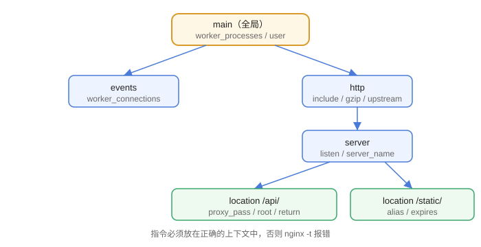

# 配置文件详解

Nginx 配置的核心是**上下文（Context）层级**：指令必须放在正确的块里才生效。理解 `main → events → http → server → location` 的嵌套关系，就能看懂 90% 的 nginx.conf。

## 配置层级

```text
main（全局）
├── events（事件模型）
└── http（HTTP 服务）
    ├── server（虚拟主机）
    │   ├── location（URI 匹配）
    │   └── location ...
    └── upstream（后端服务器组，常在 http 下）
```



## 最小可用配置

```nginx [nginx.conf]
worker_processes auto;

events {
    worker_connections 1024;
}

http {
    include       mime.types;
    default_type  application/octet-stream;
    sendfile      on;

    server {
        listen       80;
        server_name  example.com;

        location / {
            root   /usr/share/nginx/html;
            index  index.html;
        }
    }
}
```

## 常用全局指令

| 指令 | 作用 | 建议 |
| --- | --- | --- |
| `worker_processes` | worker 进程数 | `auto`（按 CPU 核数） |
| `worker_connections` | 每进程最大连接数 | 1024~65535 |
| `worker_rlimit_nofile` | 文件描述符上限 | 配合系统 ulimit |
| `user` | 运行用户 | 用低权限用户，如 `nginx` |
| `pid` | PID 文件路径 | 默认即可 |

## server 与 location

```nginx
server {
    listen 80;
    server_name api.example.com;

    location /api/ {
        proxy_pass http://backend;
    }

    location = /health {
        return 200 "ok";
    }
}
```

`server_name` 匹配 Host；`location` 匹配 URI，匹配优先级：

```text
精确匹配 =  > 前缀匹配 ^~  > 正则 ~ / ~*  > 普通前缀
```

## 常见变量

| 变量 | 含义 |
| --- | --- |
| `$host` | 请求 Host |
| `$uri` / `$request_uri` | URI（规范化/原始） |
| `$remote_addr` | 客户端 IP |
| `$proxy_add_x_forwarded_for` | 拼接 X-Forwarded-For |
| `$status` | 响应状态码 |
| `$request_time` | 请求处理耗时 |

## 配置组织方式

```nginx [nginx.conf]
http {
    include /etc/nginx/conf.d/*.conf;
    include /etc/nginx/sites-enabled/*;
}
```

每个站点一个文件放在 `conf.d/` 或 `sites-available/`，比全写进主配置好维护。

## 校验与重载

```shell
nginx -t                 # 校验语法，输出 syntax is ok
nginx -s reload          # 平滑重载（不中断请求）
nginx -s reopen          # 重新打开日志文件
```

## 易错点

::: danger 常见错误
1. 指令放错上下文：`server` 不能直接写在 `http` 外；`location` 只能出现在 `server` 或嵌套 `location` 里。
2. 每条指令漏分号：Nginx 配置每条指令以 `;` 结尾，漏掉直接 `nginx -t` 报错。
3. 改完不 `nginx -t` 就 reload：语法错误会导致 reload 失败，服务仍用旧配置。
4. 多个 server 的 server_name 冲突：匹配规则是“先精确后通配、按文件顺序”，容易踩坑。
5. `worker_processes` 写成固定数字：换机器后不匹配，用 `auto`。
6. 忘记 include mime.types：CSS/JS 可能被当成 octet-stream 下载。
:::

## 验证方式

1. 修改配置后执行 `nginx -t`，看到 `syntax is ok` 与 `test is successful`。
2. 执行 `nginx -s reload` 后访问站点，确认配置生效。
3. 故意把 `server` 块写到 `http` 外，`nginx -t` 会提示指令不允许出现在该上下文。

## 参考资料

- 官方指令索引：https://nginx.org/en/docs/dirindex.html
- 模块索引：https://nginx.org/en/docs/
- 配置示例：https://www.nginx.com/resources/wiki/start/
