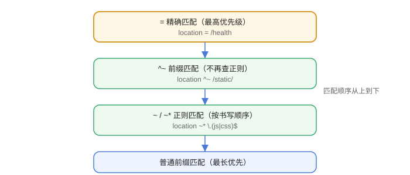

# 常见问题与最佳实践

这一篇汇总 Nginx 高频问题与团队工程实践，覆盖 location 匹配、502/504、缓存、性能与安全。

## 常见问题

### 1. location 匹配优先级

```text
= 精确匹配  >  ^~ 前缀匹配  >  ~ / ~* 正则  >  普通前缀匹配（最长优先）
```



### 2. 访问返回 403

检查：

1. 目录/文件权限：Nginx 运行用户（通常 `nginx`/`www-data`）无读权限。
2. 索引文件不存在且 `autoindex off`。
3. 隐藏文件被 `deny all` 拦截（`location ~ /\.`）。

### 3. 返回 502 Bad Gateway

后端没有正常响应：进程未启动、端口不对、防火墙拦截、`proxy_pass` 地址写错。用 `curl` 直接访问后端验证。

### 4. 返回 504 Gateway Timeout

后端响应超过 `proxy_read_timeout`（默认 60s）。长任务接口调大超时，或改为异步处理。

### 5. proxy_pass 路径不对

`proxy_pass http://backend;`（无 URI）保留原路径；`proxy_pass http://backend/xxx;`（带 URI）会替换 location 前缀。先确认预期映射再配置。

### 6. http2 配置报错

新版使用 `listen 443 ssl;` + `http2 on;`；旧写法 `listen 443 ssl http2;` 在 1.25.1+ 弃用但仍兼容。升级后按新语法迁移。

### 7. 修改配置不生效

改完必须 `nginx -t` 校验，再 `nginx -s reload`；语法错误时 reload 失败，服务继续用旧配置。

### 8. 缓存一直不命中

检查 `proxy_cache_key` 是否含参数、`proxy_cache_valid` 是否覆盖该状态码、磁盘权限是否可写、`$upstream_cache_status` 输出。

### 9. 高并发下连接数不够

```nginx
worker_processes auto;
events {
    worker_connections 65535;
}
```

同时确认系统 `ulimit -n` 足够大（如 65535）。

### 10. 安全基线

```nginx
server_tokens off;
client_max_body_size 10m;
add_header X-Content-Type-Options "nosniff" always;
add_header X-Frame-Options "SAMEORIGIN" always;
```

## 最佳实践清单

::: tip 可直接落地的清单
1. 所有配置改动先 `nginx -t`，再 `nginx -s reload`，禁止直接 restart。
2. 每个站点一个配置文件放 `conf.d/`，命名如 `example.com.conf`。
3. 静态资源由 Nginx 直接返回，动态请求反代后端。
4. 生产启用 HTTPS（Let's Encrypt 自动续期），80 端口 301 跳转。
5. 对登录、下单等敏感接口单独限流，返回 429 而不是 503。
6. 后端统一接 `X-Real-IP` / `X-Forwarded-For`，应用侧配置信任代理。
7. 日志按天切割（`logrotate` 或 `nginx -s reopen`），保留 N 天。
8. 缓存 key 必须包含影响结果的参数，用户私有数据不缓存。
9. 上线前用 `ab` / `wrk` 压测，确认 worker_connections 与后端容量匹配。
10. 关注安全更新：稳定分支 1.28.x 有安全修复时及时升级。
:::

## 验证方式

1. 对上面 10 个问题逐一构造场景并排查，记录结论。
2. 用 `nginx -T` 输出最终生效的完整配置，核对 include 是否齐全。
3. 压测后查看 access.log 的 `$request_time` 与状态码分布。

## 参考资料

- Nginx 官方文档：https://nginx.org/en/docs/
- Nginx 官方博客：https://www.nginx.com/blog/
- 阿里巴巴 Nginx 实践（书籍/社区资料）
