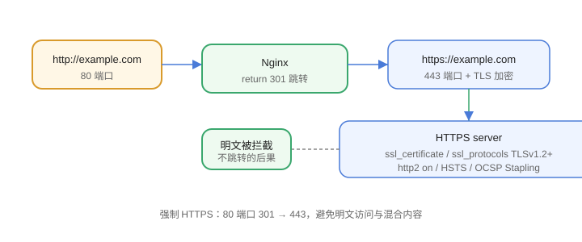

# HTTPS 配置

HTTPS 通过 TLS 加密传输，是生产环境的强制要求。Nginx 是 TLS 终结（TLS Termination）的常见位置：证书、加密、重定向都在这一层完成，后端用明文内网通信。



## 获取证书

推荐使用 Let's Encrypt + certbot 自动签发：

```shell
sudo apt install -y certbot python3-certbot-nginx
sudo certbot --nginx -d example.com -d www.example.com
```

certbot 会自动修改 Nginx 配置并配置续期。自建测试环境可用自签名证书：

```shell
sudo openssl req -x509 -nodes -days 365 -newkey rsa:2048 \
  -keyout /etc/nginx/ssl/server.key \
  -out /etc/nginx/ssl/server.crt \
  -subj "/CN=example.com"
```

## HTTPS server 配置

```nginx [conf.d/ssl.conf]
server {
    listen 443 ssl;
    http2 on;                    # 新版写法（nginx 1.25.1+）
    server_name example.com;

    ssl_certificate     /etc/letsencrypt/live/example.com/fullchain.pem;
    ssl_certificate_key /etc/letsencrypt/live/example.com/privkey.pem;

    ssl_protocols TLSv1.2 TLSv1.3;
    ssl_ciphers HIGH:!aNULL:!MD5;
    ssl_session_cache   shared:SSL:10m;
    ssl_session_timeout 10m;

    location / {
        proxy_pass http://backend;
    }
}
```

::: warning http2 写法
旧写法 `listen 443 ssl http2;` 从 nginx 1.25.1 起**弃用**，新配置使用 `listen 443 ssl;` + `http2 on;`，旧写法在 1.28 仍可运行但建议迁移。
:::

## HTTP 强制跳转 HTTPS

```nginx
server {
    listen 80;
    server_name example.com www.example.com;
    return 301 https://$host$request_uri;
}
```

## 安全增强

```nginx
server {
    # HSTS：强制浏览器使用 HTTPS
    add_header Strict-Transport-Security "max-age=31536000; includeSubDomains" always;

    # OCSP Stapling：在线证书状态查询
    ssl_stapling on;
    ssl_stapling_verify on;
}
```

## 性能优化

1. `ssl_session_cache shared:SSL:10m`：复用会话，减少握手。
2. `ssl_session_timeout 10m`：会话有效期。
3. TLS 1.3 原生减少一次往返（0-RTT 可选）。
4. 证书链完整：`fullchain.pem` 包含中间证书，避免部分客户端报错。

## 易错点

::: danger 常见错误
1. 证书私钥权限过宽：key 文件建议 `chmod 600`，Nginx 启动失败先看 error.log。
2. 忘记把 80 端口请求跳转：用户仍可通过 http 明文访问。
3. 证书过期未续期：Let's Encrypt 证书 90 天有效，确认 certbot renew 定时任务存在。
4. 混合内容（Mixed Content）：页面里还有 http 资源，浏览器拦截；统一改 https 或相对协议。
5. `ssl_protocols` 仍写 SSLv3/TLSv1.0：已不安全，最低 TLSv1.2。
6. 自签名证书被浏览器拦截：仅限内网测试，生产用受信任 CA。
:::

## 验证方式

1. `nginx -t && nginx -s reload` 后访问 `https://example.com`，地址栏显示锁标识。
2. 用 [SSL Labs](https://www.ssllabs.com/ssltest/) 检测评分。
3. `curl -I https://example.com`，确认返回 `HTTP/2 200`。
4. `curl -I http://example.com`，确认返回 301 且 Location 为 https。

## 参考资料

- ssl 模块：https://nginx.org/en/docs/http/ngx_http_ssl_module.html
- Certbot 官方文档：https://certbot.eff.org/
- Mozilla SSL 配置生成器：https://ssl-config.mozilla.org/
