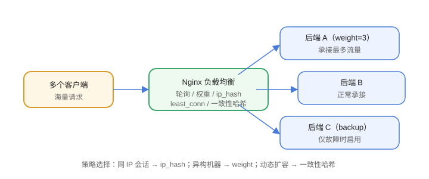

# 负载均衡

负载均衡把流量按策略分发到多台后端服务器，提升吞吐与可用性。Nginx 通过 `upstream` 定义服务器组，在 `proxy_pass` 中引用即可。



## upstream 基本配置

```nginx [conf.d/upstream.conf]
upstream backend {
    server 10.0.0.1:8080 weight=3;
    server 10.0.0.2:8080 weight=1;
    server 10.0.0.3:8080 backup;
    keepalive 32;
}

server {
    listen 80;
    server_name api.example.com;

    location / {
        proxy_pass http://backend;
        proxy_http_version 1.1;
        proxy_set_header Connection "";
    }
}
```

## 分发策略

| 策略 | 写法 | 特点 |
| --- | --- | --- |
| 轮询 | 默认 | 按顺序轮流，weight 控制比例 |
| 权重 | `weight=3` | 按权重分配，适合异构机器 |
| IP 哈希 | `ip_hash;` | 同一 IP 固定到同一台，天然会话保持 |
| 最少连接 | `least_conn;` | 分给当前连接最少的后端 |
| 一致性哈希 | `hash $request_uri consistent;` | 按 key 分布，扩容影响最小 |

## 会话保持

```nginx
upstream backend {
    ip_hash;
    server 10.0.0.1:8080;
    server 10.0.0.2:8080;
}
```

`ip_hash` 适合简单场景；多级代理下客户端 IP 不准时，用基于 Cookie 的会话保持（需要 Nginx Plus 或第三方模块）。

## 健康检查

开源版 Nginx 提供**被动健康检查**：

```nginx
upstream backend {
    server 10.0.0.1:8080 max_fails=3 fail_timeout=30s;
    server 10.0.0.2:8080 max_fails=3 fail_timeout=30s;
}
```

连续失败 `max_fails` 次后，后端在 `fail_timeout` 内被标记不可用，不再转发；主动健康检查（定时探测）需要 Nginx Plus。

## 备用节点

```nginx
upstream backend {
    server 10.0.0.1:8080;
    server 10.0.0.2:8080;
    server 10.0.0.3:8080 backup;   # 仅在其他节点不可用时启用
}
```

## keepalive 连接复用

```nginx
upstream backend {
    server 10.0.0.1:8080;
    keepalive 32;                   # 保留的空闲连接数
}
```

配合 `proxy_http_version 1.1` 与 `Connection ""`，复用与后端的连接，减少握手开销。

## 易错点

::: danger 常见错误
1. 轮询策略下请求仍集中到一台：检查 weight 是否设置合理、后端是否被动下线。
2. `ip_hash` 经过 CDN/多层代理后失效：客户端 IP 变成代理 IP，改用基于 Cookie 的方案。
3. 只配 `max_fails` 不配 `fail_timeout`：默认 1s 超时窗口太短，误判频繁。
4. 忘记 `keepalive` 配套头：不加 `proxy_http_version 1.1` 时 keepalive 不生效。
5. 后端端口写错或没监听：upstream 里配置后先用 `curl` 直接验证各节点。
6. 动态扩容时负载不均：用一致性哈希或最小连接，减少对存量请求的扰动。
:::

## 验证方式

1. 起 3 个不同端口的测试服务，配置轮询后连续请求，观察请求分布。
2. 停掉一台后端，确认 `max_fails` 后请求自动转向其他节点。
3. 用 `ip_hash` 从同一 IP 连续请求，确认始终命中同一节点。

## 相关专题

- [微服务负载均衡](../../../Backend/Microservices/LoadBalance/index.md)：客户端负载均衡（Spring Cloud LoadBalancer）与服务端负载均衡的分工
- [微服务 API 网关](../../../Backend/Microservices/Gateway/index.md)：Nginx 与业务网关的协作分层

## 参考资料

- upstream 模块：https://nginx.org/en/docs/http/ngx_http_upstream_module.html
- 负载均衡说明：https://nginx.org/en/docs/http/load_balancing.html
- keepalive 指令：https://nginx.org/en/docs/http/ngx_http_upstream_module.html#keepalive
