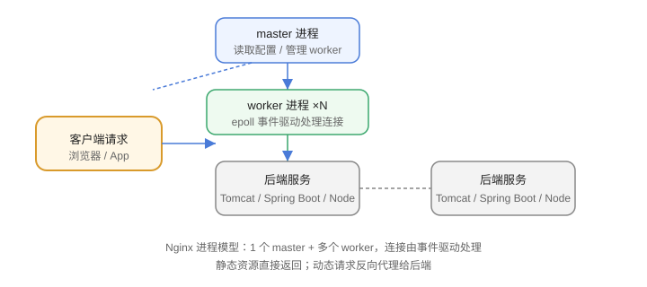

# Nginx 概述与安装

Nginx（发音 engine-x）是开源的高性能 Web 服务器与反向代理软件，以**高并发、低资源占用**著称，广泛用于静态资源托管、反向代理、负载均衡、缓存和限流。

::: info 版本现状（2026-08 核对）
Nginx 当前**稳定分支为 1.28.x**（最新 1.28.3，2026-03 发布，包含安全修复）；**主线版（mainline）**已迭代到 1.31 系列（2026-05），提供新特性但不建议生产直接使用。
:::

## Nginx 能做什么

1. **静态资源服务器**：HTML、CSS、JS、图片，性能远高于应用服务器。
2. **反向代理**：把请求转发给后端 Tomcat、Node、Spring Boot 等。
3. **负载均衡**：把流量分发到多台后端。
4. **缓存**：代理缓存 + 浏览器缓存控制。
5. **限流与安全**：限制请求速率、并发连接，隐藏后端结构。

## 为什么高并发

Nginx 采用**事件驱动 + 多进程**模型：master 进程管理，worker 进程通过 epoll（Linux）处理海量连接，每个连接开销极小，单机轻松支撑数万并发连接。



## 安装 Nginx

### Debian / Ubuntu

```shell
sudo apt update
sudo apt install -y nginx
```

### CentOS / RHEL

```shell
sudo yum install -y nginx
```

### 官方仓库（推荐获取最新稳定版）

以 Ubuntu 为例：

```shell
sudo apt install -y curl gnupg2 ca-certificates lsb-release ubuntu-keyring
curl -fsSL https://nginx.org/keys/nginx_signing.key | sudo gpg --dearmor \
  -o /usr/share/keyrings/nginx-archive-keyring.gpg
echo "deb [signed-by=/usr/share/keyrings/nginx-archive-keyring.gpg] \
  http://nginx.org/packages/ubuntu $(lsb_release -cs) nginx" \
  | sudo tee /etc/apt/sources.list.d/nginx.list
sudo apt update
sudo apt install -y nginx
```

### Docker

```shell
docker run -d --name nginx -p 80:80 -v /etc/nginx/conf.d:/etc/nginx/conf.d nginx:1.28
```

### Windows

从 https://nginx.org/en/download.html 下载 `nginx-1.28.x.zip`，解压后双击 `nginx.exe` 或命令行启动：

```shell
start nginx
nginx -s reload   # 重载配置
nginx -s stop     # 停止
```

## 验证安装

```shell
nginx -v
sudo systemctl status nginx
curl -I http://localhost/
```

预期 `curl -I` 返回 `HTTP/1.1 200 OK` 且响应头包含 `Server: nginx/1.28.x`。

## 核心目录

| 路径 | 作用 |
| --- | --- |
| `/etc/nginx/nginx.conf` | 主配置文件 |
| `/etc/nginx/conf.d/` | 附加配置目录（通常按站点拆分） |
| `/etc/nginx/sites-available/` | Debian 系站点配置（可用软链到 sites-enabled） |
| `/var/log/nginx/access.log` | 访问日志 |
| `/var/log/nginx/error.log` | 错误日志 |
| `/usr/share/nginx/html/` | Debian 系默认站点根目录 |

## 易错点

::: danger 常见错误
1. 装完不启动服务：`apt` 装完一般自动启动，手动编译安装需要自己配置 systemd。
2. 防火墙挡了 80/443：云服务器还要在安全组放行端口，`curl` 不通先查防火墙。
3. 直接改 `nginx.conf` 不备份：改前先 `cp` 备份，改后必须 `nginx -t` 校验再 reload。
4. 生产使用主线版：主线特性新但未充分打磨，生产用稳定分支 1.28.x。
5. 把 Nginx 当应用服务器跑动态页面：动态请求应反代给后端，静态资源才交给 Nginx。
:::

## 验证方式

1. `nginx -v` 确认版本为 1.28.x。
2. 浏览器访问 `http://服务器IP/`，看到 Nginx 默认欢迎页。
3. 执行 `ps -ef | grep nginx`，确认存在 1 个 master 和多个 worker 进程。

## 参考资料

- Nginx 官网：https://nginx.org/
- Nginx 下载页：https://nginx.org/en/download.html
- Nginx 官方文档：https://nginx.org/en/docs/
