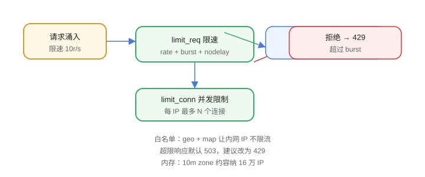

# 限流配置

Nginx 限流保护后端不被突发流量打垮，常用两种：**请求速率限制**（`limit_req`）和**并发连接限制**（`limit_conn`）。



## 请求速率限制

```nginx [conf.d/limit.conf]
http {
    limit_req_zone $binary_remote_addr zone=api_limit:10m rate=10r/s;

    server {
        location /api/ {
            limit_req zone=api_limit burst=20 nodelay;
            proxy_pass http://backend;
        }
    }
}
```

说明：

1. `limit_req_zone` 在 `http` 层定义：按 IP（`$binary_remote_addr`）限速 10 请求/秒。
2. `burst=20`：允许瞬时积压 20 个请求排队。
3. `nodelay`：积压请求不延迟处理，直接放行到限制内（配合 burst 实现“突发削平”）。
4. 超出限制返回 **503**（可改 `limit_req_status 429;`）。

## 并发连接限制

```nginx
http {
    limit_conn_zone $binary_remote_addr zone=conn_limit:10m;

    server {
        limit_conn conn_limit 20;        # 每 IP 最多 20 并发连接
        limit_conn_status 429;
    }
}
```

## 按接口精细化

```nginx
limit_req_zone $binary_remote_addr zone=login_limit:10m rate=2r/m;

location /api/login {
    limit_req zone=login_limit burst=5 nodelay;
    proxy_pass http://backend;
}
```

登录、短信等敏感接口单独收紧，业务接口放宽。

## 内网白名单

```nginx
geo $limit {
    default 1;
    127.0.0.1 0;
    10.0.0.0/8 0;
}

map $limit $limit_key {
    0 "";
    1 $binary_remote_addr;
}

limit_req_zone $limit_key zone=api_limit:10m rate=10r/s;
```

内网地址不限流，外网地址正常限流。

## 限流结果返回

```nginx
limit_req_status 429;
limit_conn_status 429;

location /api/ {
    limit_req zone=api_limit burst=20 nodelay;
    proxy_pass http://backend;
    proxy_intercept_errors on;
    error_page 429 = @rate_limited;
}

location @rate_limited {
    return 429 '{"code":429,"message":"too many requests"}';
    default_type application/json;
}
```

## 易错点

::: danger 常见错误
1. 用 `$remote_addr` 而不是 `$binary_remote_addr`：内存占用高，IP 字符串可达 46 字节，binary 只有 4~16 字节。
2. `burst` 理解错：burst 是排队容量，不是“额外放行数”，配合 nodelay 才有削峰效果。
3. 默认返回 503：客户端/网关可能当“服务不可用”重试，改成 429 语义更准确。
4. 只限 IP 不限用户：NAT/代理后多人共用一个 IP，按需换成用户 ID 维度。
5. zone 内存不足：10m 约可容纳 16 万 IP，超大流量要调大。
6. 忘记 reload：`limit_req_zone` 修改后必须 `nginx -t && nginx -s reload`。
:::

## 验证方式

1. 用 `ab -n 100 -c 10 http://api.example.com/api/` 压测，观察 429 响应。
2. 查看 access.log 中 429 状态码数量与时间分布。
3. 从内网 IP 请求，确认白名单配置后不再限流。

## 参考资料

- limit_req 模块：https://nginx.org/en/docs/http/ngx_http_limit_req_module.html
- limit_conn 模块：https://nginx.org/en/docs/http/ngx_http_limit_conn_module.html
- 限流与削峰指南：https://www.nginx.com/blog/rate-limiting-nginx/
