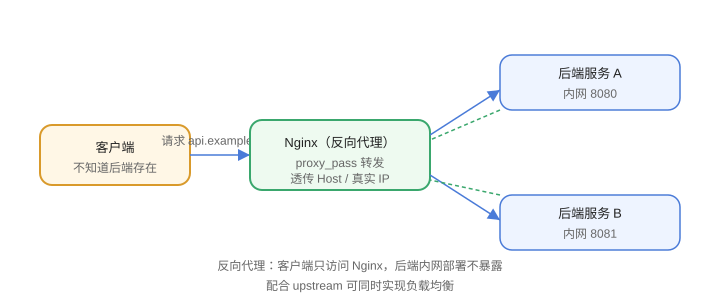

# 反向代理

反向代理（Reverse Proxy）是 Nginx 最核心的用法：客户端只认识 Nginx，真实后端对它不可见。请求到达 Nginx 后按规则转发给后端服务，再把响应返回给客户端。



## 正向代理与反向代理

| 维度 | 正向代理 | 反向代理 |
| --- | --- | --- |
| 代理对象 | 代理客户端 | 代理服务器 |
| 典型场景 | 翻墙、公司出口 | 隐藏后端、负载均衡 |
| 客户端感知 | 需要配置代理 | 无感知 |

## 基本配置

```nginx [conf.d/api.conf]
server {
    listen 80;
    server_name api.example.com;

    location /api/ {
        proxy_pass http://127.0.0.1:8080;

        proxy_set_header Host $host;
        proxy_set_header X-Real-IP $remote_addr;
        proxy_set_header X-Forwarded-For $proxy_add_x_forwarded_for;
        proxy_set_header X-Forwarded-Proto $scheme;

        proxy_connect_timeout 5s;
        proxy_read_timeout   60s;
        proxy_send_timeout   60s;
    }
}
```

## proxy_pass 带不带 URI

```nginx
# 不带 URI：原样转发完整 URI
location /api/ {
    proxy_pass http://backend;
    # /api/users → http://backend/api/users
}

# 带 URI：用替换后的路径转发
location /api/ {
    proxy_pass http://backend/v1/;
    # /api/users → http://backend/v1/users
}
```

不带 URI 时保留原路径；带 URI 时 location 匹配部分会被替换——这是最常见的前后端路径不一致问题根源。

## 透传客户端信息

| 请求头 | 作用 |
| --- | --- |
| `Host` | 原请求的域名 |
| `X-Real-IP` | 客户端真实 IP |
| `X-Forwarded-For` | 客户端 IP 链 |
| `X-Forwarded-Proto` | 原始协议 http/https |

后端（Spring Boot、Nginx 下一跳）据此拿到真实客户端信息；应用内还需配置 `server.forward-headers-strategy` 等信任代理。

## WebSocket 代理

```nginx
location /ws/ {
    proxy_pass http://ws_backend;
    proxy_http_version 1.1;
    proxy_set_header Upgrade $http_upgrade;
    proxy_set_header Connection "upgrade";
    proxy_read_timeout 3600s;      # 长连接
}
```

## 常见超时与缓冲

| 指令 | 默认 | 用途 |
| --- | --- | --- |
| `proxy_connect_timeout` | 60s | 连接后端超时 |
| `proxy_read_timeout` | 60s | 读取响应超时 |
| `proxy_send_timeout` | 60s | 发送请求超时 |
| `proxy_buffering on` | on | 是否缓冲响应 |

## 易错点

::: danger 常见错误
1. 后端拿不到真实 IP：忘记 `proxy_set_header X-Real-IP`，日志全是 Nginx 内网 IP。
2. `proxy_pass` 带 URI 导致路径丢失：`/api/` 反代到后端根路径，先确认期望的映射。
3. WebSocket 升级失败：缺 `Upgrade` / `Connection` 头，长连接直接断开。
4. 后端超时：下载/长任务接口被 `proxy_read_timeout` 切断，按业务调整。
5. 大响应被缓冲磁盘：对实时流关闭 `proxy_buffering`。
6. 代理到不存在的 upstream：配置里先定义 `upstream`，否则 reload 报错。
:::

## 验证方式

1. 启动一个本地测试服务（如 `python3 -m http.server 8080`），访问 Nginx 代理地址确认转发成功。
2. 在后端日志确认收到 `X-Real-IP` 与 `X-Forwarded-For`。
3. 用 `curl -v` 观察响应头 `Server: nginx`，确认请求确实经过 Nginx。

## 参考资料

- proxy_pass 指令：https://nginx.org/en/docs/http/ngx_http_proxy_module.html#proxy_pass
- 代理模块文档：https://nginx.org/en/docs/http/ngx_http_proxy_module.html
- WebSocket 代理示例：https://nginx.org/en/docs/http/websocket.html
