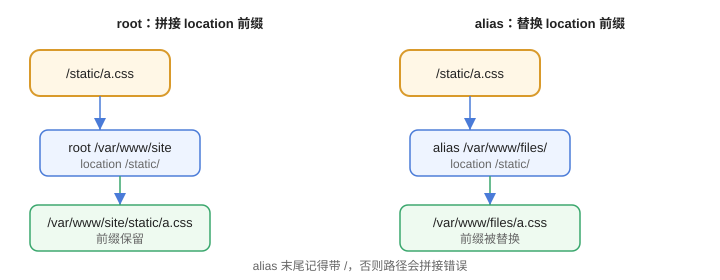

# 静态资源服务

静态资源（HTML、CSS、JS、图片）由 Nginx 直接返回比交给应用服务器快得多。这一篇讲清 `root` 与 `alias` 的区别、缓存头、gzip 和基础安全配置。

## root 与 alias

`root` 和 `alias` 是最容易混的两个指令：

```nginx
location /static/ {
    root /var/www/site;          # 请求 /static/a.css → /var/www/site/static/a.css
}

location /static/ {
    alias /var/www/files/;       # 请求 /static/a.css → /var/www/files/a.css
}
```



要点：

1. `root` 会拼接 location 的 URI 前缀。
2. `alias` 用 location 匹配后的剩余部分替换。
3. `alias` 末尾建议带 `/`，否则容易拼接出错。

## 一个完整的静态站点

```nginx [conf.d/static.conf]
server {
    listen 80;
    server_name static.example.com;

    root /var/www/site;
    index index.html;
    charset utf-8;

    location /assets/ {
        expires 30d;                     # 浏览器缓存 30 天
        add_header Cache-Control "public, immutable";
    }

    location / {
        try_files $uri $uri/ /index.html;   # SPA 路由回退
    }

    gzip on;
    gzip_types text/css application/javascript application/json image/svg+xml;
    gzip_min_length 1k;
}
```

## 常用指令

| 指令 | 作用 |
| --- | --- |
| `index` | 默认首页文件 |
| `try_files` | 按顺序尝试文件，找不到走回退 |
| `autoindex on` | 目录列表（慎开） |
| `expires` | 设置 Expires / Cache-Control |
| `gzip on` | 开启压缩 |
| `client_max_body_size` | 上传大小限制（默认 1m） |

## 浏览器缓存

```nginx
location ~* \.(js|css|png|jpg|svg|woff2)$ {
    expires 30d;
    add_header Cache-Control "public, immutable";
}

location ~* \.html$ {
    expires -1;          # HTML 不缓存，保证更新可见
    add_header Cache-Control "no-cache";
}
```

## 安全加固

```nginx
server {
    server_tokens off;                    # 隐藏版本号
    add_header X-Content-Type-Options "nosniff" always;
    add_header X-Frame-Options "SAMEORIGIN" always;

    # 禁止访问隐藏文件
    location ~ /\. {
        deny all;
    }
}
```

## 易错点

::: danger 常见错误
1. `root` 和 `alias` 混用后 404：先确认映射后的真实路径，用 `nginx -t` + 实际访问验证。
2. `expires` 只对匹配的 location 生效：JS/CSS 版本更新后仍命中旧缓存，配合文件名 hash 或 `immutable` 使用。
3. `autoindex on` 暴露目录结构：生产环境默认关闭。
4. 中文文件名乱码：`charset utf-8;` 未配置。
5. 上传/大文件 413：`client_max_body_size` 未调整。
6. gzip 对已压缩格式（jpg、mp4）无效：只对文本类开启。
:::

## 验证方式

1. 放置 `a.css` 后访问 `http://static.example.com/assets/a.css`，确认返回 200 且响应头含 `Cache-Control: public, immutable`。
2. 用 `curl -I` 观察 `Content-Encoding: gzip`。
3. 修改配置后 `nginx -t && nginx -s reload`，访问确认生效。

## 参考资料

- root 指令：https://nginx.org/en/docs/http/ngx_http_core_module.html#root
- alias 指令：https://nginx.org/en/docs/http/ngx_http_core_module.html#alias
- gzip 模块：https://nginx.org/en/docs/http/ngx_http_gzip_module.html
