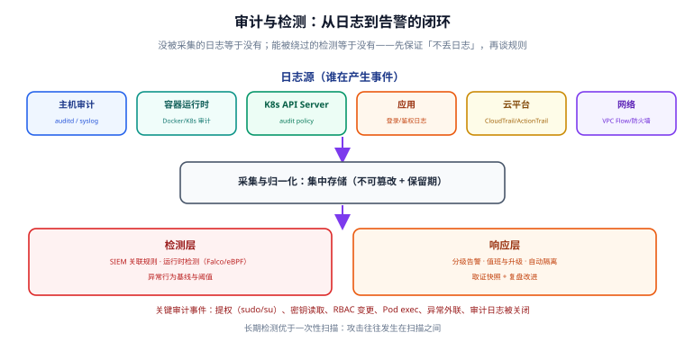

# 审计与检测

前面几篇讲的都是「**让攻击变难**」（预防）。但如果攻击者真的进来了，**你有没有能力在第一时间发现？** 这取决于审计（Audit）与检测（Detection）能力。

区别在于：

- **审计（Audit）**：完整记录「谁在什么时候做了什么」，追求**不可篡改、可追溯**，用于事后取证与合规；
- **检测（Detection）**：从事件流中识别**异常行为**，追求**实时、低误报**，用于事中止损。

两者共用同一批日志源，但目标不同——审计要求「全」，检测要求「准」。

## 一、日志源盘点

要做检测，先得知道「哪些地方会产生事件」。以下是必须覆盖的日志源：

| 来源 | 产生什么事件 | 采集方式 |
| --- | --- | --- |
| 主机审计 | 提权、文件写入、权限变更 | auditd、syslog |
| 容器运行时 | 容器创建、exec 进入、挂载 | Docker/K8s 事件 |
| K8s API Server | 谁调用了什么 API | audit policy → 日志 |
| 应用 | 登录、鉴权失败、敏感操作 | 结构化日志 |
| 云平台 | API 调用、权限变更 | CloudTrail / ActionTrail |
| 网络 | 连接、放行/拒绝 | VPC Flow Logs、防火墙日志 |



## 二、主机审计：auditd

auditd 是 Linux 内核审计子系统，能记录系统调用级别的行为。主机的完整加固见 [Linux 安全加固](../../Linux/Advanced/SecurityHardening/index.md)，这里从「检测视角」给出关键规则：

```shell [ /etc/audit/rules.d/security.rules ]
# —— 提权行为 ——
-a always,exit -F arch=b64 -S execve -F euid=0 -F auid>=1000 -k priv_esc
-a always,exit -F arch=b64 -S setuid -F auid>=1000 -k setuid_change

# —— 敏感文件写入 ——
-w /etc/passwd -p wa -k identity
-w /etc/shadow -p wa -k identity
-w /etc/sudoers -p wa -k sudoers
-w /etc/ssh/sshd_config -p wa -k sshd

# —— 凭据读取（关键！）——
-w /etc/kubernetes/admin.conf -p r -k kube_cred
-w /root/.ssh -p r -k ssh_key

# —— 审计系统自身被关闭 ——
-w /etc/audit/ -p wa -k audit_config
-a always,exit -F arch=b64 -S init_module -S delete_module -k modprobe
```

加载规则并验证：

```shell
# 重新加载规则
sudo augenrules --load
sudo systemctl restart auditd

# 查看已加载规则数量
sudo auditctl -l | wc -l

# 按 key 查询某类事件（如提权）
sudo ausearch -k priv_esc -ts recent | head -20
```

:::danger 注意
**攻击者拿到 root 后第一件事往往是关闭审计。** 所以必须检测「auditd 被停止 / 规则被清空」这个动作本身，并把它作为**最高优先级告警**。如果审计日志只在本地存，攻击者删掉就没了——必须实时转发到远端集中存储。
:::

## 三、K8s 审计：API Server Audit Policy

K8s 的 API Server 可以记录所有请求。关键是**分级记录**，否则日志量会爆炸：

```yaml [audit-policy.yaml]
apiVersion: audit.k8s.io/v1
kind: Policy
rules:
  # 不记录只读的常规查询（巨量噪声）
  - level: None
    verbs: ["get", "list", "watch"]
    resources:
      - group: ""
        resources: ["configmaps", "endpoints", "services"]

  # 敏感资源：记录完整请求体
  - level: RequestResponse
    resources:
      - group: ""
        resources: ["secrets", "serviceaccounts"]
      - group: "rbac.authorization.k8s.io"
        resources: ["clusterrolebindings", "rolebindings"]

  # 敏感动词：exec / attach / portforward（可能被用于横向移动）
  - level: Request
    verbs: ["create", "update", "patch", "delete"]
    resources:
      - group: ""
        resources: ["pods/exec", "pods/portforward", "pods/attach"]

  # 兜底：其余记录元数据
  - level: Metadata
    omitStages: ["RequestReceived"]
```

启用后（kube-apiserver 参数 `--audit-policy-file` + `--audit-log-path`），关键查询：

```shell
# 谁删除了 Secret？
jq -r 'select(.verb=="delete" and .objectRef.resource=="secrets") |
  "\(.requestReceivedTimestamp) \(.user.username) \(.objectRef.namespace)/\(.objectRef.name)"' \
  /var/log/kubernetes/audit.log
```

:::warning 说明
托管集群（EKS/GKE/AKS）的审计日志通常由云厂商提供（如 CloudWatch Logs），你无法直接改 API Server 参数，只能通过控制台开启。开启前务必确认日志落地的存储容量与保留周期，K8s 审计日志量可能非常大。
:::

## 四、运行时检测：Falco

Falco 是 CNCF 毕业项目，通过 eBPF 或内核模块监控系统调用，检测**容器内的异常行为**。

### 4.1 安装（Helm）

```shell
helm repo add falcosecurity https://falcosecurity.github.io/charts
helm repo update
helm install falco falcosecurity/falco \
  --namespace falco --create-namespace \
  --set driver.kind=modern_ebpf \
  --set tty=true
```

:::warning 说明
Falco **0.44** 起以 **modern eBPF** 为默认驱动，并移除了 gRPC、gVisor 和 legacy eBPF 支持。如果你的环境还在用旧驱动方式，升级前需评估兼容性。
:::

### 4.2 内置规则示例

Falco 自带一批开箱即用的规则，覆盖最常见的容器逃逸与异常行为：

```text
# 常见触发场景（节选）
- 容器内启动 shell（Terminal shell in container）
- 容器内写 /etc 或 /bin（Write below etc/bin）
- 读取敏感文件 /etc/shadow（Read sensitive file untrusted）
- 挂载主机目录（Container with sensitive mount）
- 提权（Privilege escalation via setuid）
- 连接挖矿池（Outbound connection to known mining pool）
```

### 4.3 自定义规则

```yaml [custom-rules.yaml]
- rule: Unexpected Outbound Connection
  desc: 业务容器尝试连接非常规目的端口
  condition: >
    outbound and container and
    not fd.sport in (80, 443, 5432) and
    not proc.name in (curl, wget)
  output: >
    非预期外联 (user=%user.name command=%proc.cmdline
    container=%container.name connection=%fd.name)
  priority: WARNING
  tags: [network, mitre_exfiltration]
```

```shell
# 验证规则语法
falco -V /etc/falco/custom-rules.yaml

# 测试：在容器里执行一个可疑命令，应触发告警
kubectl exec -it test-pod -- sh -c "cat /etc/shadow"
# 预期：Falco 输出 "Read sensitive file untrusted"
```

## 五、告警与响应闭环

检测出来只是第一步，**必须有人/系统去响应**，否则再多的告警也只是噪声。

### 5.1 告警分级

| 级别 | 触发条件 | 响应动作 |
| --- | --- | --- |
| **P0 立即** | 审计系统被关闭、密钥读取、挖矿外联、特权逃逸 | 立即呼叫值班，自动隔离 |
| **P1 高** | 容器内 shell、敏感文件读取、异常提权 | 5 分钟内响应，人工确认 |
| **P2 中** | 批量鉴权失败、异常 API 调用 | 30 分钟内查看 |
| **P3 低** | 配置偏差、非关键异常 | 每日巡检 |

### 5.2 自动化响应

对于高置信度的 P0 事件，可以自动处置，把响应时间从「分钟级」压到「秒级」：

```yaml [falco-talon 示例：检测到挖矿外联则隔离 Pod]
# 伪配置，示意「检测 → 处置」的自动化链路
- rule: Outbound Connection to C2 Server
  action: kubernetes:terminate
  parameters:
    ns: "{{ .k8s.ns_name }}"
    pod: "{{ .k8s.pod_name }}"
```

:::danger 注意
自动处置有风险：误报可能导致**生产服务被误杀**。上线自动隔离前，必须先用「观察模式」跑一段时间，统计误报率；并确保有**快速恢复机制**（如被隔离的 Pod 能一键拉起）。
:::

## 六、集中存储与 SIEM

单机日志无法关联分析，必须集中。相关能力可复用 [日志体系](../../LogSystem/index.md) 的建设成果：

```text
[auditd/syslog] ─┐
[K8s audit]      ├─→ [采集：Filebeat/Vector] ─→ [存储：ES/Loki] ─→ [检测：SIEM 规则] ─→ [告警]
[CloudTrail]     │
[Falco]          ┘
```

关键要求：

1. **不可篡改**：日志写入后应只读，或用 WORM（一次写入多次读取）存储；
2. **保留期**：按合规要求（等保三级通常要求 ≥ 6 个月）；
3. **关联分析**：跨源关联才有价值，例如「CloudTrail 里创建了 access key」+「随后 auditd 里出现异常提权」= 高置信度入侵。

## 七、验证方式

```shell
# 1. auditd 规则已加载
sudo auditctl -l | grep -c priv_esc   # 预期 ≥ 1

# 2. 触发一条审计事件
sudo su - root -c "true"   # 触发提权
sudo ausearch -k priv_esc -ts recent | tail -5   # 应有记录

# 3. K8s 审计日志里能查到敏感操作
kubectl delete secret nonexistent 2>/dev/null
# 在审计日志中搜索该操作，应能定位到 user.username

# 4. Falco 规则生效
kubectl exec -it test-pod -- cat /etc/shadow
sudo journalctl -u falco -n 20 | grep -i "sensitive"

# 5. 告警能到达人：确认通知渠道（钉钉/企微/邮件）收到测试消息

# 6. 审计日志已转发到远端（本地删除后远端仍有）
sudo truncate -s 0 /var/log/audit/audit.log
# 检查远端存储：历史日志不应消失
```

## 八、参考资料

- Linux auditd 文档：<https://man7.org/linux/man-pages/man8/auditd.8.html>
- Kubernetes Auditing：<https://kubernetes.io/docs/tasks/debug/debug-cluster/audit/>
- Falco 官方文档：<https://falco.org/docs/>
- Falco 规则库：<https://github.com/falcosecurity/rules>
- MITRE ATT&CK：<https://attack.mitre.org/>
- Sigma 通用检测规则：<https://github.com/SigmaHQ/sigma>

## 相关专题

- [安全加固方法论](../Overview/index.md)
- [密钥与凭据治理](../SecretGovernance/index.md)
- [基线合规与自动化](../BaselineCompliance/index.md)
- [日志体系](../../LogSystem/index.md)
- [监控告警](../../Monitoring/index.md)
- [容器与集群安全加固](../../ContainerOrchestration/Security/index.md)
