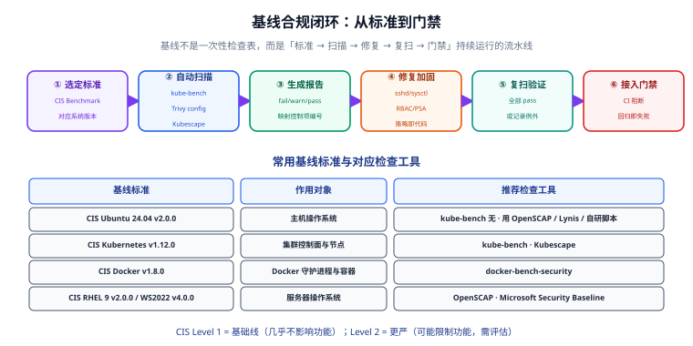

# 基线合规与自动化

**基线（Baseline）**是一组「系统必须满足」的安全配置集合，通常来自权威标准（如 CIS Benchmarks、等保 2.0）。**合规即代码**则是把这些检查写进流水线，让配置回归在 CI 阶段就被拦下。

本篇聚焦「如何把基线从一张检查表，变成持续运行、能阻断的工程能力」。

## 一、为什么需要基线

安全加固最大的敌人不是「不知道要加固」，而是**配置漂移（Configuration Drift）**：今天加固好的机器，明天被某个脚本、某次升级改回默认值，没人发现。基线的价值在于：

1. **有据可依**：不用争论「这样算不算安全」，标准写好了，对照即可。
2. **可自动检查**：机器能扫、能复扫、能进 CI。
3. **可对账**：合规率成为可跟踪的指标。



## 二、CIS Benchmarks：事实标准

CIS（Center for Internet Security）发布的 Benchmark 是业界最广泛使用的技术基线。它的结构非常规律：

- 每个检查项有**编号**（如 `1.1.1`）、**描述**、**审计方法**、**修复方法**、**影响说明**；
- 分为 **Level 1** 与 **Level 2** 两档；
- 提供对应的**自动化检查工具**或脚本。

| 等级 | 定位 | 对功能的影响 |
| --- | --- | --- |
| **Level 1** | 基础安全线 | 几乎不影响业务，**所有系统都应满足** |
| **Level 2** | 更严格的加固 | 可能限制某些功能，需按业务评估后选择性启用 |

:::warning 说明
CIS 的检查脚本默认只做**审计（audit）**不做修复，且**Level 2 的修复项可能让业务不可用**（例如卸载某些包、关闭某些服务）。上线前务必在预发环境验证 Level 2 的每一项。
:::

### 2.1 常用基线标准与工具对照

| 基线标准 | 作用对象 | 版本（2026-09 核对） | 推荐检查工具 |
| --- | --- | --- | --- |
| CIS Ubuntu 24.04 LTS Benchmark | 主机操作系统 | **v2.0.0**（2026-06） | OpenSCAP / Lynis / CIS-CAT |
| CIS RHEL 9 Benchmark | 主机操作系统 | **v2.0.0** | OpenSCAP / oscap |
| CIS Windows Server 2022 Benchmark | 主机操作系统 | **v4.0.0** | Microsoft Security Baseline / CIS-CAT |
| CIS Kubernetes Benchmark | 集群控制面与节点 | **v1.12.0** | kube-bench / Kubescape |
| CIS Docker Benchmark | Docker 守护进程与容器 | **v1.8.0** | docker-bench-security |

:::tip 版本对齐是第一步
选用基线的**唯一硬性要求**是与你的系统版本精确对应。Ubuntu 24.04 的基线拿去扫 22.04，会得到一堆无意义的 fail。托管集群（EKS/GKE/AKS）的控制面由云厂商负责，应改用面向托管场景的检查项或裁剪掉你无法控制的项。
:::

## 三、主机基线：以 OpenSCAP 为例

OpenSCAP 是社区最常用的开源合规扫描框架，支持 SCAP 标准与 CIS/STIG 内容。

### 3.1 安装与扫描

```shell [Ubuntu / Debian]
# 安装
sudo apt update && sudo apt install -y libopenscap8 openscap-scanner scap-security-guide

# 查看可用配置基线（profile）
oscap info /usr/share/xml/scap/ssg/content/ssg-ubuntu2404-ds.xml | grep -A 30 "Profiles"

# 执行扫描，输出 HTML 报告
sudo oscap xccdf eval \
  --profile xccdf_org.ssgproject.content_profile_cis_level1_server \
  --results /tmp/scan-results.xml \
  --report /tmp/scan-report.html \
  /usr/share/xml/scap/ssg/content/ssg-ubuntu2404-ds.xml
```

扫描结束后打开 `/tmp/scan-report.html`，能看到每一项的 **pass / fail / notapplicable** 与修复建议。

### 3.2 生成修复脚本

```shell
# 基于扫描结果生成可审阅的修复脚本
oscap xccdf generate fix \
  --fix-type bash \
  --result-id "" \
  /tmp/scan-results.xml > /tmp/remediate.sh

# 先人工审阅，再执行（切勿直接上生产）
less /tmp/remediate.sh
sudo bash /tmp/remediate.sh
```

:::danger 注意
不要在生产上直接跑自动生成的修复脚本。1) 它可能重启服务或改内核参数导致业务中断；2) 它可能覆盖你既有的自定义配置。正确做法：在预发验证 + 用 Ansible 把关键项编排成幂等任务（见 [Ansible 专题](../../Ansible/index.md)）。
:::

## 四、Kubernetes 基线：kube-bench

kube-bench 由 Aqua Security 维护，直接对照 CIS Kubernetes Benchmark 检查集群。

### 4.1 以 Job 方式运行

```shell [kube-bench-job.yaml]
apiVersion: batch/v1
kind: Job
metadata:
  name: kube-bench
spec:
  template:
    spec:
      hostPID: true
      nodeSelector:
        node-role.kubernetes.io/control-plane: ""
      tolerations:
        - key: node-role.kubernetes.io/control-plane
          effect: NoSchedule
      containers:
        - name: kube-bench
          image: aquasec/kube-bench:v0.8.0
          command: ["kube-bench", "run", "--targets", "master,node", "--json"]
          volumeMounts:
            - name: var-lib-etcd
              mountPath: /var/lib/etcd
              readOnly: true
            - name: etc-kubernetes
              mountPath: /etc/kubernetes
              readOnly: true
      restartPolicy: Never
      volumes:
        - name: var-lib-etcd
          hostPath: { path: /var/lib/etcd }
        - name: etc-kubernetes
          hostPath: { path: /etc/kubernetes }
```

```shell
kubectl apply -f kube-bench-job.yaml
# 等待完成后查看结果
kubectl logs job/kube-bench | head -50
```

### 4.2 结果解读

kube-bench 的输出按编号分组，关键看 **FAIL** 项：

```text
[FAIL] 1.2.1 Ensure that the --anonymous-auth argument is set to false (Automated)
[WARN] 1.2.20 Ensure that the --profiling argument is set to false (Automated)
[PASS] 1.2.2  Ensure that the --token-auth-file parameter is not set
```

- `[FAIL]`：明确不合规，需修复；
- `[WARN]`：需人工确认（可能因为参数由上游组件设置）；
- `[PASS]`：通过。

:::warning 说明
托管集群里，`1.x` 控制面检查项（etcd、apiserver）由云厂商负责，你无法修改，这些项应视为 **notapplicable** 并从门禁里排除。真正能落地的多是节点与工作负载相关项（`4.x`、`5.x`）。
:::

## 五、配置基线：IaC 与 K8s YAML 扫描

上面的工具查「运行中的系统」，配置扫描查「还没上线的声明式配置」。两者互补。

```shell [Trivy 配置扫描]
# 扫描 Kubernetes YAML / Terraform / Dockerfile 等配置
trivy config ./deploy

# 只报高危，输出表格
trivy config --severity HIGH,CRITICAL --format table ./deploy

# 输出 SARIF，供 GitHub Code Scanning / CI 消费
trivy config --format sarif --output trivy-config.sarif ./deploy
```

```shell [Kubescape]
# 集群整体态势 + NSA/CIS 框架合规
kubescape scan framework nsa --submit=false
kubescape scan framework cis-v1.23-t1.0.1 --format json --output cis.json
```

| 工具 | 检查对象 | 特点 |
| --- | --- | --- |
| Trivy config | IaC / K8s YAML | 与镜像扫描同源，一处配置多场景复用 |
| checkov | Terraform / CFN / K8s | 规则丰富，策略可自定义 |
| Kubescape | 集群 + YAML | 内置 NSA/CIS 框架，有图形化态势 |

## 六、合规闭环与门禁

扫描只是起点，闭环才是关键：**标准 → 扫描 → 修复 → 复扫 → 门禁**。

### 6.1 把基线检查接进 CI

以 GitHub Actions 为例：

```yaml [.github/workflows/security-baseline.yaml]
name: security-baseline
on: [push, pull_request]
jobs:
  config-scan:
    runs-on: ubuntu-latest
    steps:
      - uses: actions/checkout@v4
      - name: Trivy config scan
        uses: aquasecurity/trivy-action@0.28.0
        with:
          scan-type: config
          scan-ref: ./deploy
          severity: HIGH,CRITICAL
          exit-code: "1"          # 有高危即失败，实现门禁
          format: sarif
          output: trivy-config.sarif
      - name: Upload SARIF
        if: always()
        uses: github/codeql-action/upload-sarif@v3
        with:
          sarif_file: trivy-config.sarif
```

### 6.2 例外管理（Risk Acceptance）

现实里总有「明知不合规但必须接受」的项。做法不是关掉检查，而是**显式登记例外**：

```yaml [.trivyignore.yaml]
# 每条例外必须有：理由 + 负责人 + 到期时间
vulnerabilities:
  - id: CVE-2026-33634
    paths: ["usr/bin/legacy-tool"]
    statement: "该工具不解析不可信输入，攻击面不可达"
    expired_at: 2026-12-31
```

:::danger 注意
例外必须有**到期时间**。没有到期的例外就是永久漏洞——半年后没人记得当初为什么豁免。建议把「例外清单」纳入每月巡检。
:::

## 七、验证方式

```shell
# 1. 主机基线：确认扫描能跑通并产出报告
oscap xccdf eval --profile <profile> --report /tmp/r.html <datastream>
test -s /tmp/r.html && echo "报告已生成"

# 2. 集群基线：kube-bench 应能输出 PASS/FAIL 统计
kubectl logs job/kube-bench | grep -E "^(PASS|FAIL|WARN)" | sort | uniq -c

# 3. 配置基线：故意写一个不安全的配置，确认 CI 会失败
cat > /tmp/bad.yaml <<'YAML'
apiVersion: v1
kind: Pod
metadata: { name: bad }
spec:
  hostNetwork: true
  containers:
    - name: c
      image: nginx
      securityContext: { privileged: true }
YAML
trivy config --severity HIGH,CRITICAL --exit-code 1 /tmp/bad.yaml
echo "exit=$?  (预期非 0，说明门禁生效)"
```

:::tip 验收标准
「故意引入一个不合规配置 → CI 变红 → 去掉后 CI 变绿」这条链路能跑通，才说明门禁真的生效。只做了扫描、没做阻断，等于没做。
:::

## 八、参考资料

- CIS Benchmarks 下载：<https://www.cisecurity.org/cis-benchmarks>
- OpenSCAP 官方文档：<https://www.open-scap.org/>
- kube-bench：<https://github.com/aquasecurity/kube-bench>
- Kubescape：<https://kubescape.io/>
- Trivy 配置扫描：<https://trivy.dev/latest/docs/scanner/misconfiguration/>

## 相关专题

- [安全加固方法论](../Overview/index.md)
- [扫描工具链](../ScanningToolchain/index.md)
- [实战：一条端到端安全流水线](../Practice/index.md)
- [Linux 安全加固](../../Linux/Advanced/SecurityHardening/index.md)
- [容器与集群安全加固](../../ContainerOrchestration/Security/index.md)
- [Terraform](../../Terraform/index.md)
