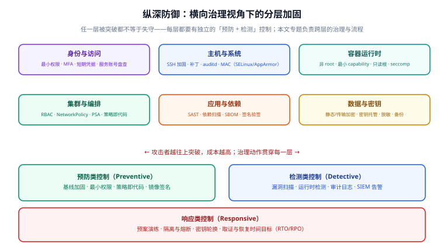
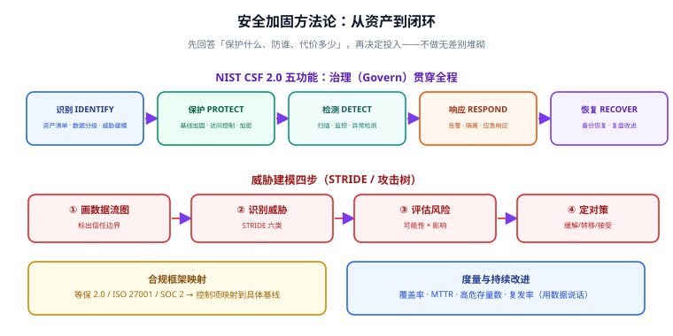

# 安全加固方法论

安全加固（Security Hardening）如果只是「照着清单把参数调严」，往往会走向两个极端：要么调得业务跑不起来，要么调了却没人维护、半年后配置被改回去。真正可运营的做法，是先把**要保护什么、防谁、能承受多大代价**想清楚，再决定投多少控制。

本篇讲跨层的方法论：纵深防御的思考方式、威胁建模的实操步骤、以 NIST CSF 为骨架的治理闭环，以及如何用量化指标让安全工作「可被度量」。

## 一、先明确三个前提

### 1.1 没有绝对安全，只有风险权衡

安全是**风险管理**，不是「消灭所有风险」。每个控制都在「降低风险」与「增加成本/影响可用性」之间权衡。合理的判断顺序是：

1. 这个资产值多少钱？被攻破的业务影响多大？
2. 攻击者要付出多大代价？现实中的动机强不强？
3. 加这个控制的收益，是否大于它带来的运维复杂度和性能损耗？

:::tip 一句话理解
不做的理由只有两种：**风险足够低**，或**成本足够高**。两者都要写下来，而不是「没时间做」。
:::

### 1.2 攻击面（Attack Surface）是核心度量

攻击面 = 所有**外部或低权限主体可以触达的入口**之和，包括：暴露的端口、可登录账户、可调用的 API、依赖的第三方组件、有写权限的共享目录、云上的公网存储桶。

加固的本质动作只有三类：

- **消除**：不需要的端口/账户/依赖，直接删掉（收益最高）；
- **收敛**：必须保留的，缩到最小权限、最短时限、最窄网段；
- **监控**：收敛不了又必须暴露的，加检测与告警。

### 1.3 承认「人」是最弱的一环

再严的基线也挡不住**凭据泄漏**和**配置漂移**。所以治理体系必须包含：密钥集中托管与轮换、变更审计、配置漂移的持续巡检。这三件事都在本专题后续篇章展开。

## 二、纵深防御（Defense in Depth）

纵深防御的基本信念是：**假定任意一层都会被突破**，因此每层都要有独立的「预防 + 检测」控制，并且相邻层之间要有明确边界。



六层从外到内是：身份与访问、主机与系统、容器运行时、集群与编排、应用与依赖、数据与密钥。三个关键设计原则：

| 原则 | 含义 | 反例 |
| --- | --- | --- |
| 独立控制 | 每层防护不依赖上一层「没被攻破」 | 只靠防火墙，内网完全裸奔 |
| 边界清晰 | 跨边界必须认证 + 授权 + 审计 | 内网服务互相无脑信任 |
| 预防 + 检测 | 每个关键控制都配一个「被发现」的手段 | 只锁门不装摄像头 |

:::warning 说明
「内网可信」是历史上最常见的安全假设，也是横向移动（Lateral Movement）屡屡得手的根因。现代做法是**零信任（Zero Trust）**：默认不信任任何来源，每次访问都验证身份、设备与上下文。
:::

## 三、威胁建模（Threat Modeling）

威胁建模回答的是：**这套系统里，攻击者最可能从哪里下手？** 它不是安全团队的闭门会议，而是架构评审的一部分。



### 3.1 四步做法

1. **画数据流图（DFD）**：标出用户、外部系统、进程、数据存储，以及它们之间的数据流向。
2. **标出信任边界**：数据从「低信任区」进入「高信任区」的每一处，都是需要认证/校验的位置。
3. **用 STRIDE 找威胁**：对每个元素逐项对照下表。
4. **评估并定对策**：按「可能性 × 影响」排序，决定缓解、转移、接受还是规避。

### 3.2 STRIDE 六类威胁

| 威胁 | 含义 | 对应安全属性 | 典型对策 |
| --- | --- | --- | --- |
| **S**poofing 仿冒 | 冒充他人身份 | 认证 | MFA、证书、短期凭据 |
| **T**ampering 篡改 | 非法修改数据/代码 | 完整性 | 签名、校验和、只读挂载 |
| **R**epudiation 抵赖 | 否认做过某操作 | 不可否认性 | 审计日志、集中存储 |
| **I**nformation Disclosure 信息泄露 | 数据被未授权读取 | 机密性 | 加密、最小权限、脱敏 |
| **D**enial of Service 拒绝服务 | 服务不可用 | 可用性 | 限流、资源限制、冗余 |
| **E**levation of Privilege 提权 | 获得更高权限 | 授权 | 最小权限、沙箱、MAC |

### 3.3 一个简化的例子

假设一个「上传图片 → 生成缩略图」的服务：

```text
[用户] --图片--> (上传 API) --写--> [对象存储]
                     |
                     +--读--> (缩略图 Worker) --写--> [对象存储]
```

| 信任边界 | STRIDE 威胁 | 对策 |
| --- | --- | --- |
| 用户 → 上传 API | Tampering（伪造文件类型） | 校验魔数而非扩展名、限制大小与格式 |
| 用户 → 上传 API | DoS（海量小请求） | 限流、按用户配额 |
| 上传 API → 对象存储 | Information Disclosure（越权读他人图片） | 按租户前缀隔离 + 短期签名 URL |
| Worker → 对象存储 | Elevation（图片解析库 RCE） | 非 root、沙箱、及时打补丁、SCA 扫描 |

:::tip 一句话理解
威胁建模的价值不在「找出所有威胁」，而在**让团队对「信任边界」形成共识**——边界一旦明确，控制该加在哪里就自然清楚了。
:::

## 四、治理骨架：NIST CSF 五功能

NIST 网络安全框架（Cybersecurity Framework，CSF）2.0 把安全能力归纳为六个功能，其中「治理（Govern）」贯穿其余五个：

| 功能 | 目标 | 落地动作 |
| --- | --- | --- |
| **治理** Govern | 定策略、明确责任与风险容忍度 | 安全策略、RACI、风险登记册 |
| **识别** Identify | 知道有什么、值多少、怕什么 | 资产清单、数据分级、威胁建模 |
| **保护** Protect | 让攻击变难 | 基线加固、访问控制、加密、最小权限 |
| **检测** Detect | 及时发现异常 | 扫描、监控、运行时检测、SIEM |
| **响应** Respond | 控制影响 | 告警分级、隔离、应急响应流程 |
| **恢复** Recover | 尽快回到正常 | 备份恢复演练、RTO/RPO、复盘改进 |

这个骨架的意义是：**它强迫你补上「检测、响应、恢复」三块最容易被忽略的能力**。多数团队的加固止步于「保护」，结果是被攻破了也不知道。

### 4.1 映射到合规框架

NIST CSF 是「能力骨架」，具体控制项往往来自合规标准。常见映射关系：

| 合规标准 | 适用场景 | 与本专题的关系 |
| --- | --- | --- |
| 等保 2.0 | 国内政企系统分级保护 | 三级等保对身份鉴别、审计、入侵防范有硬性要求 |
| ISO/IEC 27001 | 组织级信息安全管理体系 | 偏管理流程，需技术控制支撑 |
| SOC 2 | 面向 SaaS 的可信证明 | 关注安全、可用性、保密性的控制证据 |
| CIS Benchmarks | 技术基线 | 本专题[基线合规](../BaselineCompliance/index.md)篇直接落地 |

:::warning 说明
合规 ≠ 安全。合规是**「达到最低要求的证明」**，攻击者并不看你的证书。正确的顺序是：先用基线把技术面做扎实，再让合规评审去「取证」；而不是为了过审去填表格。
:::

## 五、用量化指标驱动改进

安全如果不可度量，就无法证明投入有效，也无法发现退化。建议跟踪四类指标：

| 指标 | 定义 | 关注点 |
| --- | --- | --- |
| **基线覆盖率** | 已通过基线的资产 / 应纳管资产 | 是否存在「漏网主机/集群」 |
| **高危存量数** | 当前未修复的高危漏洞数量 | 绝对值趋势是否下降 |
| **MTTR** | 从发现到修复的平均时长 | 修复效率是否达标 |
| **复发率** | 同类问题重复出现的比例 | 是否只治标没治本 |

一个务实的做法是把它们做成**看板**，和监控大盘放在一起。指标一旦可视化，团队自然会去优化——这正是[监控告警](../../Monitoring/index.md)与[日志体系](../../LogSystem/index.md)能复用的能力。

:::tip 一句话理解
把「安全」变成一组**每天都能看到、且会波动**的数字，它才会像可用性一样被认真对待。
:::

## 六、落地顺序建议

不同规模的团队，起点不同。一个从零开始的推荐路径：

1. **第 1 阶段（1~2 周）**：资产盘点 + 选基线。先把「有多少台机器、几个集群、哪些公网暴露」列清楚，选定 CIS 对应版本。
2. **第 2 阶段（2~4 周）**：主机与集群基线加固 + 接入扫描。人工跑一遍扫描，修掉高危项，再谈自动化。
3. **第 3 阶段（1~2 个月）**：基线进 CI、漏洞进 SLA、密钥进托管。让「不安全」在流水线里通不过。
4. **第 4 阶段（持续）**：补齐审计、运行时检测与响应预案。这是从「防住」迈向「可运营」的分水岭。

## 七、验证方式

本篇是方法论，验证落在「是否选出了正确的基线、是否建立了威胁模型」。可执行的收尾：

```shell
# 1. 确认你能说清「当前有多少可纳管的资产」
#    主机：统计到 CMDB 或云上实例清单，数量可对账
#    集群：列出所有集群与其 K8s 版本
kubectl version --short 2>/dev/null | head -2

# 2. 确认基线标准与你的系统版本精确对应
#    例：Ubuntu 24.04 LTS → CIS Ubuntu 24.04 LTS Benchmark v2.0.0
#        K8s 1.33~1.35 → CIS Kubernetes Benchmark v1.12.0（Kyverno 1.19 支持区间）

# 3. 确认威胁模型已产出：至少一张数据流图 + 一张信任边界清单
#    验收：每条边界都写明「认证/授权/审计」三件事怎么做
```

## 八、参考资料

- NIST Cybersecurity Framework（CSF）2.0：<https://www.nist.gov/cyberframework>
- OWASP Threat Modeling Cheat Sheet：<https://cheatsheetseries.owasp.org/cheatsheets/Threat_Modeling_Cheat_Sheet.html>
- STRIDE 威胁模型：<https://learn.microsoft.com/en-us/azure/security/develop/threat-modeling-tool-threats>
- CIS Benchmarks 官方站：<https://www.cisecurity.org/cis-benchmarks>
- 零信任架构（NIST SP 800-207）：<https://csrc.nist.gov/pubs/sp/800/207/final>

## 相关专题

- [基线合规与自动化](../BaselineCompliance/index.md)
- [扫描工具链](../ScanningToolchain/index.md)
- [漏洞管理生命周期](../VulnerabilityManagement/index.md)
- [SBOM 与软件供应链](../SbomSupplyChain/index.md)
- [密钥与凭据治理](../SecretGovernance/index.md)
- [审计与检测](../AuditDetection/index.md)
