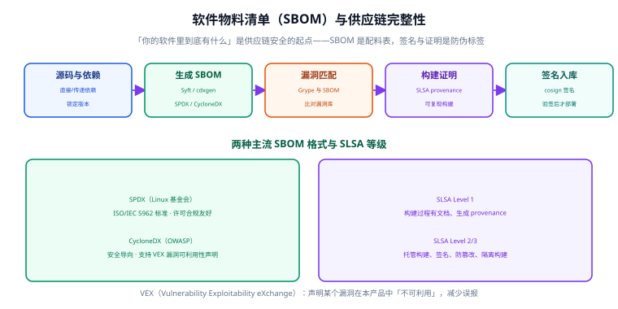

# SBOM 与软件供应链

现代应用的代码里，**自己写的往往不到 10%，其余 90% 来自第三方依赖**。这意味着软件的安全性很大程度上取决于「你引入了什么」。**软件物料清单（SBOM，Software Bill of Materials）**就是回答这个问题的「配料表」。

供应链安全的目标是：**知道用了什么（SBOM）→ 确认有没有问题（漏洞匹配）→ 证明东西没被换过（签名与证明）**。

## 一、供应链攻击的典型手法

| 手法 | 说明 | 真实案例形态 |
| --- | --- | --- |
| 依赖投毒 | 上传与知名包**名字相似**的恶意包 | typosquatting，如 `reqeusts` |
| 账户接管 | 攻击维护者账号，发布恶意版本 | 维护者 npm/PyPI token 泄漏 |
| 构建环境污染 | 篡改 CI 构建产物 | 构建脚本被注入 |
| 依赖混淆 | 抢注私有包同名的公开包 | 内网包名被公开抢注 |
| 供应链投毒 | 在正规发布中植入恶意代码 | 扫描工具二进制被替换 |

:::danger 注意
Trivy 曾在 **v0.69.5 / v0.69.6** 版本遭遇投毒事件（CVE-2026-33634）——连安全扫描工具本身都可能成为供应链攻击目标。请务必使用 **0.74.0+**，并在 CI 中固定版本、校验校验和。
:::

## 二、SBOM 是什么

SBOM 是一份结构化清单，列出软件中**所有组件**的名称、版本、供应商、依赖关系和许可证。它不是给人读的文档，而是给工具消费的数据。



### 2.1 两种主流格式

| 格式 | 主导方 | 特点 | 适用场景 |
| --- | --- | --- | --- |
| **SPDX** | Linux 基金会 | 已成为 ISO/IEC 5962 标准 | 许可证合规、法务审计 |
| **CycloneDX** | OWASP | 安全导向，支持 VEX | 漏洞管理、安全流水线 |

:::tip 一句话理解
**SPDX 偏「合规」，CycloneDX 偏「安全」。** 两者可互相转换，选哪个主要看你的下游工具支持哪个。拿不准就优先 CycloneDX（安全生态支持更广）。
:::

### 2.2 VEX：解决误报的利器

**VEX（Vulnerability Exploitability eXchange）**是一份「漏洞可利用性声明」，用来标注：某个漏洞虽然存在于你的软件中，但**在本产品的实际使用场景下不可利用**。

它的价值是**大幅减少误报**：例如某个依赖的漏洞只在 Windows 下触发，而你的产品只跑 Linux，就可以用 VEX 声明 `not_affected`，让漏洞扫描不再反复告警。

## 三、生成 SBOM

### 3.1 用 Syft 生成

```shell
# 扫描目录（源码 + lock 文件）
syft dir:. -o spdx-json=sbom.spdx.json
syft dir:. -o cyclonedx-json=sbom.cdx.json

# 扫描容器镜像
syft registry:registry.example.com/app:v1 -o cyclonedx-json=image.cdx.json

# 同时输出多种格式
syft dir:. -o spdx-json -o cyclonedx-json
```

### 3.2 用 Trivy 生成

```shell
# Trivy 一套工具同时出 SBOM + 漏洞清单
trivy fs --format cyclonedx --output sbom.cdx.json .
trivy image --format spdx-json --output image.spdx.json <image>
```

### 3.3 SBOM 的内容示例

```json [sbom.cdx.json（节选）]
{
  "bomFormat": "CycloneDX",
  "specVersion": "1.6",
  "metadata": {
    "component": { "type": "application", "name": "myapp", "version": "1.0.0" }
  },
  "components": [
    {
      "type": "library",
      "name": "log4j-core",
      "version": "2.17.1",
      "purl": "pkg:maven/org.apache.logging.log4j/log4j-core@2.17.1",
      "licenses": [{ "license": { "id": "Apache-2.0" } }]
    }
  ]
}
```

关键字段是 **PURL（Package URL）**，如 `pkg:maven/org.apache.logging.log4j/log4j-core@2.17.1`。它是组件的**全局唯一标识**，漏洞匹配就是拿 PURL 去查漏洞库。

## 四、用 SBOM 做漏洞匹配

生成 SBOM 后，可以**离线**做漏洞扫描，且结果可复现：

```shell
# 用 Grype 基于 SBOM 扫描
grype sbom:sbom.cdx.json --fail-on high

# 输出 JSON 便于比对
grype sbom:sbom.cdx.json -o json > vulns.json
```

:::tip 「一次生成、多次扫描」的意义
SBOM 是**构建时**的产物快照。即使漏洞库更新了，你也能用**当时的 SBOM** 重新扫描，回答「三个月前发布的那版，现在发现了什么新漏洞」。这是「事后追责 + 主动响应」的基础能力。
:::

## 五、供应链完整性：SLSA 与签名

有了「配料表」，还要能证明「配料没被换过」。

### 5.1 SLSA 等级

**SLSA（Supply-chain Levels for Software Artifacts）**定义了一套构建完整性的分级：

| 等级 | 要求 | 防御能力 |
| --- | --- | --- |
| **Level 1** | 构建过程有文档，生成 provenance（来源证明） | 可追溯 |
| **Level 2** | 使用托管构建服务，provenance 由服务签名 | 防篡改（需凭据） |
| **Level 3** | 构建环境隔离、不可伪造的 provenance | 防内部构建污染 |

大多数团队的现实目标是从 **Level 1 → Level 2**：用托管的 CI（GitHub Actions / GitLab CI）自动生成并签名 provenance。

### 5.2 用 cosign 签名与验签

```shell
# 生成密钥对（或用 keyless 模式）
cosign generate-key-pair

# 对镜像签名
cosign sign --key cosign.key registry.example.com/app:v1

# 验签（部署前必须通过）
cosign verify --key cosign.pub registry.example.com/app:v1

# 附加 SBOM 到镜像（作为 attestation）
cosign attest --key cosign.key --predicate sbom.cdx.json \
  --type cyclonedx registry.example.com/app:v1
```

```shell
# keyless 模式：用 OIDC 身份签名，适合 GitHub Actions
cosign sign registry.example.com/app:v1
```

### 5.3 在准入环节强制验签

签名只有**配合强制验签**才有意义。Kubernetes 侧可用准入策略（Kyverno / Gatekeeper）：

```yaml [verify-image-signature.yaml]
apiVersion: kyverno.io/v1
kind: ClusterPolicy
metadata:
  name: verify-image-signature
spec:
  validationFailureAction: Enforce
  rules:
    - name: verify-cosign
      match:
        any:
          - resources: { kinds: [Pod] }
      verifyImages:
        - imageReferences: ["registry.example.com/*"]
          attestors:
            - entries:
                - keys:
                    publicKeys: |-
                      -----BEGIN PUBLIC KEY-----
                      ...省略，填入 cosign.pub...
                      -----END PUBLIC KEY-----
```

:::danger 注意
只签名不验签 = 没签名。攻击者可以推一个**未签名的恶意镜像**，如果你的集群不校验签名就直接跑，前面的工作全白做。**签名与验签必须成对出现。**
:::

## 六、依赖卫生：从源头减少风险

治本的方法是**减少依赖、约束来源**：

| 措施 | 做法 |
| --- | --- |
| 锁定版本 | 提交 lock 文件（package-lock.json / go.sum / poetry.lock） |
| 校验完整性 | 启用 npm `integrity`、pip hash 校验、Go sumdb |
| 私有源优先 | 配置私有 Registry，避免依赖混淆 |
| 最小依赖 | 引入前评估「是否真的需要这个包」 |
| 定期更新 | 用 Dependabot / Renovate 小步快跑，避免一次性大升级 |

```shell [.npmrc]
# 强制走私有源 + 校验完整性
registry=https://nexus.internal/repository/npm-group/
audit=true
fund=false
```

## 七、验证方式

```shell
# 1. SBOM 能生成且格式合法
syft dir:. -o cyclonedx-json > /tmp/sbom.json
python -c "import json;d=json.load(open('/tmp/sbom.json'));\
print('spec=',d['specVersion'],'components=',len(d['components']))"

# 2. SBOM 能被用于扫描
grype sbom:/tmp/sbom.json -o table | head -10

# 3. 签名与验签链路通
cosign sign --key cosign.key <image>
cosign verify --key cosign.pub <image> && echo "验签通过"

# 4. 准入策略生效：推一个未签名镜像，部署应被拒绝
kubectl run test --image=registry.example.com/app:unsigned
# 预期：admission webhook deny / 验签失败
```

## 八、参考资料

- SPDX 官方：<https://spdx.dev/>
- CycloneDX：<https://cyclonedx.org/>
- Syft：<https://github.com/anchore/syft>
- Sigstore / cosign：<https://www.sigstore.dev/>
- SLSA 规范：<https://slsa.dev/>
- CISA SBOM 资源：<https://www.cisa.gov/sbom>
- PURL 规范：<https://github.com/package-url/purl-spec>

## 相关专题

- [漏洞管理生命周期](../VulnerabilityManagement/index.md)
- [扫描工具链](../ScanningToolchain/index.md)
- [容器与集群安全加固](../../ContainerOrchestration/Security/index.md)
- [Docker 安全加固](../../Docker/Security/index.md)
