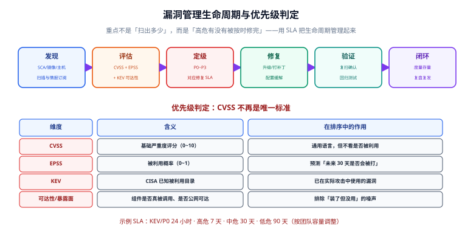

# 漏洞管理生命周期

扫描工具能告诉你「有哪些漏洞」，但**漏洞管理（Vulnerability Management）回答的是「先修哪个、多快修完、怎么证明修好了」**。没有生命周期的扫描，只会产出一份没人处理的清单。

本篇讲如何用「发现 → 评估 → 定级 → 修复 → 验证 → 闭环」六个阶段，配合 CVSS / EPSS / KEV 三把尺子，把漏洞真正管起来。

## 一、为什么单看 CVSS 会失效

CVSS（Common Vulnerability Scoring System）给出 0~10 的严重度评分，是通用语言。但实践中会出现两个问题：

1. **高分不等于紧急**：一个 9.8 分的漏洞，如果它所在的组件在你的应用里根本不会被调用，实际风险可能低于一个 7.5 分但公网可达的漏洞。
2. **数量爆炸**：一个中等规模项目动辄几千条漏洞，按 CVSS 排序，前 100 条可能永远修不完。

所以现代漏洞管理引入**两个补充维度**：



| 维度 | 全称 | 回答的问题 | 取值 |
| --- | --- | --- | --- |
| **CVSS** | Common Vulnerability Scoring System | 这个漏洞「有多严重」 | 0.0 ~ 10.0 |
| **EPSS** | Exploit Prediction Scoring System | 「未来 30 天会不会被打」的概率 | 0.0 ~ 1.0 |
| **KEV** | Known Exploited Vulnerabilities | 「是否已经在野被利用」 | 是 / 否 |

:::tip 一句话理解
**CVSS 是「体检指标」，EPSS 是「发病概率」，KEV 是「已经有人确诊」。** 三者结合，才能排出真正该先修的顺序。
:::

## 二、阶段一：发现（Discovery）

发现的来源不止扫描：

| 来源 | 说明 | 频率 |
| --- | --- | --- |
| 依赖扫描（SCA） | Trivy fs / Grype | 每次提交 |
| 镜像扫描 | Trivy image | 每次构建 |
| 主机扫描 | OpenSCAP / Nessus | 每周 |
| 情报订阅 | CISA KEV、厂商安全公告 | 每日 |
| 外部报告 | 众测、漏洞赏金、用户反馈 | 事件驱动 |
| 运行时观测 | Falco 异常外联可能暴露 0day | 持续 |

:::warning 说明
**0day 不在任何漏洞库里**。依赖扫描天然无法发现未知漏洞，这正是「运行时检测」不可替代的原因——它检测的是**行为**，而非已知特征。
:::

## 三、阶段二：评估（Assessment）

找到漏洞后，先做三件事：

1. **确认可达性**：这个组件真的被加载/调用了吗？是否公网可达？需要什么前置权限？
2. **确认可利用性**：查 KEV、查 EPSS、查是否有公开 PoC。
3. **确认影响面**：一旦被利用，影响哪些数据、哪些租户、能不能横向移动。

一个实用的评估脚本，把扫描结果与 KEV/EPSS 关联：

```python [enrich.py]
import json
import urllib.request

def epss(cve: str) -> float:
    """查询 EPSS 分数（示例：调用 FIRST 公开 API）"""
    url = f"https://api.first.org/data/v1/epss?cve={cve}"
    try:
        with urllib.request.urlopen(url, timeout=10) as r:
            data = json.load(r)["data"]
        return float(data[0]["epss"]) if data else 0.0
    except Exception:
        return 0.0

# 假设 trivy 输出的 JSON 结构（简化）
report = json.load(open("trivy.json"))
rows = []
for result in report.get("Results", []):
    for v in result.get("Vulnerabilities", []):
        cid = v["VulnerabilityID"]
        score = epss(cid)
        rows.append((cid, v["Severity"], v.get("CVSS", {}).get("V3Score", 0), score))

# 先按 EPSS 再按 CVSS 排序：被利用概率高的优先
rows.sort(key=lambda r: (r[3], r[2]), reverse=True)
for cid, sev, cvss, p in rows[:15]:
    print(f"{cid:20} sev={sev:8} cvss={cvss:4} epss={p:.4f}")
```

## 四、阶段三：定级与 SLA

把评估结果映射成**处置等级**，并约定修复时限（SLA）。一个可直接套用的模板：

| 等级 | 判定条件 | 修复 SLA | 处置方式 |
| --- | --- | --- | --- |
| **P0 紧急** | 在 KEV 目录，或公网可达 + 有公开 PoC | **24 小时** | 立即升级/临时下线，全员响应 |
| **P1 高危** | EPSS ≥ 0.1 或 CVSS ≥ 9.0 且可达 | **7 天** | 排入当前迭代，优先处理 |
| **P2 中危** | CVSS 4.0~8.9，可达性中等 | **30 天** | 常规迭代排期 |
| **P3 低危** | CVSS < 4.0，或不可达 | **90 天 / 或接受** | 批量处理或记录接受 |

:::danger 注意
SLA 必须与实际团队容量匹配。如果定「所有高危 3 天修完」但团队根本没有这个带宽，结果就是**所有漏洞都逾期**，SLA 直接失去意义。宁可先定宽一点、真正执行，再逐步收紧。
:::

## 五、阶段四：修复（Remediation）

处理手段按优先级排序：

1. **升级**：直接升到修复版本（首选，最彻底）；
2. **移除**：组件根本没用，直接删依赖（收益最高，风险最低）；
3. **配置缓解**：暂时无法升级时，用 WAF 规则、网络隔离、关闭特性来阻断利用路径；
4. **接受**：确认不可达且成本过高时，**显式登记例外并设到期时间**。

```shell
# 以 npm 项目为例：先看漏洞，再定升级策略
npm audit --json > audit.json
# 自动修复（仅在能安全升级时）
npm audit fix
# 需要破坏性升级时，人工评估
npm audit fix --force   # 慎用！可能引入 breaking change
```

```shell
# 确认 Docker 基础镜像的安全版本
docker pull node:22.22.2-alpine3.21
trivy image --severity HIGH,CRITICAL node:22.22.2-alpine3.21
```

:::tip 一句话理解
**「能删就删，能升就升，不能升就挡，实在挡不住才接受。」** 缓解是过渡手段，不要当成终点。
:::

## 六、阶段五：验证（Verification）

修复后必须**复扫确认**，而不是「我以为修好了」：

```shell
# 复扫同一目标，确认目标漏洞已消失
trivy image --severity HIGH,CRITICAL registry.example.com/app:v2
trivy image --format json registry.example.com/app:v2 > after.json

# 对比修复前后（用 jq 粗筛）
jq -r '.Results[].Vulnerabilities[]?.VulnerabilityID' before.json | sort -u > /tmp/before.txt
jq -r '.Results[].Vulnerabilities[]?.VulnerabilityID' after.json | sort -u > /tmp/after.txt
comm -23 /tmp/before.txt /tmp/after.txt   # 已修复的
comm -13 /tmp/before.txt /tmp/after.txt   # 新引入的（重点看！）
```

:::danger 注意
升级依赖极易**引入新漏洞**。复扫时必须同时看「修掉了什么」和「新引入了什么」。只关注前者，就会出现「按下去一个葫芦浮起两个瓢」。
:::

## 七、阶段六：闭环与度量

闭环的两个动作：

1. **复盘单次事件**（非复盘类主题，指事件本身的技术归因）：为什么没早点发现？是扫描没覆盖，还是覆盖了但没阻断？
2. **跟踪长期指标**：

| 指标 | 计算方式 | 目标趋势 |
| --- | --- | --- |
| 高危存量 | 当前未修复高危数 | 逐月下降 |
| 平均修复时长（MTTR） | 修复时间 - 发现时间 | 收敛到 SLA 内 |
| SLA 达成率 | 按时修复数 / 应修复数 | ≥ 90% |
| 复发率 | 同类漏洞重复出现比例 | 趋近 0 |

## 八、验证方式

```shell
# 1. 扫描能产出结构化结果
trivy image --format json -o /tmp/v.json <image>
jq '.Results | length' /tmp/v.json

# 2. 具备「按优先级排序」的能力（可用前面的 enrich.py）
python enrich.py | head -5

# 3. 修复前后对比能跑通（见上文 comm 命令）
# 4. SLA 有落地载体：Issue 系统里每条高危都有 due date

# 5. 例外登记有时间边界
grep -c "expired_at" .trivyignore.yaml   # 每条豁免都应带到期时间
```

## 九、参考资料

- CVSS 规范（FIRST）：<https://www.first.org/cvss/>
- EPSS 官方：<https://www.first.org/epss/>
- CISA KEV 目录：<https://www.cisa.gov/known-exploited-vulnerabilities-catalog>
- OWASP Vulnerability Management Guide：<https://owasp.org/www-project-vulnerability-management-guide/>
- NVD：<https://nvd.nist.gov/>

## 相关专题

- [扫描工具链](../ScanningToolchain/index.md)
- [SBOM 与软件供应链](../SbomSupplyChain/index.md)
- [基线合规与自动化](../BaselineCompliance/index.md)
- [安全加固方法论](../Overview/index.md)
