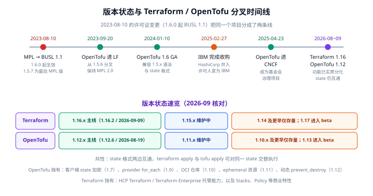

# 常见问题与最佳实践

这一页收口整个专题：先回答"用之前最常问的问题"，再把散落在各页的踩坑集中成**十八条**，最后给出**团队落地检查清单**与 **Terraform / OpenTofu 的选型判据**。



## 1. 版本状态（2026-09 核对）

| 产品 | 主线 | 维护中 | 仅存量 |
| --- | --- | --- | --- |
| Terraform | 1.16.x（1.16.2 / 2026-09-09） | 1.15.x | 1.14 及更早；1.17 已进 beta |
| OpenTofu | 1.12.x（1.12.6 / 2026-08-19） | 1.11.x | 1.10.x 及更早；1.13 已进 beta |

稳定性与支持策略（以官方为准，选择版本前请再核对一次）：

- HashiCorp 对 Terraform 的惯例是**最新两个 minor 得到积极维护**，更早的 minor 只修安全问题甚至不再发布。
- OpenTofu 同样按 minor 推进，生命周期由 CNCF 项目治理流程决定。
- **项目里用 `required_version = ">= 1.6, < 2.0"`** 这类区间约束比钉死单个版本更实用：既能挡住"太老不支持语法"，也能挡住"未来 2.0 的破坏性变更"。

## 2. Terraform 还是 OpenTofu？

判据很简单，**从"你把 Terraform 用在哪"倒推**：

| 你的场景 | 建议 | 原因 |
| --- | --- | --- |
| 公司内部管理自己的云账号 | **Terraform 官方二进制** | BUSL 只限制"把 Terraform 做成竞品对外提供"，内部使用不受影响 |
| 要把 IaC 能力嵌入**对外销售**的产品/平台 | **OpenTofu** | BUSL 明确禁止"以 Terraform 为竞争性产品对外提供"，MPL 2.0 无此限制 |
| 有硬性开源许可证合规要求（如政府/金融采购） | **OpenTofu** | MPL 2.0 是 OSI 认证许可；BUSL 不是 |
| 需要 HCP Terraform / Terraform Enterprise 的托管、Stacks、Policy 能力 | **Terraform** | 这些是商业产品能力，OpenTofu 无对应实现 |
| 需要 state **客户端加密**（不信任存储侧） | **OpenTofu** | 1.7 起的 `encryption` 块，加密后再上传 |
| 需要 provider 级别的 `for_each`、OCI 仓库分发、ephemeral 资源 | **OpenTofu** | 这些是 OpenTofu 独有（1.9 / 1.10 / 1.11） |
| 已有大量 `.tf` 与流水线，想最小代价合规 | **OpenTofu** | 命令从 `terraform` 换 `tofu`，state 格式互通 |

### 2.1 许可证变更的来龙去脉

| 日期 | 事件 |
| --- | --- |
| 2023-08-10 | HashiCorp 宣布 Terraform 从 MPL 2.0 改为 BUSL 1.1，**自 1.6.0 生效**；1.5.7 是最后一个 MPL 版本 |
| 2023-09-20 | 社区从 1.5.6 分叉的 OpenTofu 进入 Linux Foundation |
| 2024-01-10 | OpenTofu 1.6 GA，兼容 1.5.x 语法与 state 格式 |
| 2025-02-27 | IBM 完成对 HashiCorp 的收购，许可证持有方变为 IBM |
| 2025-04-23 | OpenTofu 进入 CNCF，成为基金会治理项目 |
| 2026-08~09 | 两条线功能已实质分化（见上表），**state 格式仍互通** |

::: tip 两者 state 互通意味着什么
`terraform apply` 与 `tofu apply` 可以对**同一份 state** 交替执行（不要同时执行，锁机制各自实现）。这既是"可以平滑迁移"的保证，也意味着**混用时要特别小心锁**——Terraform 的 `use_lockfile` 与 OpenTofu 的锁实现细节不同，混用期间建议只由一方执行写操作。
:::

## 3. 高频疑问

### 3.1 `terraform.tfstate` 能提交到 Git 吗？

**不能。** state 里是资源全部属性的明文快照，含密码、密钥、私钥。提交等于凭证泄露。改用远程后端（见 [State 与远程后端](../State/index.md)）。

### 3.2 `.terraform.lock.hcl` 要提交吗？

**要。** 它锁定 provider 的精确版本与校验和，保证团队与 CI 装到同一版本。`.terraform/` 目录不提交。

### 3.3 `plan` 显示 `(known after apply)` 是什么意思？

表示"这个值要等资源真正创建后才知道"。常见于 `id`、`arn`、`ip` 这类 provider 计算出来的属性。**大量 `(known after apply)` 会让 plan 难以审阅**——如果某个字段本该在 plan 时已知却是 unknown，通常说明它依赖了一个尚未创建的资源（间接说明依赖链太长）。

### 3.4 为什么改了代码 `plan` 却是 `No changes`？

三种原因：
1. 改的地方被 `ignore_changes` 覆盖了；
2. 改的是 `user_data` 这类"仅在创建时生效"的字段（不会触发 update）；
3. 改的文件不属于当前 root module（比如改到了 `modules/` 下的文件但 `source` 指向的是已缓存版本，需要 `terraform init -upgrade`）。

### 3.5 `apply` 中断了怎么办？

Terraform 的 apply 是**尽力而为的**：已完成的变更已写进 state，未完成的会留在 state 里（可能标记为 tainted）。重新 `terraform apply` 会继续。如果 state 被锁住，确认无人操作后 `terraform force-unlock`。

```shell
terraform state list | grep tainted     # 若能看到，说明有半成品
terraform plan                          # 会提示要重建 tainted 资源
terraform apply                         # 直接继续即可
```

### 3.6 怎么删除被 Terraform 管理的资源？

**从配置里删掉资源块，再 `terraform apply`。** 不要用 `terraform state rm`（那只让它"不受管理"，资源仍在），也不要只去控制台删（下次 apply 会重建）。要临时保护就先加 `lifecycle { prevent_destroy = true }`。

### 3.7 同一个 VPC 里的资源分散在多个 state 里，引用麻烦怎么办？

三种方式：`terraform_remote_state` 数据源（最直接）、SSM Parameter Store 传值（解耦、权限更细）、合并 state（简单但爆炸半径大）。**不要**用 `data "aws_vpc"` 去"重新发现"自己管理的 VPC——那会绕开依赖关系，导致顺序不可控。

### 3.8 为什么 `terraform validate` 过了，`plan` 还是报错？

`validate` **不连云**，只检查语法、类型与引用。`plan` 会真的去调 provider API，所以认证失败、权限不足、区域写错、资源名冲突、参数组合非法（provider 侧校验）都会在 plan 阶段才暴露。

### 3.9 团队怎么防止"某人本地 apply 改了生产"？

- 生产凭证**只给 CI 服务账号**，开发者本地没有；
- 用远程后端 + 状态锁（本地 apply 会被锁挡住或留下可追溯记录）；
- CI 里 apply 必须基于"已审批的 plan 文件"：`apply tfplan` 而不是 `apply`；
- 配置 CloudTrail / 审计日志，任何写操作都留痕。

### 3.10 Terraform 能管 Kubernetes 资源吗？

能。用 `kubernetes` / `helm` provider。但**不建议用它管理"高频变化的业务资源"**——应用部署交给 CD（Argo CD / Flux）。Terraform 更适合建"集群本身"与"长期稳定的基础设施层"（见 [容器编排进阶](../../ContainerOrchestration/index.md)）。

### 3.11 `count` 与 `for_each` 到底怎么选？

**默认用 `for_each`。** 只有两种情况用 `count`：确实需要"数量"语义且元素之间无差异（如固定 3 台无差别 worker），或需要 `count.index` 参与网段/编号计算。详见 [资源、数据源与变量](../Resource/index.md) 的注意事项。

### 3.12 秘密怎么管理？

| 做法 | 评价 |
| --- | --- |
| `.tfvars` 里写明文且不入库 | 只在本地演练可接受 |
| 环境变量（`TF_VAR_xxx`）注入 | 基础做法，CI 里配合密钥管理 |
| AWS Secrets Manager / Vault + `data` 读取 | 推荐；注意读到的值仍会进 state |
| `ephemeral` 变量/资源（1.10+） | 最彻底：值不写入 state |
| SOPS / sops-age 加密 tfvars 入库 | 折中方案，需管理解密密钥 |

### 3.13 为什么 `terraform plan` 每次都提示要替换某个资源？

看 plan 里的 `# forces replacement` 那几行——通常是你改了一个**不可变属性**（如 EC2 的 `subnet_id`、RDS 的 `engine`）。两种处理：接受替换，或把它移出被 Terraform 管理的配置（`lifecycle { ignore_changes = [...] }`）。

### 3.14 本地能跑通，CI 上报错 `provider not found`？

CI 没网、或没装到同一个 provider。解法：把 `.terraform.lock.hcl` 提交进仓库，并在 CI 里预先 `terraform providers mirror` 到镜像或用 `TF_PLUGIN_CACHE_DIR`。详见 [安装与初始化](../Install/index.md)。

### 3.15 `terraform destroy` 会不会误删别的环境的资源？

不会——**`destroy` 只销毁当前 root module 的 state 里记录的资源**。这也是"按环境拆分 state"的最大好处。但如果两个环境共用了一份 state（常见于"一个目录管所有环境"的写法），`destroy` 就会把 dev 和 prod 一起删掉。

## 4. 十八条踩坑清单

### 4.1 状态与协作（最致命）

| # | 坑 | 后果 | 正确做法 |
| --- | --- | --- | --- |
| 1 | `terraform.tfstate` 提交到 Git | 凭证泄露 + 历史里删不掉 | `.gitignore` 排除，用远程后端 |
| 2 | 本地 state 多人用 | 互相覆盖，资源错位 | 远程后端 + 状态锁 |
| 3 | 未确认就 `force-unlock` | state 永久损坏 | 先核对锁的持有者与时间 |
| 4 | `apply -lock=false` | 主动放弃并发保护 | 仅 `plan` 在只读场景可用 |
| 5 | 一份 state 管所有环境 | 一处出错全局遭殃 | 按环境 + 按层拆分 |

### 4.2 变更与依赖

| # | 坑 | 后果 | 正确做法 |
| --- | --- | --- | --- |
| 6 | 直接 `apply` 不看 plan | 闭眼改生产 | `plan -out=tfplan` → Review → `apply tfplan` |
| 7 | CI 里 `apply -auto-approve` | 跳过确认，plan 与预期不符也照做 | 用"已审批的 plan 文件" |
| 8 | `count` 管理有差异的实例 | 删中间元素牵连后续全部 | 用 `for_each` |
| 9 | 用 `depends_on` 解决一切 | plan 出现大量 unknown，顺序难控 | 优先用属性引用表达隐式依赖 |
| 10 | 手工改被管理的资源 | 下次 apply 被改回（或报冲突） | 改代码，不改控制台 |
| 11 | 用 `state rm` 当"删除资源" | 资源还在，只是失管 | 从配置里删，再 apply |

### 4.3 代码与结构

| # | 坑 | 后果 | 正确做法 |
| --- | --- | --- | --- |
| 12 | `source` 用 `?ref=main` | 每天可能装到不同版本 | 钉到 tag 或 commit |
| 13 | Registry 模块不写 `version` | plan 不可复现 | `version = "~> x.y"` |
| 14 | 变量不写 `type` | 退化为 `any`，类型错误到 plan 才炸 | 每个变量都写 `type` |
| 15 | 子模块里写 `provider` 块 | 与上层配置冲突、区域错乱 | 由 root 配置，用 `configuration_aliases` 传递 |
| 16 | 巨型 heredoc 当模板 | 可读性差、难测 | 抽到 `templates/*.tpl` + `templatefile()` |
| 17 | `provisioner` 干配置管理的活 | 不被 state 跟踪，失败无感知 | `user_data` 做引导，Ansible 做收敛 |
| 18 | 生产开 `force_destroy` | 一条命令删空桶及其内容 | 仅在 dev/staging 开 |

::: danger 第十八条要单独强调
`force_destroy = true` 会让 `terraform destroy` **连同桶内所有对象一起删除**。生产桶绝不能开。如果暂时需要清桶，用显式的 `aws s3 rm --recursive` 并走审批，而不是把这个能力常驻在配置里。
:::

## 5. 最佳实践清单

### 5.1 目录与结构

```text
infra/
├─ modules/            可复用能力，无环境概念
│  ├─ network/
│  ├─ compute/
│  └─ storage/
├─ stacks/             环境无关的服务栈（组合模块）
│  └─ web-service/
├─ envs/               具体环境（只传参，不写 resource）
│  ├─ dev/web-service/
│  └─ prod/web-service/
└─ bootstrap/          创建 state 桶与锁表（用 local state 单独管一次）
```

- `bootstrap` 是"先有鸡还是先有蛋"的答案：**state 桶本身用本地 state 创建**，建好后再把所有业务迁到远程后端。
- 每个目录一个 `.gitignore` 继承根配置；`terraform.tfvars.example` 入库、`terraform.tfvars` 不入库。

### 5.2 代码约定

| 约定 | 说明 |
| --- | --- |
| 固定文件名分工 | `versions.tf` / `variables.tf` / `main.tf` / `outputs.tf` |
| 单一主资源用 `this` | `aws_vpc.this`、`aws_security_group.this` |
| 多个同类资源用语义名 | `aws_subnet.public` / `aws_subnet.private` |
| 全部内容参数化 | 区域、账号、网段、规格、数量都走变量 |
| `locals` 承担派生值 | 命名拼接、tags 合并、条件分支 |
| 每个 `output` 写 `description` | 它是模块的"公开 API 文档" |
| 统一 `default_tags` | 保证每个资源都有 `Project` / `Env` / `ManagedBy` |

### 5.3 CI 门禁

```shell
# 一个可直接复用的最小门禁脚本
set -euo pipefail

terraform fmt -check -recursive           # 风格
terraform init -input=false -backend=false
terraform validate                        # 语法与类型
terraform init -input=false -reconfigure  # 连后端（只读凭证即可）
terraform plan -input=false -lock=false -detailed-exitcode -out=tfplan
# 退出码 0=无变更，2=有变更（进入下一阶段），1=错误
```

| 阶段 | 门禁 |
| --- | --- |
| PR 提交 | `fmt -check`、`validate`、`plan` 结果贴到 PR 评论 |
| 合并到 main（非生产） | 自动 `apply tfplan` |
| 生产发布 | 人工审批 → `apply` 已审批的 plan 文件 |
| 定时巡检 | `plan -detailed-exitcode -lock=false`，exit=2 触发漂移告警 |
| 安全扫描 | `trivy config` / `checkov` / `tfsec` 扫配置合规 |

### 5.4 团队落地检查清单

- [ ] state 已迁到远程后端，开了版本控制与服务端加密
- [ ] 状态锁已启用（`use_lockfile` 或 DynamoDB）
- [ ] `.gitignore` 排除了 `.terraform/`、`*.tfstate*`、`*.tfvars`
- [ ] `.terraform.lock.hcl` 已提交
- [ ] 生产凭证只存在于 CI 服务账号，开发者本地无写权限
- [ ] 所有模块 `source` 都钉到了版本（Registry `version` / Git `ref`）
- [ ] `terraform fmt -check` 已加入 PR 门禁
- [ ] 生产 `apply` 走"已审批 plan 文件"，不用 `-auto-approve`
- [ ] 已配置漂移巡检（定时 `plan -detailed-exitcode`）
- [ ] 每个环境有独立的 state key，`destroy` 只影响本环境
- [ ] 演练目录的 README 写明"演练后必须 destroy"
- [ ] 秘密不进代码、不进 tfvars 明文；能用 `ephemeral` 就用

## 6. 验证方式

用纯本地的例子把本页最关键的几条（`fmt -check`、`validate`、漂移检测退出码、`plan -out` + `apply tfplan` 流程）一次跑通：

```shell
mkdir tf-faq-check && cd tf-faq-check
```

```hcl [main.tf]
resource "terraform_data" "app" {
  input = {
    name = "faq"
    port = 80
  }
}
```

```shell
terraform init

# ① 风格门禁
terraform fmt -check -recursive; echo "fmt exit=$?"
# 预期：fmt exit=0

# ② 静态校验
terraform validate
# 预期：Success! The configuration is valid.

# ③ 标准发布流程：plan 落盘 → apply 该文件
terraform plan -out=tfplan -detailed-exitcode; echo "plan exit=$?"
# 预期：plan exit=2（有新增变更）
terraform show tfplan | head -20
# 预期：能看到将要新增的 terraform_data.app

terraform apply tfplan
# 预期：Apply complete! Resources: 1 added, 0 changed, 0 destroyed.

# ④ 再跑一次 plan：应无变更
terraform plan -detailed-exitcode; echo "plan exit=$?"
# 预期：plan exit=0

# ⑤ 漂移：手工改 state 模拟外部改动
terraform state rm terraform_data.app > /dev/null
terraform plan -detailed-exitcode; echo "drift exit=$?"
# 预期：drift exit=2（检测到资源缺失，需要重新创建）

terraform destroy -auto-approve
```

验证结果记录（**请在本地执行后填写**，当前编写环境未安装 Terraform，未实际运行）：

| 检查项 | 期望 | 实测 | 结论 |
| --- | --- | --- | --- |
| `fmt -check` | exit=0 | 待填写 | ⏳ |
| `validate` | Success! | 待填写 | ⏳ |
| 首次 `plan` | exit=2 且有新增 | 待填写 | ⏳ |
| `apply tfplan` | 1 added | 待填写 | ⏳ |
| 二次 `plan` | exit=0 | 待填写 | ⏳ |
| 模拟漂移后 `plan` | exit=2 | 待填写 | ⏳ |

## 参考资料

- Terraform 官方文档：https://developer.hashicorp.com/terraform/docs
- Terraform 版本与支持策略：https://developer.hashicorp.com/terraform/language/upgrade-guides
- Terraform Registry：https://registry.terraform.io/
- BUSL 1.1 原文：https://www.hashicorp.com/bsl
- OpenTofu 官方文档：https://opentofu.org/docs/
- OpenTofu 与 Terraform 的差异：https://opentofu.org/docs/intro/faq/
- 本专题其他章节：[概述与选型](../Overview/index.md) ｜ [安装与初始化](../Install/index.md) ｜ [HCL 语法](../HCL/index.md) ｜ [资源与数据源](../Resource/index.md) ｜ [State 与远程后端](../State/index.md) ｜ [模块与注册表](../Module/index.md) ｜ [实战：交付一套云上环境](../Practice/index.md)
- 相邻专题：[Ansible 自动化运维](../../Ansible/index.md) ｜ [Kubernetes](../../Kubernetes/index.md) ｜ [容器编排进阶](../../ContainerOrchestration/index.md) ｜ [CI/CD 自动部署与回滚](../../../Tools/CICD/DeployRollback/index.md)
