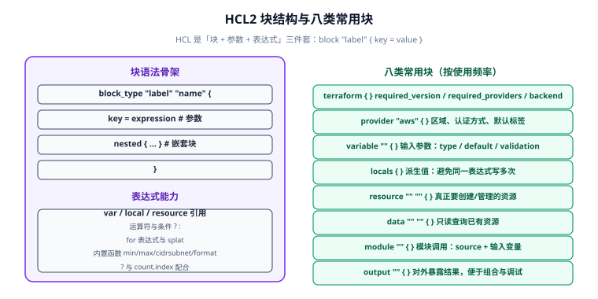

# HCL 语法与表达式

HCL（HashiCorp Configuration Language，HashiCorp 配置语言）是 Terraform 的配置语言。它**不是通用编程语言**，而是一套「声明结构 + 表达式求值」的 DSL：用块（block）声明"要什么"，用表达式（expression）算出"具体值是多少"。

看懂 HCL 只需记住三件套：**块（block）+ 参数（argument）+ 表达式（expression）**。



## 1. 块与参数：HCL 的骨架

```hcl
block_type "label_one" "label_two" {
  argument_name = expression        # 参数：key = value
  nested_block {                    # 嵌套块：没有等号
    inner = "value"
  }
}
```

| 组成 | 说明 | 例子 |
| --- | --- | --- |
| 块类型（block type） | 决定这个块是什么 | `resource`、`variable`、`module` |
| 标签（label） | 按类型数量固定 | `resource "aws_s3_bucket" "demo"` 两个标签 |
| 参数（argument） | `key = value`，赋值 | `bucket = "my-bucket"` |
| 嵌套块 | 不带等号的子结构 | `tags { ... }`（少数资源用） |
| 注释 | `#` 或 `//` 单行，`/* */` 多行 | `# 注释` |

::: tip 标签数量是"类型规定"的，不能随意加
`variable "name" {}` 一个标签，`resource "type" "name" {}` 两个标签，`module "name" {}` 一个，`terraform {}` 零个。写多了或少了都会在 `validate` 阶段直接报错。
:::

## 2. 八类常用块

| 块 | 作用 | 关键参数 |
| --- | --- | --- |
| `terraform` | 声明版本与后端 | `required_version`、`required_providers`、`backend` |
| `provider` | 配置 provider（区域、认证） | `region`、`access_key`、`default_tags` |
| `variable` | 输入参数 | `type`、`default`、`description`、`validation` |
| `locals` | 派生值，避免重复表达式 | 任意 `key = 表达式` |
| `resource` | 要创建/管理的真实资源 | 由 provider Schema 决定 |
| `data` | 只读查询既有资源 | 由 provider Schema 决定 |
| `module` | 调用子模块 | `source`、`version`、输入变量 |
| `output` | 对外暴露结果 | `value`、`description`、`sensitive` |

```hcl [完整骨架，八个块都出现一次]
terraform {
  required_version = ">= 1.6.0"
  required_providers {
    aws = { source = "hashicorp/aws", version = "~> 6.0" }
  }
}

provider "aws" {
  region = var.region
}

variable "region" {
  type        = string
  default     = "ap-southeast-1"
  description = "AWS 区域"
}

locals {
  name_prefix = "tf-demo-${var.env}"
}

data "aws_ami" "ubuntu" {
  most_recent = true
  owners      = ["099720109477"]        # Canonical
  filter {
    name   = "name"
    values = ["ubuntu/images/hvm-ssd-gp3/ubuntu-noble-24.04-amd64-server-*"]
  }
}

resource "aws_instance" "web" {
  ami           = data.aws_ami.ubuntu.id
  instance_type = "t3.micro"
  tags          = { Name = "${local.name_prefix}-web" }
}

module "network" {
  source = "./modules/network"
  cidr   = "10.0.0.0/16"
}

output "instance_ip" {
  value       = aws_instance.web.public_ip
  description = "Web 实例公网 IP"
}
```

## 3. 值与类型

HCL 的类型分为**原始类型**与**复杂类型**：

| 类型 | 写法 | 示例 |
| --- | --- | --- |
| string | `string` | `"hello"` |
| number | `number` | `42`、`3.14` |
| bool | `bool` | `true`、`false` |
| list（有序） | `list(string)` | `["a", "b"]` |
| set（去重无序） | `set(string)` | `toset(["a", "a"])` |
| map（字符串键） | `map(number)` | `{ a = 1, b = 2 }` |
| object（结构化） | `object({ name = string })` | 固定字段的组合 |
| tuple（定长异型） | `tuple([string, number])` | `["a", 1]` |
| any | `any` | 不做类型检查（慎用） |

```hcl
# 字面量的常见写法
a_string  = "hello"
a_number  = 42
a_bool    = true
a_list    = ["10.0.1.0/24", "10.0.2.0/24"]
a_map     = { Name = "web", Env = "prod" }
a_object  = { name = "web", port = 80 }
a_null    = null                     # 表示"未设置"
a_heredoc = <<-EOT
  多行文本
  可以包含 ${var.region}
EOT
```

::: danger `null` 不等于"删除"
在 `resource` 参数里写 `= null` 表示"不设置该参数"（provider 用默认值）；但如果你是想**把已经设过的值改回默认**，`null` 未必生效——有些参数在 provider 里被存储为已知值，写成 `null` 会触发"是否要 replace"的 plan 变化。要移除某参数，从配置里删掉那一行更稳妥。
:::

## 4. 变量：类型、默认值、校验

```hcl
variable "env" {
  type        = string
  description = "环境标识"
  default     = "dev"

  validation {
    condition     = contains(["dev", "staging", "prod"], var.env)
    error_message = "env 只能是 dev / staging / prod 之一。"
  }
}

variable "allowed_ports" {
  type    = list(number)
  default = [22, 80, 443]
}

variable "tags" {
  type = map(string)
  default = {
    ManagedBy = "terraform"
  }
}
```

| 特殊类型修饰 | 作用 |
| --- | --- |
| `sensitive = true` | 在 plan/apply 输出中打码为 `(sensitive value)` |
| `nullable = false` | 不允许传 `null`，强制提供值 |
| `ephemeral = true` | （1.10+）该值不写入 state，适合临时凭证 |
| `validation` | 自定义校验规则，失败时给出 `error_message` |

::: warning `sensitive` 只影响"显示"，不影响 state
`sensitive = true` 只把输出在终端里打码，**值仍然以明文写入 state**。真正的秘密请用 Vault、AWS Secrets Manager 或 `ephemeral` 变量，并确保 backend 加密 + 访问受控。
:::

## 5. 运算符与条件表达式

```hcl
locals {
  is_prod     = var.env == "prod"           # 比较
  count_inst  = var.env == "prod" ? 3 : 1   # 三元条件
  merged_tags = merge(var.tags, { Env = var.env })
  subnet_cidr = cidrsubnet("10.0.0.0/16", 8, 1)   # 10.0.1.0/24
  port_range  = var.port > 1024 && !var.is_public ? "high" : "low"
}
```

| 类别 | 运算符 |
| --- | --- |
| 算术 | `+` `-` `*` `/` `%` |
| 比较 | `==` `!=` `<` `<=` `>` `>=` |
| 逻辑 | `&&` `||` `!` |
| 条件 | `cond ? a : b` |
| 字符串拼接 | `"${var.a}-${var.b}"`（插值）、`format("%s-%s", var.a, var.b)` |

## 6. for 表达式与 splat

**for 表达式**用于把一种集合"映射"成另一种，是 HCL 里最像编程语言的部分：

```hcl
variable "names" {
  default = ["web", "api", "worker"]
}

locals {
  # 列表 → 列表（map）：加前缀
  prefixed = [for n in var.names : "tf-${n}"]

  # 列表 → 列表（带过滤）：只要 web/api
  web_only = [for n in var.names : n if n != "worker"]

  # 列表 → map：以元素为键
  by_name = { for n in var.names : n => upper(n) }

  # map → 列表：取所有 key
  all_keys = [for k, v in var.tags_map : k]
}
```

**splat 表达式**是"取集合里每个元素的同一属性"的简写：

```hcl
# 完整写法
locals { ids_full = [for i in aws_instance.web : i.id] }

# splat 简写
locals { ids_splat = aws_instance.web[*].id }

# 配 count 的资源，也能用 splat 拿全部 IP
output "all_ips" {
  value = aws_instance.web[*].public_ip
}
```

| 写法 | 适用 | 注意 |
| --- | --- | --- |
| `[for x in list : x.attr]` | 任何集合、需要过滤/变换 | 最灵活 |
| `list[*].attr` | 列表/元组，取同属性 | 对 `count` 资源最直观 |
| `map.*.attr` | 旧语法（已不推荐） | 用 `[for]` 或 `values()` 代替 |

## 7. 内置函数（高频清单）

函数调用形式为 `函数名(参数...)`，**不能自定义函数**（模块是唯一的复用手段）。

| 分类 | 函数 | 用途 |
| --- | --- | --- |
| 数值 | `min` `max` `abs` `ceil` `floor` | 取极值、取整 |
| 字符串 | `format` `join` `split` `replace` `upper` `lower` `trimspace` `substr` | 拼接、切分、大小写 |
| 集合 | `length` `concat` `merge` `flatten` `distinct` `compact` `contains` `keys` `values` `lookup` | 集合操作 |
| 网络 | `cidrsubnet` `cidrhost` `cidrnetmask` | 子网切分 |
| 编码 | `jsonencode` `jsondecode` `base64encode` `yamlencode` | 序列化 |
| 时间 | `timestamp` `formatdate` `timeadd` | 时间处理 |
| 文件 | `file` `templatefile` `filebase64` | 读文件/渲染模板 |
| 类型转换 | `tostring` `tonumber` `tolist` `toset` `tomap` | 显式转换 |
| 其他 | `coalesce` `try` `can` `sensitive` `nonsensitive` | 空值兜底、错误捕获 |

```hcl
locals {
  # 子网切分：把 /16 切成 /24
  subnets = [for i in range(2) : cidrsubnet("10.0.0.0/16", 8, i)]
  # => ["10.0.0.0/24", "10.0.1.0/24"]

  # 安全取值：键不存在时返回默认值
  env_tag = lookup(var.tags, "Env", "unknown")

  # 错误捕获：表达式可能失败时给兜底
  maybe   = try(var.maybe_missing.attr, "fallback")

  # 渲染外部模板文件
  user_data = templatefile("${path.module}/templates/init.sh.tpl", {
    pkg = "nginx"
  })
}
```

::: tip `try` / `can` 是 HCL 里的"异常处理"
`try(a, b, c)` 依次求值，返回第一个不报错的结果；`can(expr)` 返回 bool，判断表达式能否成功求值。它们常用于"可选字段"场景——比如某个 provider 版本才有某个属性，用 `try` 兼容多版本。
:::

## 8. 动态块（dynamic）

当某个嵌套块需要"按列表重复生成"时，用 `dynamic`：

```hcl
variable "ingress_rules" {
  default = [
    { port = 22, cidr = "0.0.0.0/0" },
    { port = 443, cidr = "0.0.0.0/0" },
  ]
}

resource "aws_security_group" "web" {
  name = "web-sg"

  # 按 ingress_rules 列表动态生成多个 ingress 块
  dynamic "ingress" {
    for_each = var.ingress_rules
    content {
      from_port   = ingress.value.port
      to_port     = ingress.value.port
      protocol    = "tcp"
      cidr_blocks = [ingress.value.cidr]
    }
  }
}
```

| 关键字 | 含义 |
| --- | --- |
| `dynamic "块名"` | 声明动态生成的嵌套块 |
| `for_each` | 遍历的集合（list / map / set） |
| `content { }` | 每次迭代生成的块内容 |
| `iterator` | 自定义迭代变量名（默认与块名同名） |
| `labels` | 生成带标签的嵌套块时指定标签 |

```hcl
# 自定义 iterator 名，避免与块名冲突
dynamic "tag" {
  for_each = var.tags
  iterator = t
  content {
    key   = t.key
    value = t.value
  }
}
```

::: danger 别把 dynamic 当成"万能循环"
`dynamic` 只能生成**嵌套块**，不能生成顶层 `resource`。要批量创建资源，用资源的 `count` 或 `for_each` 元参数（见[资源、数据源与变量](../Resource/index.md)）。另外 `dynamic` 生成的块在报错时定位困难，能显式写清就显式写。
:::

## 9. 模板字符串与 heredoc

```hcl
locals {
  # 插值：${表达式}
  name = "web-${var.env}-${count.index + 1}"

  # 转义：$${ 表示字面量 ${
  literal = "$${not_interpolated}"

  # 多行（indented heredoc，会自动去掉公共缩进）
  policy = <<-JSON
    {
      "Version": "2012-10-17",
      "Statement": [{"Effect": "Allow", "Action": "s3:GetObject", "Resource": "*"}]
    }
  JSON

  # 条件插值：为空时用默认
  desc = "实例${var.remark != "" ? "：${var.remark}" : ""}"
}
```

| 模板语法 | 说明 |
| --- | --- |
| `${expr}` | 插值 |
| `$${` | 转义为字面量 `${` |
| `%{ if cond }...%{ endif }` | 模板内条件 |
| `%{ for x in list }...%{ endfor }` | 模板内循环 |

::: warning 用模板文件而非巨型 heredoc
超过 15 行的 heredoc 会严重破坏 `.tf` 的可读性。把内容放进 `templates/xxx.tpl`，用 `templatefile()` 加载——既能让编辑器给出正确语法高亮，也便于单独测试渲染结果。
:::

## 10. 格式化与验证

```shell
terraform fmt           # 递归格式化当前目录（官方风格）
terraform fmt -recursive  # 含子模块
terraform fmt -check -diff  # CI 里用：不通过则非 0 退出（建议加为门禁）
terraform validate      # 语法 + 参数类型 + 引用的合法性（不连云）
```

```shell
# CI 门禁推荐组合
terraform fmt -check -recursive || exit 1
terraform init -backend=false     # 只装 provider，不连后端
terraform validate
```

## 11. 验证方式

在本地新建一个只依赖内置 `terraform_data` 的目录，跑通全部语法点：

```hcl [hcl-check.tf]
variable "names" {
  type    = list(string)
  default = ["web", "api"]
}

locals {
  prefixed = [for n in var.names : "tf-${n}"]
  joined   = join(",", local.prefixed)
  subnets  = [for i in range(2) : cidrsubnet("10.0.0.0/16", 8, i)]
}

resource "terraform_data" "check" {
  input = {
    joined  = local.joined
    subnets = local.subnets
  }
}

output "result" {
  value = terraform_data.check.output
}
```

```shell
terraform init
terraform fmt -check -diff
# 预期：无输出（已符合官方风格）

terraform validate
# 预期：Success! The configuration is valid.

terraform apply -auto-approve
# 预期：Outputs:
#   result = {
#     "joined"  = "tf-web,tf-api"
#     "subnets" = ["10.0.0.0/24", "10.0.1.0/24"]
#   }

terraform destroy -auto-approve
```

验证结果记录（**请在本地执行后填写**，当前编写环境未安装 Terraform，未实际运行）：

| 检查项 | 期望 | 实测 | 结论 |
| --- | --- | --- | --- |
| `terraform fmt -check` | 无输出 | 待填写 | ⏳ |
| `terraform validate` | Success! | 待填写 | ⏳ |
| `for` 表达式输出 | `tf-web,tf-api` | 待填写 | ⏳ |
| `cidrsubnet` 输出 | `10.0.0.0/24`,`10.0.1.0/24` | 待填写 | ⏳ |
| `dynamic` 块 | 计划中生成 2 个 ingress | 待填写 | ⏳ |

## 参考资料

- HCL 语法规范：https://developer.hashicorp.com/terraform/language/syntax/configuration
- 表达式与函数：https://developer.hashicorp.com/terraform/language/expressions
- 内置函数清单：https://developer.hashicorp.com/terraform/language/functions
- 变量与校验：https://developer.hashicorp.com/terraform/language/values/variables
- 上一节：[安装与初始化](../Install/index.md)｜下一节：[资源、数据源与变量](../Resource/index.md)
- 相邻专题：[Ansible Playbook 与变量](../../Ansible/Playbook/index.md)（对照 YAML + Jinja2 写法）
