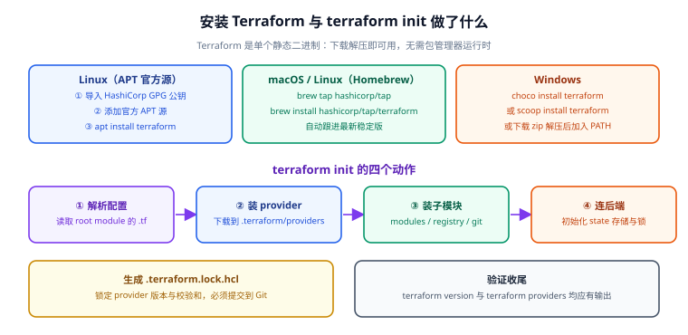

# 安装与初始化

Terraform 的安装门槛极低——**它就是一个单独的静态二进制**，下载解压就能用，不需要 Java、Python 之类的运行时。真正容易出问题的是下一步：`terraform init` 在做什么、为什么有些网络环境装不上 provider、`.terraform.lock.hcl` 到底该不该提交。

本页把"装好"和"初始化明白"两件事讲透。



## 1. 安装方式总览

| 方式 | 适用场景 | 升级方式 | 备注 |
| --- | --- | --- | --- |
| 官方二进制（zip） | 任何平台、CI 镜像、需要固定版本 | 手动替换 + 用 `tfenv` 管理 | 最可控，推荐 CI 使用 |
| APT 官方源（HashiCorp） | Ubuntu / Debian 服务器 | `apt upgrade terraform` | 自动跟随最新稳定版 |
| Homebrew `hashicorp/tap` | macOS / Linux 开发者机器 | `brew upgrade` | 与官方 release 同步 |
| Chocolatey / Scoop | Windows 开发机 | `choco upgrade` / `scoop update` | 需管理员或用户级权限 |
| OpenTofu 包源 | 需要 MPL 许可证 | 同上游 | 命令为 `tofu`，其余流程一致 |

::: warning 不要用发行版自带仓库里的 terraform
部分发行版仓库里的 `terraform` 版本常年停留在旧版（甚至 0.x），且缺少 `required_version` 检查支持。**只认 HashiCorp 官方源或官方 release 页**，否则很容易踩到"语法不支持"的坑。
:::

## 2. Linux：APT 官方源安装

```shell
# ① 安装依赖并导入 HashiCorp GPG 公钥
sudo apt-get update && sudo apt-get install -y gnupg software-properties-common curl
curl -fsSL https://apt.releases.hashicorp.com/gpg | \
  sudo gpg --dearmor -o /usr/share/keyrings/hashicorp-archive-keyring.gpg

# ② 添加官方 APT 源（用公钥签名）
echo "deb [signed-by=/usr/share/keyrings/hashicorp-archive-keyring.gpg] \
https://apt.releases.hashicorp.com $(lsb_release -cs) main" | \
  sudo tee /etc/apt/sources.list.d/hashicorp.list

# ③ 安装
sudo apt-get update
sudo apt-get install -y terraform

# ④ 验证
terraform -version
```

::: tip Ubuntu 26.04 及以上：`apt-key` 已移除
Ubuntu 26.04 LTS 时代 APT 3.x 已彻底移除 `apt-key` 命令，必须使用上面这种 `signed-by=` 的 keyring 写法。任何还在教 `curl ... | sudo apt-key add -` 的教程都需要改掉。
:::

## 3. macOS / Linux：Homebrew

```shell
brew tap hashicorp/tap
brew install hashicorp/tap/terraform
terraform -version
```

## 4. Windows：三种方式

```powershell
# 方式一：Chocolatey（管理员 PowerShell）
choco install terraform -y

# 方式二：Scoop（用户级，免管理员）
scoop install terraform

# 方式三：下载 zip 解压后加入 PATH
# 1) 从 developer.hashicorp.com/terraform/downloads 下载 windows_amd64.zip
# 2) 解压得到 terraform.exe，放到 C:\tools\terraform\
# 3) 系统环境变量 Path 追加 C:\tools\terraform\
# 4) 新开一个终端执行 terraform -version
```

## 5. 多版本管理：tfenv

同一台机器上经常要维护"面向旧环境的老项目"和"新项目"，用 `tfenv` 可以按目录锁定版本：

```shell
brew install tfenv          # 或 git clone 官方仓库到 ~/.tfenv
tfenv list-remote | head    # 查看可安装版本
tfenv install 1.16.2
tfenv install 1.15.7
tfenv use 1.16.2            # 全局切换

# 项目级锁定：在项目根目录写入 .terraform-version
echo "1.16.2" > .terraform-version
tfenv install               # 自动读 .terraform-version 装对应版本
```

::: danger 版本要和 `required_version` 对齐
项目里写了 `required_version = ">= 1.6.0"`，本机却是 1.4.x，`terraform plan` 会直接报错退出。CI 镜像里尤其要注意：**镜像 tag 与配置里的约束必须一致**。
:::

## 6. `terraform init` 做了哪四件事

`init` 是每个工作目录的"第一步"，可重复执行。它做四件事：

| 步骤 | 动作 | 产物 |
| --- | --- | --- |
| ① 解析配置 | 读取 root module 全部 `.tf` | 得到所需的 provider 与 module 清单 |
| ② 安装 provider | 从 Registry 或镜像下载插件 | `.terraform/providers/` |
| ③ 安装子模块 | 拉取 `module` 块引用到的模块 | `.terraform/modules/` |
| ④ 初始化后端 | 连接 backend，读取/创建 state | backend 目录下的 `.terraform/terraform.tfstate`（后端元信息） |

同时生成 **`.terraform.lock.hcl`**，锁定每个 provider 的精确版本与校验和。

```shell
terraform init                 # 首次或配置变更后
terraform init -upgrade        # 在版本约束内升级 provider 到最新
terraform init -reconfigure    # 改了 backend 配置后强制重新初始化
terraform init -migrate-state  # 换了 backend，把旧 state 迁过去
```

## 7. `.terraform.lock.hcl`：必须提交

```
# .terraform.lock.hcl（自动生成，请提交到 Git）
provider "registry.terraform.io/hashicorp/aws" {
  version     = "6.12.0"
  constraints = "~> 6.0"
  hashes = [
    "h1:...",
    "zh:...",
  ]
}
```

| 文件 | 是否提交 | 原因 |
| --- | --- | --- |
| `.terraform.lock.hcl` | **是** | 保证团队与 CI 装到完全相同的 provider 版本 |
| `.terraform/`（目录） | **否** | 本地缓存，体积大且含平台相关二进制 |
| `terraform.tfstate` / `*.tfstate.backup` | **否** | 含明文凭证，应放远程后端 |
| `*.tfvars`（含敏感值） | **否** | 按环境注入，不入库 |
| `crash.log` | **否** | 崩溃调试日志 |

标准 `.gitignore`：

```text
# .gitignore
.terraform/
*.tfstate
*.tfstate.*
crash.log
crash.*.log
*.tfvars
*.tfvars.json
.terraformrc
terraform.rc
```

::: tip `-upgrade` 之后要重新提交 lock 文件
`terraform init -upgrade` 会更新 `.terraform.lock.hcl`。**它会出现在 `git status` 里——别忘了提交**，否则 CI 上又会退回旧版本，出现"本地能 plan、CI 报错"的诡异现象。
:::

## 8. 网络受限环境：Provider 缓存与镜像

国内 / 内网环境经常连不上 `registry.terraform.io`。三种解法：

```shell
# ① 本地插件缓存目录（多项目共享，省重复下载）
export TF_PLUGIN_CACHE_DIR="$HOME/.terraform.d/plugin-cache"
mkdir -p "$TF_PLUGIN_CACHE_DIR"

# 写进 ~/.terraformrc 让它永久生效
cat > ~/.terraformrc <<'EOF'
plugin_cache_dir   = "$HOME/.terraform.d/plugin-cache"
plugin_cache_may_break_dependency_lock_file = true
EOF
```

```hcl
# ② 指定 provider 镜像源（指向国内/内网 Registry 或 filesystem mirror）
terraform {
  required_providers {
    aws = {
      source  = "registry.example.com/hashicorp/aws"
      version = "~> 6.0"
    }
  }
}
```

```shell
# ③ 提前把 provider 下载成离线镜像，随代码一起分发
terraform providers mirror ./vendor/registry
# 目标机器配置 filesystem_mirror 指向 ./vendor/registry
```

```hcl
# ~/.terraformrc（目标机器）
provider_installation {
  filesystem_mirror {
    path    = "/opt/tf-mirror/registry"
    include = ["registry.terraform.io/*/*"]
  }
  direct {
    exclude = ["registry.terraform.io/*/*"]
  }
}
```

::: info 缓存目录对 lock 文件的影响
开启 `TF_PLUGIN_CACHE_DIR` 后，Terraform 可能只校验 `h1:` 哈希而跳过 `zh:` 平台哈希的下载校验，这正是 `plugin_cache_may_break_dependency_lock_file = true` 的含义。若团队对可复现性要求极高（如合规审计），可以不开缓存、改用 `filesystem_mirror`。
:::

## 9. OpenTofu：安装差异

OpenTofu 的安装流程与 Terraform 基本一致，只是包名与命令名不同：

```shell
# Debian/Ubuntu 官方脚本（详见 openTofu 官方文档获取最新一键脚本）
curl -fsSL https://get.opentofu.org/install-opentofu.sh | sudo bash

# 或 Homebrew
brew install opentofu

# 验证
tofu -version
```

| 差异点 | Terraform | OpenTofu |
| --- | --- | --- |
| 命令 | `terraform` | `tofu` |
| Registry | `registry.terraform.io` | `registry.opentofu.org`（也兼容 Terraform Registry） |
| lock 文件 | `.terraform.lock.hcl` | `.terraform.lock.hcl`（同名同格式） |
| state 格式 | 原生 | 与 Terraform 互通，可交替 apply |
| 许可证 | BUSL 1.1（1.6.0 起） | MPL 2.0 |

## 10. 常见报错与处理

| 报错 | 原因 | 处理 |
| --- | --- | --- |
| `Could not retrieve the list of available versions for provider` | 网络不通 / 镜像未配 | 配 `TF_PLUGIN_CACHE_DIR` 或镜像源 |
| `Error: Unsupported Terraform Core version` | 本机版本低于 `required_version` | 用 `tfenv` 切到满足约束的版本 |
| `Error: Backend initialization required` | 改了 backend 配置 | `terraform init -reconfigure` |
| `Error acquiring the state lock` | 上一次 apply 非正常退出 | 确认无人操作后 `terraform force-unlock <LOCK_ID>` |
| `Module not installed` | 新增 `module` 块未 init | `terraform init`（会自动装子模块） |
| `Failed to install provider ... checksum mismatch` | lock 文件与镜像内容不符 | 删除 `.terraform/` 重装；核对 lock 是否被手工改过 |
| `Permission denied` 执行 terraform | 二进制无执行权限 | `chmod +x ./terraform` |

::: danger force-unlock 前必须确认
`terraform force-unlock` 只是"把锁标记删掉"，它**不会**询问线上是否真的有人在 apply。如果此时另一个流水线正在写同一份 state，强制解锁会导致 state 损坏。执行前请先确认对应 CI 任务已停止、对应开发者的终端已关闭。
:::

## 11. 验证方式

```shell
# ① 版本与 provider 就绪
terraform -version
# 预期：Terraform v1.16.x（或你的实际版本）

# ② 在空目录初始化一个最小配置（不连云）
mkdir tf-install-check && cd tf-install-check
```

```hcl [versions.tf]
terraform {
  required_version = ">= 1.6.0"
  required_providers {
    aws = {
      source  = "hashicorp/aws"
      version = "~> 6.0"
    }
  }
}
```

```shell
terraform init
# 预期：Terraform has been successfully initialized!
#      Installing hashicorp/aws v6.12.0...

terraform providers
# 预期：列出一行 provider registry.terraform.io/hashicorp/aws v6.12.0

ls -a
# 预期：能看到 .terraform/、.terraform.lock.hcl、versions.tf

cat .terraform.lock.hcl | head -5
# 预期：version = "6.12.0" 与 constraints = "~> 6.0"
```

验证结果记录（**请在本地执行后填写**，当前编写环境未安装 Terraform，未实际运行）：

| 检查项 | 期望 | 实测 | 结论 |
| --- | --- | --- | --- |
| `terraform -version` | 输出 v1.16.x | 待填写 | ⏳ |
| `terraform init` | successfully initialized | 待填写 | ⏳ |
| `terraform providers` | 列出 aws provider | 待填写 | ⏳ |
| `.terraform.lock.hcl` | 含 version 与 constraints | 待填写 | ⏳ |
| `git status` | 仅 lock 与 .tf 待提交，无 .terraform/ | 待填写 | ⏳ |

## 参考资料

- Terraform 安装指南：https://developer.hashicorp.com/terraform/install
- `terraform init` 命令参考：https://developer.hashicorp.com/terraform/cli/commands/init
- Provider 安装与镜像配置：https://developer.hashicorp.com/terraform/cli/config/config-file
- OpenTofu 安装文档：https://opentofu.org/docs/intro/install/
- 上一节：[概述与选型](../Overview/index.md)｜下一节：[HCL 语法与表达式](../HCL/index.md)
- 相邻专题：[Ansible 批量交付](../../Ansible/index.md) ｜ [Docker 环境准备](../../Docker/index.md)
