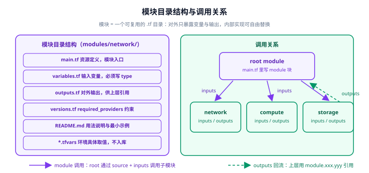

# 模块与注册表

**模块（module）**就是一个包含 `.tf` 文件的目录。任何被 `module` 块引用的目录都是"子模块"，而当前工作目录本身是"root module（根模块）"。

模块是 Terraform 里**唯一的复用机制**——HCL 不能自定义函数、不能写类，想复用就只能抽模块。用好模块能让"同一套基础设施代码交付 dev / staging / prod"变得可行。



## 1. 模块的边界：对外契约

模块的设计原则是**"高内聚、低耦合"**：内部实现可以随意重构，对外只暴露两样东西——**输入变量（variables）**与**输出（outputs）**。

```text
modules/network/
├─ main.tf          资源定义（模块入口，别人不直接看）
├─ variables.tf      输入契约：每个变量必须有 type 与 description
├─ outputs.tf        输出契约：别人只能通过这里取值
├─ versions.tf       required_providers / required_version 约束
├─ README.md         用法说明 + 最小可复制示例
└─ *.tfvars          环境取值（不入库）
```

| 文件 | 是否必需 | 作用 |
| --- | --- | --- |
| `main.tf` | 建议 | 资源与数据源定义（文件名只是习惯，内容不限） |
| `variables.tf` | **是** | 输入参数；无变量的模块几乎没有复用价值 |
| `outputs.tf` | **是** | 输出结果；无输出的模块无法被上层组合 |
| `versions.tf` | 建议 | 锁定 provider 版本范围 |
| `README.md` | 建议 | 使用说明（注册表会渲染它） |
| `.terraform.lock.hcl` | 子模块**不提交** | 由 root module 统一锁定 provider 版本 |

## 2. 最小可用模块

```hcl [modules/network/variables.tf]
variable "name" {
  type        = string
  description = "资源名前缀"
}

variable "vpc_cidr" {
  type        = string
  default     = "10.0.0.0/16"
  description = "VPC 网段"
}

variable "public_subnet_count" {
  type        = number
  default     = 2
  description = "公有子网数量"

  validation {
    condition     = var.public_subnet_count >= 1 && var.public_subnet_count <= 4
    error_message = "public_subnet_count 必须在 1~4 之间。"
  }
}
```

```hcl [modules/network/main.tf]
resource "aws_vpc" "this" {
  cidr_block           = var.vpc_cidr
  enable_dns_support   = true
  enable_dns_hostnames = true
  tags                 = { Name = "${var.name}-vpc" }
}

resource "aws_subnet" "public" {
  count             = var.public_subnet_count
  vpc_id            = aws_vpc.this.id
  cidr_block        = cidrsubnet(var.vpc_cidr, 8, count.index)
  availability_zone = data.aws_availability_zones.available.names[count.index]
  tags              = { Name = "${var.name}-public-${count.index + 1}" }
}

data "aws_availability_zones" "available" {
  state = "available"
}
```

```hcl [modules/network/outputs.tf]
output "vpc_id" {
  value       = aws_vpc.this.id
  description = "VPC ID"
}

output "public_subnet_ids" {
  value       = aws_subnet.public[*].id
  description = "公有子网 ID 列表"
}
```

调用：

```hcl [envs/prod/main.tf]
module "network" {
  source = "../../modules/network"

  name                = "prod"
  vpc_cidr            = "10.10.0.0/16"
  public_subnet_count = 3
}

output "vpc_id" {
  value = module.network.vpc_id            # 通过模块 outputs 取值
}
```

## 3. `source` 的五种来源

```hcl
# ① 本地路径（同仓库，最常用）
module "network" {
  source = "../../modules/network"
}

# ② Terraform Registry（官方/社区）
module "vpc" {
  source  = "terraform-aws-modules/vpc/aws"
  version = "~> 6.0"        # 注册表模块必须写 version
}

# ③ GitHub（可指定 tag / branch / commit）
module "sg" {
  source = "git::https://github.com/my-org/terraform-aws-sg.git?ref=v1.4.0"
}

# ④ 通用 Git（SSH、GitLab、Bitbucket 同理）
module "app" {
  source = "git::ssh://git@gitlab.example.com/infra/tf-app.git//modules/app?ref=v2.1.0"
}

# ⑤ 归档 / 对象存储 / HTTP
module "legacy" {
  source = "s3::https://s3-ap-southeast-1.amazonaws.com/tf-modules/app.zip"
}
```

| 来源 | 写法要点 | 版本控制方式 |
| --- | --- | --- |
| 本地路径 | `./` 或 `../` 开头 | 跟仓库一起走 Git |
| Registry | `命名空间/模块名/provider` | **必须** `version = "~> x.y"` |
| GitHub | `git::https://...?ref=` | `ref` 指定 tag（推荐）或 commit |
| 通用 Git | `git::ssh://...//子目录?ref=` | `//` 分隔仓库与子目录 |
| S3 / HTTP 归档 | `s3::` / `https://` | 靠文件路径/版本号 |

::: danger `source` 的四个坑
1. **本地路径不能包含 `..` 之外的花样**：`source = "./modules/network"` 可以，`source = "modules/network"` 不行（会被当成 Registry 地址报错）。
2. **Registry 模块必须写 `version`**：省略会让每次 `init` 都可能装到新版本，导致 plan 结果不可复现。
3. **Git 模块务必用 `ref` 钉到 tag/commit**：用 `?ref=main` 等于"每次拉最新"，是最常见的"昨天还好今天炸了"来源。
4. **`source` 一旦变更必须重新 `init`**：Terraform 会提示 `Module ... has changed, run init`。此时用 `terraform init -upgrade` 清理旧模块缓存。
:::

## 4. 注册表（Registry）与私有模块

```shell
# 官方公开注册表
# https://registry.terraform.io/modules/terraform-aws-modules/vpc/aws/latest

# 私有注册表（企业内网，HCP Terraform / 自建）
terraform {
  required_providers {
    mycloud = {
      source = "registry.example.com/my-org/mycloud"   # 私有 provider
    }
  }
}
```

| 来源 | 是否可信 | 建议 |
| --- | --- | --- |
| `terraform-aws-modules/*`（官方 AWS 社区维护） | 高 | 生产可用，但要注意大版本变更 |
| HashiCorp 官方 `terraform-*` | 高 | 生产可用 |
| 个人命名空间模块 | 低 | 先读源码，重点看 state 里的资源与 IAM 权限 |
| 私有注册表 | 中 | 需配合内部评审流程与版本冻结 |

::: warning 用社区模块前先读三处
1. **`variables.tf` 的默认值**——很多模块默认开启一些"顺带创建"的资源（如 NAT 网关、日志桶），会产生意外费用。
2. **`main.tf` 创建的 IAM 角色与策略**——宽泛的 `Resource: "*"` 很常见。
3. **`outputs.tf` 暴露了什么**——是否把敏感值输出为普通 output。
:::

## 5. 模块组合：分层组装

真实的项目往往由三层模块组成：

```text
modules/                      # 可复用能力（无环境概念）
├─ network/                   建 VPC / 子网 / 网关
├─ security/                  安全组 / WAF / 密钥
├─ storage/                   S3 / EFS
└─ compute/                   EC2 / ASG / 启动模板

stacks/                       # 环境无关的服务栈（组合多个能力模块）
└─ web-service/
   ├─ main.tf                 module "network" { ... } module "compute" { ... }
   ├─ variables.tf
   └─ outputs.tf

envs/                         # 具体环境（只传参，不含资源定义）
├─ dev/web-service/           source = "../../../stacks/web-service"
└─ prod/web-service/          同上，参数不同
```

```hcl [stacks/web-service/main.tf]
module "network" {
  source        = "../../modules/network"
  name          = var.name
  vpc_cidr      = var.vpc_cidr
}

module "security" {
  source        = "../../modules/security"
  name          = var.name
  vpc_id        = module.network.vpc_id       # 模块间通过输出连接
  allowed_ports = [22, 80, 443]
}

module "compute" {
  source          = "../../modules/compute"
  name            = var.name
  subnet_ids      = module.network.public_subnet_ids
  security_groups = [module.security.sg_id]
  instance_count  = var.instance_count
}
```

```hcl [envs/prod/web-service/main.tf]
module "web" {
  source         = "../../../stacks/web-service"
  name           = "prod-web"
  vpc_cidr       = "10.20.0.0/16"
  instance_count = 3
}
```

::: tip 关键约定：`envs/` 层不写 `resource`
如果"环境目录"里出现了 `resource` 块，说明这个环境有"只属于自己"的资源配置——那通常是设计漏洞：**同一套栈在不同环境应该只差参数，不差结构**。发现这种情况就把它下沉到 `stacks/` 或 `modules/`。
:::

## 6. 变量传递与 provider 传递

```hcl
# ① 显式传参（推荐）
module "compute" {
  source         = "../../modules/compute"
  instance_type  = var.instance_type
}

# ② 批量传（把 map 展开为多个变量，需模块接受同名变量）
module "compute" {
  source   = "../../modules/compute"
  for_each = var.instances          # 模块级 for_each
  name     = each.key
  size     = each.value
}

# ③ provider 传递（多区域/多账号场景）
module "log_bucket" {
  source    = "../../modules/storage"
  providers = {
    aws = aws.tokyo                 # 把别名 provider 传进去
  }
}
```

::: danger 模块级 `for_each` 不能与 provider 传递的别名动态变化同时用
模块 `for_each` 时，若 `providers` 里的别名也依赖 `each`，会产生"provider 配置在 plan 时未知"的错误。这类场景应拆成多个显式 `module` 块，或改用带 `count` 的资源写法。
:::

## 7. 模块版本与升级

```hcl
module "vpc" {
  source  = "terraform-aws-modules/vpc/aws"
  version = "~> 6.0"          # 允许 6.x，不允许 7.0
}
```

| 约束写法 | 含义 |
| --- | --- |
| `= 6.0.0` | 精确版本（最稳，但需手动升级） |
| `~> 6.0` | 允许 6.0.x、6.1.x、…，不允许 7.0（推荐） |
| `>= 6.0, < 7.0` | 显式区间 |
| `>= 6.0` | 允许 7、8、…（风险高） |

升级流程：

```shell
# ① 改 version 约束
# ② 重新初始化并拉取新版本
terraform init -upgrade

# ③ 一定先看 plan：模块升级常带来资源替换
terraform plan -out=tfplan
terraform show tfplan | head -80       # 重点看是否有 replace/destroy

# ④ 确认后执行
terraform apply tfplan
```

::: warning 模块大版本升级 = 可能重建资源
社区模块的 Major 版本常伴随"资源地址变更"（如把 `aws_eip.nat` 拆成 `aws_eip.nat[0]`）。这类变更在 plan 里表现为 `# forces replacement`。**升级前务必在非生产环境演练一次**，并准备好回滚（旧版约束 + `terraform state` 手工搬迁）。
:::

## 8. 模块最佳实践清单

| 实践 | 说明 |
| --- | --- |
| 每个变量都写 `type` 与 `description` | 无类型会退化为 `any`，通过 `validate` 也无法发现类型错误 |
| 每个输出都写 `description` | 注册表与文档工具依赖它 |
| 只输出"有必要"的值 | 输出越多，state 越难迁移（改输出会影响谁在依赖） |
| 不要在模块里写 `provider` 块 | provider 应由 root module 配置并传递（`configuration_aliases`） |
| 不要硬编码账号/区域/环境名 | 全走变量 |
| 资源用 `this` 命名单一主资源 | 约定俗成，便于阅读（如 `aws_vpc.this`） |
| 模块不要太大 | 超过约 300 行就该拆分 |
| 提交前跑 `terraform fmt -recursive` | 保证全仓库风格一致 |
| README 给出最小可运行示例 | 降低使用者的试错成本 |

## 9. 验证方式

用纯本地模块（无云 provider）验证"模块可传参、可输出、可组合"：

```shell
mkdir -p tf-module-check/modules/greeter && cd tf-module-check
```

```hcl [modules/greeter/variables.tf]
variable "name" {
  type        = string
  description = "被问候的对象"
}

variable "times" {
  type        = number
  default     = 1
  description = "重复次数"
}
```

```hcl [modules/greeter/main.tf]
resource "terraform_data" "greeting" {
  input = join(" ", [for i in range(var.times) : "Hello ${var.name}!"])
}
```

```hcl [modules/greeter/outputs.tf]
output "message" {
  value       = terraform_data.greeting.output
  description = "拼好的问候语"
}
```

```hcl [main.tf]
module "greeter" {
  source = "./modules/greeter"
  name   = "Terraform"
  times  = 3
}

output "result" {
  value = module.greeter.message
}
```

```shell
terraform init
# 预期：Initializing modules...
#      - greeter in ./modules/greeter
#      Terraform has been successfully initialized!

terraform fmt -check -recursive
terraform validate
# 预期：Success! The configuration is valid.

terraform apply -auto-approve
# 预期：Outputs:
#   result = "Hello Terraform! Hello Terraform! Hello Terraform!"

terraform state list
# 预期：module.greeter.terraform_data.greeting

terraform destroy -auto-approve
```

验证结果记录（**请在本地执行后填写**，当前编写环境未安装 Terraform，未实际运行）：

| 检查项 | 期望 | 实测 | 结论 |
| --- | --- | --- | --- |
| `init` | Initializing modules... | 待填写 | ⏳ |
| `validate` | Success! | 待填写 | ⏳ |
| `apply` 输出 | 3 次 Hello Terraform! | 待填写 | ⏳ |
| `state list` | `module.greeter.terraform_data.greeting` | 待填写 | ⏳ |
| 改 `times` 为 1 后 plan | 只 change，不 replace | 待填写 | ⏳ |

## 参考资料

- 模块开发指南：https://developer.hashicorp.com/terraform/language/modules/develop
- `module` 块语法：https://developer.hashicorp.com/terraform/language/modules/syntax
- 官方模块注册表：https://registry.terraform.io/browse/modules
- AWS 社区模块：https://github.com/terraform-aws-modules
- 上一节：[State 与远程后端](../State/index.md)｜下一节：[实战：交付一套云上环境](../Practice/index.md)
- 相邻专题：[Ansible Role](../../Ansible/Role/index.md)（角色化复用的另一种思路）｜[Helm Chart](../../ContainerOrchestration/index.md)
