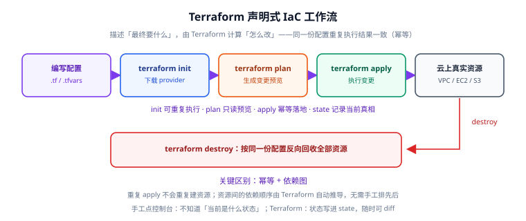
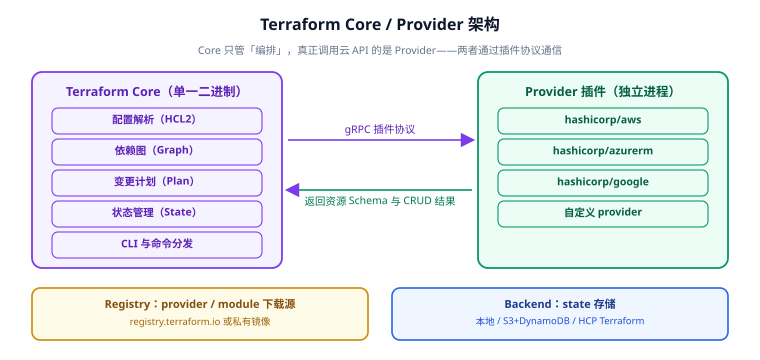

# 概述与选型

**Terraform 是基础设施即代码（Infrastructure as Code，IaC）工具**：把云资源写成版本可控的配置文件，让"环境长什么样"变成可评审、可回滚、可复现的代码，而不是一张记录了"谁在控制台点了什么"的 Wiki。

本页讲清三件事：IaC 到底解决了什么问题、Terraform 的架构与工作流是什么、它和 Ansible / Pulumi / CloudFormation 各自适合什么场景。



## 1. 没有 IaC 的世界长什么样

| 阶段 | 传统做法 | 典型后果 |
| --- | --- | --- |
| 建环境 | 登录控制台点一遍 | 无法复现；测试与生产结构对不上 |
| 改配置 | 找上次是谁点的、凭记忆改 | 手工漏改；没人知道当前完整状态 |
| 扩容 | 再点一遍，容易漏安全组/子网 | 新机器不通；上线前才发现 |
| 灾备 | "照着老环境再搭一个" | 花了三天，还是少了两条路由 |
| 审计 | 翻操作日志 | 谁在什么时候改过什么，答不上来 |

IaC 的核心主张：**环境是代码**——于是它自动获得代码的一切好处：Git 历史、Code Review、CI 校验、版本回滚、可复制。

## 2. 声明式 vs 命令式

这是理解 Terraform 的关键分野。

::: tip 一句话理解
**命令式**告诉系统"先做 A 再做 B"；**声明式**只告诉系统"最终要 A 和 B"，中间怎么走由工具算。
:::

| 维度 | 命令式（Shell / Ansible task / AWS CLI） | 声明式（Terraform / CloudFormation） |
| --- | --- | --- |
| 你描述的内容 | 操作步骤 | 期望终态 |
| 重复执行 | 可能重复建、报错、或产生副作用 | **幂等**：已是目标状态就什么都不做 |
| 是否需要 "当前状态" | 脚本作者自己心里记 | 工具用 state 精确掌握 |
| 变更前可否预览 | 通常不能 | `terraform plan` 给出完整 diff |
| 删除资源 | 得自己写反向脚本 | 从配置里删掉，`apply` 自动回收 |
| 擅长 | 机器内部配置、临时脚本 | 云资源编排、跨资源依赖 |

Terraform 的 `plan` 之所以能算出"要改什么"，是因为它同时掌握三份信息：**配置（你想要的）**、**state（它记得的）**、**真实资源（provider 查到的）**。三者做三方 diff，得出变更计划。

## 3. 架构：Core 与 Provider



Terraform 本体只是**一个静态二进制**，它自己不认识任何云 API。真正干活的是 **Provider 插件**：

| 组件 | 职责 | 说明 |
| --- | --- | --- |
| Terraform Core | 解析配置、构建依赖图、算 plan、管 state、执行 apply | 单一二进制，不含任何云厂商逻辑 |
| Provider 插件 | 把资源定义翻译成云 API 调用；提供资源 Schema | 独立进程，通过 gRPC 与 Core 通信 |
| Registry | 分发 provider 与 module | 官方 `registry.terraform.io`，也可自建/用镜像 |
| Backend | 存 state 与提供锁 | 本地文件、S3+DynamoDB、HCP Terraform 等 |

这个设计带来两个直接收益：

1. **一套语法管所有云**：AWS、Azure、GCP、Kubernetes、Cloudflare、数据库、SaaS 都是 provider，写法一致。
2. **能力可扩展**：官方 provider 不够时可以自己写，企业内网资源也能纳入统一编排。

::: info Provider 是版本化依赖
`terraform init` 会按配置里的版本约束下载 provider，并把精确版本与校验和写进 `.terraform.lock.hcl`。
**这个文件要提交到 Git**——否则不同人/不同 CI 机器可能装到不同版本，导致 plan 结果不一致。
:::

## 4. 工作流：init → plan → apply

三个命令各司其职，"哪一步会动真实资源"是最该记牢的分界线：

| 命令 | 作用 | 是否会改变真实资源 |
| --- | --- | --- |
| `terraform init` | 下载 provider 与模块、初始化 backend | 否 |
| `terraform validate` | 静态检查语法与参数合法性（不连云） | 否 |
| `terraform plan` | 生成变更预览（会读云上真实状态） | 否 |
| `terraform apply` | 执行变更，并更新 state | **是** |
| `terraform destroy` | 按 state 回收本配置管理的全部资源 | **是** |
| `terraform fmt` | 按官方风格格式化代码 | 否 |

一个最小可跑的例子：

```hcl [main.tf]
terraform {
  required_version = ">= 1.6.0"
  required_providers {
    aws = {
      source  = "hashicorp/aws"
      version = "~> 6.0"
    }
  }
}

provider "aws" {
  region = "ap-southeast-1"
}

resource "aws_s3_bucket" "demo" {
  bucket = "tf-demo-bucket-2026"
  tags = {
    ManagedBy = "terraform"
  }
}
```

```shell
terraform init      # 下载 aws provider
terraform plan      # 预期输出：Plan: 1 to add, 0 to change, 0 to destroy
terraform apply     # 输入 yes，创建桶
terraform state list
# 预期输出：aws_s3_bucket.demo
terraform destroy   # 回收
```

::: danger 三个必须养成的习惯
1. **apply 前一定看 plan**：`terraform apply` 直接跑等于闭眼改生产。养成 `plan` 输出重定向到文件、Review 后再 `apply` 的流程。
2. **不要手工改被 Terraform 管理的资源**：手工改了，下次 apply 会被"改回去"。要改就改代码。
3. **不要 `terraform apply -auto-approve` 用在生产**：它跳过确认，一旦 plan 与预期不符就直接落地。CI 里要用也必须是"plan 产物 + 人工审批 + apply 该产物"。
:::

## 5. 与相邻工具的对比

同名不同责：Terraform 管"资源存在"，其余工具各自解决"机器怎么配""应用怎么发""K8s 怎么控"。

| 工具 | 类型 | 状态管理 | 最擅长 | 与 Terraform 的关系 |
| --- | --- | --- | --- | --- |
| **Terraform** | 声明式资源编排 | 自带 state | 多云资源编排、基础设施生命周期 | 本专题主角 |
| **OpenTofu** | Terraform 的 MPL 分叉 | 自带 state（格式兼容） | 需要 OSI 开源许可的场景 | 命令行 `tofu`，语法与 state 兼容 |
| **Ansible** | 命令式配置管理 | 无（每次重跑） | 机器内部配置、应用部署、批量执行 | **互补**：Terraform 建机器，Ansible 配机器 |
| **Pulumi** | 用编程语言写 IaC | 自带 state | 团队已深度使用 TS/Go/Python，需要循环与抽象 | 二选一；Pulumi 更灵活但语言即代码也意味着更自由（更容易写乱） |
| **CloudFormation** | AWS 原生声明式 | AWS 托管 | 纯 AWS、不想引入第三方 | AWS 专用；跨云能力弱 |
| **Crossplane / ACK** | Kubernetes 控制器式 | K8s etcd | 已在 K8s 上做统一控制面 | 思路不同：把云资源当 K8s CRD |

**Terraform 与 Ansible 的边界**（最容易混的一对）：

```text
Terraform：让「机器存在」        →  建 VPC / 子网 / 安全组 / EC2 / RDS / S3
Ansible： 让「机器变对」        →  装包、写配置、发版、重启服务
组合姿势：Terraform 建好 EC2 后输出 IP 列表 → Ansible 用这些 IP 做配置
```

::: tip 怎么选：先问"有没有一个云 API 会在背后被调用"
- 有云 API / 有 provider / 需要"资源存在与否"的生命周期 → **Terraform**
- 只是登录一台已存在的服务器改文件、装包、重启服务 → **Ansible**
- 既有云资源又有机器内部配置 → **两者组合**，用 Terraform 的输出喂给 Ansible 的 inventory
:::

## 6. 它不适合做什么

| 场景 | 为什么不适合 | 替代方案 |
| --- | --- | --- |
| 高频变更的应用发布（一天几次） | plan/apply 以"分钟"计，且面向基础设施而非应用制品 | CI/CD 流水线（见 [CI/CD 自动部署与回滚](../../../Tools/CICD/DeployRollback/index.md)） |
| 机器内部的持续配置收敛 | Terraform 只保证"建出来"，不保证"一直保持这个配置" | Ansible / 配置管理（见 [Ansible 自动化运维](../../Ansible/index.md)） |
| 一次性临时脚本 | 引入 state 与 provider 是过度设计 | Shell / AWS CLI |
| 需要运行时动态决策的逻辑 | HCL 不是通用编程语言，复杂逻辑写起来别扭 | Pulumi / CDK（或把逻辑收敛到模块里） |

## 7. 术语表

| 术语 | 含义 |
| --- | --- |
| Configuration | 配置：一个目录下的 `.tf` 文件集合，即 root module |
| Resource | 由 Terraform 管理的真实对象，有唯一地址 `type.name` |
| Data Source | 只读查询既有资源，不纳入管理 |
| Provider | 提供资源类型与 API 调用的插件 |
| State | 记录"配置对象 ↔ 真实资源"映射的账本 |
| Backend | state 的存放位置与锁机制 |
| Module | 可复用的 `.tf` 目录 |
| Plan | 变更计划（三方 diff 的结果） |
| Apply | 执行计划 |
| Drift | 漂移：真实资源被手工改动，与 state 记录不一致 |
| Lock file | `.terraform.lock.hcl`，锁定 provider 精确版本 |
| State Lock | 状态锁，防止并发 apply 损坏 state |

## 8. 验证方式

本页无需创建资源，用一个纯本地的例子确认工具链就绪（provider 用内置的 `terraform_data`，不连云）：

```hcl [verify.tf]
resource "terraform_data" "hello" {
  input = "terraform-ok"
}

output "result" {
  value = terraform_data.hello.output
}
```

```shell
terraform init
# 预期：Terraform has been successfully initialized!

terraform plan
# 预期：Plan: 1 to add, 0 to change, 0 to destroy

terraform apply -auto-approve
# 预期：Apply complete! Resources: 1 added, 0 changed, 0 destroyed.
#      Outputs: result = "terraform-ok"

terraform state list
# 预期：terraform_data.hello

terraform destroy -auto-approve
# 预期：Destroy complete! Resources: 1 destroyed.
```

验证结果记录（**请在本地执行后填写**，当前编写环境未安装 Terraform，未实际运行）：

| 检查项 | 期望 | 实测 | 结论 |
| --- | --- | --- | --- |
| `terraform version` | 输出 1.16.x（或你的实际版本） | 待填写 | ⏳ |
| `terraform init` | successfully initialized | 待填写 | ⏳ |
| `terraform plan` | 1 to add | 待填写 | ⏳ |
| `terraform apply` | Outputs 打印 terraform-ok | 待填写 | ⏳ |
| `terraform state list` | 列出 1 个资源 | 待填写 | ⏳ |
| `terraform destroy` | 1 destroyed | 待填写 | ⏳ |

## 参考资料

- Terraform 官方文档：https://developer.hashicorp.com/terraform/docs
- CLI 命令参考：https://developer.hashicorp.com/terraform/cli/commands
- Provider Registry：https://registry.terraform.io/
- OpenTofu 官方文档：https://opentofu.org/docs/
- 本专题其余章节：[安装与初始化](../Install/index.md) ｜ [HCL 语法](../HCL/index.md) ｜ [State 与远程后端](../State/index.md)
- 相邻专题：[Ansible 自动化运维](../../Ansible/index.md) ｜ [CI/CD 自动部署与回滚](../../../Tools/CICD/DeployRollback/index.md) ｜ [Kubernetes](../../Kubernetes/index.md)
