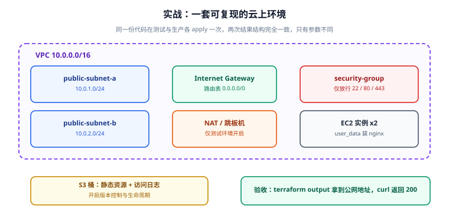

# 实战：交付一套云上环境

前面几页讲了语法与机制，这一页把它们组装成**一套可以真正 apply 的完整代码**：从零交付 `VPC + 公有子网 + 网关 + 安全组 + EC2（含 nginx）+ S3（静态资源与访问日志）`，并走完 `init → fmt → validate → plan → apply → 验收 → 变更演练 → destroy` 的全链路。

::: info 环境与前置条件
- Terraform 1.6+（文中按 1.16.x 编写，OpenTofu 1.9+ 语法兼容，命令换 `tofu`）
- AWS provider 6.x，区域示例用 `ap-southeast-1`（新加坡）
- 需要一个有 EC2 / VPC / S3 权限的 AWS 凭证（`AWS_ACCESS_KEY_ID` / `AWS_SECRET_ACCESS_KEY`，或已配置的 profile）
- **产生费用**：t3.micro + NAT 网关（本例只在测试环境开启）。演练完请立刻 `destroy`
:::



## 1. 目标与约束

| 目标 | 落点 |
| --- | --- |
| 同一份代码可交付 dev/prod | 参数化 `env` / `instance_count` / `enable_nat` |
| 网络结构完整且可复现 | VPC + 2 个公有子网 + IGW + 路由表 |
| 只放行必要端口 | 安全组仅 22（限办公网段）、80、443 |
| 机器建好即能提供服务 | `user_data` 装并启动 nginx |
| 静态资源与日志可托管 | 两个 S3 桶，开版本控制与生命周期 |
| 可销毁、无残留 | `terraform destroy` 一次清干净 |

## 2. 目录结构

```text
envs/dev/web-stack/
├─ versions.tf      provider 与版本约束 + backend
├─ variables.tf     输入变量
├─ network.tf       VPC / 子网 / IGW / 路由表
├─ security.tf      安全组与规则
├─ compute.tf       EC2 实例 + key pair
├─ storage.tf       S3 桶与桶策略/生命周期
├─ outputs.tf       对外输出
├─ terraform.tfvars 具体取值（不入库）
└─ templates/
   └─ init.sh.tpl   cloud-init 脚本
```

## 3. 版本与后端

```hcl [versions.tf]
terraform {
  required_version = ">= 1.6.0"

  required_providers {
    aws = {
      source  = "hashicorp/aws"
      version = "~> 6.0"
    }
  }

  # 生产务必写远程后端；本地演练时注释掉即可
  # backend "s3" {
  #   bucket       = "my-company-tfstate-ap-southeast-1"
  #   key          = "dev/web-stack/terraform.tfstate"
  #   region       = "ap-southeast-1"
  #   encrypt      = true
  #   use_lockfile = true
  # }
}

provider "aws" {
  region = var.region

  default_tags {
    tags = {
      Project   = "tf-practice"
      Env       = var.env
      ManagedBy = "terraform"
    }
  }
}
```

::: tip `default_tags` 是省事也省错的关键
把"所有资源都该有的标签"放进 `default_tags`，就再也不用在每个资源里重复写。注意：它会与资源自身的 `tags` 合并，**同名 key 以资源自身的为准**。若某个资源不想继承（如共享资源），用 `resource "aws_xxx" "y" { tags = { ... } }` 无法排除——需改用 provider 级别的 `ignore_tags`。
:::

## 4. 输入变量

```hcl [variables.tf]
variable "region" {
  type        = string
  default     = "ap-southeast-1"
  description = "AWS 区域"
}

variable "env" {
  type        = string
  description = "环境标识"

  validation {
    condition     = contains(["dev", "staging", "prod"], var.env)
    error_message = "env 只能是 dev / staging / prod。"
  }
}

variable "vpc_cidr" {
  type        = string
  default     = "10.0.0.0/16"
  description = "VPC 网段"
}

variable "azs" {
  type        = list(string)
  default     = ["ap-southeast-1a", "ap-southeast-1b"]
  description = "可用区列表（子网按顺序分配）"
}

variable "instance_type" {
  type        = string
  default     = "t3.micro"
  description = "实例规格"
}

variable "instance_count" {
  type        = number
  default     = 2
  description = "实例数量"

  validation {
    condition     = var.instance_count >= 1 && var.instance_count <= 6
    error_message = "instance_count 必须在 1~6 之间。"
  }
}

variable "ssh_cidr" {
  type        = string
  default     = "203.0.113.10/32"
  description = "允许 SSH 的来源网段（请改成你的办公网出口 IP）"
}

variable "enable_nat" {
  type        = bool
  default     = false
  description = "是否创建 NAT 网关（仅测试环境按需开启，按小时计费）"
}

variable "bucket_suffix" {
  type        = string
  description = "S3 桶名后缀，保证全局唯一（建议用账号 ID 或短随机串）"
}
```

```hcl [terraform.tfvars]（**该文件不入库**，只提交 `terraform.tfvars.example`）
env            = "dev"
instance_type  = "t3.micro"
instance_count = 2
enable_nat     = false
bucket_suffix  = "123456789012"
ssh_cidr       = "198.51.100.7/32"
```

## 5. 网络层

```hcl [network.tf]
resource "aws_vpc" "this" {
  cidr_block           = var.vpc_cidr
  enable_dns_support   = true
  enable_dns_hostnames = true
  tags                 = { Name = "${var.env}-vpc" }
}

# 公有子网：每个可用区一个，网段由 cidrsubnet 自动切分
resource "aws_subnet" "public" {
  count                   = length(var.azs)
  vpc_id                  = aws_vpc.this.id
  cidr_block              = cidrsubnet(var.vpc_cidr, 8, count.index)
  availability_zone       = var.azs[count.index]
  map_public_ip_on_launch = true
  tags                    = { Name = "${var.env}-public-${count.index + 1}" }
}

# 私有子网：供 NAT 场景下的后端使用
resource "aws_subnet" "private" {
  count             = length(var.azs)
  vpc_id            = aws_vpc.this.id
  cidr_block        = cidrsubnet(var.vpc_cidr, 8, count.index + 100)
  availability_zone = var.azs[count.index]
  tags              = { Name = "${var.env}-private-${count.index + 1}" }
}

resource "aws_internet_gateway" "this" {
  vpc_id = aws_vpc.this.id
  tags   = { Name = "${var.env}-igw" }
}

# 弹性 IP 与 NAT 网关（按需）
resource "aws_eip" "nat" {
  count  = var.enable_nat ? 1 : 0
  domain = "vpc"
  tags   = { Name = "${var.env}-nat-eip" }
}

resource "aws_nat_gateway" "this" {
  count         = var.enable_nat ? 1 : 0
  allocation_id = aws_eip.nat[0].id
  subnet_id     = aws_subnet.public[0].id
  tags          = { Name = "${var.env}-nat" }

  depends_on = [aws_internet_gateway.this]
}

# 公有路由表：默认走 IGW
resource "aws_route_table" "public" {
  vpc_id = aws_vpc.this.id

  route {
    cidr_block = "0.0.0.0/0"
    gateway_id = aws_internet_gateway.this.id
  }

  tags = { Name = "${var.env}-public-rt" }
}

resource "aws_route_table_association" "public" {
  count          = length(aws_subnet.public)
  subnet_id      = aws_subnet.public[count.index].id
  route_table_id = aws_route_table.public.id
}

# 私有路由表：有 NAT 才有默认路由
resource "aws_route_table" "private" {
  vpc_id = aws_vpc.this.id
  tags   = { Name = "${var.env}-private-rt" }
}

resource "aws_route" "private_nat" {
  count                  = var.enable_nat ? 1 : 0
  route_table_id         = aws_route_table.private.id
  destination_cidr_block = "0.0.0.0/0"
  nat_gateway_id         = aws_nat_gateway.this[0].id
}

resource "aws_route_table_association" "private" {
  count          = length(aws_subnet.private)
  subnet_id      = aws_subnet.private[count.index].id
  route_table_id = aws_route_table.private.id
}
```

::: warning `cidrsubnet` 的第二个参数是"新增的位数"，不是"子网序号"
`cidrsubnet("10.0.0.0/16", 8, 0)` 的含义是：把 /16 再切出 8 位 → 得到 /24，取第 0 段 → `10.0.0.0/24`。所以 `newbits = 8` 时最多有 256 段；私有子网用 `count.index + 100` 是为了和公有网段拉开距离（`10.0.100.0/24` 起）。**不要把第三个参数当成"掩码长度"**，那是两个完全不同的概念。
:::

## 6. 安全组

```hcl [security.tf]
resource "aws_security_group" "web" {
  name        = "${var.env}-web-sg"
  description = "Allow SSH from office and HTTP/HTTPS from anywhere"
  vpc_id      = aws_vpc.this.id

  tags = { Name = "${var.env}-web-sg" }
}

# SSH：只放行办公网段
resource "aws_vpc_security_group_ingress_rule" "ssh" {
  security_group_id = aws_security_group.web.id
  description       = "SSH from office"
  cidr_ipv4         = var.ssh_cidr
  from_port         = 22
  to_port           = 22
  ip_protocol       = "tcp"
}

# HTTP / HTTPS：对公网开放
resource "aws_vpc_security_group_ingress_rule" "http" {
  security_group_id = aws_security_group.web.id
  description       = "HTTP from anywhere"
  cidr_ipv4         = "0.0.0.0/0"
  from_port         = 80
  to_port           = 80
  ip_protocol       = "tcp"
}

resource "aws_vpc_security_group_ingress_rule" "https" {
  security_group_id = aws_security_group.web.id
  description       = "HTTPS from anywhere"
  cidr_ipv4         = "0.0.0.0/0"
  from_port         = 443
  to_port           = 443
  ip_protocol       = "tcp"
}

# 出站：默认全放行（如需收紧，改成只放行必要目标）
resource "aws_vpc_security_group_egress_rule" "all" {
  security_group_id = aws_security_group.web.id
  description       = "Allow all outbound"
  cidr_ipv4         = "0.0.0.0/0"
  ip_protocol       = "-1"
}
```

::: info AWS provider 5.x 起推荐"独立规则资源"
`aws_security_group_ingress_rule` / `egress_rule`（独立资源）比在 `aws_security_group` 里写 `ingress {}` 内联块更好：
1. **避免"覆盖式"更新**——内联块由 Terraform 全量管理，规则一多就容易与其他模块/系统互相覆盖；
2. **规则有独立地址**，可以单独 `import`、单独 `moved`；
3. 支持 `referenced_security_group_id`（安全组互相引用）等新参数。
:::

## 7. 计算层

```hcl [templates/init.sh.tpl]
#!/bin/bash
set -euxo pipefail

# 安装并启动 nginx
apt-get update -y
apt-get install -y ${pkg}

cat >/var/www/html/index.html <<HTML
<!doctype html>
<html>
  <head><meta charset="utf-8"><title>${env} web</title></head>
  <body>
    <h1>${env} web is running</h1>
    <p>hostname: $(hostname)</p>
  </body>
</html>
HTML

systemctl enable --now ${pkg}
```

```hcl [compute.tf]
# 查最新的 Ubuntu 24.04 AMI（Canonical 官方）
data "aws_ami" "ubuntu" {
  most_recent = true
  owners      = ["099720109477"]

  filter {
    name   = "name"
    values = ["ubuntu/images/hvm-ssd-gp3/ubuntu-noble-24.04-amd64-server-*"]
  }

  filter {
    name   = "virtualization-type"
    values = ["hvm"]
  }
}

# key pair：用本地公钥注册（私钥不经过 Terraform）
resource "aws_key_pair" "this" {
  key_name   = "${var.env}-web-key"
  public_key = file(pathexpand("~/.ssh/id_ed25519.pub"))
}

resource "aws_instance" "web" {
  count = var.instance_count

  ami                    = data.aws_ami.ubuntu.id
  instance_type          = var.instance_type
  subnet_id              = aws_subnet.public[count.index % length(aws_subnet.public)].id
  vpc_security_group_ids = [aws_security_group.web.id]
  key_name               = aws_key_pair.this.key_name

  user_data = templatefile("${path.module}/templates/init.sh.tpl", {
    pkg = "nginx"
    env = var.env
  })

  root_block_device {
    volume_size = 20
    volume_type = "gp3"
    encrypted   = true
  }

  metadata_options {
    http_tokens = "required"        # 强制 IMDSv2，安全基线要求
  }

  tags = { Name = "${var.env}-web-${count.index + 1}" }

  lifecycle {
    # AMI 每次刷新都会变，若任其触发替换会造成"计划外重建"
    ignore_changes = [ami]
  }
}
```

::: danger 三个高频错误
1. **`user_data` 改了不会重跑**：`user_data` 是"首次启动时执行一次"的机制，改它只会让实例在下次**重建**时生效。想让改动生效要显式重建（`terraform apply -replace=aws_instance.web[0]`），或在 `user_data` 里做幂等判断。
2. **`ignore_changes = [ami]` 的代价**：它避免了"每次 plan 都提示重建"，但也意味着**发布新 AMI 后 Terraform 不会自动升级**。要升级时用 `-replace` 显式触发，并配合滚动替换。
3. **`instance_count` 与子网数量不匹配**：`count.index % length(aws_subnet.public)` 是让实例轮流落在不同可用区。如果写成 `aws_subnet.public[count.index]`，实例数超过子网数时会越界报错。
:::

## 8. 存储层

```hcl [storage.tf]
locals {
  assets_bucket = "${var.env}-assets-${var.bucket_suffix}"
  logs_bucket   = "${var.env}-logs-${var.bucket_suffix}"
}

# 静态资源桶
resource "aws_s3_bucket" "assets" {
  bucket        = local.assets_bucket
  force_destroy = var.env != "prod"       # 生产禁止 force_destroy，防误删
  tags          = { Name = local.assets_bucket }
}

resource "aws_s3_bucket_versioning" "assets" {
  bucket = aws_s3_bucket.assets.id
  versioning_configuration { status = "Enabled" }
}

resource "aws_s3_bucket_server_side_encryption_configuration" "assets" {
  bucket = aws_s3_bucket.assets.id
  rule {
    apply_server_side_encryption_by_default { sse_algorithm = "AES256" }
  }
}

resource "aws_s3_bucket_public_access_block" "assets" {
  bucket                  = aws_s3_bucket.assets.id
  block_public_acls       = true
  block_public_policy     = true
  ignore_public_acls      = true
  restrict_public_buckets = true
}

# 访问日志桶
resource "aws_s3_bucket" "logs" {
  bucket        = local.logs_bucket
  force_destroy = var.env != "prod"
  tags          = { Name = local.logs_bucket }
}

resource "aws_s3_bucket_versioning" "logs" {
  bucket = aws_s3_bucket.logs.id
  versioning_configuration { status = "Enabled" }
}

# 生命周期：30 天后转低频，180 天后清理
resource "aws_s3_bucket_lifecycle_configuration" "logs" {
  bucket = aws_s3_bucket.logs.id

  rule {
    id     = "archive-and-expire"
    status = "Enabled"

    filter {}

    transition {
      days          = 30
      storage_class = "STANDARD_IA"
    }

    expiration { days = 180 }

    noncurrent_version_expiration { noncurrent_days = 30 }
  }
}

# 桶策略：拒绝非 TLS 访问
resource "aws_s3_bucket_policy" "deny_insecure" {
  for_each = {
    assets = aws_s3_bucket.assets.id
    logs   = aws_s3_bucket.logs.id
  }

  bucket = each.value
  policy = jsonencode({
    Version = "2012-10-17"
    Statement = [{
      Sid       = "DenyInsecureTransport"
      Effect    = "Deny"
      Principal = "*"
      Action    = "s3:*"
      Resource = [
        "arn:aws:s3:::${each.value}",
        "arn:aws:s3:::${each.value}/*"
      ]
      Condition = { Bool = { "aws:SecureTransport" = "false" } }
    }]
  })

  depends_on = [aws_s3_bucket_public_access_block.assets]
}
```

## 9. 输出

```hcl [outputs.tf]
output "vpc_id" {
  value       = aws_vpc.this.id
  description = "VPC ID"
}

output "public_subnet_ids" {
  value       = aws_subnet.public[*].id
  description = "公有子网 ID 列表"
}

output "instance_public_ips" {
  value       = aws_instance.web[*].public_ip
  description = "实例公网 IP 列表"
}

output "web_urls" {
  value       = [for ip in aws_instance.web[*].public_ip : "http://${ip}/"]
  description = "可访问的 Web 地址"
}

output "assets_bucket" {
  value       = aws_s3_bucket.assets.bucket
  description = "静态资源桶名"
}

output "shell_hint" {
  value       = "ssh ubuntu@${aws_instance.web[0].public_ip}"
  description = "SSH 登录命令"
}
```

## 10. 执行与验收

```shell
cd envs/dev/web-stack

# ① 初始化
terraform init
# 预期：Terraform has been successfully initialized!

# ② 风格与静态检查（CI 门禁同款）
terraform fmt -check -recursive || terraform fmt -recursive
terraform validate
# 预期：Success! The configuration is valid.

# ③ 预览（一定先看）
terraform plan -out=tfplan
# 预期：Plan: 20+ to add, 0 to change, 0 to destroy.
#      重点检查：是否有意料外的 destroy / replace

# ④ 执行
terraform apply tfplan
# 预期：Apply complete! Resources: N added, 0 changed, 0 destroyed.
#      Outputs:
#        assets_bucket      = "dev-assets-123456789012"
#        instance_public_ips = ["13.250.x.x", "13.250.y.y"]
#        web_urls            = ["http://13.250.x.x/", "http://13.250.y.y/"]
```

**验收清单**：

```shell
# 1) Web 可访问（user_data 装 nginx 需要约 60~120 秒）
curl -s -o /dev/null -w "%{http_code}\n" http://$(terraform output -json instance_public_ips | python -c "import sys,json;print(json.load(sys.stdin)[0])")
# 预期：200

curl -s http://$(terraform output -json instance_public_ips | python -c "import sys,json;print(json.load(sys.stdin)[0])") | grep -o "dev web is running"
# 预期：dev web is running

# 2) 安全组生效：22 端口只对办公网段开放
aws ec2 describe-security-groups \
  --filters "Name=group-name,Values=dev-web-sg" \
  --query 'SecurityGroups[0].IpPermissions[?FromPort==`22`].IpRanges[0].CidrIp' --output text
# 预期：你的办公网段（如 198.51.100.7/32），不是 0.0.0.0/0

# 3) S3 桶属性
aws s3api get-bucket-versioning --bucket $(terraform output -raw assets_bucket)
# 预期：{"Status": "Enabled"}

aws s3api get-public-access-block --bucket $(terraform output -raw assets_bucket)
# 预期：四项均为 true

# 4) state 与资源清单一致
terraform state list | wc -l
terraform output
```

**验收结果记录**（本次编写环境未安装 Terraform、无 AWS 凭证，未实际执行；请在你的环境跑完填写）：

| 检查项 | 期望 | 实测 | 结论 |
| --- | --- | --- | --- |
| `terraform validate` | Success! | 待填写 | ⏳ |
| `terraform plan` | 全部 add，无 destroy | 待填写 | ⏳ |
| `curl` 首页 | HTTP 200 且含 "dev web is running" | 待填写 | ⏳ |
| SSH 规则来源 | 仅办公网段 | 待填写 | ⏳ |
| 桶版本控制 | Enabled | 待填写 | ⏳ |
| 桶公开访问 | 四项均 true | 待填写 | ⏳ |
| `terraform state list` | 与 plan 资源数一致 | 待填写 | ⏳ |

## 11. 变更演练（这才是 IaC 的价值）

验收通过后，做三组变更，观察 plan 是否符合预期：

| 变更 | 期望 plan | 结论 |
| --- | --- | --- |
| `instance_count` 2 → 3 | `3 to add` 中的 1 个新增；不重建已有 2 个 | ✅ `count` 扩容只影响新增下标 |
| 安全组加 8080 入站 | `1 to add`（一条规则），无 replace | ✅ 规则独立资源不会牵动其他 |
| 删掉 `aws_s3_bucket.assets` 资源块 | `1 to destroy`（含依赖的策略/加密配置） | ✅ 从配置删除即回收 |

```shell
# 演练：扩容
sed -i 's/instance_count = 2/instance_count = 3/' terraform.tfvars
terraform plan -out=tfplan
# 预期：Plan: 1 to add, 0 to change, 0 to destroy.
terraform apply tfplan

# 演练：漂移检测——在控制台手工改一个标签
# 然后：
terraform plan -detailed-exitcode; echo "exit=$?"
# 预期：exit=2（检测到漂移），plan 中显示 tags 的 update
terraform apply       # 让 Terraform 改回配置定义的状态
```

::: tip 把 `-detailed-exitcode` 接进巡检
`exit=2` 天然适合做"漂移告警"：CI 每天跑一次 plan，退出码为 2 就通知负责人。这比"靠人记得去控制台看看"可靠得多。
:::

## 12. 销毁与清理

```shell
# ① 先把桶清空（非 force_destroy 的桶在 prod 下无法删除）
# dev 环境开了 force_destroy，可跳过这步
aws s3 rm s3://$(terraform output -raw assets_bucket) --recursive || true

# ② 销毁
terraform destroy
# 预期：Destroy complete! Resources: N destroyed.

# ③ 确认无残留
terraform state list
# 预期：无输出

aws ec2 describe-instances \
  --filters "Name=tag:Project,Values=tf-practice" \
  --query 'Reservations[].Instances[].InstanceId' --output text
# 预期：空

aws s3 ls | grep tf-practice || echo "no buckets left"
```

::: danger 忘记 destroy 的账单
本例中最容易被忘掉的是 **NAT 网关（约 $0.045/小时 + 流量费）** 与 **EIP（未绑定时收费）**。养成习惯：**每个演练目录的 README 顶部写明"演练后必须 destroy"**，并把 `terraform destroy` 写进演练脚本的最后一步。
:::

## 13. 从本例继续扩展

| 下一步 | 参考 |
| --- | --- |
| 把 `network` / `compute` / `storage` 抽成模块 | [模块与注册表](../Module/index.md) |
| 把 state 迁到 S3 + 锁，支持团队协作 | [State 与远程后端](../State/index.md) |
| 用 `for_each` 替换 `count` 管理多实例差异 | [资源、数据源与变量](../Resource/index.md) |
| 机器建好后用 Ansible 做持续配置 | [Ansible 实战：批量交付 Web 服务器](../../Ansible/Practice/index.md) |
| 把 plan/apply 接进流水线（含审批） | [CI/CD 自动部署与回滚](../../../Tools/CICD/DeployRollback/index.md) |
| 交付完成后接入监控 | [监控告警](../../Monitoring/index.md) |

## 参考资料

- AWS Provider 文档：https://registry.terraform.io/providers/hashicorp/aws/latest/docs
- 安全组规则资源：https://registry.terraform.io/providers/hashicorp/aws/latest/docs/resources/vpc_security_group_ingress_rule
- S3 生命周期配置：https://registry.terraform.io/providers/hashicorp/aws/latest/docs/resources/s3_bucket_lifecycle_configuration
- cloud-init 与 `user_data`：https://developer.hashicorp.com/terraform/tutorials/provision/cloud-init
- `cidrsubnet` 函数：https://developer.hashicorp.com/terraform/language/functions/cidrsubnet
- 上一节：[模块与注册表](../Module/index.md)｜下一节：[常见问题与最佳实践](../FAQ/index.md)
