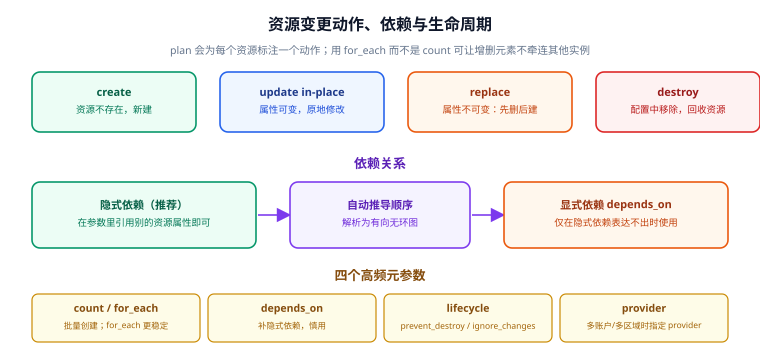

# 资源、数据源与变量

`resource` 是 Terraform 的核心——每一个 `resource` 块都对应一个**真实存在的对象**，Terraform 负责它的创建、修改与销毁。而 `data`、`variable`、`locals`、`output` 是围绕资源服务的四类"辅助块"。

本页重点讲清三件事：**资源的四类元参数怎么选**（`count` vs `for_each` 最容易用错）、**依赖关系怎么表达**、**怎么把已有资源纳管**。



## 1. 五类块的分工

| 块 | 是否创建资源 | 是否写入 state | 典型用途 |
| --- | --- | --- | --- |
| `resource` | **是** | 是 | 建 VPC / EC2 / S3 |
| `data` | 否（只读） | 是（记录查询结果） | 查最新 AMI、查现有 VPC |
| `variable` | 否 | 否 | 接收外部输入 |
| `locals` | 否 | 否 | 派生值、避免重复表达式 |
| `output` | 否 | 是（存入 state 的 outputs） | 输出 IP、供模块/上层引用 |

```hcl
# data：只读查询，不纳管
data "aws_vpc" "existing" {
  filter {
    name   = "tag:Name"
    values = ["legacy-vpc"]
  }
}

# resource：放在已存在的 VPC 里
resource "aws_subnet" "app" {
  vpc_id            = data.aws_vpc.existing.id      # 引用 data 的结果
  cidr_block        = "10.0.5.0/24"
  availability_zone = "ap-southeast-1a"
}
```

::: tip 引用语法就是依赖声明
`data.aws_vpc.existing.id` 这种"点号引用"既是取值，也是**隐式依赖**——Terraform 据此构建依赖图，保证先查 VPC 再建子网。只要能用引用表达，就不要写 `depends_on`。
:::

## 2. 资源地址与引用

| 资源写法 | 引用形式 | 说明 |
| --- | --- | --- |
| `resource "aws_instance" "web"` | `aws_instance.web.id` | 单实例 |
| 带 `count = 3` | `aws_instance.web[0].id` | 下标访问 |
| 带 `for_each = {a=..,b=..}` | `aws_instance.web["a"].id` | 键访问 |
| 模块内资源 | `module.network.vpc_id` | 通过模块 output 访问 |
| 数据源 | `data.aws_ami.ubuntu.id` | `data.` 前缀 |

```hcl
output "all_instance_ips" {
  value = aws_instance.web[*].public_ip        # splat 取全部
}
```

## 3. 四类元参数

元参数（meta-arguments）是"所有资源都支持"的特殊参数。

### 3.1 `count`：按下标批量

```hcl
resource "aws_instance" "web" {
  count         = 3
  ami           = data.aws_ami.ubuntu.id
  instance_type = "t3.micro"
  tags          = { Name = "web-${count.index + 1}" }
}
```

### 3.2 `for_each`：按 key 批量（推荐）

```hcl
variable "instances" {
  default = {
    web = "t3.micro"
    api = "t3.small"
  }
}

resource "aws_instance" "app" {
  for_each      = var.instances
  ami           = data.aws_ami.ubuntu.id
  instance_type = each.value
  tags          = { Name = each.key }
}
```

::: danger 用 `for_each` 而不是 `count`——除非你真的需要下标
1. **`count` 的中间元素被删除会牵连后面所有元素**：`count = 3` 删掉第 1 个（下标 0），原来下标 1、2 的资源会被标记为"改标签"，甚至触发重建。用 `for_each` 时每个元素有稳定 key，删掉谁只影响谁。
2. **`count` 依赖在 plan 时未知的值会报错**：`count = length(aws_instance.x)` 若 `x` 尚未创建，`count` 无法确定。`for_each` 同样要求 key 在 plan 时可确定，但实践中更稳定。
3. **`for_each` 的集合**必须是 map 或 set（不能用 list）。用 `toset([...])` 或 `{ for ... }` 转换：
   ```hcl
   # list → set
   for_each = toset(["a", "b", "c"])
   # list → map（键为元素本身）
   for_each = { for x in var.names : x => x }
   ```
4. **不要在 `for_each` 里用索引作为 key**：把 `{0 = .., 1 = ..}` 当 key 等于退回 `count` 的坑。
:::

### 3.3 `depends_on`：显式依赖（慎用）

```hcl
resource "aws_iam_role_policy_attachment" "app" {
  role       = aws_iam_role.app.name
  policy_arn = "arn:aws:iam::aws:policy/AmazonS3ReadOnlyAccess"
}

resource "aws_instance" "app" {
  # 实例启动时就会用到 S3 权限，需要用 depends_on 保证"策略先挂好"
  depends_on = [aws_iam_role_policy_attachment.app]
  # ...
}
```

::: warning `depends_on` 是"整块依赖"，会放大变更
`depends_on = [x]` 表示"x 全部相关变更完成后再处理本资源"。它无法表达"只依赖 x 的某个属性"——那种粒度请用属性引用。滥用 `depends_on` 会让 plan 里出现大量 `(known after apply)`，把整体变更顺序变得难以预测。
:::

### 3.4 `lifecycle`：控制变更行为

```hcl
resource "aws_instance" "web" {
  # ...
  lifecycle {
    create_before_destroy = true     # 先建新再删旧（减少停机）
    prevent_destroy       = true     # 禁止 destroy（防误删）
    ignore_changes        = [tags, user_data]   # 忽略这些字段的外部变动
    replace_triggered_by  = [aws_security_group.web.id]  # 该值变了就重建
  }
}
```

| 参数 | 作用 | 典型场景 |
| --- | --- | --- |
| `create_before_destroy` | 先创建替代者，再销毁旧的 | 无停机替换（需资源名可共存） |
| `prevent_destroy` | 有 destroy 计划时直接报错 | 生产数据库、状态桶 |
| `ignore_changes` | 这些属性的漂移不触发变更 | 由自动伸缩/外部系统管理的 `desired_capacity` |
| `replace_triggered_by` | 依赖项变化时强制替换 | 安全组换 ID 需重建实例 |
| `precondition` | 变更前断言 | 校验输入范围 |
| `postcondition` | 变更后断言 | 校验输出合法 |

```hcl
# 前置/后置断言（1.2+）
resource "aws_instance" "web" {
  instance_type = var.instance_type

  lifecycle {
    precondition {
      condition     = var.instance_type != "t3.micro" || var.env != "prod"
      error_message = "生产环境不允许使用 t3.micro。"
    }
  }
}
```

## 4. Provider 元参数：多区域 / 多账号

```hcl
provider "aws" {
  alias  = "tokyo"
  region = "ap-northeast-1"
}

resource "aws_s3_bucket" "log" {
  provider = aws.tokyo          # 指定用哪个 provider 实例
  bucket   = "log-tokyo-2026"
}
```

| 写法 | 说明 |
| --- | --- |
| `provider = aws.tokyo` | 指定别名 provider |
| `providers = { aws = aws.tokyo }` | 模块调用时把 provider 传进子模块 |
| `configuration_aliases` | 子模块声明"我需要一个别名叫 xxx 的 provider" |

::: info 子模块不会自动继承 alias
子模块里要用别名 provider，必须在模块内 `required_providers` 里声明 `configuration_aliases = [aws.tokyo]`，并在调用方用 `providers = { aws.tokyo = aws.tokyo }` 显式传入。否则子模块内部会用到默认 provider，导致资源建到了错误区域。
:::

## 5. provisioning 与外部脚本

```hcl
resource "aws_instance" "web" {
  ami           = data.aws_ami.ubuntu.id
  instance_type = "t3.micro"

  # 创建时执行一次（属于"建机器"，不是"配机器"）
  user_data = templatefile("${path.module}/templates/init.sh.tpl", {
    pkg = "nginx"
  })

  # 传统 provisioner：仅在建/删时跑，不参与状态收敛
  provisioner "remote-exec" {
    inline = ["sudo systemctl enable --now nginx"]
    connection {
      type        = "ssh"
      user        = "ubuntu"
      private_key = file("~/.ssh/id_rsa")
      host        = self.public_ip
    }
  }
}
```

::: danger 慎重使用 provisioner
HashiCorp 官方已明确建议：**能用 `user_data` / cloud-init 就不用 provisioner；能用配置管理工具（Ansible）就不用 `remote-exec`**。原因有三：
1. `provisioner` 的执行不被 state 跟踪，失败不影响资源状态，容易出现"资源建了但没配好"；
2. `create` 型 provisioner 只在创建时跑一次，后续配置漂移不会修复；
3. 网络不通/SSH 未就绪时容易失败，且难以重试。

**正确分工**：Terraform 负责"机器存在"，`user_data` 负责"首次引导"，Ansible 负责"持续收敛"（见 [Ansible Playbook](../../Ansible/Playbook/index.md)）。
:::

## 6. 纳管已有资源：`import`

把控制台上手工建的资源纳入 Terraform 管理，有两种写法。

```hcl
# 写法一（1.5+ 推荐）：声明式 import 块，import 与配置写在一起
import {
  to = aws_s3_bucket.legacy
  id = "legacy-bucket-name"
}

resource "aws_s3_bucket" "legacy" {
  bucket = "legacy-bucket-name"
  tags   = { ManagedBy = "terraform" }
}
```

```hcl
# 写法二（旧）：先生成配置再命令行导入
# terraform import aws_s3_bucket.legacy legacy-bucket-name
```

```shell
# 用 -generate-config-out 自动生成配置骨架（1.5+）
terraform plan -generate-config-out=generated.tf
# 检查 generated.tf，补齐缺失字段后再 apply
```

::: tip import 之后必须 `plan` 对齐
`import` 只是"把 state 指向已有资源"，**不会自动让你写的配置与真实资源一致**。导入后立刻 `terraform plan`：如果出现大量 `update`，说明你的配置与真实属性有差异，逐项对齐（或用 `ignore_changes` 暂时容忍）。真正干净的状态是 plan 输出 `No changes`。
:::

## 7. 重命名与重构：`moved` 块

把资源改个名（`aws_instance.web` → `aws_instance.app`），默认行为是"删掉旧资源、新建新资源"——这会造成线上中断。用 `moved` 块告诉 Terraform "这其实是同一个资源"：

```hcl
moved {
  from = aws_instance.web
  to   = aws_instance.app
}
```

```hcl
# 也可以搬进模块（重构为模块化时最常用）
moved {
  from = aws_instance.web
  to   = module.compute.aws_instance.web
}
```

| 场景 | 用法 |
| --- | --- |
| 改资源名 | `from = aws_instance.web` / `to = aws_instance.app` |
| 迁入模块 | `to = module.x.aws_instance.y` |
| `count` 改 `for_each` | `from = aws_instance.web[0]` / `to = aws_instance.web["a"]` |
| 模块间搬迁 | `from = module.old.aws_x.y` / `to = module.new.aws_x.y` |

::: danger `moved` 是"一次性"的，但不要立即删除
`apply` 一次后 state 已完成搬迁。多数团队会**保留 `moved` 块一段时间**（跨几个发布周期），因为不确定其他分支/环境是否还停留在旧地址。等确认所有环境都更新后再删除。
:::

## 8. 无 provider 也能跑：`terraform_data`

`terraform_data`（1.4+）是内置资源，不依赖任何 provider，常用于本地测试、触发机制与占位：

```hcl
resource "terraform_data" "trigger" {
  input = var.config_hash              # 值变化时触发 replace

  triggers_replace = [var.release_version]
}
```

| 用途 | 说明 |
| --- | --- |
| 本地验证工具链 | 不连云也能跑通 init/plan/apply |
| 触发机制 | 值变化时驱动 `depends_on` 下游重建 |
| 状态占位 | 暂时替代尚未安装的 provider |

## 9. 验证方式

```shell
mkdir tf-resource-check && cd tf-resource-check
```

```hcl [main.tf]
resource "terraform_data" "a" {
  input = "A"
}

# for_each：稳定 key
resource "terraform_data" "b" {
  for_each = toset(["x", "y", "z"])
  input    = each.key
}

# count：下标
resource "terraform_data" "c" {
  count = 2
  input = "c-${count.index}"
}

output "b_keys" { value = keys(terraform_data.b) }
output "c_ids" { value = terraform_data.c[*].output }
```

```shell
terraform init
terraform apply -auto-approve
# 预期：Resources: 6 added (1 + 3 + 2)
#      b_keys = ["x","y","z"]

terraform state list
# 预期：terraform_data.a
#      terraform_data.b["x"] / ["y"] / ["z"]
#      terraform_data.c[0] / terraform_data.c[1]

# 验证 for_each 的稳定性：删掉 "y" 再 apply
# 编辑 main.tf 把 toset(["x","y","z"]) 改为 toset(["x","z"])
terraform apply -auto-approve
# 预期：Resources: 0 added, 0 changed, 1 destroyed
#      只销毁 b["y"]，b["x"]/b["z"] 不受影响

terraform destroy -auto-approve
```

验证结果记录（**请在本地执行后填写**，当前编写环境未安装 Terraform，未实际运行）：

| 检查项 | 期望 | 实测 | 结论 |
| --- | --- | --- | --- |
| `apply` 资源数 | 6 added | 待填写 | ⏳ |
| `state list` | 6 条含 `["x"]` / `[0]` 形式 | 待填写 | ⏳ |
| 删除 `for_each` 中的键 | 只销毁 1 个 | 待填写 | ⏳ |
| `moved` 块 | 不产生 destroy/create | 待填写 | ⏳ |
| `import` 块 | plan 后无新增、可对齐 | 待填写 | ⏳ |

## 参考资料

- Resource 块参考：https://developer.hashicorp.com/terraform/language/resources
- `for_each` 与 `count`：https://developer.hashicorp.com/terraform/language/meta-arguments/for_each
- `lifecycle` 元参数：https://developer.hashicorp.com/terraform/language/meta-arguments/lifecycle
- import 与 moved：https://developer.hashicorp.com/terraform/language/import
- 上一节：[HCL 语法与表达式](../HCL/index.md)｜下一节：[State 与远程后端](../State/index.md)
- 相邻专题：[Kubernetes 资源对象](../../Kubernetes/index.md) ｜ [Docker Compose](../../Docker/ComposeAdvanced/index.md)
