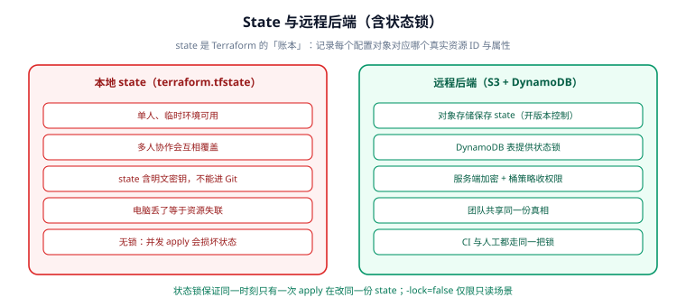

# State 与远程后端

State（状态文件）是 Terraform 的**账本**：它记录"配置文件里的每个对象，对应云上哪个真实资源、以及它的全部属性"。没有 state，Terraform 就只能看到配置，不知道"已经建了什么"，也就无法算出正确的变更。

**这一页是 Terraform 里最容易出事故的地方**——state 丢了等于资源失联，state 泄露等于密钥泄露，state 并发写等于永久损坏。



## 1. State 里到底存了什么

`terraform.tfstate` 是一个 JSON 文件，结构大致如下：

```json
{
  "version": 4,
  "terraform_version": "1.16.2",
  "serial": 12,
  "lineage": "8f1c...",
  "outputs": {
    "instance_ip": { "value": "13.250.1.10", "type": "string" }
  },
  "resources": [
    {
      "mode": "managed",
      "type": "aws_instance",
      "name": "web",
      "provider": "provider[\"registry.terraform.io/hashicorp/aws\"]",
      "instances": [
        {
          "schema_version": 1,
          "attributes": {
            "id": "i-0abc123456789",
            "public_ip": "13.250.1.10",
            "instance_type": "t3.micro",
            "tags": { "Name": "web" }
          }
        }
      ]
    }
  ]
}
```

| 字段 | 含义 |
| --- | --- |
| `serial` | 递增版本号，每写一次 +1，用于检测并发覆盖 |
| `lineage` | 状态血缘标识，跨后端迁移时保持，用于识别"同一份 state" |
| `resources[].mode` | `managed`（resource）或 `data` |
| `resources[].instances[].attributes` | 该资源的**全部属性快照**——这正是敏感信息所在 |
| `outputs` | 输出的值（模块输出会向上汇聚） |

::: danger state 里是明文
`attributes` 存的是资源的完整属性：数据库密码、RDS 连接串、TLS 私钥、IAM secret、`user_data` 里的密钥——**全部是明文**。所以：
1. 绝不能把 `terraform.tfstate` 提交到 Git；
2. 远程后端必须开**服务端加密 + 访问控制 + 版本控制**；
3. 任何"临时把 state 拷到本地看看"的操作，都等于把线上凭证拷到了个人电脑。
:::

## 2. 本地 state 的四个致命问题

| 问题 | 后果 |
| --- | --- |
| 只在某个人电脑上 | 别人拿不到 state，无法协作；电脑丢了资源失联 |
| 无锁 | 两人同时 `apply`，后写者覆盖前写者，state 与真实资源错位 |
| 明文 | 文件流出即为凭证泄露 |
| 无版本 | 误操作后无法回滚（`terraform.tfstate.backup` 只保留上一版） |

**结论：只要超过一个人操作，就必须用远程后端。**

## 3. 远程后端：S3 + DynamoDB

AWS 上最经典、也最常被复制的方案：**S3 存 state，DynamoDB 提供锁**。

```hcl [bootstrap/backend.tf（先手工建好这两个基础组件）]
provider "aws" { region = "ap-southeast-1" }

resource "aws_s3_bucket" "tf_state" {
  bucket = "my-company-tfstate-ap-southeast-1"
}

resource "aws_s3_bucket_versioning" "tf_state" {
  bucket = aws_s3_bucket.tf_state.id
  versioning_configuration { status = "Enabled" }     # 必须开版本控制
}

resource "aws_s3_bucket_server_side_encryption_configuration" "tf_state" {
  bucket = aws_s3_bucket.tf_state.id
  rule {
    apply_server_side_encryption_by_default {
      sse_algorithm = "AES256"
    }
  }
}

resource "aws_s3_bucket_public_access_block" "tf_state" {
  bucket                  = aws_s3_bucket.tf_state.id
  block_public_acls       = true
  block_public_policy     = true
  ignore_public_acls      = true
  restrict_public_buckets = true
}

resource "aws_dynamodb_table" "tf_lock" {
  name         = "terraform-locks"
  billing_mode = "PAY_PER_REQUEST"
  hash_key     = "LockID"

  attribute {
    name = "LockID"
    type = "S"
  }
}
```

业务项目里引用这个后端：

```hcl [backend.tf]
terraform {
  backend "s3" {
    bucket         = "my-company-tfstate-ap-southeast-1"
    key            = "prod/network/terraform.tfstate"   # 按环境/模块分目录
    region         = "ap-southeast-1"
    dynamodb_table = "terraform-locks"
    encrypt        = true
  }
}
```

::: tip 状态锁从"必需"变成了"默认开启"
AWS 的 S3 后端自 Terraform 1.10 起支持 **`use_lockfile = true`**，用 S3 对象的条件写（conditional write）实现锁，**不再必须依赖 DynamoDB**：

```hcl
terraform {
  backend "s3" {
    bucket       = "my-company-tfstate-ap-southeast-1"
    key          = "prod/network/terraform.tfstate"
    region       = "ap-southeast-1"
    encrypt      = true
    use_lockfile = true       # 1.10+：用 S3 自身做锁，省掉 DynamoDB
  }
}
```

**新项目建议直接用 `use_lockfile = true`**（少一个组件、少一份费用）；已有 DynamoDB 表的老项目可继续用，两种方式不要同时开。
:::

### 其他后端对比

| 后端 | 存储 | 锁 | 适合 |
| --- | --- | --- | --- |
| `s3` | S3 | DynamoDB 或 `use_lockfile` | AWS 为主的团队 |
| `gcs` | GCS | 内置 | GCP |
| `azurerm` | Azure Blob | Blob lease | Azure |
| `pg` | PostgreSQL | 表锁 | 已有 PG、想统一存储 |
| `http` | 自建 API | 需自行实现 | 自研平台 |
| `local` | 本地文件 | 无 | 学习/单机试验 |
| HCP Terraform | 托管 | 内置 | 用 HCP Terraform 的团队 |

## 4. 状态锁：为什么必须要有

```shell
# A 正在 apply，B 也想 apply
# B 会看到：
Error: Error acquiring the state lock

Error message: ConditionalCheckFailedException: The conditional request failed
Lock Info:
  ID:        9d1c...c4
  Path:      my-bucket/prod/network/terraform.tfstate
  Operation: OperationTypeApply
  Who:       alice@ci-runner-01
  Created:   2026-09-14 07:12:33.412 +0000 UTC
```

正确处理：

```shell
# ① 先确认锁的持有者是否真的还在跑
#    （看 Who / Created / Operation）
# ② 确认对方已停止（进程被杀、CI 任务已取消）后，才解锁
terraform force-unlock 9d1c...c4
```

::: danger force-unlock 的三种误用
1. **没确认就解锁**：另一个 apply 正在写 state，强制解锁后两个写操作交错 → state 永久损坏。
2. **CI 里配了自动解锁**：某些模板会在超时后自动 `force-unlock`，等于把保护关掉了。
3. **用 `-lock=false` 跑 apply**：`-lock=false` 只应用于**只读**命令（如 `plan` 在只读账户下），`apply` 加它等于主动放弃保护。
:::

## 5. state 拆分：一份还是多份

| 策略 | 做法 | 优点 | 缺点 |
| --- | --- | --- | --- |
| 单体（monolithic） | 所有资源一份 state | 引用方便、一次 apply | 改一行要 plan 全量；一个错毁全局；并发冲突多 |
| 按层拆分 | network / data / app 各一份 | 爆炸半径小、权限可分离 | 跨层引用要靠 `terraform_remote_state` 或 SSM/Consul |
| 按环境拆分 | dev / staging / prod 各一份 | 环境隔离、审批独立 | 代码需要按环境参数化（模块化收益） |
| 按团队拆分 | 每个团队各自一份 | 权责清晰 | 边界维护成本高 |

**推荐起点：按环境 + 按层拆分**，目录形如：

```text
infra/
├─ envs/
│  ├─ dev/
│  │  ├─ network/    backend key: dev/network/terraform.tfstate
│  │  ├─ data/       backend key: dev/data/terraform.tfstate
│  │  └─ app/        backend key: dev/app/terraform.tfstate
│  └─ prod/          同上，key 前缀换成 prod/
└─ modules/
   ├─ network/
   ├─ data/
   └─ app/
```

跨 state 取值的两种方式：

```hcl
# 方式一：terraform_remote_state（能取到对方全部 outputs）
data "terraform_remote_state" "network" {
  backend = "s3"
  config = {
    bucket = "my-company-tfstate-ap-southeast-1"
    key    = "prod/network/terraform.tfstate"
    region = "ap-southeast-1"
  }
}

resource "aws_instance" "app" {
  subnet_id = data.terraform_remote_state.network.outputs.private_subnet_ids[0]
  # ...
}
```

```hcl
# 方式二：参数化传入（更解耦，推荐用于模块间）
# app 的调用方把 network 的输出作为变量传进来
variable "private_subnet_ids" { type = list(string) }
```

::: warning `terraform_remote_state` 会读到敏感输出
它能读取对方 state 里的所有 output——**包括标记为 `sensitive` 的**。这意味着 app 所在 state 的读取者，间接获得了 network state 的敏感值（写进自己的 state）。若权限边界要求严格，改用 SSM Parameter Store / Consul 显式传递。
:::

## 6. `terraform state` 子命令（应急工具箱）

```shell
terraform state list                       # 列出 state 中所有对象地址
terraform state show aws_instance.web       # 查看单个资源的属性
terraform state mv aws_instance.web module.compute.aws_instance.web   # 搬迁地址
terraform state rm aws_instance.orphan      # 从 state 移除（不删除真实资源！）
terraform state pull > backup.tfstate       # 备份当前 state
terraform state push backup.tfstate         # 恢复（危险，会校验 serial/lineage）
```

| 命令 | 会改真实资源吗 | 用途 |
| --- | --- | --- |
| `state list` / `show` | 否 | 排查"这个资源被谁管理" |
| `state mv` | 否 | 改名、搬进模块（也可用 `moved` 块） |
| `state rm` | 否 | 让 Terraform"忘记"某资源，之后不再管它 |
| `state pull` | 否 | 拉取远程 state 做备份/分析 |
| `state push` | 否（但改 state） | 灾后恢复 |
| `state replace-provider` | 否 | 换 provider 源地址 |

::: danger `state rm` 不等于删除资源
`state rm` 只把资源从账本里划掉——**云上的资源还在，而且从此不受 Terraform 管理**。如果目标其实是"彻底删除"，应该从配置里删掉资源块再 `apply`。反过来，如果只是想"不再管它"，`state rm` 用完后要同时删掉对应的资源块与引用，否则下次 apply 会重新创建一份。
:::

## 7. Drift：漂移检测与处理

**漂移（drift）**指真实资源被手工改动或外部系统调整，与 state 记录不一致。

```shell
terraform plan -detailed-exitcode
# 退出码：0 = 无变更；1 = 有错误；2 = 有变更（可被 CI 用来判断是否存在漂移）

terraform plan -refresh-only
# 只刷新 state，不产生资源变更计划——看看"云上现在到底是什么样"

terraform apply -refresh-only
# 把漂移"接受"进 state（不修改云上资源）
```

| 处理策略 | 命令 | 适用 |
| --- | --- | --- |
| 让 Terraform 改回去 | `terraform apply` | 漂移是误操作，配置才是准 |
| 接受现状 | `apply -refresh-only` | 外部系统合理变更，配置应更新 |
| 只观察 | `plan -refresh-only` | 巡检、告警 |

推荐把漂移检测做成定时任务：

```shell
# 每天 09:00 巡检，有漂移就告警（CI 示例）
terraform init -input=false
terraform plan -detailed-exitcode -lock=false
case $? in
  0) echo "无漂移" ;;
  2) echo "检测到漂移，请人工确认" && exit 2 ;;   # 触发告警
  *) echo "plan 失败" && exit 1 ;;
esac
```

## 8. State 加密

| 层面 | 做法 |
| --- | --- |
| 传输中 | backend 走 HTTPS（S3/GCS 默认） |
| 静态（服务端） | S3 SSE / GCS CMEK / Azure 客户托管密钥 |
| 静态（客户端） | **OpenTofu 1.7+ 支持 state 客户端加密**（`encryption` 块 + KMS/keyprovider），加密后再上传 |

```hcl
# OpenTofu 专有：客户端 state 加密（Terraform 无此功能）
terraform {
  encryption {
    key_provider "aws_kms" "main" {
      kms_key_id = "arn:aws:kms:ap-southeast-1:123456789012:key/abcd-..."
      region     = "ap-southeast-1"
    }
    method "aes_gcm" "main" {
      keys = key_provider.aws_kms.main
    }
    state { method = method.aes_gcm.main }
    plan  { method = method.aes_gcm.main }
  }
}
```

::: info 为什么"客户端加密"是 OpenTofu 的卖点
Terraform 的 state 加密完全依赖后端（服务端加密），意味着**拥有桶读取权限的人就能读到明文**。OpenTofu 把加密提前到客户端：加密后的 state 上传，**即使桶被读走也拿不到明文**。这是两条线在安全能力上最实质的差异之一。
:::

## 9. 验证方式

用 `local` 后端做一次"远程后端语义"的演练——重点验证 state 结构、`mv`、漂移检测三者：

```shell
mkdir tf-state-check && cd tf-state-check
```

```hcl [main.tf]
terraform {
  backend "local" {
    path = "terraform.tfstate"      # 演练用；生产请换 s3 + use_lockfile
  }
}

resource "terraform_data" "keep" { input = "keep" }
resource "terraform_data" "rename_me" { input = "old-name" }
```

```shell
terraform init
terraform apply -auto-approve
# 预期：Resources: 2 added, 0 changed, 0 destroyed.

terraform state list
# 预期：terraform_data.keep
#      terraform_data.rename_me

terraform state show terraform_data.keep
# 预期：输出 input = "keep" 等属性

# 改名（不重建）：方式一 state mv
terraform state mv terraform_data.rename_me terraform_data.renamed
# 预期：Move "terraform_data.rename_me" to "terraform_data.renamed"
#      Successfully moved 1 object(s).

# 备份与结构检查
terraform state pull > backup.tfstate
python -c "import json;d=json.load(open('backup.tfstate'));print(d['serial'], [r['name'] for r in d['resources']], d['outputs'])"
# 预期：打印 serial 与资源名列表

# 漂移检测退出码
terraform plan -detailed-exitcode; echo "exit=$?"
# 预期：无变更时 exit=0
```

验证结果记录（**请在本地执行后填写**，当前编写环境未安装 Terraform，未实际运行）：

| 检查项 | 期望 | 实测 | 结论 |
| --- | --- | --- | --- |
| `apply` | 2 added | 待填写 | ⏳ |
| `state list` | 2 条 | 待填写 | ⏳ |
| `state mv` | Successfully moved | 待填写 | ⏳ |
| `state pull` | 输出合法 JSON | 待填写 | ⏳ |
| `plan -detailed-exitcode` | exit=0 | 待填写 | ⏳ |
| S3 后端 + `use_lockfile` | init 成功且无 DynamoDB | 待填写 | ⏳ |

## 参考资料

- State 概念：https://developer.hashicorp.com/terraform/language/state
- 后端配置参考：https://developer.hashicorp.com/terraform/language/backend
- S3 后端（含 `use_lockfile`）：https://developer.hashicorp.com/terraform/language/backend/s3
- `terraform state` 命令：https://developer.hashicorp.com/terraform/cli/commands/state
- OpenTofu state 加密：https://opentofu.org/docs/language/state/encryption/
- 上一节：[资源、数据源与变量](../Resource/index.md)｜下一节：[模块与注册表](../Module/index.md)
- 相邻专题：[Ansible Inventory](../../Ansible/Inventory/index.md)（机器清单与 state 的边界）｜[CI/CD 自动部署与回滚](../../../Tools/CICD/DeployRollback/index.md)
