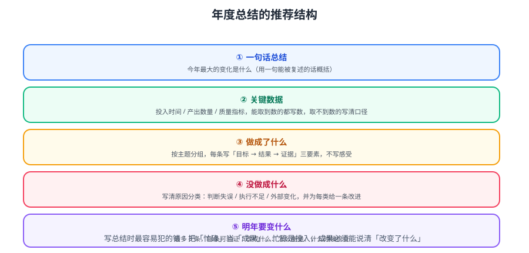

# 年度总结怎么写

年度总结**不是流水账，也不是抒情散文**。它的读者是「未来的自己 + 需要了解你的人（主管、团队、合作方）」。本篇给出可直接套用的结构、数据口径与叙事方法。



::: tip 一句话理解
好总结 = **结论先行 + 数据支撑 + 一条主线**。
读到最后，读者应该记住三件事：你完成了什么、你验证了什么判断、你明年要做什么。
:::

## 一、先定读者，再定写法

同一年的经历，写给不同的人看，结构完全不同：

| 读者 | 关心 | 篇幅 | 重点 |
| --- | --- | --- | --- |
| **未来的自己** | 教训、数据、决策依据 | 可长（3000+ 字） | 错误归因、当时判断 |
| **主管 / 团队** | 产出、影响、规划 | 800~1500 字 | 结果与价值、协作 |
| **公开分享** | 可复用的方法论 | 1500~2500 字 | 普适经验、去敏数据 |

::: warning 最常见的错误：一篇文档发给所有人
给主管看的总结里塞满「我今年读了多少本书」，对方看不到价值；
给自己的总结里删掉所有失败，明年还会再犯。
**至少写两份**：一份对外（结果导向），一份对内（教训导向）。
:::

## 二、通用结构：五段式

以下结构适合绝大多数场景，可按读者裁剪。

### 2.1 开头：一句话结论

不要用「2026 年即将过去，回顾这一年……」开头。直接给结论：

```markdown
2026 年我的主线是「从能交付，到能稳定交付」：
全年主导 3 个项目零重大事故，把发布周期从 2 周压到 3 天；
代价是前期在自动化上多投入约 80 小时，从中期开始回本。
```

一句话里包含：**主线（主题）+ 结果（数据）+ 代价（诚实）**。

### 2.2 主体：按「目标 → 结果 → 归因」组织

不要按时间顺序写（1 月做了什么、2 月做了什么），而按**目标**组织：

| 年初目标 | 结果 | 归因（做对/做错什么） |
| --- | --- | --- |
| 把发布周期压到 3 天内 | 达成，2.5 天 | 对：先做流水线缓存；错：低估了环境一致性成本 |
| 补齐可观测性 | 部分达成（指标+日志，链路未做） | 错：范围一次铺太开，应一个季度只推一项 |
| 带一个新人 | 达成 | 对：给了明确的第一周任务清单 |

::: tip 「归因」才是总结的价值所在
只写结果的是汇报，**写出归因的才是总结**。
每一条结果都追问一句：「这是运气、是能力，还是流程的作用？」——把运气归给能力，是最贵的误判。
:::

### 2.3 数据：用可核对的指标替代形容词

| 维度 | 可取的指标 | 取数来源 |
| --- | --- | --- |
| 交付 | 需求数、按期率、平均周期 | 项目工具（Jira / 飞书） |
| 质量 | 线上事故数、回滚次数、缺陷密度 | 监控 / 工单 |
| 效率 | 部署频次、构建时长、返工率 | CI/CD 记录 |
| 协作 | review 数、文档产出、被引用数 | 代码托管 / 文档库 |
| 成长 | 掌握的新技术、产出的可复用资产 | 个人记录 |

::: danger 数据口径必须先定义，否则数字会「说谎」
- 「按期率」算的是**原始承诺日期**还是**变更后日期**？两者能差 30%。
- 「事故数」算不算「已自动恢复、用户无感」的？
**做法**：在总结里直接写明口径，例如「按期率按首次承诺日期计算，不含需求变更后重新排期的」。
:::

### 2.4 反思：写「类型」而不是「个案」

个案无法复用，类型可以。把全年教训归纳成 3~5 类：

```text
教训类型①：范围贪多 —— 一个季度同时推 3 件事，结果 3 件都半途。
教训类型②：低估集成成本 —— 本地跑通 ≠ 上线跑通，总要预留联调时间。
教训类型③：文档滞后 —— 赶进度时省下的文档时间，会在交接时加倍还回去。
```

每条配一个**明年的具体对策**（不是「以后注意」，而是「以后怎么做」）。

### 2.5 结尾：明年的主线

结尾不要写「新的一年继续努力」。给出**下一年的一条主线 + 三个可验证目标**（详见 [下一年规划](../NextYearPlan/index.md)）。

## 三、叙事：把事实串成一条线

结构是骨架，叙事是血肉。三个技巧：

### 3.1 用「矛盾」开局

好的总结有一个内在张力。例如：

> 这一年我最大的收获来自一次失败：为了赶进度跳过了压测，结果大促当天数据库被打满。
> 我原以为瓶颈在应用层，数据显示瓶颈在一条没加索引的 SQL。

矛盾 → 转折 → 结论，读者自然跟着走。

### 3.2 用「对比」体现变化

| 前后对比项 | 年初 | 年末 |
| --- | --- | --- |
| 一次发布耗时 | 半天（手工） | 8 分钟（全自动） |
| 线上排查定位时间 | 平均 40 分钟 | 平均 6 分钟（有日志+链路） |
| 新项目脚手架搭建 | 2 天 | 30 分钟（模板库） |

### 3.3 用「具体细节」代替抽象形容词

| 抽象写法 | 具体写法 |
| --- | --- |
| 今年进步很大 | 把发布脚本从 300 行手工步骤改成 1 条命令 |
| 团队协作更顺畅了 | 把「口头约定」写进评审清单，返工从每周 4 次降到 1 次 |
| 学到了很多 | 读通 Netty 事件循环后，独立定位了一次连接泄漏 |

::: tip 细节来自平时的记录
写总结时最痛苦的是「想不起具体数字」。
**解法**：平时用「周记」或「变更日志」攒素材——每周 10 分钟记 3 条（做了什么 / 结果 / 意外），年底只是整理，不是回忆。
:::

## 四、可直接套用的模板

```markdown
# 2026 年度总结

## 一句话主线
（主线 + 结果数据 + 代价）

## 一、目标与结果
| 年初目标 | 结果 | 达成度 |
| --- | --- | --- |

## 二、关键数据
（交付 / 质量 / 效率 / 协作，注明口径）

## 三、做对了什么（≤ 3 条，可复用）
## 四、做错了什么（≤ 3 条，归类 + 对策）
## 五、资产沉淀
（可复用的模板、脚本、文档；明年怎么用）

## 六、明年主线与三个目标
1. …
2. …
3. …
```

## 五、写不出来时的三种解

| 症状 | 根因 | 解法 |
| --- | --- | --- |
| 对着空白页发呆 | 没有素材 | 先回去取数（见 [文档库与资产盘点](../DocsAudit/index.md)） |
| 写成了流水账 | 按时间组织 | 改成按目标组织 |
| 全是套话 | 怕暴露失败 | 先写「内部版」，只给自己看，再抽对外版 |

::: warning 别追求一次写完
建议分三轮：
1. **粗写**（1 小时）：把所有能想到的点倒出来，不管顺序。
2. **重排**（1 小时）：按五段式归类，删掉与主线无关的。
3. **精修**（1 小时）：换具体细节，砍形容词。
:::

## 相关专题

- 前置步骤（盘点资产）：[文档库与资产盘点](../DocsAudit/index.md)
- 后续步骤（定计划）：[下一年规划](../NextYearPlan/index.md)
- 复盘方法（KPT / GRAI）：[复盘方法论](../Overview/index.md)
- 实战全流程：[实战：走完一次年度复盘](../Practice/index.md)

## 参考资料

- OKR 写法与示例：https://www.whatmatters.com/faqs/okr-meaning-definition-examples
- 金字塔原理（结论先行）：https://en.wikipedia.org/wiki/Pyramid_principle
- Google SRE 事故复盘文化：https://sre.google/sre-book/postmortem-culture/
- 本专题其余章节：[年度复盘目录](../index.md)
