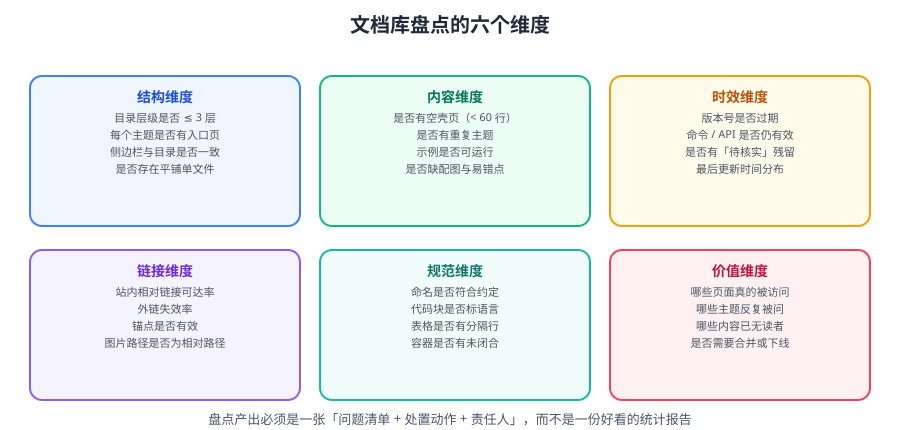

# 文档库与资产盘点

盘点的目的是**回答「我的知识和资料资产里，哪些还能用、哪些在骗我、哪些该扔」**。本篇给出六个可量化的审计维度，以及可直接运行的巡检脚本。



::: tip 一句话理解
盘点必须产出**一张问题清单 + 处置动作 + 责任人**。只统计「共有 800 篇文档」的报告，等于没盘。
:::

## 一、六个审计维度

| 维度 | 关心什么 | 可量化指标 |
| --- | --- | --- |
| **结构** | 目录层级、入口页、索引一致性 | 层级深度、缺 index 的目录数 |
| **内容** | 空壳页、重复主题、缺示例与配图 | 少于 N 行的页面数、重复标题数 |
| **时效** | 版本过期、命令失效、待核实残留 | 超期未更新数、含「待核实」数 |
| **链接** | 站内相对链接、外链、锚点、图片路径 | 断链数、图片缺失数 |
| **规范** | 命名、代码块语言、表格、容器闭合 | 违规数 |
| **价值** | 是否有人看、是否已回答过的问题 | 访问量、重复提问次数 |

::: warning 「价值维度」最难但最重要
前五个维度都可以用脚本自动检查，**只有「价值」需要判断**：
- 哪些页面半年没人打开？（可能是关键参考，也可能是死内容）
- 哪些主题被反复提问？（说明没写清或找不到）
**做法**：结合搜索日志、访问统计、以及「最近被问过的问题清单」来交叉判断。
:::

## 二、结构维度

```text
检查项：
① 每个主题目录是否有 index.md（入口页）
② 目录层级是否 ≤ 3 层（超过说明分类方式有问题）
③ 是否存在平铺的单文件页面（如 OOP.md，应改为 OOP/index.md）
④ 侧边栏/目录页的链接是否与真实文件一一对应
```

```bash
# 找出缺少 index.md 的目录
find docs -type d -not -path '*/assets*' -not -path '*/node_modules*' | while read -r d; do
  [ -f "$d/index.md" ] || echo "缺少入口页: $d"
done

# 找出超过 3 层的目录
find docs -type d -not -path '*/assets*' | awk -F/ 'NF>5 {print NF-1" 层: "$0}'

# 找出平铺的 md 文件（同级目录里直接是 .md 而不是 index.md）
find docs -name '*.md' -not -name 'index.md' -not -path '*/assets/*' | head -40
```

## 三、内容维度

| 检查项 | 判据 | 处置 |
| --- | --- | --- |
| 空壳页 | 正文少于 60 行（或少于 30 行且无示例） | 补齐或并入其他页 |
| 重复主题 | 标题相同或高度相似 | 合并，保留主页面 |
| 缺示例 | 无任何代码块 | 补可运行示例 |
| 缺配图 | 无任何图片引用 | 补示意图（SVG） |
| 缺易错点 | 无注意容器 | 补易错点小节 |

```bash
# 找出「短页面」（正文行数 < 60）
find docs -name 'index.md' -not -path '*/assets/*' | while read -r f; do
  n=$(wc -l < "$f")
  [ "$n" -lt 60 ] && printf '%4d  %s\n' "$n" "$f"
done | sort -n

# 找出没有任何代码块的页面
grep -rL '```' --include='index.md' docs | head -30

# 找出没有任何图片引用的页面
grep -rL '!\[' --include='index.md' docs | head -30

# 按标题找重复主题（同一 H1 出现多次）
grep -rh '^# ' --include='index.md' docs | sort | uniq -d
```

::: danger 「行数」只是代理指标
长文不等于好文，短文也不一定是空壳（一个精准的速查页可能只有 80 行）。
**判据应该是**：这篇文档能否满足它的**目标读者**完成一件事。
行数只用于**初筛可疑对象**，最终要人工看一眼。
:::

## 四、时效维度

| 检查项 | 命令/方法 |
| --- | --- |
| 含「待核实 / TODO / 待补充」 | `grep -rn '待核实\|TODO\|待补充\|待完善'` |
| 版本号可能过期 | 搜索版本关键字（如 `Spring 5.3`、`Node 16`）并与官方现状对照 |
| 最后更新时间分布 | 用 Git 拿到每个文件的最后提交时间 |
| 明确标记 EOL 的技术 | 搜索 `EOL\|已停止维护\|仅存量` |

```bash
# 每个文件的最后提交时间，找出最久未更新的
git ls-files 'docs/**/*.md' | while read -r f; do
  t=$(git log -1 --format=%ct -- "$f" 2>/dev/null)
  [ -n "$t" ] && printf '%s %s\n' "$t" "$f"
done | sort -n | head -30

# 一句话转成可读日期（GNU date）
git ls-files 'docs/**/*.md' | while read -r f; do
  d=$(git log -1 --format=%ad --date=short -- "$f" 2>/dev/null)
  printf '%s  %s\n' "${d:-unknown}" "$f"
done | sort | head -30
```

::: tip 「最久未更新」清单的正确用法
**不要**直接去改最老的文件——老不等于错（稳定的基础知识不需要更新）。
正确用法：把它和「时效维度」的其他信号交叉：
- 最久未更新 **且** 涉及具体版本号 → 优先核对。
- 最久未更新 **且** 是基础概念页 → 可能没问题。
- 近期更新 **但** 含「待核实」 → 优先补齐。
:::

## 五、链接维度

| 检查项 | 说明 |
| --- | --- |
| 站内相对链接 | 目标文件是否存在 |
| 图片路径 | 图片是否存在，是否用了绝对路径 `/assets/...` |
| 外链 | HTTP 状态码（可本地跑，也可放 CI） |
| 锚点 | `#小节名` 是否对得上 |

::: danger 相对链接的层数错误是本仓库最高频的问题
`../../../Foo/index.md` 与 `../../Foo/index.md` 只差一层，但前者会 404。
**对策**：把链接检查做成脚本，每次提交前跑一遍。
:::

## 六、规范维度

| 检查项 | 判据 |
| --- | --- |
| 代码块标语言 | 围栏后必须有语言标识 |
| 表格分隔行 | 表头下一行必须是 `---` 行 |
| 表格列数一致 | 每行管道数应与表头一致 |
| 容器闭合 | `:::` 成对出现 |
| 单 H1 | 每页只能有一个 `# ` |
| 命名 | 目录 PascalCase 或技术官方写法，无中文/空格 |

```bash
# 未标注语言的代码块（围栏后为空）
grep -rn '^```$' --include='*.md' docs | head -30

# 一级标题数量异常（多于 1 个）
for f in $(find docs -name 'index.md' -not -path '*/assets/*'); do
  n=$(grep -c '^# ' "$f")
  [ "$n" -gt 1 ] && echo "$n 个 H1: $f"
done

# 容器闭合检查（::: 数量应为偶数）
for f in $(find docs -name '*.md' -not -path '*/assets/*'); do
  n=$(grep -c '^::: ' "$f"); c=$(grep -c '^:::$' "$f")
  [ $((n - c)) -ne 0 ] && echo "容器可能未闭合 ($n 开 / $c 关): $f"
done
```

## 七、一键巡检脚本

把上面零散的命令合成一个脚本，产出**结构化的问题清单**。

```python
#!/usr/bin/env python3
"""docs_audit.py —— 文档库盘点巡检，输出结构化问题清单。

用法：
    python docs_audit.py --root docs --out audit-report.md
"""
from __future__ import annotations

import argparse
import re
import sys
from collections import defaultdict
from pathlib import Path

IMG_RE = re.compile(r"!\[[^\]]*\]\(([^)]+)\)")
LINK_RE = re.compile(r"(?<!!)\[[^\]]*\]\(([^)]+)\)")
STALE_WORDS = ("待核实", "TODO", "待补充", "待完善")


def collect(root: Path):
    issues: dict[str, list[str]] = defaultdict(list)
    stats = {"pages": 0, "dirs_missing_index": 0, "short": 0, "no_code": 0, "no_image": 0}

    for f in sorted(root.rglob("*.md")):
        if "assets" in f.parts or "node_modules" in f.parts:
            continue
        stats["pages"] += 1
        text = f.read_text(encoding="utf-8", errors="replace")
        lines = text.splitlines()
        rel = f.as_posix()

        # 结构：单 H1
        h1 = sum(1 for ln in lines if ln.startswith("# "))
        if h1 != 1:
            issues["单 H1"].append(f"{rel}（{h1} 个 H1）")

        # 内容：短页面 / 无代码 / 无配图
        if len(lines) < 60 and f.name == "index.md":
            stats["short"] += 1
            issues["疑似空壳页"].append(f"{rel}（{len(lines)} 行）")
        if "```" not in text:
            stats["no_code"] += 1
            issues["无代码示例"].append(rel)
        if "![" not in text:
            stats["no_image"] += 1
            issues["无配图"].append(rel)

        # 时效：待核实残留
        for w in STALE_WORDS:
            if w in text:
                issues["待核实残留"].append(f"{rel}（含 {w}）")
                break

        # 规范：未标注语言的代码块
        if re.search(r"^```\s*$", text, flags=re.M):
            issues["代码块缺语言"].append(rel)

        # 容器闭合
        opens = len(re.findall(r"^::: \S+", text, flags=re.M))
        closes = len(re.findall(r"^:::$", text, flags=re.M))
        if opens != closes:
            issues["容器可能未闭合"].append(f"{rel}（开 {opens} / 关 {closes}）")

        # 链接与图片可达性
        for m in IMG_RE.finditer(text):
            tgt = m.group(1).split()[0].strip()
            if tgt.startswith(("http://", "https://", "/")):
                if tgt.startswith("/"):
                    issues["图片使用绝对路径"].append(f"{rel} -> {tgt}")
                continue
            if not (f.parent / tgt).exists():
                issues["图片缺失"].append(f"{rel} -> {tgt}")
        for m in LINK_RE.finditer(text):
            tgt = m.group(1).split()[0].strip()
            if tgt.startswith(("http://", "https://", "#", "mailto:")):
                continue
            clean = tgt.split("#")[0]
            if not clean:
                continue
            if not (f.parent / clean).exists():
                issues["相对链接失效"].append(f"{rel} -> {tgt}")

    # 结构：目录缺入口页
    for d in sorted(p for p in root.rglob("*") if p.is_dir()):
        if "assets" in d.parts or "node_modules" in d.parts:
            continue
        if not (d / "index.md").exists() and any(d.glob("*.md")):
            stats["dirs_missing_index"] += 1
            issues["目录缺入口页"].append(d.as_posix())

    return issues, stats


def render(issues, stats) -> str:
    total = sum(len(v) for v in issues.values())
    out = ["# 文档库盘点报告", ""]
    out.append(f"- 页面总数：{stats['pages']}")
    out.append(f"- 疑似空壳页：{stats['short']}")
    out.append(f"- 无代码示例：{stats['no_code']}")
    out.append(f"- 无配图：{stats['no_image']}")
    out.append(f"- 目录缺入口页：{stats['dirs_missing_index']}")
    out.append(f"- **问题合计：{total}**")
    out.append("")
    for key in sorted(issues, key=lambda k: -len(issues[k])):
        items = issues[key]
        out.append(f"## {key}（{len(items)}）")
        out.append("")
        for it in items[:60]:
            out.append(f"- {it}")
        if len(items) > 60:
            out.append(f"- …（其余 {len(items) - 60} 项省略）")
        out.append("")
    return "\n".join(out)


def main() -> int:
    ap = argparse.ArgumentParser()
    ap.add_argument("--root", default="docs")
    ap.add_argument("--out", default="audit-report.md")
    args = ap.parse_args()

    root = Path(args.root)
    if not root.is_dir():
        print(f"目录不存在: {root}", file=sys.stderr)
        return 2

    issues, stats = collect(root)
    report = render(issues, stats)
    Path(args.out).write_text(report, encoding="utf-8")
    print(report.splitlines()[0])
    print(f"问题合计：{sum(len(v) for v in issues.values())}，报告已写入 {args.out}")
    return 0


if __name__ == "__main__":
    raise SystemExit(main())
```

```shell
python docs_audit.py --root docs --out /tmp/audit-report.md
head -40 /tmp/audit-report.md
```

## 八、处置动作与优先级

| 优先级 | 问题类型 | 处置 | 时限 |
| --- | --- | --- | --- |
| **P0** | 相对链接失效、图片缺失、容器未闭合 | 立即修（影响可用性/构建） | 本周 |
| **P1** | 空壳页、缺示例、代码块缺语言 | 补齐或合并 | 本月 |
| **P2** | 版本过期、待核实残留 | 联网核对并更新 | 本季度 |
| **P3** | 重复主题、命名不规范 | 合并 / 重命名（保留跳转） | 本季度 |
| **P4** | 无人访问的过期内容 | 归档 | 半年内 |

```text
# 问题清单的推荐格式（必须含「动作 + 责任人 + 截止」）
| # | 问题 | 类型 | 动作 | 责任人 | 截止 | 状态 |
| --- | --- | --- | --- | --- | --- | --- |
| 1 | docs/xx/A/index.md 链接失效 | P0 | 修正为 ../../yy/index.md | @me | 09-20 | 待办 |
| 2 | docs/zz/B/index.md 仅 12 行 | P1 | 补齐示例与易错点 | @me | 09-30 | 待办 |
| 3 | docs/ww/C/index.md 版本过期 | P2 | 核对官方版本并更新 | @me | 10-15 | 待办 |
```

## 九、健康度指标

| 指标 | 计算 | 目标 |
| --- | --- | --- |
| 链接可达率 | 可达链接数 ÷ 总链接数 | ≥ 99% |
| 空壳页占比 | 短页面数 ÷ 总页面数 | ≤ 2% |
| 配图覆盖率 | 有配图页面数 ÷ 总页面数 | ≥ 90% |
| 待核实残留数 | 含「待核实」的页面数 | 0 |
| 规范合规率 | 无规范问题的页面数 ÷ 总页面数 | ≥ 95% |

::: tip 把这套指标接到 CI
每次提交自动跑巡检，把「P0 类问题」作为**构建失败**条件，其余作为报告输出。
这样「盘点」就从「一年一次的突击」变成「每次提交都在做」。
:::

## 十、实战：对本仓库跑一次盘点

```shell
# ① 保存脚本
mkdir -p scripts && cp docs_audit.py scripts/

# ② 跑巡检
python scripts/docs_audit.py --root docs --out audit-report.md

# ③ 看汇总
head -12 audit-report.md

# ④ 按优先级处理，并把结论写进计划
#    P0 立即修，P1/P2 排期
```

### 验证方式

```text
1. 报告能生成
   预期：audit-report.md 存在，首行是「# 文档库盘点报告」

2. 统计口径可信
   预期：报告里的「页面总数」与 `find docs -name '*.md' | wc -l` 同量级

3. 已知问题能被检出
   操作：人为在某页写一个不存在的相对链接
   预期：报告中「相对链接失效」出现该条

4. 修复后复跑
   操作：修好该链接再跑一次
   预期：该条从报告中消失

5. 问题清单可执行
   预期：每条都写清「动作 + 责任人 + 截止」，而不是只有现象
```

## 十一、易错点汇总

::: danger 逐条对照
1. **只统计不处置**：盘点变成一份好看的报告。必须产出「动作 + 责任人 + 截止」。
2. **把「老文件」当「坏文件」**：稳定的基础概念不需要更新。要交叉其他信号。
3. **用行数当唯一判据**：精准的速查页可能很短。行数只用于初筛。
4. **不检查图片路径的绝对/相对**：绝对路径在带 base 的站点会 404。
5. **外链检查放进同步脚本**：外网抖动会导致结果不稳定。放在 CI 且允许重试。
6. **改路径不留跳转**：产生外部 404。改名前先搜引用。
7. **一次修 200 个文件**：无法评审、无法回滚。分批（每批 ≤ 10 个）。
8. **问题没有 Owner**：清单变成愿望清单。
9. **不接 CI**：一年后一切照旧。把 P0 类做成构建失败条件。
10. **盘完不更新「口径」**：明年检查项不同，无法对比趋势。
:::

## 参考资料

- Diátaxis 文档分类法：https://diataxis.fr/
- Docs as Code：https://www.writethedocs.org/guide/docs-as-code/
- markdown-link-check：https://github.com/tcort/markdown-link-check
- 本专题其余章节：[年度复盘导览](../index.md)、[知识体系重构](../KnowledgeRefactor/index.md)、[文档协作规范](../../../Tools/Collaboration/DocCollaboration/index.md)
