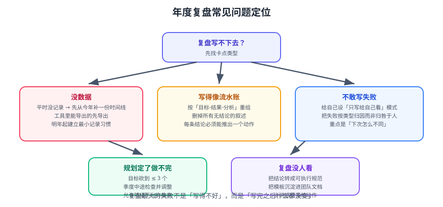

# 常见问题与最佳实践

以下是年度复盘中最常遇到的疑问，按「定位 → 原因 → 解法」组织。遇到写不下去时，先在这里找症状。



## 一、开始阶段的问题

### 1.1 完全不知道从哪里下手怎么办？

**症状**：打开空白文档，脑子一片空白。

**定位路径**：

```text
不知道从哪开始
├─ 没有数据 → 先取数（提前一周收集提交/项目/监控数据）
├─ 数据有了但没头绪 → 先做资产盘点（结构/内容/时效/链接）
└─ 盘点完还是不知道写什么 → 先列「今年最痛的三件事」
```

**解法**：不要从「写总结」开始，从**取数 + 盘点**开始。
事实清单会自然引出结论，而凭空写感受只会越写越空。

::: tip 一句话
**先做减法：数据 → 事实 → 结论。不要跳过前两步直接写结论。**
:::

### 1.2 一年过得很平淡，没有值得写的怎么办？

「平淡」通常有两种情况：

| 情况 | 判断 | 处理 |
| --- | --- | --- |
| 真的在原地 | 技能雷达与去年完全重合 | 坦诚写出「停滞」，并把「破局」定为明年主线 |
| 有变化但没记录 | 想不起细节，但职级/项目有实际推进 | 去翻提交记录、工单、邮件，用事实倒推 |

::: warning 「平淡」本身就是一个重要结论
如果确实停滞，写成励志总结才是自欺。
**正确做法**：把「为什么今年没有突破」当作核心反思——是时间被杂事占满？是没有明确目标？还是环境限制？
:::

### 1.3 复盘要花多久？能不能更快？

| 阶段 | 第一次 | 第二次起 |
| --- | --- | --- |
| 取数 | 3 小时（现建脚本） | 30 分钟（复用脚本） |
| 盘点 | 5 小时 | 2 小时 |
| 总结 | 3 小时 | 2 小时 |
| 规划 | 2 小时 | 1 小时 |
| **合计** | **~13 小时** | **~6 小时** |

提速的关键：**把脚本和模板留档**（见 [实战](../Practice/index.md) 第六节）。

## 二、盘点阶段的问题

### 2.1 文档太多，一篇篇看根本看不完

**不要逐篇读**，用脚本先做机器能做的判断：

| 机器判断 | 判据 | 人工只看 |
| --- | --- | --- |
| 空壳 | 行数 < 60 且无代码块 | 少量边界页面 |
| 过期 | 含旧版本号、旧组件名 | 确认新方案 |
| 断链 | 相对链接指向不存在文件 | 决定改指还是删链 |
| 重复 | 标题高度相似 | 判断合并方向 |

```bash
# 快速列出候选（只报告）
find docs -name '*.md' -exec sh -c 'n=$(wc -l < "$1"); [ "$n" -lt 60 ] && echo "$n $1"' _ {} \;
grep -rEn '待核实|TODO|FIXME|已废弃|deprecated' docs --include='*.md' | head -30
```

::: tip 先扫「高信号」区域
优先看：分类目录的 `index.md`（入口是否完整）、最近一个月改过的页面、你被反复问到的问题对应页面。
**不要从第一个目录按顺序扫到最后一个**——那样永远扫不完。
:::

### 2.2 每篇都觉得「以后可能有用」，删不掉

这是最典型的囤积心理。用**三个问题**强制裁决：

```text
问题①：过去 12 个月，我用过它吗？        没有 → 倾向淘汰
问题②：网上能 3 分钟搜到吗？             能 → 淘汰，不必自留
问题③：它含我自己的一手经验/数据吗？     否 → 淘汰
（三条全是否，直接淘汰；有一条为是，保留并补齐版本标注）
```

::: danger 别在生产/个人目录直接 `rm`
清理个人资料时：
1. 先出**报告清单**，不直接动手；
2. 人工确认要清理哪些；
3. **优先用回收站**（Windows 资源管理器删除 / macOS 废纸篓 / Linux `gio trash`）；
4. 分批处理，每批不超过 10 个，处理完检查一次。
:::

### 2.3 旧结论被证明是错的，要不要删？

**不要直接删，要标注更正**。理由：错误结论本身记录了「当时的判断依据」，有价值。

```markdown
> **2026-09 更正**：本文原结论「X 方案更优」已在实测中推翻，
> 原因是最初的压测未覆盖高并发写场景。正确结论见 [某主题](…)。
```

## 三、总结阶段的问题

### 3.1 数据口径不一，数字前后矛盾

**症状**：总结里说按期率 85%，附录表格算出 72%。

**根因**：口径未定义。**解法**：在第一次取数时就把口径写死：

| 指标 | 口径定义 |
| --- | --- |
| 按期率 | 按首次承诺日期，不含需求变更后重排期 |
| 事故数 | 计入 P1/P2，不含自动恢复的 P3 |
| 部署频次 | 按生产环境成功部署计，不含回滚 |

::: warning 口径要写在文档里，而不是记在脑子里
写在总结附录的「数据说明」一节。**明年复盘时，口径可对比**，否则两年的数字无法比较。
:::

### 3.2 写成流水账，读起来像工作周报合集

**症状**：按月罗列「1 月做了什么、2 月做了什么」。

**解法**：改成**按目标组织**。同一件事在不同月份的动作，归到同一个目标下。

| 错误结构 | 正确结构 |
| --- | --- |
| 1 月：搭环境 | 目标：发布自动化 |
| 2 月：写脚本 | ├─ 1 月搭环境 |
| 3 月：接 CI | ├─ 2 月写脚本 |
| | └─ 3 月接 CI（结果：部署从半天到 8 分钟） |

### 3.3 给主管看的版本和自己看的版本一样吗？

**不一样**。至少两份：

| 版本 | 读者 | 侧重 | 篇幅 |
| --- | --- | --- | --- |
| 对内（私） | 自己 | 教训、失败、真实判断 | 可长 |
| 对外（公） | 主管/团队 | 结果、价值、协作、规划 | 精简 |

::: tip 先写对内版
先写只给自己看的版本（敢写失败），再从里面**抽取**可公开的部分。
反过来（先写对外版）会不自觉地美化，导致反思失效。
:::

## 四、规划阶段的问题

### 4.1 定了目标，执行两周就荒废

**根因**：目标太大 + 没有检查点。

| 对策 | 具体做法 |
| --- | --- |
| 缩小单元 | 周任务写成「可一眼判断做没做」的动作 |
| 固定时段 | 把深度时段写进日历（重复日程） |
| 周期检查 | 每周 15 分钟 + 每月 30 分钟 + 每季度 2 小时 |
| 允许缩范围 | 进度不足时缩目标，而不是放弃 |

### 4.2 定了 10 个目标，怎样取舍？

**物理上限**：一年 52 个周末。执行 3 个目标各需 100 小时 = 300 小时 ≈ 每周末 6 小时。

::: danger 目标数量的红线
**全年主线 ≤ 1 个，季度目标 ≤ 2 个。**
超过这个数量，不是「更努力」，而是「分散到每个都做不成」。
取舍标准只有一个：**它是否服务于今年主线？**
:::

### 4.3 计划赶不上变化，还有必要定吗？

必要，但方式要改：**定方向与季度目标，不定死月度细节**。

```text
稳定层（少变）：主线、季度目标      ← 定了就守
灵活层（常变）：月度任务、周安排    ← 每周调整
```

::: info 计划的作用是「拒绝」
计划的最大价值不是预测未来，而是**提供一个拒绝无关事项的依据**。
有了主线，别人塞给你的杂活你才有底气说「这个不服务我今年的重点」。
:::

## 五、最佳实践清单

### 5.1 十条经验

1. **提前一周取数**，别指望周末现找。
2. **先事实、后感受**；先盘点、后抒情。
3. **教训归成类型**，不要停留在个案。
4. **数据先定口径**，否则数字会骗人。
5. **保留页必须补版本与复核日期**，否则明年仍是问题项。
6. **淘汰要写原因**，写不出来说明还没想清。
7. **主线只能有一个**，能用来拒绝选项。
8. **季度目标必须可演示**，不是「学了 X」。
9. **规划最后一步是写进日历**。
10. **脚本与模板留档**，让第二次复盘快一倍。

### 5.2 一次复盘的最小可行版本

时间不够时，只做这四件事：

```text
① 取三类数据：提交、项目、事故        30 分钟
② 列三个最痛的问题 + 各自对策          30 分钟
③ 写一句话主线 + 三个季度目标          30 分钟
④ 把季度检查点写进日历                 10 分钟
```

::: tip 最小版本也比不做强
完整复盘 13 小时，最小版本不到 2 小时。
**关键是养成「每年回看一次」的习惯**——习惯建立起来，深度可以逐年加。
:::

### 5.3 复盘失败的三个信号

| 信号 | 含义 |
| --- | --- |
| 总结里没有一条失败 | 在美化，反思失效 |
| 清单里有「待定」 | 没做决策，等于没盘点 |
| 计划没写进日历 | 明年大概率不会执行 |

## 相关专题

- 方法论入口：[复盘方法论](../Overview/index.md)
- 盘点维度：[文档库与资产盘点](../DocsAudit/index.md)
- 重构与取舍：[知识体系重构](../KnowledgeRefactor/index.md)
- 总结与规划：[年度总结怎么写](../AnnualSummary/index.md) · [下一年规划](../NextYearPlan/index.md)
- 完整实战流程：[实战：走完一次年度复盘](../Practice/index.md)

## 参考资料

- KPT 回顾法：https://www.atlassian.com/team-playbook/plays/retrospective
- Google SRE 无责复盘：https://sre.google/sre-book/postmortem-culture/
- PDCA 戴明环：https://asq.org/quality-resources/pdca-cycle
- 本专题其余章节：[年度复盘目录](../index.md)
