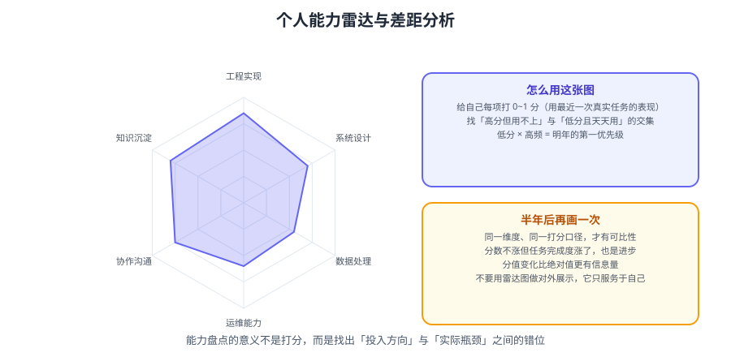

# 个人成长复盘

技术人的成长复盘要回答两个问题：**我的能力结构长什么样？我的时间真的花在主线上了吗？** 本篇给出能力雷达、时间投入分析与差距定位的具体做法。



::: tip 一句话理解
「我感觉自己进步了」不是结论，**雷达图上的短板 + 时间账本上的偏差**才是。
成长复盘的本质是：把模糊的自我感觉，换成可对比的两组坐标。
:::

## 一、能力雷达：给能力定级

先定义维度，再逐项打分。技术人可用的六维模型：

| 维度 | 含义 | 关键证据 |
| --- | --- | --- |
| **工程实现** | 写出可维护、可测试的代码 | 代码评审通过率、缺陷密度 |
| **系统设计** | 拆分复杂问题、做技术选型 | 主导过的设计文档 |
| **深度原理** | 对核心机制的掌握程度 | 能否解释「为什么」，能否排查疑难 |
| **工程效率** | 自动化、工具链、流程改进 | 部署频次、重复劳动占比 |
| **协作沟通** | 表达、推动、跨角色配合 | 推动落地的改进项数量 |
| **业务理解** | 把技术对齐到业务价值 | 参与过的需求决策 |

### 1.1 打分用「行为锚定」，不用感觉

每个等级给出**可观察的行为**，避免自评虚高：

| 等级 | 分数 | 行为锚点（以「深度原理」为例） |
| --- | --- | --- |
| 了解 | 1 | 知道概念，用过现成 API |
| 会用 | 2 | 能独立完成常规使用，能读官方文档排错 |
| 熟练 | 3 | 能定位非常规问题，能解释底层大致机制 |
| 精通 | 4 | 读过核心源码，能改，能预测边界行为 |
| 权威 | 5 | 能设计机制、能指导他人、能写出被引用的总结 |

::: warning 自评的反向偏差
大多数人**在熟悉领域高估、在陌生领域低估**。
对策：每个维度找一条「外部证据」支撑打分——一次评审意见、一次排查记录、一次分享反馈。
没有证据的分数，默认降一级。
:::

### 1.2 雷达图怎么读

把六个维度的分数画成雷达图，重点看三件事：

1. **形状**：是否有明显凹陷（短板会拖住整体）。
2. **面积**：与去年对比是否扩大（进步的量）。
3. **与目标的偏移**：明年的主线需要哪个维度突出，而现在它是否够高。

```text
示例（去年 → 今年）：
工程实现 4 → 4（停滞）
系统设计 2 → 3（进步）
深度原理 3 → 4（进步，读了 Netty / Raft）
工程效率 2 → 4（显著进步，打通 CI/CD）
协作沟通 3 → 3（停滞）
业务理解 2 → 2（停滞，明年重点）
```

::: tip 停滞也是重要信息
「工程实现停在 4」不一定是坏事——可能是**已经够用**，资源应该投到更短的那几块板上。
复盘的目的是找**性价比最高的下一块板**，不是每块都涨。
:::

## 二、时间投入分析：账要对得上

成长看结果，也看投入。用「时间账本」对照：**你说重要的，和你实际花时间做的，是不是同一件事？**

| 时间类别 | 定义 | 占比参考（工程期） |
| --- | --- | --- |
| **深度工作** | 需要连续专注的：设计、编码、调优、学习 | 30~45% |
| **协作沟通** | 会议、评审、答疑、对齐 | 20~30% |
| **救火支持** | 线上问题、临时求助 | 10~20% |
| **事务杂活** | 环境、流程、审批、填表 | 10~20% |
| **无效损耗** | 等待、返工、上下文切换 | 越低越好 |

### 2.1 取数方法：一周采样

不需要常年记录，**采样一周**就能看出结构：

```text
方法：连续 5 个工作日，每 2 小时记一次「刚在做什么 + 属于哪一类」
（用日历回看、提交记录、聊天记录交叉补全）

输出：五类占比 + 最大的时间黑洞
```

### 2.2 三类典型信号

| 信号 | 数据特征 | 含义与对策 |
| --- | --- | --- |
| **救火占比过高** | 救火 > 25% | 系统稳定性欠账，应该投自动化与监控，而非更拼命 |
| **上下文切换频繁** | 单次专注 < 30 分钟 | 会议碎片化，应设「无会议时段」 |
| **深度工作时长不足** | 深度 < 20% | 长期目标必然荒废，必须保护深度时段 |

::: danger 最常见的自我欺骗
「我今年很忙」——忙不等于有产出。
**忙如果没有结构，就是在用战术勤奋掩盖战略懒惰。**
把时间账本摊开，答案往往很扎心：大量时间花在了既不能积累、也不被认可的杂活上。
:::

## 三、差距定位：三层分析法

知道短板后，还要搞清「差在哪一层」，否则会补错方向。

| 层次 | 症状 | 补法 |
| --- | --- | --- |
| **知识缺口** | 「不知道有这个东西」 | 系统学习：读文档 / 书 / 论文 |
| **技能缺口** | 「知道但做不熟」 | 刻意练习：动手做，反复练 |
| **视角缺口** | 「会做但不知道什么时候该做」 | 见世面：参与评审、看优秀方案、复盘对比 |

::: tip 三种缺口的补法完全不同
- 知识缺口靠**输入**（读）；
- 技能缺口靠**输出**（做）；
- 视角缺口靠**对比**（看别人的方案，问「为什么这么选」）。
用「读书」去补「技能缺口」，是很多人学了很久却不会用的原因。
:::

### 3.1 用「不会—会—教」定位当前位置

| 状态 | 表现 | 下一步 |
| --- | --- | --- |
| 不会 | 遇到问题无从下手 | 补知识缺口 |
| 会但不稳 | 能做出，但依赖参考、易出错 | 刻意练习到稳定 |
| 稳但不优 | 能完成，但方案平庸 | 看优秀案例，补视角 |
| 优且能教 | 能独立设计并讲清 | 输出沉淀，形成影响力 |

## 四、成长复盘的执行流程

```text
① 定维度（6 个）          30 分钟
② 逐维度找证据打分        60 分钟
③ 画雷达，与去年对比      30 分钟
④ 采样一周时间账本        分散进行
⑤ 定位 1~2 个关键缺口     30 分钟
⑥ 把缺口写进明年季度目标  30 分钟
```

::: warning 只做一次雷达图没有意义
雷达图的价值在**对比**：与去年比（成长速度）、与目标比（方向偏差）。
所以第一次做完，**一定要存档**（连同打分证据），明年才有得比。
:::

## 五、常见误区

| 误区 | 后果 | 纠正 |
| --- | --- | --- |
| 只补短板，不看性价比 | 耗在最不重要的维度上 | 优先补「主线需要」的板 |
| 用「学了多少」当进步 | 学而不练，纸上谈兵 | 用「能做出来什么」衡量 |
| 拿别人的强项比自己弱项 | 长期焦虑 | 只和去年的自己比 |
| 记录但不行动 | 复盘变成仪式 | 每条差距必须落到季度目标 |

::: info 能力增长的真实曲线
能力提升**不是线性的**：投入期（看不到变化）→ 突破点（突然会了）→ 平台期（停滞）。
很多人在「投入期」放弃，误以为方法无效。
**对策**：以季度为观察粒度，而不是以周——周粒度看不到成长，只会看到波动。
:::

## 相关专题

- 盘点维度（含个人层）：[文档库与资产盘点](../DocsAudit/index.md)
- 把结论变成计划：[下一年规划](../NextYearPlan/index.md)
- 年度总结的写法：[年度总结怎么写](../AnnualSummary/index.md)
- 复盘方法（KPT / PDCA）：[复盘方法论](../Overview/index.md)

## 参考资料

- Dreyfus 技能获得模型（新手到专家）：https://en.wikipedia.org/wiki/Dreyfus_model_of_skill_acquisition
- 刻意练习（Deliberate Practice）：https://en.wikipedia.org/wiki/Practice_(learning_method)
- Deep Work（深度工作）：https://calnewport.com/books/deep-work/
- 本专题其余章节：[年度复盘目录](../index.md)
