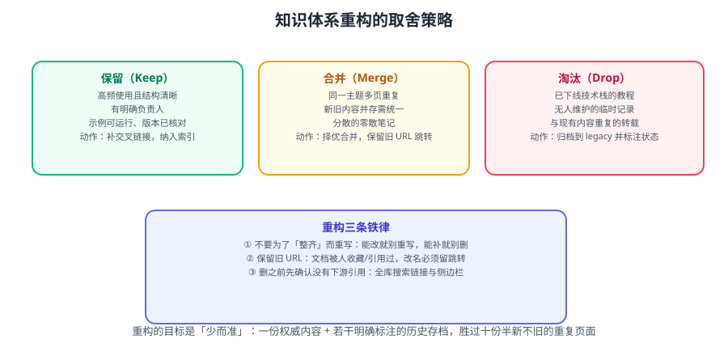

# 知识体系重构

盘点出问题清单之后，真正决定下一年效率的是**取舍**：哪些知识资产保留、哪些合并、哪些淘汰。本篇给出一套可执行的取舍策略、迁移方法与「重构后不反弹」的维护机制。



::: tip 一句话理解
知识体系的价值不在「存了多少」，而在**「要用的时候能不能在 30 秒内找到」**。
重构的唯一判据是：*这条内容，明年我会不会再用一次？*
:::

## 一、为什么知识库会越整理越乱

几乎所有个人知识库都逃不过同一个循环：

```text
收集（看到好文章就存）
  → 堆积（分类随缘，标签随手加）
  → 失效（版本过期，链接挂掉，无人维护）
  → 放弃（反正找不到，重新搜一遍）
  → 重新收集（新开一个库，循环开始）
```

根因有三个，都不在「工具」上：

| 根因 | 表现 | 对策 |
| --- | --- | --- |
| **只进不出** | 从没删过东西，库只增不减 | 每次整理必须给出淘汰清单 |
| **没有入口** | 找不到东西，只能靠搜索碰运气 | 每个主题必须有 `index.md` 目录页 |
| **混装内容与索引** | 一页里既有结论又有链接还有待办 | 内容归内容，索引归索引，待办归流程工具 |

::: warning 「多一个工具」不是解法
把内容从 A 工具搬到 B 工具，只会把「找不到」的问题平移过去。
**重构的对象是结构，不是载体**——先在当前库里把结构做对，再考虑要不要换工具。
:::

## 二、三类处置动作

盘点后每条资产只能落进三个桶之一，不允许出现「再看看」——那等于默认保留。

| 动作 | 判据 | 具体做法 |
| --- | --- | --- |
| **保留 Keep** | 明年大概率复用，且内容当前有效 | 补目录页、补版本标注、补交叉链接 |
| **合并 Merge** | 与其他条目讲同一件事，且都还有价值 | 选内容最全的作主页面，其余并入并留重定向 |
| **淘汰 Drop** | 过期失效、无人引用、网上随手可得 | 归档到 `archive/` 或直接删除，写清淘汰原因 |

### 2.1 保留：不是什么都不做

「保留」是最容易被滥用的动作。真正该保留的内容，需要满足**至少两条**：

1. **可复用**：明年做新项目时可以直接拿来改。
2. **有沉淀**：包含你自己踩过的坑、结论、数据，网上搜不到。
3. **有引用**：其他文档或项目正链接到它。

保留的同时必须补齐三样，否则明年盘点还会是问题项：

```markdown
<!-- 每篇保留页面的最小头部 -->
> 适用版本：Spring Boot 3.5.x（2026-09 核对）
> 最后复核：2026-09
> 相关：框架用法 · 配置管理
```

### 2.2 合并：重复是最好的信号

重复不是失误，而是**你不确定哪个是对的**的信号。合并时按以下顺序决策：

| 情况 | 合并方式 |
| --- | --- |
| 两篇内容互补 | 以结构更好的一篇为骨架，把另一篇的内容插进去 |
| 两篇结论冲突 | 查官方来源定论，把错的那篇整段删除并标注更正 |
| 一深一浅 | 深的保留，浅的改成「速览页」并链接到深页 |
| 一篇是另一篇的子集 | 删子集，把其中独有段落迁走 |

::: danger 合并最常犯的三个错
1. **只搬不删**：把两篇内容贴到一起，得到一篇更长的重复文档——**必须删掉冗余段落**。
2. **丢掉历史结论**：旧结论即使错了也有价值（记录「为什么当初这么想」），用 `:::details` 折叠保留。
3. **不更新引用**：被删页面的入站链接会全部失效——**合并后必须全库检索旧路径并改指新页面**。
:::

### 2.3 淘汰：写清原因才能真的放下

淘汰最容易心软。用一张「淘汰决策表」把判断外化，避免反复纠结：

| 条目 | 淘汰理由 | 是否归档 | 替代来源 |
| --- | --- | --- | --- |
| 某框架 2.x 笔记 | 项目已升 3.x，2.x 不再维护 | 归档 | 官方 3.x 文档 |
| 某工具安装备忘 | 官方一行命令搞定 | 删除 | 官方 quickstart |
| 某次临时排查记录 | 问题已根治，坐标失效 | 归档 | — |

::: warning 归档而非删除的两个例外
- 涉及**合规、事故、审计**的记录：必须保留，不能删。
- 含有**个人经验数据**（性能对比、踩坑成本）的：归档到 `archive/`，保留可检索。
其余「网上随手可得」的内容，删掉不可惜。
:::

## 三、目标结构：三层就够

个人知识库不需要复杂分类，三层足以覆盖 95% 场景：

```text
知识库/
├─ index.md              # 总入口：分类导航 + 最近更新
├─ 领域A/
│  ├─ index.md           # 领域目录页（该领域的全部子页）
│  ├─ 主题1/index.md     # 主题正文（讲透一个点）
│  └─ 主题2/index.md
└─ 领域B/
   └─ ...
```

三条硬规则：

1. **每层都有 index.md**：入口页是「能不能 30 秒找到」的关键。
2. **一个目录一个主题**：目录里塞三五件事，等于没分类。
3. **内容与索引分离**：`index.md` 只放导航，正文放在子页——避免「目录页越写越长，最后变成大杂烩」。

::: info 与本站仓库的对应
本站（docs-website）采用的正是这套结构：大类 `docs/<Category>/` → 主题 `docs/<Category>/<Topic>/` → 页面 `docs/<Category>/<Topic>/<Page>/index.md`，规则见仓库根目录 `AGENTS.md` 第 3 节。
:::

## 四、迁移方法：四条可执行步骤

重构不是「重写」，而是**分步搬迁**。推荐按下面顺序执行，任何一步出问题都可以停下回滚。

### 4.1 冻结入口

先在旧库入口贴一条「本库正在重构，请以新目录为准」，避免重构期间有人继续往旧结构里写。

### 4.2 建目标骨架

按第三节的三层结构新建空目录 + 每个目录建 `index.md` 占位，先把「房子」搭好。

### 4.3 分批搬迁，改一篇删一篇

```bash
# 用脚本辅助：找出所有待迁移的旧页面，逐条对照处理
# 注意：搬迁必须"复制 → 校验 → 删源"，不要直接移动
for f in $(find old-docs -name '*.md' -not -name 'index.md'); do
  echo "待处理: $f"
done
```

每搬完一批（建议 10 篇以内），做一次全库链接检查：

```bash
# 检查站内相对链接是否还有指向已删除文件的
grep -rEn '\]\((\.\.?/)+[^)]+\.md\)' docs --include='*.md' | head -40
```

### 4.4 补交叉链接与版本标注

这是「重构完成」与「重构有效」的分界线：没有交叉链接的知识库，仍然是一座座孤岛。

::: tip 交叉链接的最小写法
在每页末尾加一节「相关专题」，用**相对路径**指向同层的兄弟页面：

```markdown
## 相关专题

- [知识体系整理（前一版）](../../Review/KnowledgeMap/index.md)
```
VitePress 会在构建时校验相对路径，断链会在 `pnpm docs:build` 中暴露出来。
:::

## 五、不反弹的维护机制

重构一次不难，难的是明年不重来。三个机制足够：

| 机制 | 频率 | 动作 |
| --- | --- | --- |
| **随手归档** | 每次整理收件箱时 | 新内容立即归位，不留「待整理」堆 |
| **季度巡检** | 每季度 1 小时 | 跑一遍断链/空壳/过期检查脚本 |
| **年度大重构** | 每年一次 | 走完本篇全部流程，产出保留/合并/淘汰清单 |

### 5.1 季度巡检脚本示例

```bash
#!/usr/bin/env bash
# quarterly-audit.sh —— 知识库季度巡检
set -euo pipefail

echo "=== 1. 缺少入口页的目录 ==="
find docs -type d -not -path '*/assets*' | while read -r d; do
  [ -f "$d/index.md" ] || echo "  缺 index: $d"
done

echo "=== 2. 疑似空壳页（少于 60 行）==="
find docs -name '*.md' | while read -r f; do
  n=$(wc -l < "$f")
  [ "$n" -lt 60 ] && echo "  $n 行: $f"
done

echo "=== 3. 残留「待核实 / TODO」==="
grep -rEn '待核实|TODO|FIXME' docs --include='*.md' || echo "  无"

echo "=== 4. 相对链接指向的文件是否存在 ==="
# 交给构建验证：pnpm docs:build 会对相对 .md 链接做解析
echo "  请运行 pnpm docs:build 复核"
```

::: danger 巡检脚本不要用 rm 自动删
巡检只做**报告**，不自动删除。
尤其不要在个人目录上用 `rm -rf` 批量清理——先人工确认清单，再分批处理，并优先用回收站而非直接删除。
:::

## 六、实战：一次重构的动作清单

以本站某次主题收敛为例（把两个重复的日志相关页面合并为一个专题）：

| 步骤 | 具体动作 | 验证 |
| --- | --- | --- |
| ① 定位重复 | 检索「Promtail / Filebeat / ELK」命中的页面 | 得到 8 处引用 |
| ② 定主页面 | 新专题内容最全，定为主页面 | — |
| ③ 收敛旧页 | 旧页改为速览页并链接新专题 | 页面能跳转 |
| ④ 改引用 | 全库把旧采集器示例改为新采集器 | `grep` 无残留 |
| ⑤ 补入口 | 目录页 + 侧边栏补入口 | 侧边栏可见 |
| ⑥ 构建验证 | `pnpm docs:build` | 无报错 |

## 相关专题

- 盘点维度与巡检脚本：[文档库与资产盘点](../DocsAudit/index.md)
- 复盘方法（KPT / GRAI / PDCA）：[复盘方法论](../Overview/index.md)
- 知识体系整理（前一版）：[知识体系整理](../../Review/KnowledgeMap/index.md)
- 文档协作与命名规范：[文档协作规范](../../../Tools/Collaboration/DocCollaboration/index.md)

## 参考资料

- PARA 方法（Projects / Areas / Resources / Archives）：https://fortelabs.com/blog/para/
- Zettelkasten 卡片盒笔记法：https://zettelkasten.de/introduction/
- Diátaxis 文档分类法（教程/指南/参考/解释）：https://diataxis.fr/
- 本专题其余章节：[年度复盘目录](../index.md)
