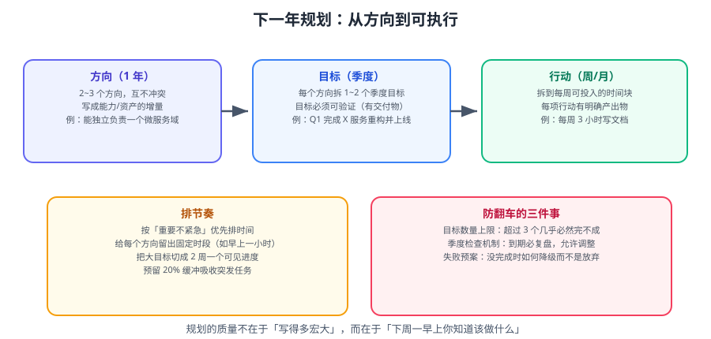

# 下一年规划

复盘的最后一步是**把结论变成行动**。本篇给出一套「方向 → 季度目标 → 周行动」的拆解方法，以及让计划不荒废的检查机制。



::: tip 一句话理解
计划失败几乎都不是「不够努力」，而是**目标太大、太模糊、没人检查**。
本篇的三板斧：**≤ 3 个目标、可验证、写进日历**。
:::

## 一、为什么计划总是年中荒废

| 症状 | 根因 | 对策 |
| --- | --- | --- |
| 年初立 10 个 flag，3 月就忘 | 目标超过承载量 | 全年主线 ≤ 3 个 |
| 「提升架构能力」永远无法验收 | 目标不可验证 | 改成「独立完成一次架构评审」 |
| 定了但从不回看 | 没有检查机制 | 4 个季度检查点写进日历 |
| 被日常淹没 | 没有为长期目标预留时间 | 每周固定 1~2 个「深度时段」 |

::: warning 目标数量的物理上限
一年 52 个周末。若一个目标需要 100 小时，3 个就是 300 小时 ≈ 每个周末 6 小时。
**再往上加，得到的不是产出，而是焦虑**。
宁少勿多：**2 个做透 > 5 个都半途**。
:::

## 二、第一层：定方向（1 个主线）

主线回答「明年我要成为什么样的人 / 把什么能力做扎实」。它是一次性判断，但决定所有目标的取舍。

| 主线类型 | 例子 | 适合阶段 |
| --- | --- | --- |
| **深度型** | 「把分布式一致性真正搞懂」 | 已有基础，要突破瓶颈 |
| **广度型** | 「补齐云原生全链路」 | 转岗、换方向 |
| **产出型** | 「沉淀一套可复用的脚手架」 | 想扩大影响力 |
| **平衡型** | 「把加班压下来，恢复学习节奏」 | 倦怠期 |

::: tip 主线要能「一句话否掉选项」
判断主线是否合格的方法：**它能不能帮你拒绝一件事**。
「提升技术能力」不能拒绝任何事；「把分布式一致性搞懂」能让你拒绝掉一个不相关的副业邀请——这才是好主线。
:::

## 三、第二层：定季度目标（每季度 1~2 个）

把主线拆到季度。每个季度目标必须满足 **SMART** 中的最关键两条：**可衡量、有时限**。

| 主线 | Q1 | Q2 | Q3 | Q4 |
| --- | --- | --- | --- | --- |
| 搞懂分布式一致性 | 读完 Raft 论文 + 手写选举 | 实现 KV 存储的 Raft 日志复制 | 做一次故障注入实验并复盘 | 输出一篇原理长文 |
| 沉淀脚手架 | 抽出通用模块 | 补齐配置与日志 | 写文档 + 单测到 70% | 在 2 个真实项目试用 |

拆解时的三条规则：

1. **季度目标是「可演示的」**：季末能拿出一个东西（代码、文档、实验报告），而不是「学了 X」。
2. **前后有依赖**：Q2 建立在 Q1 之上，避免每季度从零开始。
3. **留缓冲**：4 个季度里只安排 3 个满负荷，留 1 个季度应对意外——否则一次生病就全盘崩。

### 3.1 季度目标检查清单

```text
□ 季末能演示什么？（一句话说清）
□ 怎么判断做到了？（可量化 or 可验收）
□ 它和主线的关系是什么？（不是可有可无）
□ 需要谁配合？（提前打招呼）
□ 最可能卡在哪里？（提前准备对策）
```

## 四、第三层：拆到周行动

季度目标太大，必须拆到「每周能推进一点」。用**倒推法**：

```text
季度目标：实现 KV 存储的 Raft 日志复制
  ← 月 3：通过多节点一致性测试
  ← 月 2：实现日志复制与提交
  ← 月 1：实现 Leader 选举
     ← 周 4：选举超时与随机化
     ← 周 3：RequestVote RPC
     ← 周 2：节点状态机
     ← 周 1：读论文 + 画状态图
```

::: tip 用「最小可推进单元」代替「宏大任务名」
不要写「本周学 Raft」，写「本周画出 Raft 的 3 个状态转换图，并列出每个转换的触发条件」。
**任务名越具体，越不可能拖**——因为「做没做」一眼可判断。
:::

### 4.1 每周固定动作

| 动作 | 时长 | 时间点 |
| --- | --- | --- |
| 深度时段（推进主线） | 2 × 2 小时 | 周二 / 周四晚 |
| 周复盘（对齐季度目标） | 15 分钟 | 周日晚 |
| 调整下周任务 | 10 分钟 | 周日晚 |

## 五、检查机制：让计划活下来

计划死于「无人检查」。三个检查点按粒度递增：

| 检查点 | 频率 | 动作 | 失败信号 |
| --- | --- | --- | --- |
| 周复盘 | 每周 15 分钟 | 本周围绕季度目标做了什么？ | 连续 2 周为 0 |
| 月度对齐 | 每月 30 分钟 | 季度进度是否过半？要不要缩范围？ | 进度 < 1/3 |
| 季度评审 | 每季度 2 小时 | 目标达成 / 放弃？下季度改什么？ | 连续 2 季度未达成 |

::: warning 「缩范围」不丢人，「硬扛」才丢人
如果一个季度过半而进度不足 1/3，正确动作是**缩小范围**（比如把「Raft 全功能」降级为「Raft 选举」），
而不是继续原计划然后全面崩盘。**能把目标调整到完成，本身是一种能力**。
:::

### 5.1 记录进度：一张表就够

```markdown
| 季度 | 目标 | 关键结果 | 进度 | 状态 |
| --- | --- | --- | --- | --- |
| Q1 | 实现 Leader 选举 | 3 节点选出唯一 Leader | 100% | 达成 |
| Q2 | 实现日志复制 | 数据强一致 | 60% | 进行中 |
```

## 六、把技能目标拆成学习路径

技术类目标最容易「只看不做」。用下面的路径保证有产出：

| 阶段 | 动作 | 产出 | 时长参考 |
| --- | --- | --- | --- |
| 1. 建立框架 | 读 1 篇综述 / 官方文档总览 | 一张概念图 | 3~5 小时 |
| 2. 精读核心 | 读关键论文 / 源码主流程 | 读书笔记 | 10~20 小时 |
| 3. 动手实现 | 写一个最小可运行版 | 可运行代码 | 20~40 小时 |
| 4. 制造故障 | 注入错误，观察行为 | 排查记录 | 5~10 小时 |
| 5. 输出沉淀 | 写成文档 / 分享 | 一篇文章 | 5~10 小时 |

::: info 「输出」是检验是否真懂的唯一标准
能讲清楚、能写出来，才算真的掌握。**把「输出」写进季度目标**（不是可选项），
否则很容易停在「感觉自己懂了」。
:::

## 七、与复盘闭环

规划不是终点，而是下一轮复盘的起点：

```text
年度复盘（找问题）
  → 定主线
    → 拆季度目标
      → 周末行动
        → 周/月/季检查
          → 年底再复盘（用检查记录当数据）
```

::: tip 检查记录 = 明年的复盘素材
每周 15 分钟的复盘记录，攒一年就是**最好的年度复盘数据源**。
它记录了当时的判断、卡点与调整——比年底回忆准确得多。
:::

## 相关专题

- 规划的输入（年度总结）：[年度总结怎么写](../AnnualSummary/index.md)
- 上一层方法（复盘）：[复盘方法论](../Overview/index.md)
- 个人能力分析：[个人成长复盘](../GrowthReview/index.md)
- 实战全流程：[实战：走完一次年度复盘](../Practice/index.md)
- 目标拆解到研发流程：[研发流程](../../../Tools/Collaboration/RdProcess/index.md)

## 参考资料

- OKR 目标写法：https://www.whatmatters.com/faqs/okr-meaning-definition-examples
- SMART 原则：https://en.wikipedia.org/wiki/SMART_criteria
- 倒推法（Backcasting）：https://en.wikipedia.org/wiki/Backcasting
- 本专题其余章节：[年度复盘目录](../index.md)
