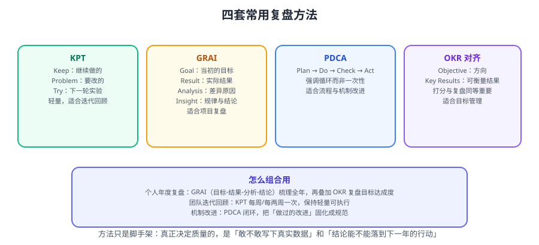

# 复盘方法论

复盘（Retrospective / Postmortem）的核心不是「总结过去」，而是**从过去的事实中提取可复用的规律，并把它变成下一次的行动**。本篇给出四套成熟方法及其组合用法。



::: tip 一句话理解
复盘 = **事实 → 归因 → 规律 → 行动**。任何停在「归因」或「感受」的复盘，都不会改变下一年。
:::

## 一、复盘的三个前提

| 前提 | 说明 | 不满足的后果 |
| --- | --- | --- |
| **事实优先** | 先摆数据与时间线，再谈评价 | 变成主观印象的争论 |
| **口径固定** | 指标定义写下来，全年不变 | 数字可比性消失 |
| **心理安全** | 允许写失败，不追究个人 | 得到一份「美化过的」复盘 |

::: danger 「心理安全」不是客气，是数据质量的前提
如果写失败会被追责，人只会写「客观原因」和「外部变化」。
**做法**：
1. 明确「复盘针对机制，不针对个人」。
2. 失败按**类型**归因（判断失误 / 执行不足 / 外部变化），而不是按人。
3. 个人总结可以只给自己看；只有「改进项」需要对外。
:::

## 二、四套方法

### 2.1 KPT：轻量迭代回顾

| 字母 | 含义 | 问什么 |
| --- | --- | --- |
| **K**eep | 保持 | 哪些做法有效，继续做？ |
| **P**roblem | 问题 | 哪些做法无效，要改？ |
| **T**ry | 尝试 | 下一轮想试什么新做法？ |

```text
适用：每两周的迭代回顾、项目阶段性回顾
时长：30~60 分钟
输出：Keep 清单（沉淀成规范）、Problem 清单（选 1~2 条改）、Try 清单（小步验证）
```

::: warning KPT 最常见的失败
把 Problem 列了 20 条，Try 写了 10 条，最后一条都没做。
**约束**：Try 一次最多 2 条，每条必须有负责人与验证方式。
:::

### 2.2 GRAI：项目/年度复盘

| 字母 | 含义 | 内容 |
| --- | --- | --- |
| **G**oal | 回顾目标 | 当初设定的目标是什么（要引用当时的原文） |
| **R**esult | 评估结果 | 实际达成如何（用数据） |
| **A**nalysis | 分析原因 | 差异的根因是什么（分类型） |
| **I**nsight | 提炼规律 | 得出了什么可复用的结论 |

```text
适用：项目复盘、年度复盘
关键点：Goal 必须引用「当时写下的原话」，否则会产生「我本来就想做这个」的事后合理化
```

::: tip GRAI 最有价值的是「对照」
把「当时的目标原文」和「实际结果」并列摆出来，差距才会显形。
建议在年初把目标**写进一个固定文件**（不要只在脑子里），年末直接对照。
:::

### 2.3 PDCA：机制改进

```text
Plan（计划）→ Do（执行）→ Check（检查）→ Act（改进）
       ↑                                      │
       └──────────────────────────────────────┘
```

| 阶段 | 动作 | 常见偏差 |
| --- | --- | --- |
| Plan | 定目标与衡量方式 | 目标不可衡量 |
| Do | 执行并记录 | 不记录过程，事后无法归因 |
| Check | 对照目标看差距 | 只看结果不看过程 |
| Act | 固化成功做法 / 修正失败做法 | 「改进」只停留在口头 |

**PDCA 和 KPT/GRAI 的区别**：KPT/GRAI 是「回顾一次事件」，PDCA 是「持续改进一个机制」。年度复盘里，PDCA 用于**流程类改进**（如「如何减少返工」）。

### 2.4 OKR 回顾

| 要素 | 说明 |
| --- | --- |
| Objective | 定性的方向 |
| Key Results | 可衡量的结果（2~4 个） |
| 打分 | 通常 0~1 分或 0~100；0.7 左右算健康 |
| 复盘 | 打分不是终点，重点是「为什么是 0.4 而不是 0.8」 |

```text
# OKR 复盘的三问
① 哪些 KR 达成了？达成的原因是什么（可复用的做法）？
② 哪些没达成？是目标定得太高，还是执行路径错了？
③ 明年同类目标应该怎么定（保守/激进/换路径）？
```

::: danger OKR 的两个致命误用
1. **当 KPI 考核**：一旦与绩效挂钩，KR 会变成「容易达成的数字」。
2. **全是 KR 没有 O**：只写「发布 12 个版本」，不写「为什么」，方向感消失。
:::

## 三、怎么组合

| 场景 | 主方法 | 辅助 | 输出 |
| --- | --- | --- | --- |
| 每两周迭代回顾 | KPT | — | Try（≤2 条） |
| 项目结束 | GRAI | KPT 收尾 | 项目复盘文档 + 改进项 |
| 年度个人复盘 | GRAI + OKR 回顾 | PDCA | 年度总结 + 下一年规划 |
| 文档库/资产盘点 | PDCA | 清单法 | 保留/合并/淘汰清单 |
| 故障复盘 | 时间线 + 5 Why | PDCA | 故障报告 + 改进项 |

```text
# 推荐的年度复盘组合流程
① GRAI 梳理全年（对抗「凭感觉」）
② OKR 回顾目标达成度（对抗「目标漂移」）
③ 资产盘点（对抗「重复造轮子」）
④ 用 KPT 收尾，把结论转成 ≤3 条改进项（对抗「复盘没有行动」）
⑤ 用 PDCA 把改进项拆到季度（对抗「明年再说」）
```

## 四、复盘的六个步骤

```text
① 收集事实
   数据源：Git 提交、事项系统、监控告警、日历、笔记、周报
   产出：一份原始数据清单

② 重建时间线
   按月（或按项目）列出「发生了什么」
   关键：只写事实，不写评价

③ 对照目标
   找出年初写下的目标原文，逐条对照达成情况

④ 归因分类
   把「没做到」按类型归类：判断失误 / 执行不足 / 外部变化 / 资源不足
   每一类各配一条应对策略

⑤ 提炼规律
   把具体事件抽象成可复用的判断
   反例：「这次接口超时是因为没加索引」→ 太具体
   正例：「凡是新接口上线，必须先用真实数据量压测」→ 可复用

⑥ 转成行动
   最多 3 条，每条写清：改成什么、怎么衡量、什么时候检查
```

::: danger 「归因」最容易走偏的两个方向
1. **全部归为外部原因**：得到「运气不好」的结论，明年不会有任何改变。
2. **全部归为个人努力不够**：得到「我不够努力」的结论，除了内耗没有产出。
**正解**：按类型归因，并区分「可控」与「不可控」——只对可控项定对策。
:::

## 五、数据从哪来

| 数据源 | 能取到什么 | 取数方式 |
| --- | --- | --- |
| **Git 提交记录** | 提交量、活跃时段、项目分布 | `git log` 统计 |
| **事项系统（Jira）** | 完成数、周期时间、缺陷数 | JQL 导出 |
| **监控与告警** | 故障次数、可用性、变更次数 | 监控平台导出 |
| **日历** | 会议时长、时间分配 | 导出或人工统计 |
| **笔记 / 周报** | 当时的判断与困惑 | 人工翻阅 |
| **文档库 / 知识库** | 产出数量、更新频率 | 文件统计脚本 |
| **账单 / 工具订阅** | 花了钱的项目 | 账单记录 |

```shell
# 示例：用 Git 统计一年的提交分布
git log --since="2026-01-01" --until="2026-12-31" --pretty=format:'%ad' --date=format:'%Y-%m' \
  | sort | uniq -c | sort -k2
# 输出：每个月的提交次数

# 按项目统计
for d in ~/projects/*/; do
  n=$(git -C "$d" log --since="2026-01-01" --oneline 2>/dev/null | wc -l)
  printf '%6d  %s\n' "$n" "$(basename "$d")"
done | sort -rn
```

::: tip 没数据怎么办
第一次复盘常常「无数据可用」。这时候**不要跳过**，而是：
1. 先用「人工重建」：翻日历、翻笔记、翻聊天记录，重建一份粗时间线。
2. 同时**建立明年的最小记录习惯**（见下）。
3. 在总结里注明「本年度数据为事后重建，口径不统一，明年起统一」。
:::

```text
# 明年的最小记录习惯（只要三样，负担极低）
① 每周五写 5 行：本周做了什么、卡在哪、下周计划
② 每月末把「本周5行」合并成一段 200 字小结
③ 每季度做一次 30 分钟 KPT
一年后你会有：52 周记录 + 12 段小结 + 4 次回顾
```

## 六、常见错误

| 错误 | 后果 | 对策 |
| --- | --- | --- |
| 从感受开始写 | 变成抒情，无行动 | 先摆事实与时间线 |
| 目标事后合理化 | 无法发现判断失误 | 年初把目标写进固定文件 |
| 归因不分类型 | 结论不可用 | 分「判断/执行/外部/资源」四类 |
| 改进项写成口号 | 明年无变化 | 每条含「做什么、怎么衡量、何时检查」 |
| 改进项超过 3 条 | 一条都做不到 | 上限 3 条 |
| 只写个人层 | 忽略机制问题 | 三层都盘 |
| 一年只做一次 | 中途无法纠偏 | 加季度 30 分钟小复盘 |
| 数据口径中途改变 | 无法对比 | 口径写进文档并固定 |

## 七、一页纸复盘模板

```markdown
# 年度复盘（2026）

## 一、事实与数据
- 交付：完成事项 X 个，上线版本 Y 个
- 质量：故障 Z 次，平均恢复时间 W 分钟
- 投入：会议 X 小时，编码 Y 小时
- 资产：新增文档 X 篇，归档 Y 篇

## 二、目标对照（引用年初原文）
| 年初目标 | 实际结果 | 达成度 | 差异类型 |
| --- | --- | --- | --- |
| ... | ... | 80% | 执行不足 |

## 三、归因分类
- 判断失误：（列 1~3 条）
- 执行不足：（列 1~3 条）
- 外部变化：（列 1~2 条）
- 资源不足：（列 1~2 条）

## 四、提炼规律（可复用）
1. ...
2. ...

## 五、明年行动（≤3 条）
| 行动 | 衡量方式 | 检查时间 |
| --- | --- | --- |
| ... | ... | Q1 末 |

## 六、待处理的资产清单
见 [文档库与资产盘点](../DocsAudit/index.md)
```

## 八、验证方式

```text
复盘结束后，用这 5 条自检：
1. 目标对照表里是否有「引用年初原文」的列？
   —— 没有，说明可能有事后合理化
2. 归因是否分成了 4 类，且每类都配了对策？
   —— 没有，说明归因不完整
3. 提炼出的规律是否「脱离本次事件也成立」？
   —— 只适用于本次事件，说明太具体
4. 行动项是否 ≤3 条，且每条都有衡量方式与检查时间？
   —— 没有，明年一定会荒废
5. 是否已经写进日历的季度检查？
   —— 没有，等于没有规划
```

## 参考资料

- PDCA（ASQ）：https://asq.org/quality-resources/pdca-cycle
- Atlassian 回顾会指南：https://www.atlassian.com/team-playbook/plays/retrospective
- OKR 常见问题：https://www.whatmatters.com/faqs
- Google SRE 复盘文化：https://sre.google/sre-book/postmortem-culture/
- 本专题其余章节：[年度复盘导览](../index.md)、[文档库与资产盘点](../DocsAudit/index.md)、[下一年规划](../NextYearPlan/index.md)
