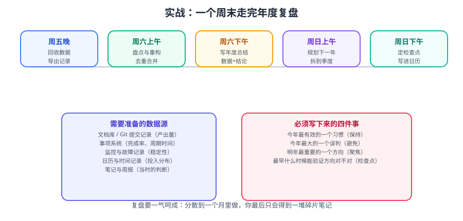

# 实战：走完一次年度复盘

本篇把前面几篇的方法串成**一次可在周末两天内跑完的完整流程**，每一步都给出可复制的命令、模板与验收标准。



::: tip 一句话目标
跑完之后，你手里应该有**四份文件**：
数据汇总、问题与处置清单、年度总结、下一年规划。
缺任何一份，这次复盘都不算完成。
:::

## 〇、准备：需要提前一周做的事

复盘最难的是「数据不在手边」。提前一周开始收集，周末才能专注分析。

| 数据源 | 要什么 | 怎么取 |
| --- | --- | --- |
| **代码托管** | 提交数、PR 数、代码行变化 | `git log` 统计脚本 |
| **项目工具** | 需求数、按期率、issue 关闭数 | Jira / 飞书多维表格导出 |
| **CI/CD** | 部署频次、构建时长、失败率 | 流水线记录导出 |
| **监控** | 线上事故数、告警数、恢复时长 | Prometheus / 告警平台 |
| **日历** | 会议时长、深度时段占比 | 日历导出 |
| **文档库** | 新增/更新页面数、被引用数 | 仓库 git 统计 |

::: warning 别在周末现补数据
周末现取数据，会有三成数据「查不到了」（工具权限过期、导出限额、记录过期）。
**提前一周把原始数据落到一个 `data/` 目录**，周末只做分析。
:::

## 一、Day 1 上午：取数与建目录

### 1.1 建本次复盘的目录

```bash
mkdir -p review-2026/{data,notes,output}
cd review-2026
touch data/README.md notes/raw.md output/01-问题与处置清单.md \
      output/02-年度总结.md output/03-下一年规划.md
```

目录约定：

```text
review-2026/
├─ data/      # 原始数据（导出文件，只读）
├─ notes/     # 过程笔记、临时想法
└─ output/    # 最终四份产出
```

### 1.2 用脚本汇总代码与提交数据

```bash
#!/usr/bin/env bash
# collect-git.sh —— 汇总一年的提交与改动规模
set -euo pipefail

REPO="${1:-.}"
SINCE="2026-01-01"
UNTIL="2026-12-31"

echo "=== 提交总数 ==="
git -C "$REPO" log --since="$SINCE" --until="$UNTIL" --oneline | wc -l

echo "=== 按月份统计提交数 ==="
git -C "$REPO" log --since="$SINCE" --until="$UNTIL" \
  --date=format:'%Y-%m' --pretty=format:'%ad' | sort | uniq -c

echo "=== 改动文件数 Top 20（最常动的模块）==="
git -C "$REPO" log --since="$SINCE" --until="$UNTIL" \
  --name-only --pretty=format: | sort | uniq -c | sort -rn | head -20

echo "=== 我的提交数 ==="
git -C "$REPO" log --since="$SINCE" --until="$UNTIL" \
  --author="$(git -C "$REPO" config user.name)" --oneline | wc -l
```

预期输出示例：

```text
=== 提交总数 ===
412
=== 按月份统计提交数 ===
     28 2026-01
     35 2026-02
   ...
=== 改动文件数 Top 20（最常动的模块）===
     57 src/order/service/OrderService.java
     41 src/common/utils/DateUtils.java
```

::: tip 「改动最频繁的文件」是宝藏信号
改动次数异常高的文件，通常意味着**设计有问题**（职责不清、频繁变更）。
把 Top 5 记进过程笔记，这是明年重构的输入。
:::

### 1.3 手工补全「无法自动取数」的部分

| 项目 | 记录方式 |
| --- | --- |
| 关键决策 | 「某月决定引入 X，因为……」 |
| 重大事故 | 时间、影响、根因、改进项 |
| 意外收获 | 顺手做成、但价值很高的东西 |

## 二、Day 1 下午：盘点与定位问题

### 2.1 跑一次资产巡检

按 [文档库与资产盘点](../DocsAudit/index.md) 与 [知识体系重构](../KnowledgeRefactor/index.md) 的脚本做结构巡检：

```bash
#!/usr/bin/env bash
# audit-docs.sh —— 文档库结构巡检（只报告，不修改）
set -euo pipefail

echo "=== 缺少 entry（index.md）的目录 ==="
find docs -type d -not -path '*/assets*' | while read -r d; do
  [ -f "$d/index.md" ] || echo "  $d"
done

echo "=== 疑似空壳页（< 60 行）==="
find docs -name '*.md' | while read -r f; do
  n=$(wc -l < "$f")
  [ "$n" -lt 60 ] && echo "  $n 行: $f"
done

echo "=== 残留待办标记 ==="
grep -rEn '待核实|TODO|FIXME' docs --include='*.md' || echo "  无"
```

::: danger 巡检脚本一律只读
**不要让巡检脚本自动删除任何文件**，尤其不要对个人目录使用 `rm -rf`。
正确做法：脚本产出问题清单 → 人工确认 → 分批（每批 ≤10 个）用回收站处理。
:::

### 2.2 产出「问题与处置清单」

把巡检结果 + 过程笔记合并成一张表，**每条必须有处置动作**：

```markdown
# 2026 问题与处置清单

| # | 类别 | 问题 | 影响 | 处置动作 | 优先级 |
| --- | --- | --- | --- | --- | --- |
| 1 | 资产 | 3 个主题缺目录页 | 找不到内容 | 补 index.md | 高 |
| 2 | 时效 | 8 处仍引用已废弃组件 | 误导 | 全库替换为现行方案 | 高 |
| 3 | 结构 | 某目录平铺 12 个 md | 难维护 | 迁为「目录 + index.md」 | 中 |
| 4 | 重复 | 两篇讲同一件事 | 维护成本翻倍 | 合并，保留主页面 | 中 |
| 5 | 内容 | 5 页不足 60 行 | 未完成 | 补齐或并入 | 低 |
```

验收标准：**清单里没有「待定」「再看看」这类状态**。

## 三、Day 2 上午：写年度总结

按 [年度总结怎么写](../AnnualSummary/index.md) 的五段式分三轮写：

| 轮次 | 时长 | 动作 | 完成标志 |
| --- | --- | --- | --- |
| 粗写 | 1 小时 | 把所有点倒出来 | 不分顺序，能写满即可 |
| 重排 | 1 小时 | 按「目标→结果→归因」归类 | 主线一条，目标 ≤ 5 条 |
| 精修 | 1 小时 | 换具体细节，砍形容词 | 数据有口径，结论有一句话 |

写作时反复自检：

```text
□ 开头第一段有没有「一句话主线」？
□ 每个目标是否有可核对的数据？
□ 教训是否归纳成「类型」并配了对策？
□ 有没有删掉与主线无关的内容？
```

## 四、Day 2 下午：定下一年规划

按 [下一年规划](../NextYearPlan/index.md) 拆三层：

1. **主线**：1 个，能用来拒绝选项。
2. **季度目标**：每季度 1~2 个，且可演示。
3. **周行动**：把 Q1 第一个月拆到周。

```markdown
# 2027 规划

## 主线
把分布式一致性与可观测性做扎实（能独立设计与排障）。

## 季度目标
| 季度 | 目标 | 验收方式 |
| --- | --- | --- |
| Q1 | 手写 Raft 选举 | 3 节点稳定选出 Leader |
| Q2 | 日志复制 + 强一致读 | 通过一致性测试 |
| Q3 | 故障注入实验 | 一份实验报告 |
| Q4 | 输出原理长文 | 一篇可发布文章 |

## 周行动（Q1 第 1 月）
- 第 1 周：读论文，画状态图
- 第 2 周：实现节点状态机
- 第 3 周：RequestVote RPC
- 第 4 周：选举超时随机化
```

最后一步：**把 4 个季度检查点写进日历**（每季度末留 2 小时）。

::: tip 规划完成后立刻做一件事
打开日历，为下周一晚的「深度时段」建一个重复日程。
**规划如果不落到日历，就等于没规划。**
:::

## 五、验收：四份产出检查表

| 产出 | 文件 | 验收标准 |
| --- | --- | --- |
| 数据汇总 | `data/` | 有提交统计、项目数据、监控数据 |
| 问题与处置 | `output/01-问题与处置清单.md` | 每条有动作与优先级，无「待定」 |
| 年度总结 | `output/02-年度总结.md` | 一句话主线 + 数据 + 类型化教训 |
| 下一年规划 | `output/03-下一年规划.md` | 1 主线 + 4 季度目标 + 周行动 + 日历检查点 |

::: warning 没写进日期的计划，等于没计划
「Q1 学 Raft」和「1 月 6 日起每周二、四晚 8 点读论文」，后者的完成率是前者的数倍。
**规划的最后一步永远是「写进日历」。**
:::

## 六、复盘之后：把机制留下来

跑完一次不算成功，**明年能跑第二次才算**。留下三样东西：

| 留存物 | 位置 | 作用 |
| --- | --- | --- |
| 取数脚本 | `review-2026/scripts/` | 明年直接复用 |
| 空模板 | `review-2026/templates/` | 明年填空即可 |
| 本次结论 | `output/` | 明年的「去年对比」基准 |

```bash
# 建议把脚本与模板单独抽出来，放进你的知识库
mkdir -p ~/knowledge/templates/annual-review
cp review-2026/scripts/*.sh ~/knowledge/templates/annual-review/
```

::: info 第二次复盘会快得多
第一次可能要 8~10 小时（现建模板、现取数）。
第二次有了脚本和模板，**4~6 小时可以完成**——这才是复盘真正的复利。
:::

## 相关专题

- 方法论入口：[复盘方法论](../Overview/index.md)
- 盘点的六个维度：[文档库与资产盘点](../DocsAudit/index.md)
- 知识体系重构：[知识体系重构](../KnowledgeRefactor/index.md)
- 总结与规划：[年度总结怎么写](../AnnualSummary/index.md) · [下一年规划](../NextYearPlan/index.md)
- 文档与流程规范：[文档协作规范](../../../Tools/Collaboration/DocCollaboration/index.md)

## 参考资料

- KPT 回顾法（Keep / Problem / Try）：https://www.atlassian.com/team-playbook/plays/retrospective
- Google SRE 无责复盘：https://sre.google/sre-book/postmortem-culture/
- OKR 季度检查（Check-in）实践：https://www.whatmatters.com/faqs/okr-meaning-definition-examples
- 本专题其余章节：[年度复盘目录](../index.md)
