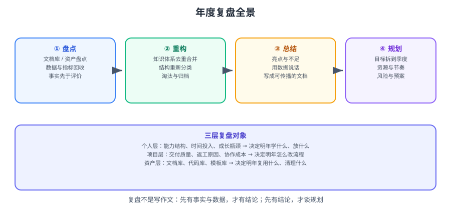

# 年度复盘

年度复盘不是写一篇年终总结，而是**用一年的真实数据，回答三个问题**：哪些做对了、哪些判断错了、明年把力气放在哪里。

## 为什么值得花一整个周末

| 不做复盘 | 做了复盘 |
| --- | --- |
| 一年忙完，说不出具体产出了什么 | 有一份带数据的产出清单 |
| 重复犯同一类错误（换个场景再犯一次） | 把错误归成「类型」并各配一条对策 |
| 明年计划凭感觉定，年中就荒废 | 目标 ≤ 3 个，每季度可验证 |
| 文档/资料/模板散落各处，明年重新造轮子 | 资产盘点后复用，清理掉过期的 |
| 能力增长靠「感觉进步了」 | 有能力雷达与差距分析，知道该补什么 |

::: tip 一句话理解
复盘的产出不是「一份文档」，而是**三样东西**：一张问题清单、一份资产索引、一组明年的行动。文档只是容器。
:::

## 章节导航

1. [复盘方法论](Overview/index.md)：KPT / GRAI / PDCA / OKR 四套方法的组合用法。
2. [文档库与资产盘点](DocsAudit/index.md)：六个维度审计，产出问题清单与处置动作。
3. [知识体系重构](KnowledgeRefactor/index.md)：保留 / 合并 / 淘汰的取舍策略与迁移方法。
4. [年度总结怎么写](AnnualSummary/index.md)：结构、数据口径、叙事方式。
5. [下一年规划](NextYearPlan/index.md)：从方向到季度到周的可执行拆解。
6. [个人成长复盘](GrowthReview/index.md)：能力雷达、时间投入分析、差距定位。
7. [实战：走完一次年度复盘](Practice/index.md)：一个周末的完整流程与模板。
8. [常见问题与最佳实践](FAQ/index.md)：写不下去时的定位树与经验清单。

## 三层复盘对象

| 层次 | 复盘什么 | 产出 | 影响 |
| --- | --- | --- | --- |
| **个人层** | 能力结构、时间投入、成长瓶颈 | 能力雷达 + 差距清单 | 决定明年学什么、放什么 |
| **项目层** | 交付质量、返工原因、协作成本 | 流程改进项 | 决定明年怎么改做法 |
| **资产层** | 文档库、代码库、模板库 | 保留/合并/淘汰清单 | 决定明年复用什么、清理什么 |

::: warning 三层的顺序不能反
**先盘事实（资产层与项目层），再谈感受（个人层）。**
先写「今年我成长了很多」的总结，几乎必然会变成空洞的抒情——因为没有事实支撑。
:::

## 时间投入参考

| 阶段 | 建议时长 | 输出 |
| --- | --- | --- |
| 数据回收 | 2~3 小时 | 原始数据齐备（提交、事项、监控、日历） |
| 盘点与重构 | 4~6 小时 | 资产清单 + 问题清单 + 处置动作 |
| 写年度总结 | 3~4 小时 | 一份可传播的总结文档 |
| 定下一年规划 | 2~3 小时 | 方向 / 季度目标 / 周行动 |
| 设检查点 | 30 分钟 | 写进日历的 4 个季度检查 |

::: info 关于「跑一次要多久」
第一次会慢（要现补数据、现建模板），**第二次会快很多**——因为模板与口径都已固化。
建议把「复盘模板」和「取数脚本」都留档，明年直接复用。
:::

## 相关专题

- 复盘方法与项目级模板：[复盘杂项](../Review/index.md)
- 知识体系整理（前一版）：[知识体系整理](../Review/KnowledgeMap/index.md)
- 文档治理的执行规范：[文档协作规范](../../Tools/Collaboration/DocCollaboration/index.md)
- 度量指标的取数方式：[研发流程](../../Tools/Collaboration/RdProcess/index.md)

## 参考资料

- PDCA（戴明环）：https://asq.org/quality-resources/pdca-cycle
- KPT 回顾法：https://www.atlassian.com/team-playbook/plays/retrospective
- OKR 官方资源：https://www.whatmatters.com/faqs/okr-meaning-definition-examples
- Google SRE：事故复盘文化：https://sre.google/sre-book/postmortem-culture/
- 本专题其余章节：[复盘方法论](Overview/index.md)
