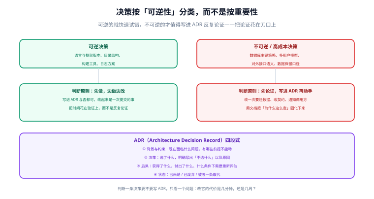

# 架构设计与技术选型

架构设计不是画一张漂亮的框图，而是**把「以后改起来贵的决定」提前定好并留痕**。本页给出决策分类法、ADR 模板、边界划分方法与技术选型评分表。



## 一句话定位

架构设计的核心动作只有两个：**划分边界**（谁负责什么、谁能依赖谁）与**记录决策**（选了什么、为什么不选别的、什么条件下重新评估）。其余都是这两件事的展开。

## 先分类：可逆决策 vs 不可逆决策

新手最常犯的错误是把所有决策都当成大事，讨论三天仍不敢动手；老手最容易犯的错误相反——随手定下数据库主键策略，三个月后才发现要改。

| 类型 | 判定标准 | 处理方式 | 例子 |
| --- | --- | --- | --- |
| **可逆** | 改它的代价是几次提交、几小时 | 先做，边做边改；不必写 ADR | 目录结构、日志框架、构建工具、代码风格 |
| **半可逆** | 改动需要同步调用方或迁移少量数据 | 简单记一条决策说明，通知相关方 | 接口版本策略、缓存方案、任务调度方式 |
| **不可逆 / 高成本** | 改动要迁数据、改对外承诺、影响多系统 | **先论证、写 ADR、评审后再动手** | 数据库主键策略、多租户模型、对外接口语义、数据保留口径 |

::: tip 一个快速判据
问一句：**「如果这个决策错了，我要花多久修？」**

- 半天以内 → 直接做，不要开会。
- 几天到两周 → 记一条 ADR，通知相关方。
- 一个月以上或涉及数据不可回退 → 写完整 ADR，评审后再动手。
:::

## ADR：把决策留痕的四段式

```markdown
<!-- docs/adr/0003-order-id-strategy.md -->

# ADR-0003 订单主键采用雪花 ID 而非自增 ID

- 状态：已采纳（2026-09-19）
- 取代：ADR-0001（早期采用自增 ID 的临时决定）

## 1. 背景与约束
- 订单表预计三年内达到 5 亿行，未来可能按用户维度分库
- 自增 ID 在分库后需要额外的全局发号器，且对外暴露 ID 会泄露业务量
- 现有系统已上线，历史数据需要迁移

## 2. 决策
订单主键采用 **雪花 ID（BIGINT，由应用侧生成）**，对外接口一律使用该 ID。

**不选什么，以及为什么：**
- 不选自增 ID：分库后需要全局发号器，且暴露业务量
- 不选 UUID：作为聚簇索引会导致随机写入与页分裂，写入性能损失明显
- 不选「自增 + 对外映射表」：多一张表与一次查询，收益不足以抵消复杂度

## 3. 后果
- 获得：分库友好、ID 生成不依赖数据库、对外不暴露业务量
- 付出：ID 变长（BIGINT 8 字节）、时钟回拨需要处理、历史数据需要迁移脚本
- 重新评估条件：若引入分布式数据库自带全局唯一 ID，可重新评估

## 4. 实施与回滚
- 迁移脚本：`db/migrations/20260919_order_id.sql`（先加新列、双写、回填、切读、再清理）
- 回滚：切读阶段之前可直接回退代码；切读之后需按反向迁移执行
```

四条写作纪律：

1. **必须写「不选什么和为什么」**——这才是后人最需要的信息。
2. **必须写「重新评估条件」**——决策不是永恒真理，写清失效条件才不会被误用。
3. **状态要能表达取代关系**（已采纳 / 已废弃 / 被 ADR-00XX 取代），否则文档库会充满互相矛盾的结论。
4. **一条决策一个文件**，按时间编号；不要写成一个「架构说明.md」大文件。

## 划分边界：三个可操作的切入角度

| 角度 | 怎么切 | 例子 |
| --- | --- | --- |
| **按变化频率** | 变化快的与变化慢的分开 | 业务规则（常变）与基础设施（稳定）分开，改规则不必动基础设施 |
| **按数据所有权** | 每份数据只有一个写入方 | 用户服务拥有用户表；订单服务要用户信息就通过接口而不是直连表 |
| **按团队边界** | 一个模块只有一个团队负责 | 跨团队改一个模块必然排队，边界应与组织边界对齐 |

边界划完之后，用一句话检查：**「谁能依赖谁」是否单向、是否可陈述。** 如果答不出来，说明边界还没划清。

```text
依赖方向示例（单向，永不反向）：
application  →  web  /  infrastructure   →  domain  →  common

四条约定：
① domain 不依赖任何框架与 IO（便于纯单元测试）
② common 不依赖任何业务模块（否则立刻成环）
③ 基础设施实现之间零引用，只通过 domain 的接口通信
④ web 层不直接依赖具体的基础设施实现
```

::: danger 三个能让架构腐化的写法
1. **为了复用而让底层依赖上层**：一旦出现「工具模块里 new 了一个 Service」，依赖方向就断了，后续所有测试都会变成集成测试。
2. **用接口包装只有一个实现的东西**：抽象要有第二个实现或明确的替换预期，否则只是多一层跳转。
3. **共享数据库表**：两个服务写同一张表，等于两个团队共享一个隐式契约——任何一方改字段都会让另一方不可预测地出问题。
:::

## 技术选型：用评分表代替「我觉得」

选型分歧往往源于「各自的评价标准不同」。把标准写下来打分，分歧会自动收敛到具体的权重上。

| 维度 | 权重 | 打分要点（1~5 分） |
| --- | --- | --- |
| 团队熟悉度 | 25% | 现有成员能不能在一周内上手；有没有人维护过 |
| 生态与文档 | 20% | 官方文档完整度、社区活跃度、遇到问题能否搜到答案 |
| 长期维护性 | 20% | 是否有明确的维护承诺与版本节奏；是否已停止维护 |
| 与现有栈契合 | 15% | 能否复用现有部署、监控、鉴权体系 |
| 性能与容量满足度 | 10% | 是否满足明确的性能判据（不要打「越快越好」的分） |
| 迁移成本 | 10% | 从现状迁过去要改多少东西 |

```text
示例（消息队列选型）：
              权重    方案 A    方案 B    方案 C
团队熟悉度     25%      4         3         5
生态与文档     20%      5         4         4
长期维护性     20%      5         4         3
与现有栈契合   15%      4         3         4
性能满足度     10%      4         5         3
迁移成本       10%      4         2         5
加权合计              4.45      3.45      4.10
```

两个使用要点：

- **打分前先设门槛**：某些维度是「一票否决」的（如许可证不允许商用、已停止维护），先过门槛再打分。
- **分数不是结论**：如果两个方案分差在 0.3 以内，说明它们实质相当，此时应选**团队更熟悉的那个**——因为差距会体现在后期的运维与排障上，而这部分成本不在表里。

## 自研还是复用

判据只有一条：**这个能力是不是你的核心竞争力？**

| 情况 | 选择 | 理由 |
| --- | --- | --- |
| 是产品的差异化所在 | 自研 | 需要掌握演进节奏与细节控制权 |
| 是通用能力且已有成熟方案 | 复用 | 认证、日志、任务调度、序列化、连接池 |
| 成熟方案都有明显不满足项 | 先扩展，再考虑自研 | 多数框架都提供扩展点，改扩展点的成本远低于重写 |
| 只是为了「少一个依赖」 | 复用 | 自研的维护成本会在两年后集中爆发 |

## 架构文档的最小集合

不需要厚厚的设计书，三张图 + 一叠 ADR 就够：

1. **上下文图（Context）**：系统边界、外部依赖、谁调用谁。
2. **模块图（Module）**：分层与依赖方向，明确「谁能依赖谁」。
3. **关键时序图（Sequence）**：只画最容易出错的 2~3 条链路（如登录、下单、支付回调）。
4. **ADR 目录**：所有不可逆决策的记录与状态。

## 本页的可验证收尾

```shell
# ① 每条 ADR 都包含四段与状态
for f in docs/adr/*.md; do
  for k in "状态：" "## 1. 背景与约束" "## 2. 决策" "## 3. 后果" "不选"; do
    grep -q "$k" "$f" || echo "缺少 [$k]: $f"
  done
done
echo "ADR 结构检查完成"

# ② 依赖方向可被自动检查（以 Java 多模块为例）
mvn -q dependency:tree -Dincludes=com.example.domain | grep -q "infrastructure" \
  && echo "存在反向依赖，需修正" || echo "依赖方向正确"

# ③ 模块图中的每个模块都能在代码里找到对应目录
```

## 参考资料

- [Architecture Decision Records（ADR）官网与模板](https://adr.github.io/)
- [C4 Model：上下文图 / 容器图 / 组件图](https://c4model.com/)
- [Martin Fowler：架构决策记录](https://martinfowler.com/bliki/ArchitectureDecisionRecord.html)
- [十二要素应用（12-Factor App）](https://12factor.net/zh_cn/)
