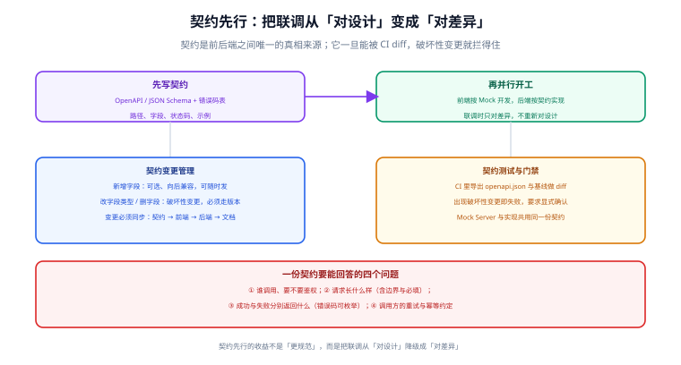

# 接口契约先行

前后端联调最大的浪费不是「调不通」，而是**反复对设计**：字段名来回改、错误结构每次不一样、分页参数各写一套。契约先行把这个过程从「对设计」降级成「对差异」。



## 一句话定位

契约是**前后端之间唯一的真相来源**：路径、字段、类型、必填、错误结构、分页约定，全部写在契约里，双方照着它并行开工。契约能被 CI 做 diff，破坏性变更就拦得住。

## 一份契约要回答的四个问题

| 问题 | 契约中对应内容 | 漏掉的后果 |
| --- | --- | --- |
| 谁调用、要不要鉴权 | `security` 定义与权限标注 | 前端不知带不带 Token，403 满天飞 |
| 请求长什么样 | `parameters` / `requestBody` + `required` + 边界 | 前端传 null、后端假设非空，联调才发现 |
| 成功返回什么 | 响应 `schema` + `example` | 字段名与嵌套结构靠口头约定 |
| 失败返回什么 | 错误响应结构 + 错误码枚举 | 前端无法区分「参数错」与「系统错」 |

## 契约片段：把约定写死

```yaml
# docs/api/openapi.yaml（节选）
openapi: 3.1.0
info:
  title: 订单服务 API
  version: 1.2.0
paths:
  /api/orders:
    get:
      summary: 按状态筛选订单（分页）
      security:
        - bearerAuth: []                 # 必须带令牌
      parameters:
        - name: status
          in: query
          required: false
          schema:
            type: string
            enum: [待付款, 待发货, 已发货, 已完成]   # 合法取值写进契约
        - name: page
          in: query
          schema: { type: integer, minimum: 1, default: 1 }
        - name: size
          in: query
          schema: { type: integer, minimum: 1, maximum: 100, default: 10 }  # 上限写进契约
      responses:
        "200":
          description: 查询成功
          content:
            application/json:
              schema:
                $ref: "#/components/schemas/PageResultOrder"
              example:
                code: 0
                message: ok
                data:
                  total: 12
                  page: 1
                  size: 10
                  records:
                    - id: "1856234193321574400"     # 雪花 ID 用字符串传，避免前端精度丢失
                      status: 待发货
                      amount: "199.00"
        "400":
          $ref: "#/components/responses/BadRequest"
        "403":
          $ref: "#/components/responses/Forbidden"
components:
  schemas:
    PageResultOrder:
      type: object
      required: [code, message, data]
      properties:
        code: { type: integer, description: 0 表示成功，非 0 见错误码表 }
        message: { type: string }
        data:
          type: object
          required: [total, page, size, records]
          properties:
            total: { type: integer }
            page: { type: integer }
            size: { type: integer }
            records:
              type: array
              items: { $ref: "#/components/schemas/Order" }
  responses:
    BadRequest:
      description: 参数校验失败
      content:
        application/json:
          schema: { $ref: "#/components/schemas/ErrorResult" }
          example:
            code: 40003
            message: "字段 status 非法，合法取值：待付款 / 待发货 / 已发货 / 已完成"
            data: null
```

::: tip 两个容易忽略但代价很高的细节
1. **长整型 ID 要作为字符串传输**：JavaScript 的 `Number` 安全整数上限是 2^53−1，雪花 ID 会超出，前端拿到会精度丢失（表现为「ID 末几位变了」）。契约里直接写成 `type: string`，避免后端改、前端也改。
2. **金额用字符串或最小货币单位**：浮点数在 JSON 里会丢失精度，`199.00` 与 `199` 也要在契约里统一。
:::

## 破坏性变更的判定

契约变更分两类，处理方式完全不同：

| 变更 | 类型 | 是否需要流程 | 说明 |
| --- | --- | --- | --- |
| 新增可选字段 | 非破坏 | 直接发 | 老的调用方忽略新字段即可 |
| 新增必填请求字段 | **破坏** | 走版本 | 老调用方不传就会失败 |
| 新增枚举取值 | **半破坏** | 通知调用方 | 未做兜底的调用方**可能**处理不了新值 |
| 字段改名 | **破坏** | 走版本 | 客户端解析会拿到 undefined |
| 字段类型变化（int → string） | **破坏** | 走版本 | 解析失败 |
| 删除字段 | **破坏** | 走版本 | 引用它的调用方报错 |
| 收紧校验（上限 100 → 50） | **破坏** | 走版本 | 现在合法的请求以后会 400 |
| 放宽校验 | 非破坏 | 直接发 | 但要确认下游能处理更大的取值 |
| 修改错误码语义 | **破坏** | 走版本 | 前端按码分支的逻辑会走错分支 |
| 修改路径 | **破坏** | 走版本 | 老客户端直接 404 |

### 版本策略：能不改就不改

优先级从高到低：

1. **加字段而不是改字段**（成本最低，绝大多数需求都能这么满足）。
2. **扩展枚举前先让调用方兜底**（在契约文档里明确写「未知取值必须按 X 处理」）。
3. **真要破坏性变更时加路径版本**（`/api/v2/orders`），旧版本保留至少一个弃用周期。
4. **在响应头里给弃用信号**（`Deprecation: true` + `Sunset: <日期>`），让调用方有据可依。

## CI 里怎么拦住破坏性变更

契约的价值一半在「写」，一半在「**被自动比对**」。

```shell
# GitHub Actions 片段：契约破坏性变更门禁
- name: Export current contract
  run: |
    mvn -q -DskipTests package
    java -jar target/app.jar --spring.profiles.active=contract-export &
    sleep 15
    curl -fsS http://127.0.0.1:8080/v3/api-docs > /tmp/openapi.new.json

- name: Diff against baseline
  run: |
    # oasdiff：专门做 OpenAPI 差异与破坏性变更判定
    docker run --rm -v /tmp:/tmp tufin/oasdiff \
      breaking docs/api/openapi.baseline.yaml /tmp/openapi.new.json
```

三条实践约定：

1. **基线契约进版本库**（`docs/api/openapi.baseline.yaml`），每次发布后更新它。
2. **发现破坏性变更就让流水线失败**，由人显式确认后再更新基线——这一步强制了「破坏性变更是需要决策的」。
3. **导出契约必须是构建产物**，不要手写一份副本。手写的副本一定会与实现漂移；正确做法是从代码注解（如 springdoc）导出，再与基线比对。

```java
// 服务端注解即契约来源（Spring Boot + springdoc）
@Operation(summary = "按状态筛选订单（分页）")
@GetMapping("/api/orders")
public Result<PageResult<OrderVO>> list(
        @Parameter(description = "订单状态") @RequestParam(required = false) OrderStatus status,
        @Parameter(description = "页码，从 1 开始") @RequestParam(defaultValue = "1") int page,
        @Parameter(description = "每页条数，上限 100") @RequestParam(defaultValue = "10") int size) {
    return Result.ok(orderService.page(status, page, size));
}
```

::: danger 契约先行的三个反面做法
1. **契约是手写的 Word / 语雀文档**：改一次要人工同步四处，两周后必然漂移。契约必须是机器可读、可 diff 的格式。
2. **先写代码再补契约**：此时契约只是代码的注释，无法提前约束前端，收益基本归零。
3. **Mock 与实现各写一套**：Mock 用一份手写 JSON，实现用另一套逻辑，联调时差异来自 Mock 而不是业务。正确做法是 **Mock Server 直接由契约生成**。
:::

## 错误码表：让前端能写分支

统一响应结构是基础，**错误码可枚举**才是关键。前端要能根据码写出确定的分支，而不是靠 `message` 做字符串匹配。

| 号段 | 含义 | 示例 |
| --- | --- | --- |
| 0 | 成功 | — |
| 400xx | 客户端错误（参数、格式、冲突） | 40001 请求体格式错误 / 40002 请求体过大 / 40003 参数校验失败 / 40004 并发更新冲突 |
| 401xx | 认证 | 40101 令牌缺失 / 40102 令牌过期 / 40103 令牌已撤销 |
| 403xx | 授权 | 40301 权限不足 / 40302 数据范围外 |
| 500xx | 服务端 | 50001 系统内部错误 / 50002 依赖不可用 |
| 503xx | 降级 | 50301 依赖服务熔断 |

约定四条：

1. **错误码与 HTTP 状态码同时使用**：状态码给网关与监控用，错误码给业务分支用。
2. **`message` 面向人，错误码面向程序**。不要在 message 里塞需要程序解析的内容。
3. **`message` 给出可执行的提示**（如「字段 status 非法，合法取值：…」），而不是「参数错误」。
4. **不把内部异常信息暴露给调用方**：堆栈、SQL 片段、类名一律只进服务端日志（带 traceId 便于定位）。

## 统一约定：分页、排序、过滤

这三件事是每个列表接口都会遇到的，提前统一能省下大量重复讨论：

```text
分页：page（从 1 开始）+ size（默认 10，上限 100）；响应统一 PageResult { total, page, size, records }
排序：sort=createdAt,desc 形式；**必须用白名单校验字段名**，禁止把字段名直接拼进 SQL
过滤：显式列出可用过滤参数，不用「传什么就过滤什么」的通用实现
```

::: warning 排序字段白名单不是可选项
`?sort=id;DROP TABLE orders--` 这类注入在老系统里非常常见。排序与过滤字段必须走白名单映射（请求里的名字 → 实体字段），映射表就是允许的取值集合。
:::

## 幂等与重试约定

只要涉及写操作，就把这两件事写进契约：

- **幂等键**：写接口接受 `Idempotency-Key` 请求头，重复提交返回首次结果而不是重复执行。
- **重试边界**：契约里明确哪些接口可以安全重试（GET、幂等 PUT），哪些必须先查状态（POST 创建）。

## 本页的可验证收尾

```shell
# ① 契约能被解析（格式与语法层面无误）
npx @redocly/cli lint docs/api/openapi.yaml && echo "契约语法通过"

# ② 实现与契约一致：导出实现产物后比对
curl -fsS http://127.0.0.1:8080/v3/api-docs > /tmp/impl.json
docker run --rm -v /tmp:/tmp tufin/oasdiff diff docs/api/openapi.yaml /tmp/impl.json

# ③ 破坏性变更门禁（有破坏性变更时退出码非 0）
docker run --rm -v /tmp:/tmp tufin/oasdiff breaking \
  docs/api/openapi.baseline.yaml /tmp/impl.json && echo "无破坏性变更"
```

第 ② 步是契约先行的关键验证：**契约与实现必须一致**，不一致时以契约为准修实现（或走变更流程改契约）。

## 参考资料

- [OpenAPI Specification 3.1](https://spec.openapis.org/oas/latest.html)
- [Redocly CLI：契约 lint 与预览](https://redocly.com/docs/cli/)
- [oasdiff：OpenAPI 差异与破坏性变更检查](https://github.com/Tufin/oasdiff)
- [springdoc-openapi：从注解导出契约](https://springdoc.org/)
- [MDN：HTTP 状态码](https://developer.mozilla.org/zh-CN/docs/Web/HTTP/Status)
