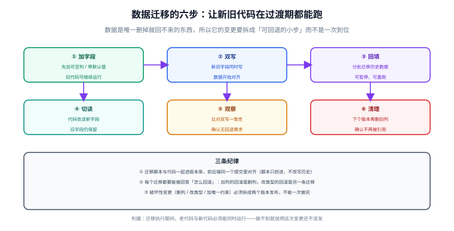

# 数据建模与迁移

数据是项目里**唯一删掉就回不来**的东西。表结构定错了，改一次要迁数据、改契约、通知调用方；迁移写错了，可能一夜之间丢掉一批订单。本页讲怎么建模、怎么命名，以及怎么把变更拆成可回退的小步。



## 一句话定位

数据建模的目标不是「设计出最规范的模型」，而是**让业务规则在数据层面无法被违反**：能由约束保证的，就不要靠代码自觉；能一次迁移完的，就不要留三个版本的技术债。

## 建模的起点：从验收条件反推

一个常见误区是先画 ER 图再想字段，结果发现验收条件要的数据没地方放。正确顺序是反过来的：

```text
验收条件 → 需要记录的事实 → 实体与关系 → 字段与类型 → 约束与索引

示例：
「给定 库中存在 12 笔状态为待发货的订单，当按状态筛选并分页，则返回 12 条」
   ↓ 需要记录的事实
   订单有「状态」，且状态可枚举；订单有「创建时间」用于默认排序；订单可被分页 → 需要稳定排序键
   ↓ 实体
   orders(1) — (n) order_items；order_items 需要「下单时的价格快照」
   ↓ 约束
   status 用枚举列 + CHECK；amount 用 DECIMAL(12,2)；created_at 建索引
```

::: tip 用「事实」而不是「页面」来驱动建模
按页面建表会得到一堆为某个界面量身定制的字段；按事实建表，界面怎么改都不用动数据模型。判据很简单：**如果这个字段在三个月后某个新界面上也说得通，它就是事实；只服务于一个界面的，可能是展示逻辑**。
:::

## 命名与类型规范

| 项 | 规范 | 说明 |
| --- | --- | --- |
| 表名 | 小写 + 下划线 + 复数（`order_items`） | 避免大小写敏感平台的坑 |
| 列名 | 小写 + 下划线，不用保留字 | `desc`、`order`、`key` 都是保留字，需加反引号，埋雷 |
| 布尔列 | `is_` / `has_` 前缀 | `is_deleted`、`has_paid` |
| 时间列 | 统一 `_at` 后缀，且**全部存 UTC** | `created_at`、`paid_at`；展示层再转时区 |
| 金额列 | `DECIMAL(12,2)` 存最小货币单位或定点数 | **绝不用 FLOAT / DOUBLE** |
| 枚举列 | 用字符串枚举 + CHECK，或字典表 | 整数枚举可读性差，排障痛苦 |
| 软删除 | `is_deleted` + `deleted_at`，查询统一过滤 | 或直接用删除状态列，避免两列语义重叠 |
| 主键 | `id`，类型统一 | 详见下一节 |
| 索引 | `idx_<表>_<列>` / `uk_<表>_<列>` | 名字里带类型，便于排障时识别 |

```sql
-- 示例：订单表
CREATE TABLE orders (
    id            BIGINT       NOT NULL COMMENT '雪花 ID，应用侧生成',
    user_id       BIGINT       NOT NULL,
    status        VARCHAR(16)  NOT NULL COMMENT '待付款/待发货/已发货/已完成/已取消',
    total_amount  DECIMAL(12,2) NOT NULL COMMENT '订单总额（含运费）',
    currency      CHAR(3)      NOT NULL DEFAULT 'CNY',
    created_at    DATETIME(3)  NOT NULL COMMENT 'UTC 时间',
    updated_at    DATETIME(3)  NOT NULL,
    deleted_at    DATETIME(3)  NULL,
    PRIMARY KEY (id),
    KEY idx_orders_user_created (user_id, created_at DESC),
    KEY idx_orders_status_created (status, created_at DESC),
    CONSTRAINT ck_orders_status CHECK (status IN ('待付款','待发货','已发货','已完成','已取消'))
) ENGINE=InnoDB DEFAULT CHARSET=utf8mb4 COLLATE=utf8mb4_0900_ai_ci;
```

### 主键策略怎么选

| 方案 | 优点 | 缺点 | 适用 |
| --- | --- | --- | --- |
| 自增 BIGINT | 短、写入顺序、索引紧凑 | 分库需全局发号器；对外暴露业务量 | 单库、不对外暴露 ID 的内部表 |
| 雪花 ID（BIGINT，应用生成） | 分库友好、无需数据库交互、趋势递增 | 需处理时钟回拨；比自增长 | **默认选择**（多数业务表） |
| UUID v4 | 无中心依赖 | 随机写导致页分裂、索引膨胀、可读性差 | 少量关联表或客户端生成 ID 的场景 |
| UUID v7 / ULID | 有序、分布式友好 | 生态支持仍在完善 | 想用 UUID 又要顺序性时 |

::: danger 主键的三个高频坑
1. **对外接口暴露自增 ID**：调用方可以通过 ID 差值估算你的业务量，也便于横向遍历（越权探测）。对外一律用不可枚举的 ID。
2. **前端直接用数字接雪花 ID**：JS 的安全整数上限是 2^53−1，雪花 ID 会超出，表现为「末几位被抹平」。**JSON 里用字符串传**。
3. **用 UUID 做主键又建聚簇索引**：随机写入导致页分裂与索引膨胀，写入吞吐明显下降。要用就用有序版本（v7/ULID），或把 UUID 当业务键、另设 BIGINT 主键。
:::

## 索引：按查询建，不按字段建

| 判断 | 做法 |
| --- | --- |
| 该列出现在 WHERE / JOIN / ORDER BY 里，且区分度高 | 建索引 |
| 组合查询常见 | 建组合索引，**把等值条件放前面、范围条件放后面** |
| 只是偶尔查一次的管理端报表 | 先不建，看慢查询日志再决定 |
| 表很小（几千行）且不再增长 | 不建，全表扫更快 |
| 低区分度列（如状态只有 5 个值） | 单独建几乎没用；与时间列组合才有意义 |

```sql
-- 组合索引顺序示例：WHERE status = ? AND created_at > ? ORDER BY created_at DESC
KEY idx_orders_status_created (status, created_at DESC)   -- 等值在前，范围在后
-- 反过来建 (created_at, status) 则范围条件之后的 status 无法用于快速定位
```

冗余索引的代价常被低估：每个索引都让写入变慢、占用存储、并在迁移时增加负担。**新增索引前先确认没有已有索引能满足同样的前缀查询。**

### 外键到底建不建

| 选择 | 优点 | 代价 |
| --- | --- | --- |
| 建外键约束 | 数据库层面保证引用完整性 | 分库分表后失效；批量导入与迁移顺序受限；删除操作受约束 |
| 不建，靠应用保证 | 灵活、便于分库与批量操作 | 需要测试覆盖「脏数据」场景，并定期跑一致性巡检 |

实用结论：**核心强一致关系（订单明细 → 订单）建约束；跨聚合、跨库、未来可能拆分的引用不建**，改为在应用层校验 + 定期巡检脚本。选哪种都要在 ADR 里写明。

## 迁移：六步法

任何涉及已有数据结构的变更，都按这六步走。核心目的是**让新旧代码在过渡期都能正常运行**，从而支持随时回滚。

```text
① 加字段    新增可空列或带默认值的列（老代码不受影响）
② 双写      新老代码同时写新旧字段
③ 回填      分批迁移历史数据，可暂停可重跑
④ 切读      代码改读新字段，旧字段保留
⑤ 观察      比对双写一致性，确认无回退需求
⑥ 清理      下个版本再删旧列（确认无任何引用后）
```

### 迁移脚本的四条规范

```text
db/migrations/
├─ V20260919001__add_order_channel.sql      # 只前进：修改过的迁移不许改，只能新增
├─ V20260919002__backfill_order_channel.sql # 数据回填单独一条，可分批
└─ V20260920001__drop_order_legacy_flag.sql # 清理必须单独一个版本，且隔一次发布
```

1. **只前进**：已执行的迁移脚本不允许修改。改历史会把「新环境能跑、老环境跑不了」变成常态。
2. **可重跑**：回填类脚本要写成幂等的（`UPDATE ... WHERE channel IS NULL`），失败后能直接重跑。
3. **分批执行**：大表回填按主键区间分批（每批 1 万行左右），避免长事务锁表。
4. **与代码同一个提交**：迁移脚本和依赖它的代码一起提交，避免「代码上了但列还没加」。

```sql
-- 分批回填示例（可重跑、可暂停）
-- 循环执行直到影响行数为 0，每批 10000 行
UPDATE orders
   SET channel = 'web'
 WHERE channel IS NULL
   AND id > :last_id
 ORDER BY id
 LIMIT 10000;
```

### 每个迁移都要能回答「怎么回滚」

| 变更 | 回滚方式 | 注意 |
| --- | --- | --- |
| 加列 | 删列 | 若已双写则数据会丢，需先停写 |
| 加索引 | 删索引 | 无风险，但重建耗时 |
| 改列类型 | **另一条迁移**（改回去） | 可能丢精度（如 DECIMAL → INT） |
| 删列 | **无法回滚**（数据已丢） | 所以删除必须隔一次发布 |
| 加唯一约束 | 删约束 | 若已有重复数据，加约束本身会失败 |

::: warning 破坏性变更必须拆成两次发布
删列、改类型、加唯一约束、改主键——这些「一次做完」会同时面临两个风险：迁移本身失败，且无法回滚。正确做法是**先发布兼容两种形态的代码，确认稳定后再发清理版本**。

判据：**改完之后，上一版代码还能不能正常跑？** 不能，就拆两次。
:::

## 种子数据：让新环境能一键起来

```text
db/seed/
├─ 001_roles_permissions.sql   # 基础字典：角色、权限、错误码
├─ 002_admin_user.sql          # 初始管理员（密码为占位，首次登录强制修改）
└─ 003_demo_data.sql           # 演示数据（仅 dev 环境）
```

三条约定：

1. **种子数据必须幂等**（`INSERT ... ON DUPLICATE KEY UPDATE` 或先删后插），否则第二次启动就报重复键。
2. **生产只放必需字典**，演示数据仅 dev / staging。
3. **种子数据也进版本库**，与迁移脚本一起评审——它是「新环境能不能起来」的关键一环。

## 本页的可验证收尾

```shell
# ① 迁移脚本可在空库上一路执行到最新（在容器里跑最干净的验证）
docker run --rm -d --name mysql-test -e MYSQL_ROOT_PASSWORD=test -p 13306:3306 mysql:8.4
sleep 30
for f in db/migrations/V*.sql; do mysql -h127.0.0.1 -P13306 -uroot -ptest < "$f" || echo "失败: $f"; done
mysql -h127.0.0.1 -P13306 -uroot -ptest -e "SHOW TABLES FROM app;" && echo "迁移链完整"

# ② 回滚方案也验证一遍（在预发环境，不在生产）
for f in $(ls -r db/migrations/V*.sql | head -2); do mysql -h127.0.0.1 -P13306 -uroot -ptest < "db/rollback/$(basename $f)"; done

# ③ 检查「迁移与代码在同一个提交」
git log --name-only -1 | grep -E "db/migrations|src/main" | wc -l   # 应 ≥ 2
```

## 相关专题

- [分库分表 · 平滑迁移](../../../DB/Relational/Sharding/Migration/index.md)：本页讲**通用迁移方法**（改字段、加索引这类 schema 变更的六步：加→双写→回填→切读→观察→清理）；分片迁移是它在**最重场景**下的具体化——除了表结构变，还要把数据重新分布到多个库，且多出一个「路由规则切换」的不可逆节点。两页的六步骨架一致，可对照阅读。

## 参考资料

- [MySQL 8.4 官方文档：数据类型与索引](https://dev.mysql.com/doc/refman/8.4/en/)
- [Flyway：数据库迁移工具与命名规范](https://documentation.red-gate.com/flyway)
- [Liquibase：迁移与回滚](https://docs.liquibase.com/)
- [Use The Index, Luke：索引与 SQL 性能](https://use-the-index-luke.com/)
- [Evolutionary Database Design（Fowler & Sadalage）](https://martinfowler.com/articles/evodb.html)
