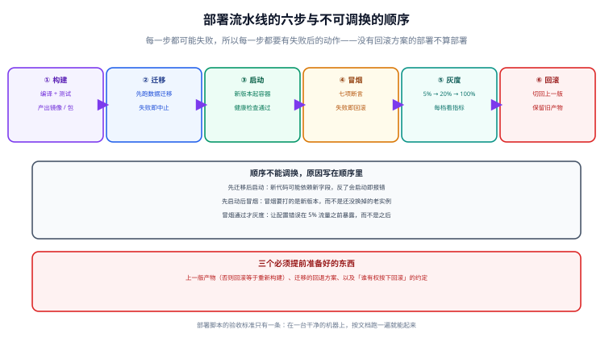
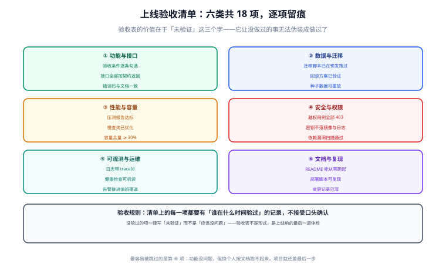

# 一键部署与上线验收

上线是整条链路上唯一「做错了影响最大」的环节。本页把部署拆成顺序固定的六步，并给出一份可逐项留痕的上线验收清单。



## 一句话定位

部署的验收标准只有一条：**在一台干净的机器上，按文档跑一遍就能起来**。做不到这一点，说明交付还差最后一步——而这一步恰恰是换人接手时最容易崩的地方。

## 环境矩阵：三套环境各自的职责

| 环境 | 用途 | 数据 | 谁能发布 | 与生产的一致性要求 |
| --- | --- | --- | --- | --- |
| dev | 本地开发 | 演示数据 | 开发者自己 | 只要求组件版本一致 |
| staging | 上线演练、验收 | 脱敏数据 | 流水线自动 | 中间件版本、配置维度、部署方式**必须与生产一致** |
| prod | 生产 | 真实数据 | 流水线自动（需审批） | — |

::: danger staging 与 prod 的「差不多」是最大的隐患
三种最常见的「差不多」都会在上线时爆炸：

1. **中间件版本不同**：staging 跑 MySQL 8.0、prod 跑 8.4，SQL 行为或默认字符集差异导致行为不一致。
2. **配置项不同**：staging 用单实例、prod 用两实例，结果会话/缓存不共享的问题只在生产暴露。
3. **部署方式不同**：staging 手工 `java -jar`、prod 用容器，导致文件路径、时区、字体、时区设置全不一样。

判据：**staging 上跑的必须是和生产同一份产物（同一个镜像 tag）**，只是配置不同。
:::

## 六步与不可调换的顺序

```text
① 构建      编译 + 测试 + 产出可部署产物（镜像 / 包），带唯一版本号
② 迁移      先执行数据迁移，失败即中止（不要启动新代码）
③ 启动      起新版本实例，等待健康检查通过
④ 冒烟      打 7 项关键断言，失败即回滚
⑤ 灰度      5% → 20% → 100%，每档设观察窗口
⑥ 回滚      任一档指标恶化，切回上一版产物
```

顺序不可调换的原因写在顺序本身：

- **先迁移后启动**：新代码可能依赖新字段，反了会启动即报错。
- **先启动后冒烟**：冒烟要打的是新版本，而不是还没被替换掉的老实例。
- **冒烟通过才灰度**：让配置类错误在 5% 流量之前暴露，而不是之后。

## 配置与密钥

```yaml
# 原则：镜像里只留占位符，所有环境差异走环境变量
spring:
  datasource:
    url: jdbc:mysql://${DB_HOST}:${DB_PORT}/${DB_NAME}
    username: ${DB_USERNAME}
    password: ${DB_PASSWORD}     # 必须注入；不给默认值
```

| 纪律 | 说明 |
| --- | --- |
| 镜像里不放任何密钥 | 镜像一旦构建就无法在不重建的前提下改配置 |
| 缺关键配置直接启动失败 | 不给默认值——默认值会让错误配置「成功启动」 |
| 密钥不进日志 | 打印配置时要脱敏；异常堆栈里不能出现密码 |
| 密钥有轮换路径 | 能改、能双活、能在不重启的前提下生效（或明确写出重启窗口） |

```java
// 启动期强校验：宁可起不来，也不要以空密钥运行
@Component
@Profile("prod")
public class StartupSecurityCheck {
    @Value("${spring.security.jwt.secret:}") private String jwtSecret;
    @Value("${spring.datasource.password:}") private String dbPassword;

    @PostConstruct
    public void check() {
        List<String> missing = new ArrayList<>();
        if (jwtSecret == null || jwtSecret.length() < 32) missing.add("JWT_SECRET（长度需 ≥ 32）");
        if (dbPassword == null || dbPassword.isBlank()) missing.add("DB_PASSWORD");
        if (!missing.isEmpty()) {
            throw new IllegalStateException("生产环境缺少必要配置：" + String.join("、", missing));
        }
    }
}
```

## 冒烟脚本：部署后必须能自动判定

```shell
#!/usr/bin/env bash
# scripts/smoke.sh —— 部署后跑这一份，任何一项失败即退出非 0
set -euo pipefail
BASE="${BASE:-http://127.0.0.1:8080}"
PASS=0; FAIL=0

check() {                       # check <名称> <期望子串> <实际响应>
  local name="$1" expect="$2" body="$3"
  if grep -q "$expect" <<<"$body"; then echo "  ✓ $name"; PASS=$((PASS+1));
  else echo "  ✗ $name"; echo "    期望包含：$expect"; echo "    实际：$body"; FAIL=$((FAIL+1)); fi
}

check "健康检查 UP"        '"status":"UP"' "$(curl -fsS "$BASE/actuator/health")"
check "未认证返回 401"      '"code":401'   "$(curl -sS "$BASE/api/users/me" || true)"
check "参数校验返回 400"    '"code":400'   "$(curl -sS -X POST "$BASE/api/auth/login" \
                                   -H 'Content-Type: application/json' -d '{"username":"","password":""}' || true)"
body=$(curl -sS -X POST "$BASE/api/auth/login" -H 'Content-Type: application/json' \
       -d "{\"username\":\"${SMOKE_USER}\",\"password\":\"${SMOKE_PASS}\"}" || true)
check "登录返回令牌"        'accessToken'  "$body"
TOKEN=$(sed -n 's/.*"accessToken"[[:space:]]*:[[:space:]]*"\([^"]*\)".*/\1/p' <<<"$body")
headers=$(curl -sS -D - -o /dev/null "$BASE/api/users/me" -H "Authorization: Bearer ${TOKEN}")
check "受保护接口 200"      '200'          "$headers"
check "响应带 X-Trace-Id"   'X-Trace-Id'   "$headers"

echo "冒烟：通过 ${PASS} 项，失败 ${FAIL} 项"
[ "$FAIL" -eq 0 ] || exit 1
```

::: tip 冒烟脚本的两个设计要点
1. **零依赖**：只用 `curl` + `grep`。验收机器不一定装 `jq`，多一个依赖就多一个失败点。
2. **失败时打印实际响应**：只输出一个红叉，会让排障从头开始。把实际响应打出来，80% 的问题一眼可见。
:::

## 灰度与回滚

```text
影子（可选）→ 5% → 20% → 50% → 100%
每档观察窗口内必须看的四个数：
  ① 错误率（5xx 与业务错误码）  ② P95 / P99 延迟
  ③ 输出或行为的分布是否突变    ④ 业务侧的人工反馈
```

### 回滚的三个前置条件

回滚不是「想回就能回」，需要提前准备：

| 前置条件 | 为什么 | 怎么准备 |
| --- | --- | --- |
| **上一版产物还在** | 重新构建需要时间，且可能因依赖变动而构建不出来 | 镜像保留最近 N 个 tag；禁止只留 latest |
| **迁移有回退方案** | 新版本可能已经改了数据结构 | 破坏性变更拆两次发布；回退脚本与迁移脚本一起评审 |
| **回滚决议有人能拍** | 观察窗口内争分夺秒，不能等会议 | 提前约定阈值与决策人，写进上线计划 |

```shell
# 回滚动作要能一条命令完成（多 LoRA / 多版本形态下的通用写法）
kubectl set image deploy/api api=registry.example.com/api:${PREV_SHA}   # 或
docker compose -f compose.yaml up -d --no-deps app                     # 换成上一版 tag 后重起
bash scripts/smoke.sh                                                  # 回滚后同样要冒烟
```

## 上线验收清单



```markdown
<!-- docs/acceptance.md -->

# <版本号> 上线验收清单

| 类别 | 检查项 | 判据 | 结果 | 验收人 | 时间 |
| --- | --- | --- | --- | --- | --- |
| 功能 | 用户故事验收条件全部勾选 | 逐条对照 requirements.md | ✅ / ❌ / 未验证 | | |
| 功能 | 接口返回与契约一致 | oasdiff 无差异 | | | |
| 数据 | 迁移在预发跑过 | 迁移日志无错误 | | | |
| 数据 | 回滚方案已验证 | 在预发执行过一次回退 | | | |
| 数据 | 种子数据可重放 | 空库初始化脚本可重跑 | | | |
| 性能 | 压测达到判据 | TPS ≥ X、P95 < Y | | | |
| 性能 | 容量余量 ≥ 30% | 监控面板截图 | | | |
| 安全 | 越权用例全部 403 | 安全用例集通过 | | | |
| 安全 | 密钥不落镜像与日志 | 镜像层扫描 + 日志抽样 | | | |
| 安全 | 依赖漏洞扫描通过 | 无高危未修复项 | | | |
| 可观测 | 日志含 traceId 且可检索 | 抽样一次请求链路 | | | |
| 可观测 | 健康检查可机读 | curl 返回 UP | | | |
| 可观测 | 告警已接值班渠道 | 触发一次测试告警 | | | |
| 文档 | README 能从零跑起 | 在干净环境实测 | | | |
| 文档 | 部署脚本可复现 | 同一版本重复部署结果一致 | | | |
| 文档 | CHANGELOG 已更新 | 面向使用者的变更记录 | | | |
| 文档 | 配置项清单已更新 | 新增配置都有说明与默认值 | | | |
| 运维 | 备份与恢复演练 | 恢复一次备份并校验数据 | | | |
```

::: danger 验收表上最危险的两个字是「应该」
- 「应该没问题」→ 写「未验证」。
- 「以前是好的」→ 那是上一次的验收结论，不是这一次的。
- 「这个不用验」→ 那就把它从清单里删掉，而不是留一条假的 ✅。

验收表的价值在于**「未验证」这三个字**：它让没做过的事无法伪装成做过了。
:::

## 监控接入

上线不等于交付完成，**能看见它是否正常**才算。至少接入四类：

| 类别 | 具体指标 | 告警纪律 |
| --- | --- | --- |
| 可用性 | 健康检查、错误率、超时率 | 面向用户可感知的故障才告警 |
| 性能 | P50 / P95 / P99、吞吐 | 用百分位而不是平均值 |
| 资源 | CPU、内存、连接池、磁盘 | 阈值留余量（≥ 30%） |
| 业务 | 关键动作计数（下单、支付、登录成功） | 业务指标下降比技术指标更早暴露问题 |

告警的三条纪律：

1. **每条告警都要有人处理**，否则会被静音，最终等于没有。
2. **阈值要有依据**（来自压测基线或历史分位），不要拍脑袋。
3. **告警要能定位**：告警信息里带服务名、实例、traceId 入口，而不是只报「错误率上升」。

## 本页的可验证收尾

```shell
# ① 干净环境从零部署（最强验证：删掉所有容器与卷）
docker compose -f docker/compose.yaml down -v
bash scripts/deploy.sh up          # 起服务 → 等健康 → 跑冒烟

# ② 迁移可从空库一路执行
for f in db/migrations/V*.sql; do mysql < "$f"; done

# ③ 回滚演练：切回上一版 tag 并再次冒烟
docker compose -f docker/compose.yaml up -d --no-deps app  # 使用上一版 tag
bash scripts/smoke.sh && echo "回滚可用"

# ④ 验收清单逐项留痕
grep -c "未验证" docs/acceptance.md   # 发布前必须为 0
```

## 验收清单怎么定：六类 18 项的可裁剪模板

上一节给了一张填好的验收清单样例；这里给**模板本身**——六类各三项，共 18 项，每项写清「验收判据」与「责任人」。责任人的建议填法：功能与数据归研发 / DBA，性能与安全归对应专项负责人，可观测与运维归 SRE / 运维。

| 类别 | 检查项 | 验收判据 | 责任人 |
| --- | --- | --- | --- |
| 功能 | 主链路端到端通过 | 核心用户旅程按验收条件逐条走通，无阻断 | 研发 / 产品 |
| 功能 | 边界与异常路径有覆盖 | 参数越界、超时、依赖失败均有明确返回与提示 | 研发 |
| 功能 | 已知缺陷有登记与豁免说明 | 遗留缺陷登记在案，写明影响、规避方式与豁免人 | 研发 / 产品 |
| 性能 | 压测 p95 达标 | 核心接口在目标并发下 p95 低于约定阈值 | 性能负责人 |
| 性能 | 容量拐点有记录 | 记录 TPS 不再线性增长时的资源水位与并发点 | 性能负责人 |
| 性能 | 慢查询与长任务已定位 | 上线前无未处理的慢 SQL、无超时未切分的长任务 | DBA / 研发 |
| 安全 | 权限最小化核对 | 账号与角色只具备必需权限，无通配符授权 | 安全负责人 |
| 安全 | 密钥不落明文 | 密钥走托管注入，镜像与日志中无明文密钥 | 安全负责人 |
| 安全 | 依赖漏洞扫描无高危 | 依赖与镜像扫描无未修复的高危项 | 安全负责人 |
| 数据 | 备份可恢复（演练过） | 从备份真实恢复一次并校验数据一致 | DBA |
| 数据 | 迁移可回退 | 迁移脚本的反向执行在预发验证通过 | DBA / 研发 |
| 数据 | 数据隔离与脱敏符合要求 | 跨租户访问被拒，非生产环境数据已脱敏 | DBA / 安全负责人 |
| 可观测 | 关键指标有看板 | 可用性、性能、资源、业务四类指标在看板上可见 | SRE |
| 可观测 | 错误日志可检索 | 关键错误日志带 traceId，能按请求检索 | 研发 / SRE |
| 可观测 | 告警能触达人而非只发群 | 告警指向具体值班人，并触发过一次测试告警 | SRE |
| 运维 | 部署脚本可重放 | 同一版本重复部署结果一致，无需手工补步骤 | 运维 |
| 运维 | 回滚演练过 | 回滚动作一条命令可完成，且回滚后冒烟通过 | 运维 |
| 运维 | 值班与升级路径已交接 | 明确值班人、升级路径与联系方式，交接有记录 | 运维 / 负责人 |

**「可裁剪」的规则**：

1. 这 18 项不是每类项目都必须全做——小项目、内部工具、不涉及数据的变更，可以按需裁剪。
2. 但**每一项被裁掉都必须写明理由与替代手段**，不能默默不写。例如裁掉「容量拐点有记录」，要写清「当前量级远低于预估容量、以监控观察替代」，而不是留空。
3. 裁剪结果与豁免说明同样要留痕（写进 `docs/acceptance.md`），让后来的人知道「为什么这项没做」。

## 回滚谁拍板：观察窗口、触发阈值与决策人

「能不能回滚」是技术准备，「谁拍板回滚」是组织约定。观察窗口与阈值要在上线前定死，回滚决策人必须在上线时在场——**观察窗口内争分夺秒，不能等会议**。

### 观察窗口时长按变更风险分三档

| 变更风险 | 观察窗口 | 典型场景 |
| --- | --- | --- |
| 常规变更 | 30 分钟 | 文案、样式、无逻辑改动的依赖升级 |
| 涉及数据变更 | 2 小时 | 表结构变更、迁移脚本、缓存格式调整 |
| 首次上线或大版本 | 24 小时 | 新系统首次上线、大版本、核心链路重构 |

### 回滚触发的四类指标与建议阈值

| 指标 | 建议阈值（示例，需按自身基线校准） |
| --- | --- |
| 错误率 | 5xx 占比超过基线 2 倍，或绝对值 > 1% 持续 5 分钟 |
| p95 延迟 | 高于上一版基线 50% 持续 5 分钟 |
| 核心业务指标 | 支付成功率 / 下单成功率较基线下降超过 5% |
| 资源水位 | CPU / 内存 / 连接池持续 > 85% 且有上升趋势 |

任一档观察窗口内命中任一阈值，即进入回滚决议，不要「再观察一会儿看看」。

### 决策人

| 角色 | 权限 | 备注 |
| --- | --- | --- |
| 回滚决策人 | 有权直接发动回滚，不需要再请示 | 上线前指定，全程在场，联系方式填入上线计划 |
| 「不回滚先修」决策人 | 有权决定暂缓回滚、改为热修并延长观察 | 通常是技术负责人，须说明理由与新的观察窗口 |
| 升级路径 | 上述两人都不在或意见不一致时，向上一级汇报 | 联系方式占位：值班电话 / 负责人电话 |

::: danger 回滚决议的三条纪律
1. **回滚决策人必须在上线前指定且在场**：临时找人拍板等于没有决策人；上线计划里要写清姓名与联系方式。
2. **观察窗口内不许顺手做别的变更**：窗口期内再叠一个变更，出了指标异常就无法归因是哪个改动导致的——回滚谁、保留谁都会变成猜。
3. **数据库变更的回滚计划必须与代码回滚分开写**：「把代码切回上一版」不会自动把已经写进去的新格式数据切回去。数据回滚要有独立脚本、独立判据与独立责任人，并与代码回滚在顺序上对齐（先回代码还是先回数据，取决于兼容方向）。
:::

## 参考资料

- [十二要素应用：构建、发布、运行](https://12factor.net/zh_cn/build-release-run)
- [Google SRE Book：发布工程](https://sre.google/sre-book/release-engineering/)
- [Docker Compose 参考：健康检查与依赖顺序](https://docs.docker.com/reference/compose-file/services/#depends_on)
- [Keep a Changelog：变更记录规范](https://keepachangelog.com/zh-CN/1.1.0/)
- [Kubernetes：滚动更新与回滚](https://kubernetes.io/zh-cn/docs/concepts/workloads/controllers/deployment/#rolling-back-a-deployment)
- 本页的**落地实例**：[后端通用模板 · 镜像推送与发布策略](../../../../project/Base/BackendTemplate/Release/index.md)：把本页的「部署六步」「灰度与回滚三前置」做成可机械校验的标签计划工具（身份/版本/环境指针三层标签与六条不变量），并补上本页未展开的**供应链环节**——构建来源证明、签名与验签、registry 标签不可变
