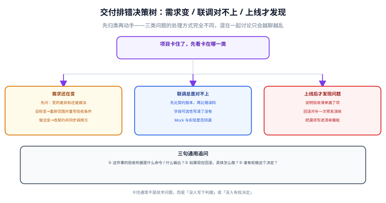

# 常见问题与排错

项目卡住时，先把问题归类：**需求还在变 / 联调对不上 / 上线才发现**。三类问题的处理方式完全不同，混在一起讨论只会越聊越乱。



## 通用追问：三句话定位问题

::: tip 遇到任何卡点，先问这三句
1. **这件事的验收判据是什么命令 / 什么输出？** —— 答不上来说明还没定义「做完」。
2. **如果现在回滚，具体怎么做？** —— 答不上来说明这一步还不该往前走。
3. **谁有权做这个决定？** —— 答不上来说明问题会在会议之间来回弹。
:::

## 一、需求还在变

**Q：需求方总是在开发中途加东西，怎么办？**

不要拒绝变更，而是**把变更按影响面分级**（见 [需求拆分与验收条件](../Requirements/index.md)）：L1 表现层直接做，L2 行为层走契约变更，L3 结构层暂停开发重排范围。真正的问题不是「变了」，而是「变了没人知道影响多大」。

**Q：验收条件写不出来，感觉很虚。**

写不出来通常有三个原因：① 需求粒度太大（一条故事对应多个界面）→ 继续拆；② 条件里用了「合理」「相关」这类词 → 换成具体数值或枚举；③ 你自己也不知道期望行为 → 这是**最需要问清楚的情况**，不要靠猜开工。

**Q：不做清单会不会显得不配合？**

恰恰相反。不写不做清单，最后要么超期、要么质量妥协。写法上把原因指向**约束**（依赖未定、口径未统一）而不是「没时间」，并把计划写清楚（Sprint 2 / 未排期）。

**Q：需求方说「先做个大概，以后再细化」。**

「大概」无法验收，最后会变成无限返工。可接受的版本是：**缩小范围、但保留验收条件**。例如「本轮只做单用户下单，不做并发与批量」，而不是「先做下单，边界以后再说」。

## 二、联调总是对不上

**Q：前端说字段名不对，后端说契约里就是这么写的。**

先做一件事：**双方打开的是同一份契约吗？契约的版本号是多少？** 90% 的这类争论源于契约副本不同（一份在语雀、一份在代码注释里）。判据是契约必须机器可读、可 diff、在 CI 里比对。

**Q：接口返回 400，但前端不知道为什么。**

两种可能：① `message` 写成「参数错误」，没有字段名与合法取值；② 错误结构不统一，有的接口返回 `{code,message}`、有的直接返回字符串。正确做法见 [接口契约先行](../Contract/index.md)：**错误码可枚举 + message 给可执行提示 + 结构统一**。

**Q：后端改了一个字段，前端不知道，上线才发现。**

这是流程缺失：契约变更没有同步机制。补两件事——契约进版本库并在 CI 做破坏性变更拦截；变更通知走同一个渠道（PR 描述 + 变更记录），而不是口头或私聊。

**Q：Mock 数据和真实接口对不上。**

Mock 如果是手写的，一定会漂移。**Mock Server 必须由契约生成**，这样它和实现是同一个真相来源的两个投影。

**Q：分页参数前端传 `page=0`，后端从 1 开始，谁对？**

这不是谁对的问题，而是**契约没写清**。契约里写明 `minimum: 1` 与 `default: 1`，并在实现里对越界值返回 400 而不是静默纠正——静默纠正会让调用方的 bug 一直藏着。

## 三、上线后才发现问题

**Q：预发没问题，生产一上就报错。**

按顺序排查四件事：① **配置差异**（环境变量是否齐全、有没有默认值掩盖缺失）；② **中间件版本差异**；③ **数据差异**（生产数据里存在预发没有的边界形态，如超长字段、空值、历史脏数据）；④ **并发与规模差异**（预发单实例、生产多实例，会话/缓存不共享的问题会暴露）。

**Q：数据库迁移把服务搞停了。**

九成是这两条之一：**长事务锁表**（大表 `ALTER` 或一次性 `UPDATE` 全表 → 必须分批）；**迁移与代码顺序反了**（新代码先上、列还没加）。执行顺序与分批做法见 [数据建模与迁移](../DataModel/index.md)。

**Q：出了故障想回滚，发现回不去。**

三个前置条件缺一个就回不去：上一版产物还在不在、迁移有没有回退方案、谁有权拍板。这三件事必须**上线前**准备，故障中现补是不可能的。

**Q：监控上有告警但没人处理。**

告警没有明确责任人就会被静音。三条纪律：每条告警有处理人、阈值有依据（来自压测基线或历史分位）、告警信息里带服务名与 traceId 入口。

**Q：上线后发现某个用户故事没做完。**

这说明验收清单漏项或「未验证」被写成了「已通过」。补救不是补代码就完事，而是**把漏项写进清单模板**，让下一次不会再漏。

## 四、进度与协作

**Q：怎么判断项目是「真的快完成了」还是「感觉快了」？**

看验证过的比例，而不是代码量。问一句：**剩下没验证的东西里，有多少是「实际运行过一次」的？** 如果核心链路只有设计没有跑过，那离完成还很远。

**Q：每个阶段都要写文档，太耗时。**

把文档标准降到「够用」：需求一页验收条件、ADR 每条半页、契约由代码导出、README 三条命令。**文档的价值在于让下一个人不必重新推演**，而不是写给人看。

**Q：中途有人要接手，怎么交接最省时间？**

按顺序给三样东西：① README（怎么跑起来）；② 需求文档里的验收条件（什么算做完）；③ ADR 目录（为什么这么定）。如果这三样写着写着发现讲不清，说明交接的坑在文档里就已经暴露了——比交接后才发现好得多。

**Q：代码评审总在争论风格问题。**

把风格交给工具（格式化器 + lint 规则），评审只讨论三件事：**是否满足验收条件、边界与异常是否覆盖、有没有更简单的做法**。

## 五、快速自查表

| 症状 | 归类 | 第一动作 |
| --- | --- | --- |
| 反复改验收条件 | 需求 | 冻结已承诺条件，新需求进下一轮并写明理由 |
| 同一个决策讨论第三次 | 需求 / 设计 | 写一条 ADR，含「不选什么」与重新评估条件 |
| 前端拿到接口后改字段名 | 联调 | 契约先行 + CI 破坏性变更拦截 |
| 400 响应看不出原因 | 联调 | 错误码可枚举 + message 给字段名与合法取值 |
| 预发正常生产报错 | 上线 | 比配置 → 比版本 → 比数据 → 比并发 |
| 迁移导致停机 | 上线 | 分批执行；迁移先于代码；准备回退方案 |
| 想回滚回不去 | 上线 | 保留上一版产物 + 迁移回退方案 + 明确决策人 |
| 测试全绿但线上出问题 | 测试 | 检查是否用替身假装真实依赖（尤其数据库） |
| 测试随机失败 | 测试 | 当天修或删，禁止挂着红灯 |

## 六、求助时该提供什么

```text
1. 这件事的验收判据（命令 / 期望输出）
2. 现在实际看到的结果（完整输出，不要只贴报错一行）
3. 环境的三个版本：应用、中间件、依赖库
4. 最近一次正常是什么时候、之后改了什么（含迁移）
5. 相关契约片段与数据样例（脱敏后）
6. 已经试过什么、排除了什么
```

::: tip 最小复现仍然是最有价值的东西
能把问题缩到「一条命令 + 一份最小数据」还能复现时，问题基本已经解决了一半。
:::

## 参考资料

- [十二要素应用：开发与生产的等价性](https://12factor.net/zh_cn/dev-prod-parity)
- [Google SRE：变更管理与错误预算](https://sre.google/sre-book/embracing-risk/)
- [Martin Fowler：持续交付与部署流水线](https://martinfowler.com/bliki/DeploymentPipeline.html)
- [OpenAPI Specification](https://spec.openapis.org/oas/latest.html)
