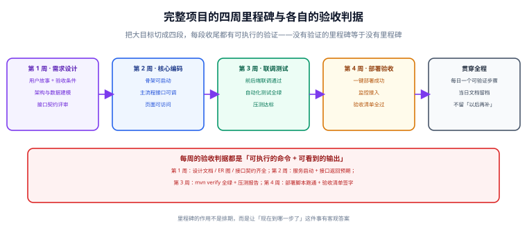

# 交付全景与验收标准

交付失控最常见的形态不是「技术太难」，而是**没人能回答「现在到哪一步了」**。本页给出一套按周划分的节奏、每阶段的验收判据，以及五类能让项目烂尾的失败模式。



## 一句话定位

交付管理只需要回答两个问题：**这一阶段要产出什么**，以及**凭什么说它做完了**。把这两个问题在每一阶段都答上来，项目就不会烂尾；答不上来，再强的技术团队也会陷入「感觉快了」的循环。

## 四个阶段与各阶段判据

| 阶段 | 做什么 | 验收判据（可执行） | 常见产物 |
| --- | --- | --- | --- |
| ① 需求与设计 | 拆分需求、定架构、定契约、定数据模型 | 设计文档 / ER 图 / 接口契约齐备，且能被第三人读懂 | 用户故事、验收条件、ADR、OpenAPI 契约、ER 图 |
| ② 核心编码 | 骨架可启动、主流程可调、页面可访问 | 服务启动命令返回成功；主流程接口返回预期响应；页面可打开 | 可运行的服务、核心接口、基础页面、种子数据 |
| ③ 联调与测试 | 前后端联调、补齐测试、压测、门禁 | 自动化测试全绿；覆盖率门禁通过；压测达到目标 TPS/P95 | 测试用例、覆盖率报告、压测报告、契约回归结果 |
| ④ 部署与验收 | 一键部署、监控接入、验收清单 | 在干净环境按文档跑通部署脚本；验收清单逐项留痕 | 部署脚本、镜像、监控面板、验收记录、README |

::: tip 判据的共同格式
每一条判据都要写成「**执行什么命令 / 做什么操作，看到什么结果**」。例如：

```shell
# 判据：服务可启动
mvn -q clean package -DskipTests && java -jar target/app.jar &
curl -fsS http://127.0.0.1:8080/actuator/health | grep '"status":"UP"'
# 期望：输出 {"status":"UP",...}
```

写成「服务能正常启动」这种句子，等于没有判据——因为「正常」由谁来定义？
:::

## 交付物清单（按阶段）

一份能在三个月后被复现的交付，至少留下下面这些文件。**缺哪一项，就在哪一项上留一个坑。**

```text
项目根目录
├─ README.md              # 从零跑起来的最短路径：环境要求 + 三条命令 + 验证方法
├─ docs/
│  ├─ requirements.md     # 用户故事 + 验收条件 + 明确不做的范围
│  ├─ adr/                # 架构决策记录（每条一个文件，含状态与取代关系）
│  └─ api/openapi.yaml    # 接口契约（唯一真相来源，CI 里做破坏性变更拦截）
├─ db/
│  ├─ migrations/         # 只前进的迁移脚本，按时间戳命名
│  └─ seed/               # 可重放的种子数据
├─ docker/                # Dockerfile + compose（含健康检查与依赖顺序）
├─ scripts/               # 一键部署、冒烟、备份等脚本
└─ CHANGELOG.md           # 面向使用者的变更记录
```

::: warning 交付物不是「有就行」
判断一份交付物有没有用，只看一件事：**换一个人照着它做，能不能得到同样的结果**。

- README 里写「配置好数据库后启动」，等于没写——「配置好」是几个步骤？
- ADR 里只写「采用了 MySQL」，等于没写——当时还比较了哪些方案、为什么否掉？
- 验收清单里写「功能正常」，等于没写——功能指哪些、谁验的、什么时候验的？
:::

## 五类常见失败模式

| 失败模式 | 早期信号 | 根因 | 处理 |
| --- | --- | --- | --- |
| **范围无限膨胀** | 「顺便再加一个…」越来越频繁，验收条件反复修改 | 没有明确的「本轮不做」清单 | 重排范围，把新需求写进下一轮并写明理由；已承诺的验收条件冻结 |
| **设计反复推翻** | 同一个决策被讨论第三次，每次结论不同 | 没有 ADR，决策没有留痕，讨论无法累积 | 每条高成本决策写一条 ADR，含「什么条件下重新评估」 |
| **联调天天返工** | 前端拿到接口后开始改字段名 | 契约没有先行，或契约改动没有同步机制 | 见 [接口契约先行](../Contract/index.md) |
| **上线才发现问题** | 预发环境「差不多」就上生产 | 环境不一致、没有冒烟、验收清单没做 | 见 [一键部署与上线验收](../Delivery/index.md) |
| **测试形同虚设** | 测试全绿但上线就出问题 | 测试只覆盖了「好例子」，或用 H2 假装 MySQL | 见 [测试策略与门禁](../Testing/index.md) |

## 「现在到哪一步了」的自查

每周收尾时问自己下面五句。任何一句答「不确定」，就意味着这一周的工作没有真正收口：

1. 这周的验收判据是什么命令、看到什么输出就算过？
2. 现在还有哪些「应该没问题」的东西是**没有实际运行过**的？
3. 如果今天要回滚，具体做法是什么，练过没有？
4. 下一个人接手时，只看仓库能不能知道现在做到哪了？
5. 有哪个决策是「凭感觉定的」，它的代价在什么时候会显现？

## 节奏：每天一个可验证步骤

最稳的推进方式是把大目标切成**每日一个可验证的步骤**：

```text
每天收尾时，只需要满足三条：
① 今天的产出能被一条命令或一次点击验证（启动成功 / 接口可调 / 页面可访问 / 测试通过）
② 当天在项目目录里留下「做了什么、怎么验证、下一步」三行记录
③ 不把「以后再补」的东西堆着——留一个待办可以，留一堆就是欠债
```

这样做的好处不是「看起来很勤奋」，而是**让每天都能停下来**。没有可验证步骤的推进方式，一旦中途被打断（换人、插需求、排期变化），接手的人只能从头推演。

## 什么时候该停下来重排

推进不是一味向前。出现下面任一情况，应当暂停开发、先重排范围：

- 需求变更已经影响到**数据结构或对外接口**（属于高成本变更，见 [架构设计与技术选型](../Architecture/index.md)）。
- 连续两次迭代都**没有达到验收判据**，且原因不是「做得慢」而是「判据本身有问题」。
- 出现了原设计没考虑到的**关键约束**（合规、性能上限、依赖许可证）。
- 团队对「什么算做完」出现了明显分歧——这说明需求页该重写，而不是继续写代码。

::: danger 重排范围时的三个错误做法
1. **偷偷降低验收标准让它变绿。** 门禁阈值不是用来通过的东西，它是为了避免把问题推到线上。
2. **把「还没验」写成「已通过」。** 验收表上写「未验证」不会让人难堪，但写成「已通过」会让问题在线上暴露。
3. **补文档代替修问题。** 用一份漂亮的文档掩盖没做完的功能，下一个人只会踩同样的坑。
:::

## 本页的可验证收尾

在动手写第一行业务代码之前，先产出并核对下面三份文件：

```shell
# ① 项目根目录存在三件套
ls README.md docs/requirements.md docs/api/openapi.yaml && echo "设计阶段产物齐备"

# ② README 里的「三条命令」能在干净环境跑通（在容器或新机器里试）
docker run --rm -v "$PWD":/w -w /w <你的基础镜像> sh -c "$(grep -A3 '快速开始' README.md | tail -3)"

# ③ 验收条件可以被机器检查（示例：校验每条用户故事都有对应验收条件）
grep -c "^### US-" docs/requirements.md
grep -c "^\- 验收条件" docs/requirements.md
# 两个数字必须相等
```

## 参考资料

- [十二要素应用（12-Factor App）](https://12factor.net/zh_cn/)
- [Google SRE：发布工程与变更管理](https://sre.google/sre-book/release-engineering/)
- [Atlassian：Definition of Done 的写法](https://www.atlassian.com/agile/project-management/definition-of-done)
- [Keep a Changelog](https://keepachangelog.com/zh-CN/1.1.0/)
