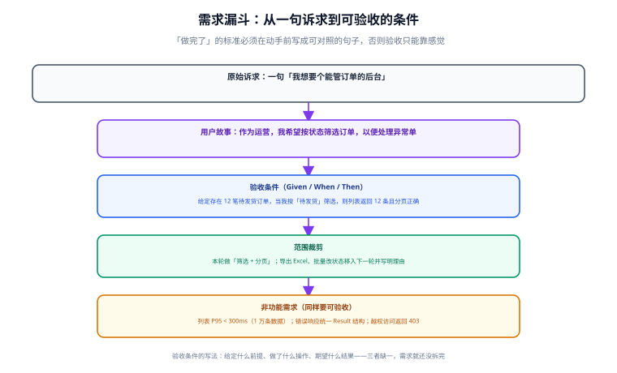

# 需求拆分与验收条件

「需求已经清楚了」是项目里最危险的一句话。真实情况通常是：需求方说得清楚，开发理解得不同，验收时双方各拿一套标准。本页把「清楚」这件事变成可操作的产物——**用户故事 + 验收条件 + 明确的「本轮不做」**。



## 一句话定位

需求拆分的产出不是一份描述功能的文档，而是一组**能被照着重放、能被机器或人客观核对**的条件。做到这一步，验收就只剩「照着条件逐条跑」这一件事。

## 用户故事：把诉求翻译成可交付的句子

标准写法：

```text
作为 <角色>，我希望 <做什么>，以便 <获得什么价值>。

示例：
作为 运营人员，我希望 按订单状态筛选并分页查看订单，以便 集中处理待发货的异常单。
```

三个部分各有作用，省略任何一部分都会出问题：

| 部分 | 作用 | 省略后的后果 |
| --- | --- | --- |
| 角色 | 确定权限、入口、数据范围 | 做出来的功能没人有权限用 |
| 做什么 | 界定功能边界 | 范围可以无限膨胀 |
| 价值 | 判断「能不能不做」 | 做了一堆没人用的功能 |

### 写完故事后的四项检查（INVEST 的实用版）

1. **独立**：这条故事能不能单独上线？如果不能，它其实是一个大故事，需要再拆。
2. **可协商**：实现方式是否还留有选择空间？（写死实现方案的故事应该降级为设计文档）
3. **有价值**：删掉它，用户会不会察觉？察觉不到就不该做。
4. **可测试**：能不能写出 Given/When/Then？写不出就是还没拆完。

::: danger 「拆得不够细」的三个典型信号
1. 故事的完成时间估不出来，只能估「大概一周」。
2. 验收条件里出现「等」「相关」「合理」这类词（如「响应合理」「错误处理完善」）。
3. 一条故事对应三个以上页面的改动，且这些页面之间没有直接关系。
:::

## 验收条件：Given / When / Then

验收条件的标准结构是三段：**给定什么前提 → 做了什么操作 → 期望什么结果**。

```text
### US-03 按状态筛选订单

- 验收条件 1（正常路径）
  给定 库中存在 12 笔状态为「待发货」的订单
  当 运营人员以 status=待发货 调用 GET /api/orders 且 page=1&size=10
  则 返回 200，data.total = 12，data.records 长度为 10，且每条记录的 status 均为「待发货」

- 验收条件 2（边界）
  给定 status 传入不存在的取值 "已取消"
  则 返回 400，code = 40003，message 中包含字段名 status 与合法取值列表

- 验收条件 3（权限）
  给定 使用仅有「只读」权限的账号访问
  则 返回 200 但隐藏客户手机号字段（脱敏为 138****0000）

- 验收条件 4（异常）
  给定 size 传入 500（超过上限 100）
  则 返回 400 且不执行查询（可通过日志无 SQL 输出来确认）
```

### 每个功能至少要写四类条件

| 类型 | 覆盖什么 | 不写的后果 |
| --- | --- | --- |
| 正常路径 | 功能主流程 | 功能可能根本不可用 |
| 边界 | 空值、极值、超限、恰好等于阈值 | 上线后被一条超长输入打挂 |
| 权限与可见性 | 越权、数据范围、字段脱敏 | 数据泄露（最严重的一类事故） |
| 异常与降级 | 依赖不可用、并发冲突、重复提交 | 线上出现「偶发」问题且无从复现 |

::: tip 边界怎么取：三值法
每个输入取三个值——**下界 − 1、下界、上界 + 1**。例如分页 `size` 上限 100：测 99、100、101。这个方法能一次性覆盖绝大多数边界缺陷，比「随便试几个值」有效得多。
:::

## 非功能需求同样要可验收

非功能需求（性能、安全、可用性、兼容性）如果不写成可执行判据，就一定会被无限推迟。写法对照：

| 不要这样写 | 要这样写 |
| --- | --- |
| 系统要快 | 订单列表接口在 1 万条数据下 P95 < 300ms（k6 20 并发，压测脚本 `perf/order-list.js`） |
| 要保证安全 | 所有写接口需要认证；非本人资源访问返回 403（用例 `SecurityIT#crossUserAccess`） |
| 要能容错 | 数据库不可用时接口返回 503 而非 500，且不抛堆栈给调用方 |
| 要支持主流浏览器 | Chrome 120+ 与 Edge 120+ 下核心流程可完成（手工验收清单第 3 组） |
| 日志要可查 | 每个响应带 `X-Trace-Id`，且该 ID 能在应用日志中检索到完整请求链路 |

## 范围裁剪：写下「本轮不做」

不做清单和做清单一样重要，因为它是**拒绝范围膨胀的唯一依据**。

```text
## 本轮（Sprint 1）不做，及原因

| 不做的内容 | 原因 | 计划 |
| --- | --- | --- |
| 导出 Excel | 依赖尚未确定的分页上限与列格式 | Sprint 2（需先定列格式契约） |
| 批量改状态 | 涉及并发冲突与审计口径，需要单独设计 | Sprint 3 |
| 多语言 | 目前无海外用户 | 未排期（需求出现时再评估） |
| 移动端适配 | 运营只在桌面使用 | 未排期 |
```

三个写法要点：

1. **每条都要写原因**，且原因要指向「约束」而不是「我们没时间」。
2. **写明是否已排期**。未排期的需求不应出现在待办列表里，否则会持续制造焦虑。
3. **不做清单要随验收一起过一遍**——验收时才提出「怎么没有导出功能」的，多半是当初没写不做清单。

## 需求变更：按影响面分级

需求一定会变，问题在于变化的影响面。收到变更请求时先判定它属于哪一级：

| 级别 | 影响面 | 判定 | 处理 |
| --- | --- | --- | --- |
| L1 表现层 | 文案、排序、颜色、默认值 | 不动契约与数据 | 直接做，随最近一次发布 |
| L2 行为层 | 字段可选性、校验规则、状态流转 | 动契约但不动数据结构 | 走契约变更流程，同步调用方 |
| L3 结构层 | 数据模型、对外接口语义、权限模型 | 动数据或对外承诺 | **暂停开发，重排范围**，补 ADR 后再动手 |

```text
变更影响面自检三问：
① 会不会改变已经发布的接口的请求/响应语义？
② 会不会需要修改已有的数据（含线上数据）？
③ 会不会让已经写好的验收条件失效？
任一个答「会」，就是 L3——先停下来重排，不要顺手改。
```

## 需求文档模板

```markdown
<!-- docs/requirements.md -->

# <项目名> 需求与验收条件

## 1. 目标与非目标
- 目标：<一句话，能被度量>
- 非目标：<本轮明确不做的事>

## 2. 角色
| 角色 | 权限范围 | 主要诉求 |

## 3. 用户故事与验收条件
### US-01 <标题>
- 故事：作为 <角色>，我希望 <做什么>，以便 <价值>
- 验收条件 1（正常路径）：给定 … 当 … 则 …
- 验收条件 2（边界）：…
- 验收条件 3（权限）：…
- 验收条件 4（异常）：…

## 4. 非功能需求
| 项 | 判据 | 验证方式 |

## 5. 本轮不做
| 内容 | 原因 | 计划 |

## 6. 变更记录
| 日期 | 变更 | 影响面级别 | 谁批准 |
```

## 本页的可验证收尾

```shell
# ① 每条用户故事都有验收条件，且数量一致
grep -c "^### US-" docs/requirements.md
grep -c "^- 验收条件" docs/requirements.md

# ② 验收条件里不出现模糊词（输出为空即通过）
grep -n "合理\|相关\|尽可能\|尽量\|等" docs/requirements.md | grep "验收条件" || echo "无模糊表述"

# ③ 每条验收条件都能追溯到至少一个测试用例或手工步骤
python tools/check_traceability.py docs/requirements.md tests/   # 按需自建
```

第 ② 步是最有用的一条：**验收条件里出现「合理」「相关」这类词，说明它不可测**，必须改写。

## 参考资料

- [用户故事的 INVEST 原则](https://www.agilealliance.org/glossary/invest/)
- [Given-When-Then 与行为驱动开发](https://cucumber.io/docs/gherkin/reference/)
- [Atlassian：验收标准（Acceptance Criteria）写法](https://www.atlassian.com/work-management/project-management/acceptance-criteria)
- [IEEE 830 软件需求规格说明（历史参考）](https://standards.ieee.org/ieee/830/1222/)
