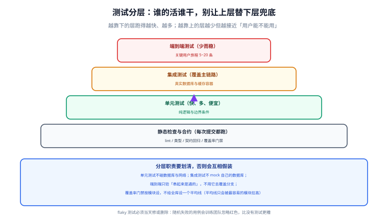

# 测试策略与门禁

「测试全绿但上线就出问题」的根因通常不是测试写得少，而是**测试写错了层**：单元测试里连数据库、集成测试里用 H2 假装 MySQL、端到端测试拿去覆盖分支。本页讲清每一层该干什么，以及门禁阈值怎么设才不会被绕过。



## 一句话定位

测试策略的核心是**分工**：越靠下的层跑得越快、覆盖越细；越靠上的层越少、但越接近「用户能不能用」。每层只做自己该做的事，测试总量才会既快又有意义。

## 分层职责

| 层次 | 覆盖什么 | 不该做什么 | 参考数量比 |
| --- | --- | --- | --- |
| 静态检查 | 格式、类型、明显缺陷、契约破坏性变更 | 逻辑正确性 | 每次提交必跑 |
| 单元测试 | 纯逻辑、算法、边界条件、状态机 | 连数据库 / 网络 / 文件系统 | 60%~70% |
| 集成测试 | 主链路、SQL 正确性、事务与并发、序列化 | 覆盖所有分支 | 20%~30% |
| 端到端 | 关键用户旅程「串起来是通的」 | 用它做分支覆盖 | 5~10 条核心旅程 |
| 性能基线 | 吞吐、延迟分位、资源占用 | 功能正确性 | 每轮发布一次 |

::: danger 三个「层写错」的典型症状
1. **单元测试启动慢**（几秒起）：说明它连了真实依赖。单元测试应当毫秒级，慢下来后团队就会跳过它。
2. **集成测试用内存数据库替代真实数据库**：方言差异、事务语义、`TRUNCATE` 的隐式提交、外键行为都会与生产不同，测试通过不代表能用。用真实数据库容器。
3. **端到端测试数量超过单元测试**：跑一轮要半小时，团队会开始绕过它——最终等于没有。
:::

## 覆盖率门禁怎么设

覆盖率是最容易被误用的指标：设一个全库平均线，只会被最容易测的模块拉高，而最危险的模块仍然没被覆盖。

| 做法 | 评价 |
| --- | --- |
| 全库设一个平均线（如 80%） | **不推荐**：达标靠的是简单模块，核心模块可能仍然裸奔 |
| 按模块设阈值 | **推荐**：核心模块（认证、支付、权限）阈值更高 |
| 只涨不跌（增量门禁） | **推荐**：对本次改动的覆盖率做要求，存量不倒退即可 |
| 把覆盖率当交付目标 | **反模式**：会催生大量无断言的「走过场」测试 |

```xml
<!-- 按模块设阈值（Maven + JaCoCo，示例） -->
<plugin>
  <groupId>org.jacoco</groupId>
  <artifactId>jacoco-maven-plugin</artifactId>
  <version>0.8.15</version>            <!-- 版本以官方最新为准 -->
  <executions>
    <execution>
      <id>check</id>
      <goals><goal>check</goal></goals>
      <configuration>
        <rules>
          <rule>
            <element>BUNDLE</element>
            <limits>
              <limit>
                <counter>LINE</counter>
                <value>COVEREDRATIO</value>
                <minimum>0.75</minimum>   <!-- 默认线：只降不升才拦 -->
              </limit>
            </limits>
          </rule>
          <rule>
            <!-- 核心模块单独抬高：安全与权限相关代码必须有测试 -->
            <element>CLASS</element>
            <includes>
              <include>com.example.security.*</include>
            </includes>
            <limits>
              <limit>
                <counter>LINE</counter>
                <value>COVEREDRATIO</value>
                <minimum>0.85</minimum>
              </limit>
            </limits>
          </rule>
        </rules>
      </configuration>
    </execution>
  </executions>
</plugin>
```

### 门禁阈值的三条设定原则

1. **从现状往上抬一小步**，不要一步到 90%。定一个永远达不成的阈值，等于把门禁关掉。
2. **区分模块**：核心链路（认证、鉴权、资金、状态机）阈值高于工具类。
3. **新代码必须带测试**：用增量覆盖率卡住新提交，比全量阈值有效得多。

## 集成测试要接真实依赖

| 依赖 | 错误的替身 | 后果 |
| --- | --- | --- |
| 数据库 | H2 / 内存库 | SQL 方言、事务、锁行为不同，测试通过但生产失败 |
| 缓存 | `ConcurrentHashMap` | 序列化、过期策略、宕机行为完全不同 |
| 消息队列 | 直接调用消费者方法 | 丢失重试、幂等、顺序性的验证 |
| 外部 HTTP 服务 | 全局 mock | 超时、重试、降级逻辑没人验证 |

推荐组合：**Testcontainers 起真实的 MySQL / Redis 容器**，用 `@DynamicPropertySource` 把随机端口注入配置。

```java
// 集成测试：真实 MySQL 容器 + 真实 Redis（Spring Boot 4 / Testcontainers 2.x 写法示意）
@SpringBootTest(webEnvironment = SpringBootTest.WebEnvironment.RANDOM_PORT)
@Testcontainers
class OrderApiIT {

    @Container
    @ServiceConnection                       // 自动把容器地址注入 Spring 配置
    static MySQLContainer<?> mysql = new MySQLContainer<>("mysql:8.4");

    @Container
    @ServiceConnection
    static RedisContainer<?> redis = new RedisContainer<>("redis:8");

    @Autowired TestRestTemplate rest;        // Boot 4 亦可考虑 RestTestClient

    @Test
    void 按状态筛选订单_返回分页且条数正确() {
        // 1) 准备数据：12 笔待发货订单
        // 2) 调用接口 GET /api/orders?status=待发货&page=1&size=10
        // 3) 断言 total=12、records.size=10，且每条 status 均为「待发货」
    }
}
```

::: tip 容器启动太慢怎么办
三条常用手段：① **singleton container 模式**（静态容器 + 手动启动，整个测试类/套件共用一个实例）；② 镜像预热（CI 里 `docker pull` 提前拉好）；③ 分层执行（单元测试与集成测试分阶段，单元测试先给快速反馈）。

具体做法（包括 singleton 容器的写法、清库与 Redis `flushDb` 必须成对等细节）见 [测试数据隔离与边界用例](../../../../project/Base/BackendTemplate/TestIsolation/index.md)。
:::

## 测试数据隔离：三档各有适用场景

| 档位 | 做法 | 速度 | 隔离度 | 适用 |
| --- | --- | --- | --- | --- |
| 事务回滚 | `@Transactional` 自动回滚 | 最快 | 中（跨线程/跨事务失效） | 单事务内的查询类用例 |
| 清库 | `@Sql` / 清表脚本 | 中 | 高 | 涉及多事务、异步的用例 |
| 独立库 | 每个套件独立 schema/容器 | 最慢 | 最高 | 并发、序列、事务隔离级别的验证 |

::: warning 清库与缓存必须成对清理
只清库不清缓存，会出现「第一次跑通过、第二次跑就失败」的玄学问题——上一次的令牌黑名单、失败计数还留在 Redis 里。**数据库清理与缓存清理必须在同一个 `@BeforeEach` 里成对写。**
:::

## 边界用例：三值法 + 矩阵

每个输入取三个值（下界 −1、下界、上界 +1），把「输入 × 场景」写成矩阵，确保没有漏格：

| 输入 | 下界 −1 | 下界 | 上界 +1 |
| --- | --- | --- | --- |
| `size`（1~100） | 0 → 400 | 1 → 200 | 101 → 400 |
| 令牌 `exp` | 已过期 1 秒 → 401 | 恰好等于当前 → 判定一致 | 未过期 → 200 |
| 失败次数（上限 5） | 4 次 → 仍可登录 | 5 次 → 锁定 | 6 次 → 保持锁定 |
| 字符串长度（1~64） | 0 → 400 | 1 → 200 | 65 → 400 |

```java
@ParameterizedTest
@ValueSource(ints = {0, 1, 101})
void 分页参数边界(int size) {
    var resp = rest.postForEntity("/api/orders?page=1&size=" + size, null, String.class);
    int expected = (size == 1) ? 200 : 400;
    assertThat(resp.getStatusCode().value()).isEqualTo(expected);
}
```

::: tip 用「恰好的边界值」而不是「差不多的值」
「恰好等于上界」与「上界 +1」是两个不同的用例，前者常被漏掉。判据是：**每个校验规则至少有三个用例——刚好合法、刚好越界、明显越界**。
:::

## flaky 测试：当天修或删除

随机失败（flaky）的测试比没有测试更糟，因为它训练团队忽略红色。

| 常见根因 | 修法 |
| --- | --- |
| `Thread.sleep` 等待异步结果 | 改用轮询断言（Awaitility）或注入可控时钟 |
| 并发用例起跑线不齐 | 用 `CountDownLatch` 让线程同时起跑 |
| 依赖时间（当前日期、时区） | 注入 `Clock`，测试固定时间 |
| 依赖执行顺序（共享静态状态） | 每个用例自建数据，不共享可变状态 |
| 随机端口/随机数据冲突 | 隔离到独立 schema，或使用随机化但可复现的种子 |

约定：**发现 flaky 当天处理**——要么修，要么删掉并开一条明确的重写任务。挂着不修的红灯就是没有红灯。

## 性能基线：三个必需元素

```text
① 可复现的压测脚本（场景、并发数、持续时间都写在脚本里）
② 明确的判据（例如：登录 50 并发下 TPS ≥ 200，P95 < 500ms）
③ 基线记录（上一版的数字，用于判断这次的改动是不是回退）
```

只报「TPS 是 X」而没有基线，等于没有结论——**性能结论永远是相对的**。

## 门禁清单：CI 里该拦哪些

```text
每次提交（3 分钟内给结论）：
  □ 编译通过
  □ 静态检查（lint / 类型 / 依赖漏洞）
  □ 单元测试全绿
  □ 契约破坏性变更检查（无破坏性变更）

每次合并 / 发布前：
  □ 集成测试全绿（真实数据库与缓存容器）
  □ 覆盖率门禁（按模块阈值）
  □ 种子数据 + 迁移脚本在空库上跑通
  □ 冒烟测试通过（部署后）
  □ 性能基线未回退（或回退在允许范围内）
```

## 本页的可验证收尾

```shell
# ① 单元测试快：整轮应在秒级到分钟级
mvn -q test -Dtest='*Test' -DfailIfNoTests=false && echo "单元测试通过"

# ② 集成测试真的连了容器（日志里能看到容器启动）
mvn -q verify -Dtest='*IT' 2>&1 | grep -i "container" | head -3

# ③ 覆盖率门禁能被触发：故意删掉一个测试，门禁应当失败
mvn -q verify -Djacoco.skip=false && echo "门禁通过"

# ④ 检查是否存在 flaky 隐患（搜索固定等待）
grep -rn "Thread.sleep" src/test | grep -v "// 已评估" || echo "无固定等待"
```

## 工具层落点

本页给出的是**职责边界、测试数据隔离的三档取舍与 CI 门禁清单**——回答「哪一层该测什么、门禁卡在什么标准、数据怎么隔离」。至于每一层**具体用哪个工具、脚本怎么写、命令怎么敲**，落在 [测试工具专题](../../../Tools/TestingTools/index.md)，那里给的是能照着跑一遍的工具细节。

| 测试目标 | 本项目（本页）的方法 | 对应工具页 |
| --- | --- | --- |
| 纯逻辑与边界条件 | 单元测试不碰网络 / 文件 / 时间，三值法覆盖边界 | [测试工具专题总览](../../../Tools/TestingTools/index.md) |
| 接口主链路与契约 | 集成测试连真实容器，契约破坏性变更进 CI 拦截 | [接口自动化](../../../Tools/TestingTools/APIAutomation/index.md) |
| 性能基线与容量拐点 | 可复现压测脚本 + 明确判据 + 上一版基线对照 | [JMeter 压力测试](../../../Tools/TestingTools/JMeter/index.md) |
| 跨浏览器端到端旅程 | 关键旅程 5~10 条，等待策略稳定、flaky 当天处理 | [Selenium 端到端测试](../../../Tools/TestingTools/Selenium/index.md) |

## 参考资料

- [JUnit 5 用户指南](https://junit.org/junit5/docs/current/user-guide/)
- [Testcontainers 官方文档](https://java.testcontainers.org/)
- [JaCoCo：覆盖率与 check 规则](https://www.jacoco.org/jacoco/trunk/doc/check-mojo.html)
- [Awaitility：异步断言](https://github.com/awaitility/awaitility)
- [Martin Fowler：测试金字塔与实用主义](https://martinfowler.com/articles/practical-test-pyramid.html)
